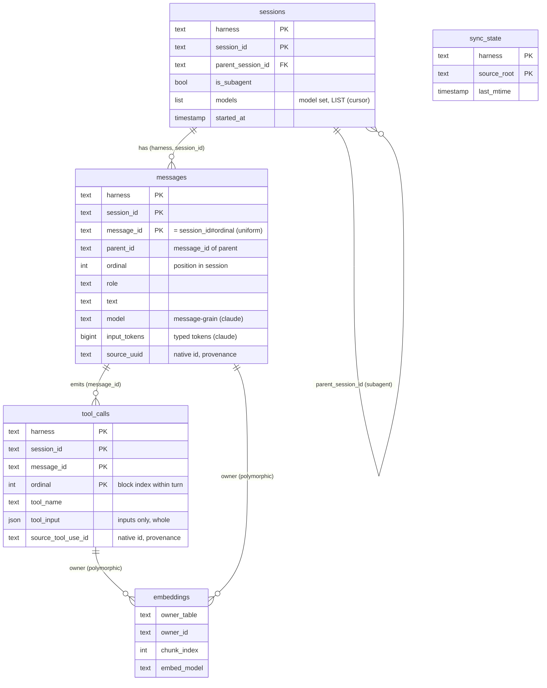

# Task: Schema field enumeration + locked DDL

* Task ID: p1-data-backbone-m1-schema-ddl
* Complexity: Level 3
* Type: feature (foundational data-contract / DDL)

Lock the five-table, harness-labeled DuckDB schema as `migrations/0001`, authored **test-first** from the operator-reviewed enumeration (`creative/creative-schema-enumeration.md`). Milestone 1 of the `p1-data-backbone` L4 project. Deliverables: the DDL file (final resting place — milestone 2's framework wraps it in place, no later move), a schema contract test suite, and durable artifacts (the enumeration record + shared real & pathological transcript fixtures) reused by milestone 3's ingest and future-harness onboarding.

## Pinned Info

### Schema ERD (pinned — governs the whole DDL)

Five harness-labeled tables; `tool_calls` are children of a `messages` turn; `embeddings` is polymorphic over `messages`/`tool_calls`. Full detail in `creative/creative-schema-enumeration.md` §4.

### Reconstruction model (two ordinals)

`messages.ordinal` = position of the message in its session (conversation order); `tool_calls.ordinal` = block index of a tool within its emitting turn. Reconstruct: `messages ORDER BY ordinal`, attaching `tool_calls WHERE message_id=… ORDER BY ordinal`. Empirically lossless (text never follows a tool within a turn: 0/5,646).

## Component Analysis

### Affected Components

- **`skills/sr-search/src/stockroom/migrations/0001_initial_schema.sql`** (NEW; the only product artifact): authors the five tables. This exact path is milestone-2's expected location — no later move.
- **`skills/sr-search/tests/test_schema_0001.py`** (NEW): the schema contract test suite.
- **`skills/sr-search/tests/conftest.py`** (MODIFY): add a `schema_con` fixture — an in-memory DuckDB with `0001` applied. Locates the SQL via `Path(stockroom.__file__).parent/"migrations"/"0001_initial_schema.sql"` so the test pins the file's location. **No migration runner** (that is milestone 2) — the fixture just reads + `execute()`s the SQL.
- **`skills/sr-search/tests/fixtures/transcripts/{cursor,claude}/`** (NEW): durable real + pathological transcript fixtures. Committed now as artifacts for milestone-3 ingest tests + future-harness onboarding; **not parsed by milestone-1 tests** (no parser until m3).
- **`memory-bank/active/creative/creative-schema-enumeration.md` + `evidence/`** (EXISTING, durable): the field-enumeration record. Stays in `creative/`; archived at the archive phase.
- **`memory-bank/techContext.md`** (MODIFY): add a pointer to the migration SQL location (the "accrete a pointer per landed artifact" cut-gate strategy).

### Cross-Module Dependencies

- `tests` → `0001_initial_schema.sql` (read + execute via `schema_con`); `tests` → `duckdb` (locked dep).
- Milestone 2 (framework) consumes `0001_initial_schema.sql` **in place** as migration #1.
- Milestone 3 (ingest) consumes the committed fixtures and writes through this schema; it mints the uniform `message_id` and enforces logical referential integrity.

### Boundary Changes

- Introduces **the warehouse data contract** — the single highest-blast-radius artifact in the project; every later table read/write depends on it. This milestone *is* the boundary definition.

### Invariants & Constraints (must hold)

- No truncation at rest (kept content stored whole); harness-labeled single schema; tool **inputs only**; harness-neutral; test-first; `make ci` green at the boundary. (From `milestones.md` cross-milestone invariants + `systemPatterns.md`.)
- The three canonized principles (`systemPatterns.md`): one-meaning-per-field; typed-columns-not-JSON-blobs; thinking-not-captured.

## Open Questions

All schema-shape questions were resolved in the creative phase (`creative/creative-schema-enumeration.md` §6). For the record:

- [x] Field drops (`is_meta`, `caller_type`, `thinking`, `plan_documents` table) → Resolved: dropped.
- [x] Token usage → Resolved: KEEP as four typed `BIGINT` columns on `messages` (not JSON).
- [x] Model granularity → Resolved: split by grain (`messages.model` Claude / `sessions.models` LIST Cursor), no faking.
- [x] Identity & stability → Resolved: uniform `message_id = {session_id}#{ordinal}`; native ids → `source_*` provenance; stability via append-only invariant + `_sync_state` detection.
- [x] CLI `store.db` → Resolved: deferred out of v1.

In-plan implementation decisions (no creative needed):

- [x] **No DB-level FK constraints in `0001`.** DuckDB FK enforcement is limited and complicates bulk ETL insert-ordering; logical relationships are documented and enforced in the ingest layer (m3) + asserted via reconstruction tests.
- [x] **No `CHECK` on `harness`.** Hard-coding `('cursor','claude')` would block future-harness onboarding — left open by design (extensibility invariant).
- [x] **`embeddings` table defined without the HNSW index.** The VSS index needs the VSS extension (Phase 2); `0001` defines the table + `vector FLOAT[384]` only, so no Phase-2 dependency leaks into milestone 1.

None unresolved — implementation approach is clear.

## Test Plan (TDD)

### Behaviors to Verify

Structure:
- Apply `0001` to a fresh DuckDB → the five tables (`sessions`, `messages`, `tool_calls`, `embeddings`, `_sync_state`) exist with the expected columns + declared types.
- **Locked-schema snapshot**: the introspected schema (tables → columns → types → nullability → PK) matches the committed golden snapshot `tests/fixtures/schema/0001_snapshot.json`.
- Each composite PK enforces uniqueness: duplicate insert → `ConstraintException`.
- NOT NULL columns reject NULL (`harness`, `session_id`, `ordinal`, `role`, `tool_name`, `tool_input`, `_sync_state.updated_at`, etc.).

Contract / semantics:
- **Reconstruction**: a session with ordered messages incl. a multi-tool assistant turn → `ORDER BY ordinal` yields conversation order; tools attach per message ordered by their ordinal.
- **Threading**: `parent_id` chains; a root message has NULL `parent_id`.
- **Subagent linkage**: `is_subagent=TRUE` row with `parent_session_id` resolving to a parent session row.
- **Model grain / no faking**: a Cursor session populates `sessions.models` (LIST) with `messages.model` NULL for its messages; a Claude session populates `messages.model` with `sessions.models` NULL → assert both NULL-sides hold.
- **Token columns**: typed `BIGINT`, `SUM()`-aggregatable; NULL for Cursor.
- **JSON `tool_input`**: stored whole; `tool_input->>'$.key'` retrieves a nested value.
- **LIST `models`**: `list_contains(models, …)` works; a multi-model conversation stores a multi-element list.
- **`embeddings`**: table + `vector FLOAT[384]` column exist (no index asserted).
- **Harness-neutral**: inserting a third, unknown `harness` value succeeds (proves no `CHECK` lock-in).
- **No truncation at rest**: a multi-KB `text` and a large `tool_input` round-trip byte-identical.

Edge / pathological:
- Empty-string `text`; assistant turn with zero tools; turn with many tools (ordinals 0..n contiguous).
- Two messages with identical content get distinct ids via differing `ordinal` (uniqueness/stability).
- Unicode + very large JSON `tool_input`.

### Test Infrastructure

- Framework: `pytest` 8.x in `skills/sr-search/` (`[tool.pytest.ini_options]`, `pythonpath=["src"]`).
- Test location: `skills/sr-search/tests/`.
- Conventions observed: `test_*.py`, module docstring, `from __future__ import annotations`, fixtures in `conftest.py`, `repo_root` session fixture.
- New test files: `tests/test_schema_0001.py`. New fixture: `schema_con` in `tests/conftest.py`. New fixtures dir: `tests/fixtures/transcripts/`.

### Integration Tests

- The reconstruction test spans `sessions` + `messages` + `tool_calls` (the core cross-table contract).

## Implementation Plan

1. **Schema-apply fixture + first structural test (RED).**
    - Files: `skills/sr-search/tests/conftest.py` (add `schema_con`), `skills/sr-search/tests/test_schema_0001.py` (assert five tables exist).
    - Changes: fixture locates `stockroom/migrations/0001_initial_schema.sql`, executes it on an in-memory `duckdb.connect()`. Fails (no SQL yet) — expected RED.
2. **Author the DDL (GREEN structural).**
    - Files: `skills/sr-search/src/stockroom/migrations/0001_initial_schema.sql` (NEW) + `src/stockroom/migrations/__init__.py` (empty, makes the packaged SQL locatable).
    - Changes: the minimal `CREATE TABLE`s to green step 1's structural assertions — `sessions`, `messages`, `tool_calls`, `embeddings`, `_sync_state` per creative §4 DDL (typed token columns, `models VARCHAR[]`, `tool_input JSON`, `vector FLOAT[384]`, composite PKs; no FKs, no harness CHECK, no HNSW index).
    - Licensing is automatic: `REUSE.toml`'s `skills/**/*.sql` path rule asserts AGPL — **no inline header needed** (the project uses path-based REUSE, not inline SPDX).
    - Creative ref: `creative/creative-schema-enumeration.md` §4–§5.
3. **Constraint tests, test-first (PK uniqueness, NOT NULL).** Files: `test_schema_0001.py`. Write the tests first (RED against any missing constraint) → set NOT NULL / PK composition in the SQL to green them.
4. **Reconstruction + threading + subagent tests, test-first.** Files: `test_schema_0001.py` (insert helpers building a faithful mini-conversation per harness). Write tests first (assert ordering, tool attachment, parent chain, subagent link) → adjust the SQL only if a test fails.
5. **Model-grain "no faking" tests, test-first.** Files: `test_schema_0001.py`. Write first → assert Cursor→`sessions.models` set & `messages.model` NULL; Claude→`messages.model` set & `sessions.models` NULL.
6. **Typed-token + JSON + LIST + faithful-capture tests, test-first.** Files: `test_schema_0001.py`. Write first → `SUM` tokens; `->>'$.key'`; `list_contains`; multi-KB round-trip equality.
7. **Pathological-case tests, test-first.** Files: `test_schema_0001.py`. Write first → empty text, zero-tool turn, many-tool turn, duplicate content, unicode/large JSON.
8. **Golden locked-schema snapshot test, test-first** *(preflight radical-innovation finding, in-scope).* Files: `test_schema_0001.py::test_schema_matches_snapshot`, `tests/fixtures/schema/0001_snapshot.json`. Write a test that introspects the applied schema (`duckdb_columns()` / `duckdb_constraints()`) into a normalized structure and compares it to a committed golden snapshot; generate the snapshot from the DDL. Thereafter any DDL change must *consciously* regenerate the snapshot — this enforces "locked DDL" literally and hands milestone 2 a regression guard.
9. **Curate & commit durable transcript fixtures.** Files: `tests/fixtures/transcripts/cursor/*.jsonl`, `tests/fixtures/transcripts/claude/*.jsonl` (small real excerpts, scrubbed) + crafted pathological cases (turn_ended/error record, sidechain+tool_result-to-be-dropped, empty content, multi-model conv, huge tool_input) + a `README.md` (provenance + scrubbing). Durable artifacts for m3; not parsed by m1 tests. (Covered by `REUSE.toml`'s `skills/**/tests/**` AGPL rule — no per-file license action.)
10. **Docs.** Update `memory-bank/techContext.md` with a pointer to `skills/sr-search/src/stockroom/migrations/0001_initial_schema.sql`. Confirm `systemPatterns.md` (already updated) and the creative doc match the final DDL.
11. **Green gate.** Run `make ci` (sync, lock-check, lint, format-check, test, reuse) from repo root until green. No inline SPDX headers — `REUSE.toml` is path-based and already covers `skills/**/*.sql` and `skills/**/tests/**`.

## Technology Validation

**No new technology** — `duckdb>=1.2` is already in the locked `pyproject.toml` (1.5.4 in the engine venv). POC executed during planning (in-memory DuckDB 1.5.4): the representative DDL with `VARCHAR[]`, `JSON`, `FLOAT[384]`, and composite PKs parsed; a reconstruction query, `tool_input->>'$.path'`, `list_contains(models,…)`, `SUM(output_tokens)`, and the subagent self-link all returned correctly; a duplicate PK insert raised `ConstraintException`. The full schema shape is validated.

## Challenges & Mitigations

- **Real-transcript fixtures may carry secrets/PII** → hand-pick minimal excerpts, scrub secrets/absolute user paths, prefer synthetic for pathological shapes; keep real samples small. Document provenance in the fixtures README.
- **DuckDB FK enforcement is limited & complicates bulk ETL** → no DB-level FKs in `0001`; document logical refs, enforce in m3 ingest, assert via reconstruction tests.
- **VSS/HNSW is Phase 2** → `0001` defines the `embeddings` table only (no index); avoids leaking a Phase-2 dependency into m1.
- **Pre-empting milestone 2** → no migration runner/`schema_version`/lock in m1; schema-apply is test-only via the `schema_con` fixture.
- **REUSE licensing gate** → no action needed: `REUSE.toml` is path-based and already asserts AGPL for `skills/**/*.sql` and everything under `skills/**/tests/**` (incl. `.jsonl` fixtures + the schema snapshot). No inline headers; just keep `make reuse` green.
- **`message_id` format is not DDL-enforceable** (it's a TEXT column) → m1 tests assert the schema *supports* the convention (composite PK + `ordinal`); the `{session_id}#{ordinal}` minting is an ingest-layer (m3) responsibility — documented, not over-claimed here.

## Status

- [x] Component analysis complete
- [x] Open questions resolved
- [x] Test planning complete (TDD)
- [x] Implementation plan complete
- [x] Technology validation complete
- [ ] Preflight
- [ ] Build
- [ ] QA
