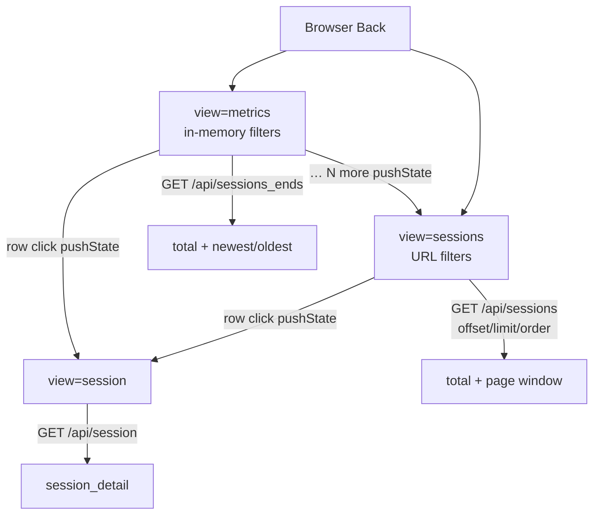

# Task: dashboard-sessions-browse

* Task ID: dashboard-sessions-browse
* Complexity: Level 3
* Type: feature

Close the loop on visual conversation exploration per [#49](https://github.com/Texarkanine/stockroom/issues/49): capped glanceable **Sessions** panel on metrics, deep-linkable paginated sessions-list SPA view, browser-Back-only navigation, efficient COUNT/window retrieval.

## Pinned Info

### Navigation & data flow

Why pinned: three SPA views and two session list APIs must stay consistent through build and QA.

## Component Analysis

### Affected Components

- **`metrics.py`**: Today `sessions()` returns newest-N array (limit clamp 500). → Extract shared filter/row helpers; add `sessions_ends()`; change `sessions()` to page envelope `{total, sessions}` with `offset`/`order`/`limit` (`limit=0` = no LIMIT); register `sessions_ends` in `ENDPOINTS`.
- **`server.py`**: Parse `limit`/`offset`/`order` for sessions; wire `sessions_ends` like other filter endpoints; allow `limit=0` for show-all; drop silent 500 truncation for show-all path.
- **`dashboard-data.mjs`**: `buildRequestPlan` currently hard-codes `limit=50` for sessions. → Metrics fan-out uses `sessions_ends`; add list-page fetch helper for paged `/api/sessions`.
- **`dashboard-session.mjs`**: Session URL helpers + `shouldUseHistoryBackForSessionClose`. → Add sessions-list URL parse/build (`view=sessions`, harnesses, since/until, page, per_page); remove or narrow history-back helper usage once `#session-back` is gone.
- **`dashboard-core.mjs` / `dashboard.mjs`**: Metrics state, `renderSessions`, `openSessionView`, pane swap. → Cap/ellipsis render; open list view; third pane; list filters URL-owned; remove session-back wiring.
- **`index.html`**: “Recent Sessions”, `#session-back`, FOUC CSS for `data-view=session`. → Rename Sessions; ellipsis row affordance; `#sessions-pane` + per-page radios; FOUC for `view=sessions`; remove back button.
- **Docs/skills**: `skills/sr-dashboard/SKILL.md`, `docs/user-guide/dashboard.md` (+ local skill mirror if tracked) — document list deep links; Sessions naming; no custom back.

### Cross-Module Dependencies

- Static client → HTTP API → `metrics.*` → DuckDB `open_current()`
- Metrics pane and list pane both navigate to reconstruct via shared `openSessionView`
- List URL is independent of metrics in-memory filters; `… more` copies filters at navigate time only

### Boundary Changes

- `/api/sessions` response: array → `{total, sessions}` (sole consumer: this SPA)
- New `/api/sessions_ends` → `{total, newest, oldest}`
- New SPA `view=sessions` query contract
- Remove `#session-back` public chrome

### Invariants & Constraints

- Must preserve reconstruct deep links (`view=session&harness&session`) and row fields
- Must preserve read-only `open_current()`, no schema migration
- Must not fetch-all to build panel ends or a single page
- Must keep list filter state URL-scoped and independent of metrics filters
- Must use browser history as the only back navigation
- Out of scope: reconstruct content/export, search-within-list, collaboration

## Open Questions

- [x] Sessions retrieval API shape → Resolved: `/api/sessions_ends` + enriched `/api/sessions` (`limit=0` = show-all). See `memory-bank/active/creative/creative-sessions-api-shape.md`
- [x] Per-page control UX → Resolved: radio presets 25/50/100/All (All last); URL `per_page=`; default 50. See `memory-bank/active/creative/creative-per-page-control.md`

## Test Plan (TDD)

### Behaviors to Verify

- Panel ≤20: `sessions_ends` returns all in `newest`, empty `oldest`; UI shows all, no ellipsis
- Panel >20: newest 10 + oldest 10 + `total`; UI shows `… N more` with `N = total − 20`
- Panel / list rows: same fields; click opens reconstruct
- `… N more`: pushState to `view=sessions` seeded with current harnesses + window
- List URL parse/build: harness (repeated), since/until optional, page, per_page ∈ {25,50,100,all}
- List fetch: numeric per_page → limit/offset; `all` → `limit=0`
- Pagination chrome visible top+bottom only when paging active (`per_page≠all` and total > per_page)
- List filter changes update list URL only (metrics in-memory filters unchanged)
- Reconstruct: no `#session-back`; browser Back restores prior view
- Efficient path: ends uses COUNT + bounded queries (assert via SQL behavior / result sizes, not full dump)
- Invalid API params → 400; show-all not silently capped at 500
- Static contracts: Sessions title, sessions pane landmarks, FOUC `data-view=sessions`, no session-back
- Docs/skill mention list deep-link template

### Edge Cases

- total = 0, 20, 21
- `per_page=all` with large total (returns all; no pager)
- Missing/invalid `per_page` → default 50
- `page` beyond last → clamp to last non-empty page (or page 1 when total=0)
- Deep-link boot directly to `view=sessions` (no metrics visit)
- `default` date range: omit since/until on list URL (match metrics sessions unwindowed behavior)
- popstate across metrics ↔ list ↔ session

### Test Infrastructure

- Framework: pytest (`skills/sr-search/tests/`), Node 22 `node:test` (`skills/sr-search/tests-js/`)
- Conventions: `test_<behavior>_…` with short docstrings; JS `test("…", …)`
- Run: `make test-dashboard-py`, `make test-dashboard-js`, full `make ci` before done
- New/extended files:
  - `tests/test_dashboard_metrics.py` — `sessions_ends`, paged `sessions`
  - `tests/test_dashboard_server.py` — new endpoint + param validation
  - `tests/test_dashboard_static.py` — HTML/FOUC/chrome contracts
  - `tests-js/dashboard-data.test.mjs` — request plan for ends + list fetch
  - `tests-js/dashboard-session.test.mjs` — list URL helpers; drop/adjust back-button tests
  - `tests-js/dashboard-core.test.mjs` — panel cap/ellipsis pure helpers if extracted
  - Skill hygiene / docs assertions if existing patterns cover SKILL.md strings

### Integration Tests

- Server: `/api/sessions_ends` and `/api/sessions` against migrated fixture DB
- Static + JS: URL helpers + request plan compose a valid list deep link an agent would emit

## Implementation Plan

Each numbered unit is one TDD cycle: **(a) write/adjust failing tests → (b) run and confirm failure → (c) implement production code → (d) run and confirm pass**. Do not start (c) before (a)/(b) for that unit.

1. **Metrics: shared filter + `sessions_ends`** ✅
    - (a) Tests first: `test_dashboard_metrics.py` — empty/≤20/>20 ends shapes, filter window, harness filter, field parity with today’s row dict
    - (c) Then: `metrics.py` — extract filter/row helpers; implement `sessions_ends`; register in `ENDPOINTS`
    - Creative ref: `creative-sessions-api-shape.md`

2. **Metrics: paged `sessions` envelope** ✅
    - (a) Tests first: rewrite existing `sessions()` assertions for `{total, sessions}`; add offset/order/`limit=0` show-all cases
    - (c) Then: `metrics.py` — envelope + offset/order/limit semantics

3. **Server wiring** ✅
    - (a) Tests first: `test_dashboard_server.py` — `/api/sessions_ends`; `offset`/`order`/`limit=0`; update clamp/`limit=501` expectations; keep `limit=-1` → 400
    - (c) Then: `server.py` — parse and dispatch

4. **Pure JS: list URL + panel model helpers** ✅
    - (a) Tests first: `tests-js/dashboard-session.test.mjs`, `dashboard-core.test.mjs` — parse/build list URL; per_page map; ellipsis `N`; invalid defaults
    - (c) Then: `dashboard-session.mjs` / `dashboard-core.mjs` helpers
    - Creative ref: `creative-per-page-control.md`

5. **Data layer: request plan + list fetch** ✅
    - (a) Tests first: `tests-js/dashboard-data.test.mjs` — metrics plan hits `/api/sessions_ends` (no `limit=50`); list fetch builds offset/limit/all
    - (c) Then: `dashboard-data.mjs`

6. **HTML shell + FOUC** ✅
    - (a) Tests first: `test_dashboard_static.py` — Sessions title; `#sessions-pane` + per-page radios; pagination slots; FOUC `data-view=sessions`; **assert `#session-back` absent**
    - (c) Then: `index.html` markup/CSS/head FOUC script

7. **Adapter: metrics panel cap + navigate to list** ✅
    - (a) Tests first: extend JS helpers/tests for render model (newest / more / oldest) if not fully covered in step 4; any extractable pure functions get tests before `dashboard.mjs` wiring
    - (c) Then: `dashboard.mjs` — render capped panel; `… more` → pushState list URL; row click unchanged

8. **Adapter: sessions list view + pagination** ✅
    - (a) Tests first: pure transition/URL sync helpers in `dashboard-core` / `dashboard-session` tests for page/per_page/filter changes
    - (c) Then: `dashboard.mjs` — list pane fetch/render; pager top+bottom; row → reconstruct; popstate

9. **Remove reconstruct custom back** ✅
    - (a) Tests first: remove/replace `shouldUseHistoryBackForSessionClose` / static back-button tests with popstate-only expectations
    - (c) Then: delete `#session-back` handlers and dead helpers from `dashboard.mjs` / `dashboard-session.mjs`

10. **Docs & skill** ✅
    - (a) Tests first: only if existing skill-hygiene/docs tests assert old strings — update those assertions first
    - (c) Then: `skills/sr-dashboard/SKILL.md`, `docs/user-guide/dashboard.md` (engine tree only; do not hand-edit untracked `.cursor/skills/stockroom-local/` mirrors)

11. **Verification** ✅
    - `make test-dashboard-py`, `make test-dashboard-js`, then `make ci`

## Technology Validation

No new technology - validation not required (extend existing dashboard static ESM + metrics/server).

## Challenges & Mitigations

- **`/api/sessions` wire break**: Update all client + tests in the same build sequence; grep for bare array assumptions.
- **Show-all memory pressure**: Accepted by issue; keep `limit=0` explicit; do not use show-all for the metrics panel path.
- **Oldest block ordering**: Return oldest ASC; render after ellipsis so the table reads newest…ellipsis…oldest.
- **Metrics filters not in URL**: List seeding copies selected harnesses + `state.window` ISO bounds (omit when `default`); Back restores prior history entry without mutating list URL into metrics.
- **FOUC for third view**: Mirror session head-script/`data-view` pattern for `view=sessions`.
- **test_dashboard_static asserts `#session-back`**: Replace with negative assertion + list-pane contracts.

## Pre-Mortem

- **Treated list filters as shared with metrics (single global state)**: Plan response — keep metrics in-memory; list state only from URL; navigate copies, never two-way binds.
- **Implemented panel cap client-side from a fat `/api/sessions` dump**: Already covered by Challenge/API creative — build must use `sessions_ends` only for the panel.
- **Left “Back to metrics” as a soft dependency (e.g. keyboard shortcut only)**: Plan response — delete the control and any close-via-button path; popstate + browser Back only.
- **Encoded `default` range as synthetic since/until that drift on revisit**: Plan response — omit since/until when window is null; document in URL helpers tests.

## Preflight Amendments

- Explicit (a) tests → (b) fail → (c) implement → (d) pass ordering added to every implementation unit (TDD plan encoding).
- Docs step scoped to tracked engine/docs paths; untracked `.cursor/skills/stockroom-local/` is localdev output, not a plan touchpoint.
- Page-beyond-last behavior fixed for build: **clamp `page` to last non-empty page** (or page 1 when total=0).

## Status

- [x] Component analysis complete
- [x] Open questions resolved
- [x] Test planning complete (TDD)
- [x] Implementation plan complete
- [x] Technology validation complete
- [x] Pre-Mortem complete
- [x] Preflight
- [x] Build
- [x] QA
