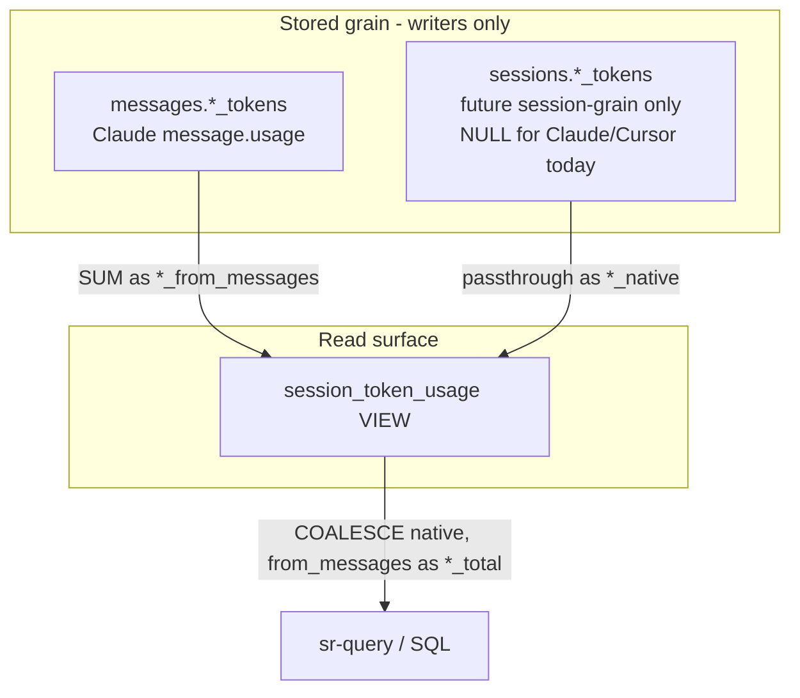

# Task: Token Usage Grain & Rollups

* Task ID: token-usage-grain-rollups
* Complexity: Level 3
* Type: enhancement

Make conversation-level token rollups easy while future-proofing for session-grain harnesses. Claude already stores message-grain tokens; Cursor has no source. Add nullable session token columns + a rollup VIEW; wire ingest to persist session grain when present (always NULL today); document the query surface. No Cursor CSV/API enricher.

## Pinned Info

### Dual-grain token flow

Pinned because every implementation step depends on which table owns which grain and what the VIEW may coalesce.

## Component Analysis

### Affected Components
- **Migrations / schema**: forward-only DDL under `skills/sr-search/src/stockroom/migrations/` — add `0007_*.sql` with session token columns + `session_token_usage` VIEW; golden snapshot + `test_schema_0007.py`.
- **Ingest model** (`ingest/model.py`): `NormalizedSession` gains optional session token fields (parallel to message tokens).
- **Ingest writer** (`ingest/writer.py`): INSERT/persist session token columns; never compute them from message sums.
- **Claude/Cursor parsers**: no behavior change required today (session tokens stay unset/`None`); Cursor remains NULL at both grains.
- **Docs**: `docs/architecture/warehouse.md` (dual-grain tokens), `docs/user-guide/search.md` (rollup example via VIEW).
- **Schema contract tests**: follow `test_schema_0006.py` pattern.

### Cross-Module Dependencies
- Parsers → `NormalizedSession` → `write_session` → base tables → VIEW (read-only, migration-defined).
- Query/docs consumers read VIEW; writer never targets VIEW.

### Boundary Changes
- Schema: four new nullable BIGINT columns on `sessions`; new VIEW `session_token_usage`.
- Public query surface: documented VIEW name + column contract.
- Dataclass/writer: new optional fields (internal; no CLI flag changes).

### Invariants & Constraints
- Must preserve one meaning per field; harness fills only the grain it reports.
- Must not invent message tokens from session totals (or the reverse as stored values).
- Must not attribute Cursor tokens from external usage exports.
- Must keep Claude message ingest behavior unchanged.
- ADD COLUMN / CREATE VIEW only — no destructive rewrite, no backfill of Claude session columns from SUM.
- No new dependencies or indexes.

## Open Questions

- [x] Dual-grain token storage & rollup surface → Resolved: Option B (see `memory-bank/active/creative/creative-dual-grain-token-storage.md`)

## Test Plan (TDD)

### Behaviors to Verify

- Migration 0007 adds four nullable BIGINT token columns on `sessions`.
- Migration 0007 creates VIEW `session_token_usage`.
- Pre-existing sessions survive migration with session token columns NULL (no backfill).
- Cumulative schema matches `0007_snapshot.json`.
- VIEW `*_from_messages` equals `SUM` of non-null message token columns per `(harness, session_id)`.
- VIEW `*_native` mirrors `sessions.*_tokens`.
- VIEW `*_total` = `COALESCE(*_native, *_from_messages)`.
- VIEW `token_grain` is `'session'` when any native non-null, else `'message'` when any from_messages non-null, else `'none'`.
- Writer persists session token fields when set on `NormalizedSession`.
- Writer leaves session token columns NULL when unset (Claude/Cursor path).
- Claude message token ingest unchanged (existing tests still pass; no regression).
- Cursor sessions/messages still have NULL tokens at both grains.

### Edge Cases

- Session with all-NULL message tokens and NULL session tokens → grain `'none'`, totals NULL.
- Session with message tokens only → grain `'message'`, totals = sums.
- Session with native tokens only (fixture/writer) → grain `'session'`, totals = native; from_messages NULL/0 as defined.
- Both grains present (synthetic) → totals prefer native; both series visible (no silent drop).
- Empty session (no messages) still appears in VIEW if session row exists.

### Test Infrastructure

- Framework: pytest (+ xdist) under `skills/sr-search/tests/`
- Conventions: `test_schema_NNNN.py` + `fixtures/schema/NNNN_snapshot.json`; ingest tests in `test_ingest_*.py`
- New test files: `tests/test_schema_0007.py`; extend `tests/test_ingest_writer.py` (and a focused VIEW behavior test — either in schema test with seeded rows or `test_session_token_usage.py`)
- Golden: regenerate/author `tests/fixtures/schema/0007_snapshot.json`

### Integration Tests

- Apply chain through 0007, write a Claude-like session via `write_session` with message tokens only → VIEW totals match message sums, grain `'message'`.
- Write session with native tokens only → VIEW totals match native, grain `'session'`.

## Implementation Plan

1. **Schema contract stubs (TDD red)**
    - Files: `tests/test_schema_0007.py`, eventually `fixtures/schema/0007_snapshot.json`
    - Changes: write failing tests for columns, view existence, null-preserve, snapshot match, VIEW semantics with seeded rows
2. **Migration 0007**
    - Files: `src/stockroom/migrations/0007_session_token_usage.sql`
    - Changes: `ALTER TABLE sessions ADD COLUMN` ×4; `CREATE VIEW session_token_usage AS ...` with `*_from_messages`, `*_native`, `*_total`, `token_grain`
    - Creative ref: `creative-dual-grain-token-storage.md`
3. **Golden snapshot**
    - Files: `tests/fixtures/schema/0007_snapshot.json`
    - Changes: capture cumulative schema head (same introspection helper as 0006)
4. **Ingest model + writer (TDD)**
    - Files: `ingest/model.py`, `ingest/writer.py`, `tests/test_ingest_writer.py`
    - Changes: optional `input_tokens`/`output_tokens`/`cache_creation_tokens`/`cache_read_tokens` on `NormalizedSession`; INSERT includes them; tests for NULL default and explicit values
5. **Docs**
    - Files: `docs/architecture/warehouse.md`, `docs/user-guide/search.md`
    - Changes: document dual-grain tokens + example `stockroom query` against `session_token_usage`
6. **Verification**
    - Run targeted new tests, then full `make test` (or project equivalent) before claiming done

## Technology Validation

No new technology - validation not required

## Challenges & Mitigations

- **VIEW column naming / DuckDB aggregate NULL semantics**: Define sums as `SUM(col)` (NULL if all NULL) explicitly in tests; document.
- **Snapshot churn / introspection includes views**: Follow existing `_introspect_schema` behavior; if views are included, lock VIEW definition shape in snapshot or companion asserts.
- **Mirrored skill tree under `.cursor/skills/stockroom-local/`**: Prefer editing canonical `skills/sr-search/` only unless repo practice requires sync; do not commit unrelated untracked mirror noise.
- **Double-counting if someone SUMs VIEW totals and also messages**: Docs state VIEW is the session rollup entrypoint; message table remains detail grain.

## Pre-Mortem

- **Plan assumes Claude ingest already correct but a latent bug exists**: already covered — regression via existing Claude ingest tests + full suite gate.
- **Operators treat `*_total` as billable truth across harnesses with different accounting**: plan response — docs label totals as warehouse rollup of reported fields, not vendor invoice; expose grain.
- **Scope creeps into dashboard/CSV enricher**: already bounded by brief constraints / non-goals.

## Status

- [x] Component analysis complete
- [x] Open questions resolved
- [x] Test planning complete (TDD)
- [x] Implementation plan complete
- [x] Technology validation complete
- [x] Pre-Mortem complete
- [ ] Preflight
- [ ] Build
- [ ] QA
