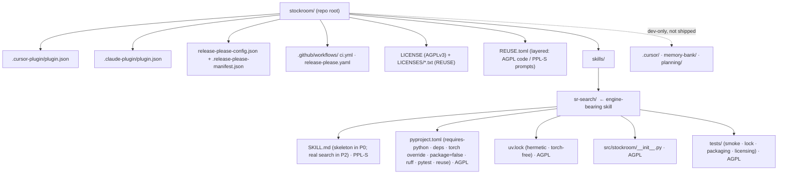

# Task: Phase 0 — Foundations

* Task ID: p0-foundations
* Complexity: Level 3
* Type: feature (foundational scaffold / substrate)

Stand up the trustworthy, reproducible, test-first substrate for stockroom: a dual-manifest plugin scaffold (Cursor + Claude Code) over a shared `skills/` tree with no build step, a hermetically locked uv project that holds torch out of the lock and lives **inside the `sr-search` skill**, release-please versioning that syncs into both manifests, layered REUSE/SPDX licensing (AGPLv3 on code, PPL-S on prompt content), and a test/lint/format harness. No product behavior ships in this phase.

## Pinned Info

### Target Repository Layout (end of Phase 0)

Pinned because every later phase reads or writes against this layout. The load-bearing decision: the shared Python engine lives **inside `skills/sr-search/`** (the core entrypoint skill), which ships in Phase 0 with a **skeleton `SKILL.md`** that honestly states the dir's purpose and that the search behavior is built in Phase 2. No dummy/placeholder skill; no manifest-less directory.



### Cross-skill resource resolution (cribbed from cursor-warehouse — its own invention, safe to reuse)

Pinned so future phases' builds implement it without re-deriving. Sibling skills locate the shared engine via the harness-provided plugin-root env var, resolved **once on startup**, with a `find -L` dev fallback (traverses symlinked dev installs). Because resolution is plugin-root-relative, the engine's host dir (`sr-search`) is irrelevant to consumers.

```bash
# Resolve the engine dir once. CURSOR_PLUGIN_ROOT (Cursor) / the Claude equivalent
# is set by the plugin system; may be unset in dev.
APP_DIR="${CURSOR_PLUGIN_ROOT:+$CURSOR_PLUGIN_ROOT/skills/sr-search}"
if [ -z "$APP_DIR" ] || [ ! -d "$APP_DIR" ]; then
  APP_DIR="$(dirname "$(find -L ~/.cursor/plugins -path '*/stockroom/*/skills/sr-search/pyproject.toml' 2>/dev/null | head -1)")"
fi
# Torch-safe invocation: never an exact sync.
uv run --project "$APP_DIR" --no-sync python -m stockroom.<entrypoint> ...
```

(Phase 0 builds no consuming skills, so this is documented in `systemPatterns.md` for later phases; the `sr-search` skeleton does not yet invoke it.)

## Component Analysis

### Affected Components

- **Plugin manifests + skills tree** (new): `.cursor-plugin/plugin.json`, `.claude-plugin/plugin.json`, the `skills/` dir, and the `skills/sr-search/` skill (skeleton `SKILL.md`). Establishes committed-layout = install-layout, both harnesses from day one.
- **Locked uv engine, inside `skills/sr-search/`** (new): `pyproject.toml` + hermetic `uv.lock` + `src/stockroom/` package + `tests/`. Encodes the proven torch-exclusion override; `package = false` (run-in-place, no build/install of stockroom itself).
- **release-please versioning** (new): `release-please-config.json` + `.release-please-manifest.json` + `.github/workflows/release-please.yaml`. Syncs one version into both plugin manifests in lockstep.
- **Layered licensing (REUSE/SPDX)** (new, REQUIRED): `REUSE.toml` + `LICENSES/*.txt`. AGPLv3 is the explicit base on all code; PPL-S is layered over prompt-shaped skill content; code within `skills/**` is re-asserted AGPL. Enforced by `reuse lint`, not advisory.
- **Test/lint/format harness** (new): pytest + ruff + reuse configured in `pyproject.toml`; `.github/workflows/ci.yml` running them; the trivial green test.
- **AGPLv3 licensing** (verify/extend): root `LICENSE` already AGPLv3; confirm and add `LICENSES/` texts for REUSE.

### Cross-Module Dependencies

- `release-please-config.json` → both `plugin.json` files: writes `$.version` into each via `extra-files` (lockstep).
- `.github/workflows/ci.yml` → the engine in `skills/sr-search/`: `uv sync` + `uv lock --locked` + ruff + pytest + `reuse lint`.
- Future `sr-*` skills (later phases) → the engine via the PLUGIN_ROOT resolution pattern above. Phase 0 only establishes the home + documents the pattern.
- Packaging/licensing tests (in `skills/sr-search/tests/`) → repo-root artifacts: resolved via a `repo_root` conftest fixture (walks up to `.git`).

### Boundary Changes

- Establishes the **repo layout contract**, the **invocation/packaging contract**, and the **licensing contract** for the entire project — highest blast radius in the roadmap.

### Invariants & Constraints (must hold at end of phase)

- `uv.lock` contains **zero** torch / nvidia / cuda entries; every package is from PyPI with hashes (hermetic, `uv lock --no-config`).
- `pyproject.toml` carries `requires-python`, the `override-dependencies` torch marker, and `package = false`.
- Both `plugin.json` versions equal each other and `.release-please-manifest.json`.
- `reuse lint` passes; code is AGPL, prompt content is PPL-S, worst-case fallback is AGPL.
- No build step (committed layout = install layout). AGPLv3 in place. No product behavior/code.

## Open Questions

- [x] **Engine-bearing skill** → **Resolved: `skills/sr-search/`** (operator's lead — the core entrypoint), shipping a **skeleton `SKILL.md`** in Phase 0. Skeleton-skill is explicitly acceptable (operator), so no dummy and no manifest-less limbo. Resolution is plugin-root-relative, so the host choice is about coherence, not mechanics. **Alternative:** `sr-initialize` (owns environment/setup) — one-word veto switches it via `git mv`. *Confirm at review.*
- [x] **Skeleton `SKILL.md` content** → **Resolved:** real front-matter (`name`, `description`) + a body stating the dir is the home of the shared stockroom engine and that search behavior lands in Phase 2. Honest placeholder, not a dummy.
- [x] **uv project shape** → **Resolved:** `[tool.uv] package = false` (run-in-place; deps locked, stockroom itself never built/installed), `src/` layout with `pythonpath = ["src"]` for tests. Avoids needing a build backend while honoring no-build-step.
- [x] **Linter/formatter** → **Resolved:** `ruff` (lint + format) in `pyproject.toml`.
- [x] **Test framework** → **Resolved:** `pytest` (dev group).
- [x] **Runtime deps in the lock** → **Resolved:** `duckdb`, `sentence-transformers`, `numpy` (spike's proven set) — required, because the torch-exclusion override is only *provable* with `sentence-transformers` (torch's transitive source) present.
- [x] **Licensing model** → **Resolved (operator: intentional):** layered REUSE/SPDX — AGPLv3 base on everything, PPL-S override on `skills/**` prompt content, AGPL re-asserted on code-shaped paths within `skills/**`, NOASSERTION on vendored `.cursor/**`. Enforced via `reuse lint`.
- [x] **Live release-please run** → **Resolved (operator confirmed):** Phase 0 proves config validity + version-lockstep via tests; the operator iterates on GitHub to get releases actually flowing **after this phase merges**. The roadmap's live end-to-end release stays in Phase 5.

## Test Plan (TDD)

### Behaviors to Verify

- **Trivial harness sanity**: pytest runs → one trivial test passes.
- **Engine package imports**: `import stockroom` succeeds under the locked env and exposes `__version__`.
- **Lock is hermetic & torch-free**: parse `skills/sr-search/uv.lock` → no `torch` / `nvidia-*` / `cuda-*` package; every `[[package]]` has hashes; no source outside `pypi.org`.
- **pyproject encodes the torch contract**: `requires-python >= 3.11` present; exact `override-dependencies` torch marker present; `package = false` present.
- **Manifests valid & versions in lockstep**: both `plugin.json` parse, carry required keys (Cursor also `skills` → `./skills/`), and `version` equals across both + `.release-please-manifest.json`.
- **release-please syncs both manifests**: `release-please-config.json` parses; `extra-files` writes `$.version` into *both* `plugin.json` paths.
- **Skeleton skill is present & valid**: `skills/sr-search/SKILL.md` exists with valid front-matter (`name`, `description`).
- **Licensing is enforced**: `reuse lint` exits clean; a `.py` under `skills/sr-search/` resolves to AGPL and the (skeleton) `SKILL.md` resolves to PPL-S.
- **Edge — skills pointer resolves**: the Cursor manifest's `skills` path (`./skills/`) exists as a directory.
- **Lock not stale**: `uv lock --locked --no-config` succeeds (committed lock matches `pyproject.toml`).

### Test Infrastructure

- Framework: `pytest` (new), in `skills/sr-search/`.
- Test location: `skills/sr-search/tests/`.
- Conventions: `test_*.py`; a session-scoped `repo_root` conftest fixture (locates the dir containing `.git`).
- New test files:
  - `tests/test_smoke.py` — trivial sanity + `import stockroom`.
  - `tests/test_lock_hermetic.py` — lock torch-free / hashed / PyPI; pyproject torch + `package=false` contract.
  - `tests/test_packaging.py` — manifest validity, version lockstep, release-please config, skills pointer, skeleton SKILL.md front-matter.
  - `tests/test_licensing.py` — `reuse lint` passes; spot-check AGPL-on-code vs PPL-S-on-prompt via `reuse`.

### Integration Tests

- `test_packaging.py` and `test_licensing.py` are cross-artifact integration tests (manifests agree; whole-repo REUSE compliance), driven from the engine's pytest via the `repo_root` fixture.

## Implementation Plan

> Each numbered step is one TDD cycle: failing test(s) first, then the artifact(s) to pass, then tidy.

1. **Bootstrap the uv engine + pytest harness inside `skills/sr-search/`**
   - Files: `skills/sr-search/pyproject.toml` (`[project]` `requires-python=">=3.11"`, deps `duckdb`/`sentence-transformers`/`numpy`; `[tool.uv]` `override-dependencies` torch marker + `package = false` + `required-version`; `[dependency-groups] dev = ["pytest~=8","ruff~=0","reuse~=4"]`; `[tool.pytest.ini_options]` testpaths+`pythonpath=["src"]`; `[tool.ruff]`), `skills/sr-search/src/stockroom/__init__.py` (`__version__ = "0.0.0"`), `skills/sr-search/tests/conftest.py` (`repo_root`), `skills/sr-search/tests/test_smoke.py`.
   - TDD: write `test_smoke.py` (fails — no project) → add pyproject + package so `uv run --no-sync pytest` (after a sync) passes.
2. **Generate the hermetic, torch-free lock**
   - Files: `skills/sr-search/tests/test_lock_hermetic.py`, then `skills/sr-search/uv.lock`.
   - TDD: write the lock assertions (fail — no lock) → `uv lock --no-config` in `skills/sr-search/` → pass. (Mechanism proven in `planning/spikes/o9-torch/`.)
3. **Skeleton `sr-search` skill + dual manifests**
   - Files: `skills/sr-search/SKILL.md` (skeleton), `.cursor-plugin/plugin.json`, `.claude-plugin/plugin.json`; extend `tests/test_packaging.py` (manifest + skills-pointer + skeleton-front-matter portions).
   - TDD: write assertions (fail) → create skeleton SKILL.md + both manifests (`name:"stockroom"`, `version:"0.0.0"`, `license:"AGPL-3.0-or-later"`, author/homepage/repository; Cursor adds `displayName`/`category`/`skills:"./skills/"`) → pass.
4. **release-please wiring**
   - Files: `release-please-config.json`, `.release-please-manifest.json` (`{ ".": "0.0.0" }`), `.github/workflows/release-please.yaml`; extend `test_packaging.py` (lockstep + extra-files).
   - TDD: write assertions (fail) → adapt `slobac`'s config (`release-type:simple`, `bump-minor-pre-major`, `extra-files` → both `plugin.json` `$.version`) + manifest + workflow → pass.
5. **Layered licensing (REUSE)**
   - Files: `REUSE.toml`, `LICENSES/AGPL-3.0-or-later.txt` + `LICENSES/LicenseRef-PPL-S.txt` + `LICENSES/LicenseRef-NOASSERTION.txt` (copy texts from `../slobac/LICENSES/`), `skills/sr-search/tests/test_licensing.py`.
   - TDD: write `test_licensing.py` running `reuse lint` (fails — no REUSE.toml) → author `REUSE.toml` with last-wins precedence ordering: (a) `**/*` → AGPL-3.0-or-later; (b) `skills/**` → LicenseRef-PPL-S; (c) `skills/**/*.py`,`skills/**/*.sql`,`skills/**/pyproject.toml`,`skills/**/uv.lock`,`skills/**/tests/**` → AGPL-3.0-or-later; (d) `.cursor/**` → LicenseRef-NOASSERTION — until `reuse lint` is green.
6. **Lint/format + CI + docs**
   - Files: run `ruff format` + `ruff check` clean; `.github/workflows/ci.yml` (uv sync + `uv lock --locked --no-config` + ruff check + ruff format --check + pytest + `reuse lint`); root `.gitignore` (`.venv/`, `__pycache__/`, etc.); `README.md` (replace "under construction": what stockroom is + the **torch-safe run contract** — `uv run --no-sync` / `--inexact`, never an exact sync).
   - TDD: config/docs step guarded by the step 1–5 tests; close the phase by running the full suite + ruff + reuse clean.

## Technology Validation

- **uv + torch-exclusion + hermetic lock**: validated end-to-end in `planning/spikes/o9-torch/`. Phase 0 re-runs `uv lock --no-config` in `skills/sr-search/` to confirm in-place.
- **`tool.uv.package = false`**: validated when `uv sync` succeeds without a build backend and `import stockroom` works via `pythonpath`.
- **pytest / ruff / reuse**: standard; validated by the harness + `reuse lint` running green.
- **release-please**: config validity checked locally + by tests; the live release is exercised by the operator on GitHub after merge (and end-to-end in Phase 5).

## Challenges & Mitigations

- **REUSE precedence ordering is subtle.** Code under `skills/**` must win back AGPL over the `skills/**`→PPL-S prompt rule. **Mitigation:** rely on REUSE's last-matching-annotation-wins semantics — list the code-shaped AGPL overrides *after* the `skills/**` PPL-S entry; `reuse lint` + the spot-check test prove it resolves correctly. Pattern mirrors `../slobac/REUSE.toml`.
- **`reuse lint` covers every committed file.** `memory-bank/`, `planning/`, `.cursor/` must all resolve. **Mitigation:** the `**/*`→AGPL base covers our originals (worst-case-AGPL, which the operator endorses); `.cursor/**`→NOASSERTION for vendored dev tooling.
- **Live release can't be fully exercised locally.** **Mitigation:** prove config + lockstep now; operator flips releases on after merge (confirmed); Phase 5 owns the end-to-end.
- **uv build attempt on a non-package project.** **Mitigation:** `tool.uv.package = false` declares stockroom non-installable; deps still lock; run via `pythonpath`.
- **Ambient `~/.config/uv/uv.toml` leakage.** **Mitigation:** `--no-config` on `uv lock` (proven in spike); documented in README.
- **Packaging/licensing tests reaching repo-root from inside the engine.** **Mitigation:** `repo_root` conftest fixture, not brittle `../..`.

## Preflight Findings

**Result: PASS (with advisories).** Re-validated after the operator's plan revisions (engine in `sr-search` with skeleton SKILL.md; REUSE elevated to enforced; PLUGIN_ROOT pattern documented; release reading confirmed).

1. **TDD encoding — PASS (blocking gate).** Steps 1–5 each order failing-test-before-artifact (including `reuse lint` as a failing-first test); step 6 is config/docs guarded by prior tests.
2. **Convention compliance — PASS.** Layout, manifests, release-please, and REUSE layering all mirror the operator's own `slobac` template; engine-in-skill + skeleton-skill + PLUGIN_ROOT resolution match `cursor-warehouse`'s own (safe-to-reuse) patterns, now recorded in `systemPatterns.md`.
3. **Completeness — PASS.** Every requirement maps to a concrete step. The "release on demand" criterion is read as config-valid + workflow-present + lockstep-tested for Phase 0, with the live flip owned by the operator post-merge (confirmed).
4. **Dependency / conflict — PASS.** Greenfield; no overlapping implementations, no public contract to break.
5. **Advisory (applied, in-scope):** `uv lock --locked` staleness guard (test + CI); `reuse` added to dev deps so licensing is enforced rather than asserted.

## Status

- [x] Component analysis complete
- [x] Open questions resolved (1 flagged for confirmation: engine-skill = `sr-search`)
- [x] Test planning complete (TDD)
- [x] Implementation plan complete
- [x] Technology validation complete
- [x] Preflight (PASS with advisories) — re-validated after revision
- [x] Build — all 6 steps complete; 17 tests green; ruff/format/reuse/lock-locked clean
- [x] QA — PASS; semantic review clean (KISS/DRY/YAGNI/completeness/regression/integrity); one doc-completeness fix applied

## QA Findings

Semantic review against the plan across all seven constraints:

- **KISS / DRY / YAGNI:** clean. Tests use shared helpers (`_run_reuse`, `repo_root`, `_packages`); no over-abstraction, no speculative code. The skeleton `SKILL.md` and `__version__`-only package are the phase-mandated minimum, not stubs to flag.
- **Completeness:** every Test-Plan behavior is implemented and green (17 tests). No `TODO`/placeholder/debug artifacts in code (grep-verified).
- **Regression / Integrity:** style matches the `slobac` template (manifests, release-please, REUSE); no magic numbers or scaffolding survived.
- **Documentation (one fix applied):** `memory-bank/techContext.md` had promised to gain pointers to the Phase 0 canonical artifacts once they existed. Updated its Environment Setup / Build Tools / Testing Process sections to point at `skills/sr-search/pyproject.toml`, `uv.lock`, `release-please-config.json` (+ manifest), and both workflows. Re-verified: 17 tests pass, `reuse lint` 93/93.

## Build Notes

All six implementation steps executed in order, each as a failing-test-first TDD cycle:

1. **uv engine + pytest harness** — `skills/sr-search/{pyproject.toml,uv.lock,src/stockroom/__init__.py}` + `tests/{conftest.py,test_smoke.py}`. `package = false`, `src/` layout, `pythonpath=["src"]`. uv provisioned **Python 3.13.7** (satisfies `>=3.11`).
2. **Hermetic torch-free lock** — `tests/test_lock_hermetic.py`; lock = **51 packages** (o9 spike's 38 + dev group `pytest`/`ruff`/`reuse` and their trees), all PyPI + hashed, **zero torch/CUDA/nvidia**. Forbidden set also blocks `triton` (torch companion). Red was shown by moving the lock aside (a lock must exist to bootstrap the interpreter).
3. **Skeleton skill + dual manifests** — `skills/sr-search/SKILL.md` (honest skeleton, real front-matter), `.cursor-plugin/plugin.json` (+`displayName`/`category`/`skills:"./skills/"`), `.claude-plugin/plugin.json`. Both `license:"AGPL-3.0-or-later"`.
4. **release-please** — `release-please-config.json` (extra-files → both manifests' `$.version`), `.release-please-manifest.json` (`{".":"0.0.0"}`), `.github/workflows/release-please.yaml` (App-token pattern from `slobac`; operator flips on post-merge).
5. **Layered REUSE licensing** — `REUSE.toml` + `LICENSES/{AGPL-3.0-or-later,LicenseRef-PPL-S,LicenseRef-NOASSERTION}.txt`. `reuse lint` clean (93/93 files). `tests/test_licensing.py` proves AGPL-on-code vs PPL-S-on-SKILL.md via `reuse spdx`.
6. **CI + README + format** — `.github/workflows/ci.yml` (sync + `uv lock --locked` + ruff check/format + pytest + reuse lint), README rewritten with the torch-safe run contract, lock-staleness guard test added (preflight advisory).

**Deviations from plan:** (a) root `.gitignore` created in step 1 instead of step 6 — needed to commit without `.venv/`/`__pycache__/`. (b) `triton` added to the lock's forbidden-exact set (defensive; it's torch's companion). Neither changes scope.

**Integration gate (all green):** `uv lock --locked --no-config` ✓ · `ruff check` ✓ · `ruff format --check` ✓ · `pytest` 17 passed ✓ · `reuse lint` 93/93 ✓.
