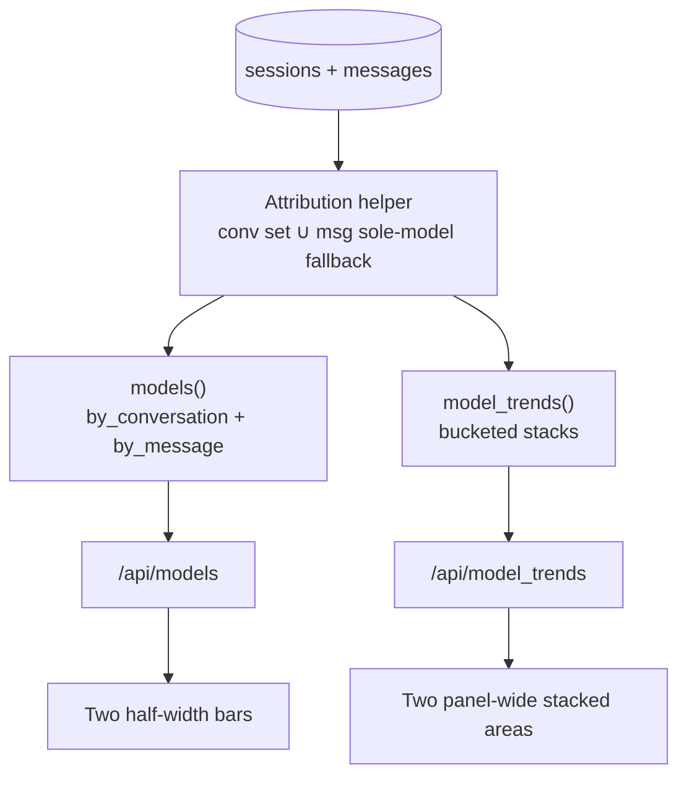

# Task: dashboard-model-analytics

* Task ID: dashboard-model-analytics
* Complexity: Level 3
* Type: feature

Ship [#67](https://github.com/Texarkanine/stockroom/issues/67) (top models by conversation and by message) and [#68](https://github.com/Texarkanine/stockroom/issues/68) (stacked area model usage over time) on the existing offline dashboard.

## Pinned Info

### Dual-grain data flow

Shared attribution feeds ranked bars and time-series areas so grains never disagree.

## Component Analysis

### Affected Components
- **`stockroom.dashboard.model_usage` (new)**: Mirror of `skill_usage.py` — attribution pure helpers (conversation sets + attributed assistant turns). → Keeps SQL/windowing in `metrics.py`, grain rules out of the mondo function.
- **`stockroom.dashboard.metrics`**: Session-grain `models()` + trend bucketing helpers. → Call `model_usage`; dual-grain `models()` payload; new `model_trends()`.
- **`ENDPOINTS` / server**: Registers metric handlers. → Add `model_trends`; keep `models` key with new shape.
- **`dashboard-data.mjs`**: Fetch plan list. → Include `model_trends`.
- **`dashboard-core.mjs`**: `buildModelsPanel`. → Conversation + message bar builders; stacked-area builders; shared model→color helper.
- **`dashboard.mjs`**: Chart.js render + wiring. → New panel names; `fill`/stack options for area; wire snapshot fields.
- **`index.html`**: Single `models-panel`. → Two bar panels + two `panel-wide` area panels; update canvas count / order pins.
- **Tests**: metrics, static, server, JS core/data. → Behaviors below.
- **Docs (light)**: `docs/user-guide/dashboard.md` if it enumerates panels — add brief mention of dual-grain model charts if/when that page lists them (currently sparse; only update if a panel inventory exists or screenshot captions need refresh).

### Cross-Module Dependencies
- Client `ENDPOINTS` list ↔ server `metrics.ENDPOINTS` keys.
- Attribution helper ↔ both metric functions.
- Model color map ↔ all four model panels.

### Boundary Changes
- `/api/models` JSON shape becomes dual-grain (clean break; dashboard is sole consumer).
- New `/api/model_trends`.
- Static panel inventory grows (+3 panels net: −1 old models, +2 bars, +2 areas).
- No schema/ingest changes.

### Invariants & Constraints
- Offline read-only `open_current()`.
- Harness-honest attribution (see creative).
- Aggregate/Compare: bars keep harness stacks; areas filter harnesses server-side and stack **models only**.
- TDD; existing Make targets.

## Open Questions

- [x] **Dual-grain model attribution** → Resolved: sole-session-model fallback for assistant turns; conversation grain keeps union once-per-session (`memory-bank/active/creative/creative-dual-grain-attribution.md`)
- [x] **Top-models presentation (#67)** → Resolved: two half-width bars with grain in titles (`creative-top-models-presentation.md`)
- [x] **Model-over-time presentation (#68)** → Resolved: two `panel-wide` stacked areas; Compare filters harnesses into model stacks (`creative-model-over-time-presentation.md`)

## Test Plan (TDD)

### Behaviors to Verify

**Attribution / metrics (Python)**
- Conversation grain: session with model only in `sessions.models` counts once for that model.
- Conversation grain: session with model only on a message counts once.
- Conversation grain: same model on session list + messages still counts once.
- Conversation grain: subagent sessions excluded.
- Message grain: Claude assistant turn with `messages.model=M` increments M.
- Message grain: Cursor assistant turn with NULL model and sole `sessions.models=[M]` increments M.
- Message grain: Cursor assistant turn with NULL model and multi-model `sessions.models` increments nothing.
- Message grain: user turns never increment (even with sole session model).
- Message grain: rankings independent of conversation rankings (high message / low session model can outrank).
- `model_trends` conversation: session activity buckets increment the session’s models once per session per bucket.
- `model_trends` message: attributed assistant turns bucket by message `ts` (fallback session activity if needed).
- `model_trends`: adaptive granularity via `_trend_granularity` for bounded windows; default window aligns with models (30d).
- Empty warehouse / empty window → empty model lists / zero-filled or empty series consistent with other metrics.
- Harness filter: only selected harnesses contribute.

**API / static**
- `ENDPOINTS` includes `models` and `model_trends`.
- `/api/models` returns `by_conversation` + `by_message` shapes.
- `/api/model_trends` returns `labels`, `granularity`, `by_conversation`, `by_message`.
- HTML: panels `models-conversation-panel`, `models-message-panel`, `model-trends-conversation-panel`, `model-trends-message-panel` (exact ids pinned in tests).
- Two bar panels half-width; two trend panels have `panel-wide`.
- Canvas count / order pins updated (models pair before efficiency; wide trends after models pair).
- Request plan includes `model_trends`.

**JS panel builders**
- `buildModelsConversationPanel` / `buildModelsMessagePanel` (names as implemented): aggregate vs compare harness stacks; empty → empty flag.
- Stacked-area builders: `kind: "line"`, `fill: true`, `stacked: true`, one dataset per model, colors stable for a given model id across builders.
- Compare mode on area builders does not invent harness datasets (model stacks only).

### Test Infrastructure

- Framework: pytest (+ xdist) under `skills/sr-search/tests/`; Node 22 `--test` under `skills/sr-search/tests-js/`.
- Conventions: `test_<behavior>` in `test_dashboard_metrics.py` / `test_dashboard_static.py`; JS `node:test` in `dashboard-core.test.mjs` / `dashboard-data.test.mjs`.
- New test files: `tests/test_model_usage.py` for attribution unit cases (parallel to `test_skill_usage.py` / skill extractors). Ranking/bucketing/API shape remain in `test_dashboard_metrics.py`.

### Integration Tests

- Server smoke already hits every `ENDPOINTS` key — registering `model_trends` covers HTTP 200.
- Static inventory + adapter import/wiring pins cover HTML↔`dashboard.mjs` coupling.

## Implementation Plan

Each numbered step is one TDD cycle: **write/adjust failing tests → implement → re-run until green.** Do not implement production code for a step before its tests exist and fail for the right reason.

1. **`model_usage` attribution helper**
    - Files: `tests/test_model_usage.py` (new), `dashboard/model_usage.py` (new)
    - Tests first: sole-model fallback, multi-model skip, user-turn skip, conversation union once-per-session, subagent exclusion helpers as pure functions over row fixtures.
    - Then implement helpers. Creative: dual-grain attribution.
2. **Dual-grain `models()`**
    - Files: `tests/test_dashboard_metrics.py`, `metrics.py`
    - Tests first: rewrite `test_models_unifies_*` (+ new cases) for `{ by_conversation, by_message }` shape and grain behaviors end-to-end through `metrics.models()`.
    - Then rewrite `models()` to use `model_usage` and emit harness-aligned arrays.
3. **`model_trends()`**
    - Files: `tests/test_dashboard_metrics.py`, `metrics.py`
    - Tests first: bucketing, granularity, harness filter, empty window, both grains’ `counts` maps.
    - Then implement `model_trends` + register `ENDPOINTS["model_trends"]`. Creative: over-time presentation.
4. **Client fetch plan**
    - Files: `tests-js/dashboard-data.test.mjs`, `dashboard-data.mjs`
    - Tests first: plan includes `/api/model_trends` with harness/window params.
    - Then add `model_trends` to the client `ENDPOINTS` list.
5. **Panel builders + model colors**
    - Files: `tests-js/dashboard-core.test.mjs`, `dashboard-core.mjs`
    - Tests first: replace `buildModelsPanel` coverage with conversation/message bar builders; area builders (`line`+fill+stack); `colorForModel` stability across builders.
    - Then implement builders. Creative: both UI docs.
6. **Static HTML inventory**
    - Files: `tests/test_dashboard_static.py`, `index.html`
    - Tests first: update panel ids, `panel-wide` assertions, canvas count (8 → 11), order pins (model bars → model trends → efficiency).
    - Then edit `index.html` to satisfy pins.
7. **Wire render path**
    - Files: `tests/test_dashboard_static.py` (adapter import/wiring pins), `dashboard.mjs`
    - Tests first: adapter imports new builders and references new panel chart ids (same style as skill sunburst wiring pins).
    - Then wire snapshot → render; Chart.js options honor `fill` for area without changing Write/Read (`fill: false`).
8. **Verify**
    - `make test-dashboard-py`, `make test-dashboard-js`, then full `make test`.
    - Docs: `docs/user-guide/dashboard.md` has no panel inventory — **no docs change** unless a screenshot refresh is explicitly requested later.

### Preflight amendments (2026-07-18)

- Extract attribution into `dashboard/model_usage.py` (parallel to `skill_usage.py`) instead of a private helper buried only in `metrics.py`.
- Made TDD ordering explicit per implementation step (tests before code).
- Confirmed sole `/api/models` / `buildModelsPanel` consumers are dashboard static + tests under `skills/sr-search/` (ignore untracked `.cursor/skills/stockroom-local/` mirror).
- Dropped conditional docs step — user-guide has no panel list to update.

## Technology Validation

No new technology — validation not required. Stacked area uses existing vendored Chart.js 4.5.1 (`line` + `fill` + stacked scales).

## Challenges & Mitigations

- **Breaking `/api/models` shape**: Sole consumer is dashboard; update JS + tests in same change set; server endpoint loop covers new key.
- **Cursor multi-model silence on message grain**: By design (creative); conversation charts still show those sessions; don’t “fix” with fan-out.
- **Color consistency across four panels**: Shared `colorForModel` from ranked union or stable hash into `PALETTE`.
- **Area chart render options**: Extend `chartOptions` / dataset mapping for `fill` without breaking Write/Read (`fill: false`).
- **Static test canvas count**: Update explicitly when panels change (currently asserts `len(canvases) == 8` → expect 11).
- **Independent ranking vs shared Y labels**: Bars rank per grain independently (creative); areas use each grain’s model set for the window.

## Pre-Mortem

- **Plan failed because message grain looked “broken” for Cursor users**: Already covered by Challenge (honesty) — mitigate in UI with clear titles, not fake data; optional one-line empty copy if message panel empty while conversation has data.
- **Plan failed because stacked areas were unreadable with dozens of models**: Add a follow-up step only if needed: cap to top-N models by total + “other” bucket — **out of initial scope** (YAGNI); note as post-ship if clutter appears.
- **Plan failed because Compare mode users expected harness-colored areas**: Creative explicitly rejected harness×model stacks; document in panel behavior — if operators push back, that’s a rework, not a silent change mid-build.
- **Plan failed by treating attribution as chart-local**: Prevented by pinned helper + single creative; implementation step 1 lands helper before UI.

## Status

- [x] Component analysis complete
- [x] Open questions resolved
- [x] Test planning complete (TDD)
- [x] Implementation plan complete
- [x] Technology validation complete
- [x] Pre-Mortem complete
- [x] Preflight
- [ ] Build
- [ ] QA
