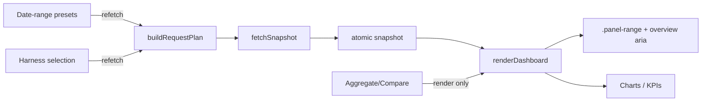

# Task: dashboard-polish-m1-top-controls

* Task ID: dashboard-polish-m1-top-controls
* Complexity: Level 3
* Type: feature

L4 milestone m1: add a top-bar date-range preset control wired to windowed `since`/`until` (prior-period % deltas + panel labels) per [#4](https://github.com/Texarkanine/stockroom/issues/4), and restyle Aggregate/Compare as one exclusive segmented toggle per [#5](https://github.com/Texarkanine/stockroom/issues/5).

## Pinned Info

### Control strip data flow

Date range is a query filter (refetch); Aggregate/Compare remains presentation-only (render). Wrapped never receives bounds.

## Component Analysis

### Affected Components

- **`static/index.html`**: Shell + inline CSS for `.controls`. Add `#date-range-selector` fieldset (presets). Restyle `#mode-selector` into one segmented pill. Keep `.panel-range` nodes (copy becomes dynamic).
- **`static/dashboard-data.mjs`**: `buildRequestPlan` / `fetchSnapshot` — accept optional `{ since, until } | null`; append encoded bounds to all endpoints except `wrapped`.
- **`static/dashboard-core.mjs`**: Extend view state + `transitionViewState` with date-range action (`effect: "refetch"`); helpers for preset → bounds and panel-range label strings.
- **`static/dashboard.mjs`**: Wire date-range DOM, busy disable, call plan/fetch with window, update labels/aria on render; keep mode handler render-only.
- **Python metrics/server**: No functional change expected — `since`/`until` and prior-window overview already implemented.
- **Tests**: `tests-js/dashboard-data.test.mjs`, `tests-js/dashboard-core.test.mjs`, `tests/test_dashboard_static.py` (and any small adapter coverage if added).

### Cross-Module Dependencies

- `dashboard.mjs` → `transitionViewState` (core) → on `refetch` → `fetchSnapshot`/`buildRequestPlan` (data) → snapshot → render helpers (core) → DOM/Chart.js.
- Label text depends on selected preset (client), not on response metadata.
- Mode never appears in request URLs.

### Boundary Changes

- **Public JS:** `buildRequestPlan(selectedHarnesses, windowBounds?)` gains an optional bounds argument (`null`/omitted = today’s behavior). `fetchSnapshot(fetchImpl, selectedHarnesses, options?)` already takes an options object — pass bounds via `options.window` (or equivalent) rather than a new positional parameter, and forward that into `buildRequestPlan`.
- **HTTP/API:** Unchanged contract; client begins exercising existing query params.
- **HTML contracts:** New `#date-range-selector` fieldset; `#mode-selector` remains a fieldset radiogroup with segmented visuals.

### Invariants & Constraints

- Read-only warehouse; offline (no CDN/calendar lib); mode-agnostic API; client-owned Aggregate/Compare.
- Wrapped all-time / unfiltered.
- Atomic snapshot gate — no partial panel flash on bad ranges.
- `project_id` identity untouched (m3).
- Port 6767 / `stockroom dashboard` unchanged.
- Cross-milestone invariants in `milestones.md` still hold.

## Open Questions

- [x] Date-range control UX → Resolved: preset exclusive control `Default | 7d | 30d | 90d | 1y`; initial `Default` omits bounds; no URL sync / persistence / free-form calendar in m1 (see `memory-bank/active/creative/creative-date-range-ux.md`)

## Test Plan (TDD)

### Behaviors to Verify

- Date preset selected → `buildRequestPlan` URLs for overview/trends/projects/tools/models/efficiency/sessions include `since` + `until`; `wrapped` has neither.
- `Default` / null bounds → plan matches today’s URLs (harness + sessions `limit=50` only).
- Bounds are URI-encoded; both params always present together when a non-default preset is active.
- `transitionViewState` date-range change → `effect: "refetch"`; identical preset → `none`; mode change still `render` only.
- Panel-range helper: `default` → existing per-panel default strings; preset → honest shared window labels (e.g. “Last 7 days”) for windowed panels.
- Static HTML: `#date-range-selector` is a `fieldset` with exclusive radios; `#mode-selector` remains `fieldset` and reads as one segmented control (class/structure contract).
- Existing Node/pytest dashboard contracts stay green.

### Edge Cases

- Empty harness selection still refused by existing state machine (unchanged).
- HTTP 400 on malformed bounds still fails whole snapshot (existing gate); preset path should not emit invalid bounds.
- Busy/`aria-busy` disables date-range inputs like mode radios.

### Test Infrastructure

- Framework: Node 22 `node:test` (`make test-js`); pytest for static HTML (`uv run --no-sync pytest`).
- Locations: `skills/sr-search/tests-js/`, `skills/sr-search/tests/test_dashboard_*.py`.
- Conventions: `test("…")` in `dashboard-*.test.mjs`; `test_*` in `test_dashboard_*.py`.
- New test files: none required (extend existing).

### Integration Tests

- `fetchSnapshot` with bounds: all non-wrapped pending URLs contain the same `since`/`until` query pair; wrapped URL unchanged (extend existing parallel-fetch test pattern).

## Implementation Plan

1. [x] **Request-plan bounds (TDD)** — write failing tests in `dashboard-data.test.mjs` for null vs preset bounds (including `fetchSnapshot` URL assertions); then implement `buildRequestPlan` optional bounds + `fetchSnapshot` forwarding via `options.window`.
    - Files: `tests-js/dashboard-data.test.mjs`, `static/dashboard-data.mjs`
    - Changes: append `since`/`until` when bounds provided; never on `wrapped`.
2. [x] **View-state + label helpers (TDD)** — write failing tests in `dashboard-core.test.mjs` for date-range transitions and label mapping; then implement preset constants, bounds resolver (`until=now`, `since=until−duration`), `transitionViewState` action, `panelRangeLabels(preset)` (or equivalent).
    - Files: `tests-js/dashboard-core.test.mjs`, `static/dashboard-core.mjs`
    - Creative ref: `creative-date-range-ux.md`
3. [x] **Static shell contracts (TDD)** — write failing assertions in `test_dashboard_static.py` for `#date-range-selector` fieldset + segmented mode markup/classes; then update `index.html` CSS/markup for date presets and mode pill.
    - Files: `tests/test_dashboard_static.py`, `static/index.html`
4. [ ] **DOM adapter glue (after 1–3 green)** — no new business logic in `dashboard.mjs`: only event wiring, busy disable, pass `options.window` into `fetchSnapshot`, and apply already-tested label helpers / aria updates. Mode path stays render-only. If any non-trivial logic appears during wiring, extract it to `dashboard-core.mjs` with a failing test first (do not grow untested logic in the adapter).
    - Files: `static/dashboard.mjs`
5. [ ] **Verification** — `make test-js`, targeted pytest dashboard tests, then `make ci` at milestone boundary.

### Preflight amendments (2026-07-10)

- Clarified TDD ordering on every implementable unit (tests before code on steps 1–3; step 4 is adapter glue only after those are green).
- Aligned `fetchSnapshot` bounds with existing `options` object (`options.window`) instead of a new positional arg.

## Technology Validation

No new technology — validation not required (native HTML/CSS/JS only; no calendar library).

## Challenges & Mitigations

- **Mixed default windows vs single preset:** When `Default`, keep per-panel copy; when preset active, label all windowed panels to that duration (trends daily+weekly share one bounded window server-side). Mitigation: label helper keyed by preset, not by old hardcoded per-panel defaults.
- **Crowded `.controls` row:** Five date radios + segmented mode + harness. Mitigation: compact segmented styling consistent with #5; verify responsive wrap still usable.
- **Clock skew / ISO format:** Use the same ISO shape `parse_timestamp` accepts (date-time or date-only). Mitigation: centralize bound formatting in core helper; cover encoding in data tests.
- **Accidental Wrapped filtering:** Explicit `wrapped` branch without bounds; regression test asserts absence.

## Pre-Mortem

- **Plan failed because operators expected a calendar and rejected presets:** Already accepted tradeoff in creative; m1 ships presets; calendar is a later enhancement on the same `{ since, until } | null` shape — no plan change.
- **Plan failed because first paint changed trends (14d/12w → 30d) and looked like a regression:** Mitigated by initial `Default` (omit bounds) — already in creative decision.
- **Plan failed by treating label updates as optional and leaving “Last 14 days” while fetching 90d:** Add explicit implementation step + tests for label helper; treat dishonest labels as acceptance failure.
- **Plan failed by putting mode semantics into the API:** Challenge already forbids; keep mode render-only in state machine tests.

## Status

- [x] Component analysis complete
- [x] Open questions resolved
- [x] Test planning complete (TDD)
- [x] Implementation plan complete
- [x] Technology validation complete
- [x] Pre-Mortem complete
- [x] Preflight
- [ ] Build
- [ ] QA
