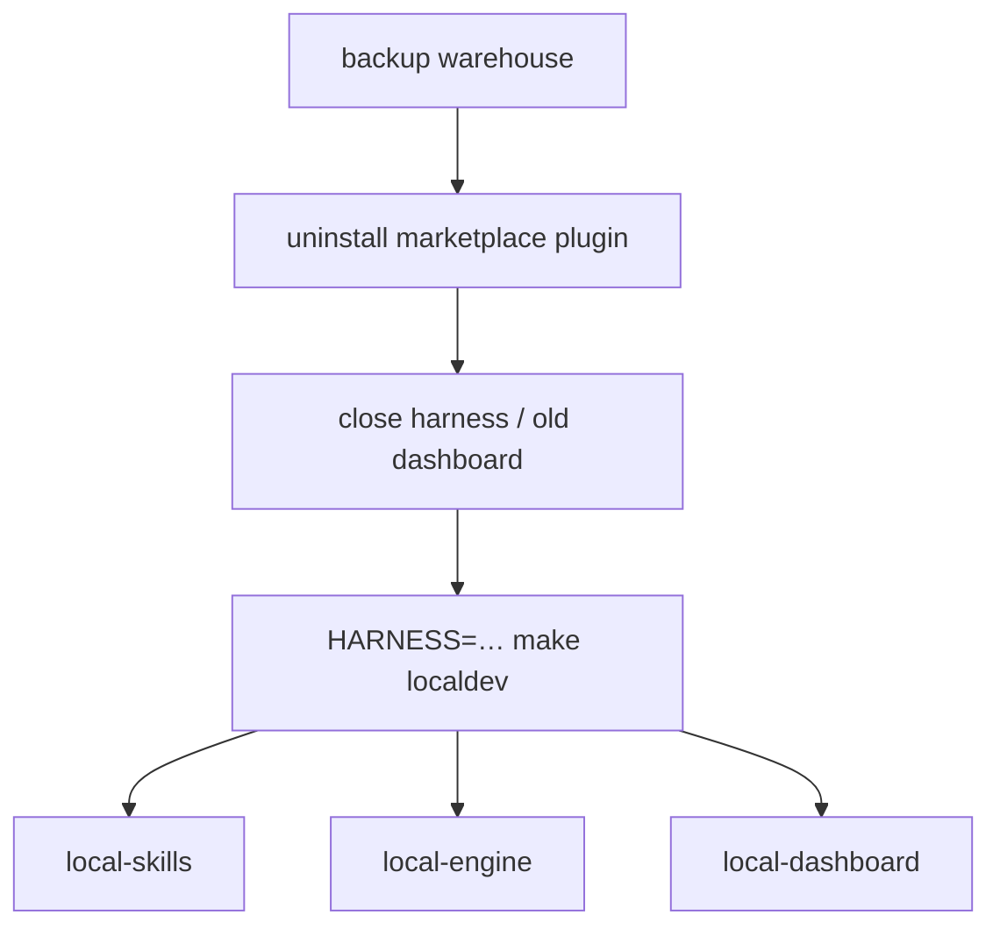

# Task: contributing-localdev-guide

* Task ID: contributing-localdev-guide
* Complexity: Level 3
* Type: enhancement (rework² — thin `local-*` atoms; **no hook automation**)

Throw out the mega-`localdev` recipe and all hook-install automation. Keep shim FORCE + deleted `plugin-local`. Named atoms only; `localdev` composes them. Harness-dependent atoms require `HARNESS=cursor|claude` and error if unset/invalid.

**Hooks are out of Make.** Committed `hooks/*.json` use `*_PLUGIN_ROOT`; after marketplace uninstall that var is unset, so copying them into the project does not help. Contributors who change the hook bootstrap surface edit hooks by hand (documented note only).

## Pinned Info

### Enter composition

### Locked atom inventory

| Target | `HARNESS`? | Role |
| --- | --- | --- |
| `local-skills` | required | Wire checkout skills for that harness |
| `local-engine` | no | `shim TAKEOVER=1 FORCE=1` + `ensure-env` (owner `dev`) |
| `local-dashboard` | no | Bounce `stockroom dashboard` |
| `localdev` | required | Invokes the three atoms above |
| `localdev-clean` | required | Undo that harness’s managed bits (not warehouse/shim) |
| `localdev-status` | optional | Report managed vs shim sections |

Usage: `HARNESS=cursor make localdev`

**Not a target:** `local-hooks` — removed from inventory.

## Cruft to throw out

- Fat inlined `localdev` recipe
- **`hooks/localdev_hooks.py`** and all Make/docs wiring that installs project hooks
- **`tests/test_localdev_hooks.py`**
- Dual-harness / PATH-based project-hook install from creative B *automation* track (PATH-hook *idea* remains valid for a future manual note only)
- Docs that present automated hooks as part of enter
- Any leftover `plugin-local` references (B2 gate)

## Keep (already done / still valid)

- Shim `force` policy + CLI `--force` + tests S1–S5
- `make shim` low-level bake with optional `TAKEOVER=1` / `FORCE=1`
- `plugin-local` deleted
- Status section separator (localdev-managed vs shim)
- Committed plugin hooks under `hooks/` for **marketplace/plugin** installs (unchanged)

## Component Analysis

### Affected Components

- **`Makefile`**: atoms + composer; delete hook-install recipes; `HARNESS` guard for skills/clean/localdev
- **Delete** `hooks/localdev_hooks.py`, `tests/test_localdev_hooks.py`
- **`docs/contributing/local-workflow.md`**: rip-it-out + `HARNESS=… make localdev`; appendix atoms; **short note**: hooks only if changing bootstrap surface (manual; PLUGIN_ROOT footgun)
- **`docs/contributing/development.md`**, troubleshooting: match atoms; no automated hooks
- **`memory-bank/techContext.md` / `systemPatterns.md`**: atom composition; no localdev hook install
- **Tests**: S1–S5 only for new Python; shell M-checks below

### Cross-Module Dependencies

Order inside `localdev`: `local-skills` → `local-engine` → `local-dashboard`

### Boundary Changes

- Make: public atom targets + required `HARNESS` for harness-scoped ones
- Unchanged: shim CLI `--force`; committed `hooks/*.json` for plugin packaging

### Invariants & Constraints

- Must preserve: succeed-or-refuse without FORCE; agents/skills never recommend FORCE
- Must preserve: TAKEOVER alone insufficient for live foreign
- Must hold: warehouse backup in rip-it-out story
- Must hold: `localdev-clean` does not touch warehouse, marketplace, or on-path shim
- Must hold: harness atoms error when `HARNESS` unset or not `cursor`/`claude`
- Must hold: **no Make target writes project hooks**
- Non-goal: `dashboard stop/restart`; automated project-hook install

## Open Questions

- [x] FORCE → creative B two-key (binding)
- [x] Mega one-shot → atoms + composer
- [x] Hooks in automation → **out** (operator 2026-07-12; PLUGIN_ROOT after uninstall)
- [x] Claude `local-skills`: no-op + `--plugin-dir` message if no mirror (**locked default**)

## Test Plan (TDD)

### Already green (do not regress)

- S1–S5 shim FORCE
- M1: `TAKEOVER=1 FORCE=1` vs plain `shim`
- M2: `plugin-local` gone
- B2: no `plugin-local` in user-facing docs

### Make checks

- M3: `make local-skills` / `localdev` / `localdev-clean` without `HARNESS` → nonzero + message
- M4: `HARNESS=nope make local-skills` → nonzero
- M5: `make -n local-engine` shows takeover+force and ensure-env; no `HARNESS`
- M6: `make -n HARNESS=cursor localdev` invokes local-skills, local-engine, local-dashboard — **not** hooks
- M7: `localdev-status` has managed vs shim separator; **no** managed-hooks lines
- M8: no `local-hooks` / `localdev_hooks` target or recipe references
- M9: `hooks/localdev_hooks.py` absent

### Docs

- B1: `make docs-build` green
- B3: rip-it-out + `HARNESS=… make localdev`; appendix atoms; FORCE warned; **hooks = manual note only**

## Implementation Plan

1. **Delete hook automation (TDD)** — Confirm M8/M9 currently fail (helper + test exist; Makefile references `localdev_hooks`) → delete `hooks/localdev_hooks.py` + `tests/test_localdev_hooks.py` and strip all Makefile hook recipes/vars → re-check M8/M9 pass
2. **Makefile atoms (TDD)** — Confirm M3–M7 fail/wrong against current mega-`localdev` → implement `require-harness`, `local-skills`, `local-engine`, `local-dashboard`, composer `localdev`, harness-scoped `localdev-clean`, slim `localdev-status` → re-check M3–M7
3. **Docs + memory-bank** — rewrite local-workflow / development / troubleshooting for atoms + `HARNESS` + manual hooks footnote; fix techContext/systemPatterns one-liners that still claim PATH hooks in localdev; fix projectbrief rework user-story if it still says “hooks”
4. **Gates** — pytest shim suites; M1–M9; docs-build; `make format` / `make ci`

## Preflight Amendments

- TDD ordering made explicit per unit (steps 1–2: check-fail → implement → re-check). Previous step 2 was implement-then-verify only — would have blocked build.
- Build must **ignore** stale creative “Implementation Notes → Hooks” (lines that still describe installing project hooks). Binding text is the **Hooks amendment** + this `tasks.md` only.
- `localdev-status` must not report managed hook markers after hook automation is removed.
- Claude `local-skills` open question closed with no-op + message default.

## Challenges & Mitigations

- **Contributor expects sessionStart after uninstall**: docs say dashboard via `local-dashboard` / CLI; hooks only if hacking bootstrap
- **FORCE abuse**: two-key via `local-engine` / `shim` only
- **Claude skills**: no-op + message default

## Pre-Mortem

- **Plan fails by sneaking hooks back into Make**: M8–M9 gates
- **Plan fails by copying PLUGIN_ROOT hooks into project**: explicitly rejected
- **Plan fails leaving docs promising automated hooks**: B3

## Technology Validation

No new technology.

## Status

- [x] Shim FORCE; plugin-local deleted
- [x] nk-refresh → thin atoms; hooks removed from automation
- [x] Plan (rework²) updated
- [x] Preflight PASS (amendments applied)
- [ ] Build
- [ ] QA
