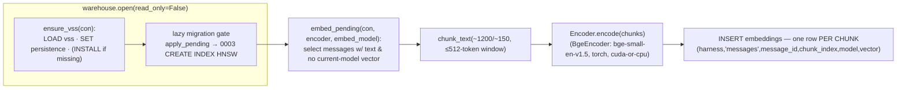
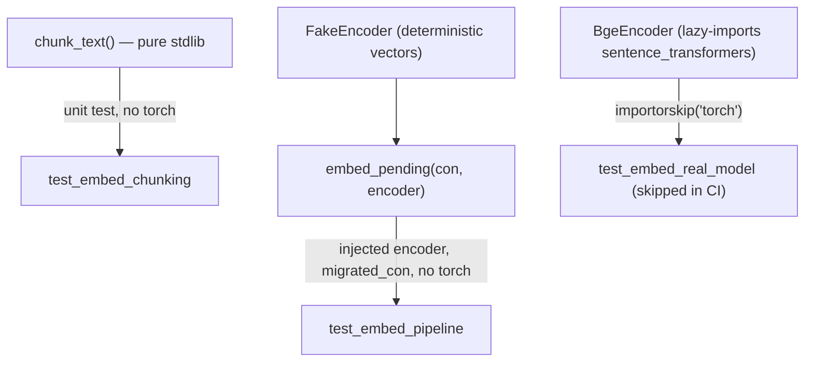

# Task: Phase 2 · Milestone 1 — Embedding pipeline

* Task ID: `p2-embeddings-search` (sub-run m1)
* Complexity: Level 3
* Type: feature (new subsystem)

Land the deferred VSS/HNSW vector index as forward-only migration `0003`, and a
local `sentence-transformers` (`BAAI/bge-small-en-v1.5`, 384-dim, 512-token
window) embedding pipeline: chunk long text and store **one `FLOAT[384]` vector
per chunk** (per-chunk rows, max-sim dedup deferred to m2), written through the
`warehouse.open()` chokepoint, re-embedding only un-embedded/changed content.
Runs on the Phase 0 torch contract; built test-first under torch-free CI.

## Pinned Info

### Embedding pipeline data flow

### Torch-free testability seam

## Component Analysis

### Affected Components

- **`stockroom.migrations` (`0003_embeddings_hnsw_index.sql`)** — new file. Current: ships `0001`+`0002`. Change: add `0003` = `SET hnsw_enable_experimental_persistence=true; CREATE INDEX embeddings_vector_hnsw ON embeddings USING HNSW (vector) WITH (metric='cosine')`. No `INSTALL`/`LOAD` in the file (precondition: vss loaded by caller). Discovery is automatic.
- **`stockroom.warehouse`** — add `ensure_vss(con)` (LOAD; INSTALL-if-missing; SET persistence). `open()` calls it on the migrator RW connection (before `apply_pending`) and on every returned connection. Boundary change (see below).
- **`stockroom.embed` (new module)** — `chunk_text()`, `Encoder` protocol, `BgeEncoder` (lazy torch import, `BAAI/bge-small-en-v1.5`, device select), `embed_chunks(text, encoder) -> list[vector]` (one 384-vector **per chunk**, no mean-pool), `embed_pending(con, encoder, *, embed_model)`, `EMBED_MODEL`/`EMBED_DIM` constants, and a `__main__`-style CLI entry (`python -m stockroom.embed`) mirroring `stockroom.query`'s single-module shape.
- **`stockroom.ingest.writer`** — cascade-delete a session's `embeddings` in the existing per-`(harness, session_id)` delete-then-insert, so re-ingested (possibly changed) content is re-embedded next run.
- **Test infra (ripple from new migration head = 3)** — `test_migrate_runner.py` (two `==2`/`[1,2]` assertions → `3`/`[1,2,3]`, + `ensure_vss` on real-chain applies), `test_warehouse_open.py` (three `current_version == 2` → `3`; repoint head snapshot), `conftest.py::migrated_con` (call `ensure_vss` before `apply_pending`), new `test_schema_0003.py` + `fixtures/schema/0003_snapshot.json`. `test_migrations_discovery.py` is robust (uses `len(found)` / `>= {1,2}`).

### Cross-Module Dependencies

- `stockroom.embed` → `stockroom.warehouse.open()` (read-write) for the CLI path; → injected `Encoder` for logic (testable without torch).
- `stockroom.warehouse.open()` → `ensure_vss()` → DuckDB `vss` extension (loaded per-connection).
- `0003` (HNSW index) → requires `vss` loaded on the applying connection (established by chokepoint/fixture, not by the migration SQL).
- `stockroom.ingest.writer` → `embeddings` table (cascade-delete on session rewrite).

### Boundary Changes

- **`warehouse.open()` now loads `vss` and sets experimental persistence on every connection** (post-`0003` the schema contains an HNSW index; per-connection SET is required to create/modify it; readers need `vss` for vector ops in m2). New public-ish helper `ensure_vss(con)`.
- **New migration `0003`** advances the schema head 2 → 3 (a test-suite-wide event; see ripple list).
- **`embeddings` becomes a write target** of a second writer (`stockroom.embed`) besides ingest — both go through the chokepoint (`read_only=False`), preserving the single-writer contract.

### Invariants & Constraints preserved

No truncation at rest (only bounded chunks reach the model; full `text` untouched); storage/embedding decoupled; torch-safe contract (torch never in the lock; tests torch-free; `--no-sync`); locked-uv trust (no new runtime dependency — `vss` is a DuckDB extension, not a Python dep); chokepoint-only DB access with `read_only` enforcement; incremental not from-scratch; schema changes only via forward-only numbered migration (`0003`); harness-labeled & cross-harness (embeddings ride the `harness` column); clean-room (engine reimplemented from briefs/spike, not ported).

## Open Questions

- [x] **VSS extension provisioning + where the HNSW index lives** → Resolved: thin `0003` migration (index only, no `INSTALL`/`LOAD`); chokepoint `ensure_vss(con)` loads `vss` + sets persistence on every open and centralizes the (provisioning-time) `INSTALL`; test fixtures call `ensure_vss` before applying the real chain. (`memory-bank/active/creative/creative-vss-provisioning-and-index.md`)
- [x] **Embedding owner grain (what gets embedded)** → Resolved: **messages only** for m1 (`owner_table='messages'`, `owner_id=message_id`); `tool_calls` embedding deferred (additive later via the existing `owner_table` column). (`creative-embedding-owner-grain.md`)
- [x] **Incremental re-embed — new & changed detection** → Resolved: **A+B** — select owners lacking a current-`embed_model` vector (new + model change), plus session-grained embedding cascade-delete in `ingest.writer` (catches edits); no schema column added. (`creative-incremental-reembed-detection.md`)
- [x] **Chunk storage grain (per-chunk vs mean-pool)** → Resolved (operator-directed, grounded in the measured corpus): **per-chunk rows** (`chunk_index = 0..N-1`), max-sim dedup-to-owner deferred to m2. Lossless, best long-tail recall, no schema change; supersedes the tech-brief's "one vector per source item." (`creative-chunk-storage-grain.md`)
- [x] **Embedding model at 384-dim** → Resolved (operator-directed): **`BAAI/bge-small-en-v1.5`** over `all-MiniLM-L6-v2` — +9 MTEB retrieval, 512-token window (2×), no `trust_remote_code`, MIT; passages need no prefix (m1), query prefix optional (m2). Stays 384-dim ⇒ no schema/migration change. (`creative-embedding-model-selection.md`)

## Test Plan (TDD)

### Behaviors to Verify

- **Chunking — short text** → single chunk equal to the input (no splitting under the size threshold).
- **Chunking — long text** → multiple chunks of ~1200 chars with ~150-char overlap; concatenated coverage is complete; deterministic; chunk size stays within the model's 512-token window (verify against the tokenizer to avoid silent within-chunk truncation).
- **Chunking — empty/whitespace** → no chunks (caller skips embedding).
- **embed_chunks(text, encoder)** → returns **one length-384 vector per chunk** (N chunks → N vectors), in chunk order (verified against a deterministic `FakeEncoder`).
- **embed_pending — per-chunk rows** → a single-chunk message writes exactly 1 `embeddings` row (`chunk_index=0`); a multi-chunk message writes N rows with `chunk_index` ascending `0..N-1`, each a 384-vector; `owner_table='messages'`, `owner_id=message_id`; tool_calls untouched.
- **embed_pending — incremental** → a second run with no new content is a no-op (no duplicate rows); after inserting a new message, only that message's chunks are embedded.
- **embed_pending — skips empty text** → messages with NULL/whitespace `text` get no embedding row.
- **embed_pending — model-aware** → a row embedded under a different `embed_model` does not satisfy the current model's selection (re-embedded under the current model).
- **ingest.writer cascade** → re-ingesting (delete-then-insert) a `(harness, session_id)` removes that session's `embeddings`, so they re-embed next run; other sessions' embeddings are untouched.
- **`0003` migration** → after applying the chain, an HNSW index named `embeddings_vector_hnsw` exists on `embeddings(vector)` with cosine metric; the index is usable for `array_cosine_distance` KNN; a delete against the live index succeeds.
- **`0003` schema golden** → cumulative post-`0003` schema (columns + PKs + the new index) byte-matches `0003_snapshot.json`; `0001`/`0002` snapshots stay frozen.
- **chokepoint `ensure_vss`** → an opened warehouse has `vss` loaded and can run a vector query / live-index delete; `open()` on a fresh path migrates to head version 3.
- **Edge — KNN correctness** → with deterministic vectors, the nearest neighbor by cosine is the expected row (sanity that metric + index wiring are right).
- **Real-model integration (torch-gated)** → `BgeEncoder` loads `BAAI/bge-small-en-v1.5` and encodes a string to a 384-vector on CPU; `pytest.importorskip("torch")` so CI (torch-free) skips it.

### Test Infrastructure

- Framework: `pytest`, configured in `skills/sr-search/pyproject.toml` (`[tool.pytest.ini_options]`, `pythonpath = ["src"]`). Run via `make test` / `make ci` from repo root.
- Test location: `skills/sr-search/tests/`.
- Conventions: one test module per engine module (`test_<module>.py`); schema migrations get `test_schema_NNNN.py` + a `fixtures/schema/NNNN_snapshot.json` golden updated via `STOCKROOM_UPDATE_SCHEMA_GOLDEN=1`; library entrypoints take an injected `con=`/encoder for torch-free/DB-free unit tests (the `run_query(sql, *, con=None)` precedent); real-model paths are `importorskip`-gated.
- New test files: `tests/test_embed.py` (chunking + pipeline w/ FakeEncoder + torch-gated real-model), `tests/test_schema_0003.py`, `tests/fixtures/schema/0003_snapshot.json`. Modified: `tests/test_migrate_runner.py`, `tests/test_warehouse_open.py`, `tests/test_ingest_writer.py`, `tests/conftest.py`.

### Integration Tests

- **Chokepoint → migration → vector op**: `warehouse.open(read_only=False)` on a fresh `STOCKROOM_HOME` yields a v3 warehouse with `vss` loaded; insert embeddings, run a cosine KNN, delete against the live index — all succeed (exercises `ensure_vss` + `0003` + experimental persistence end to end).
- **Ingest → embed → re-ingest**: ingest a fixture session, `embed_pending` it, re-ingest the same session, confirm its embeddings were cascaded and re-embedded; other sessions stable.

## Implementation Plan

Ordered, dependency-led (fewest deps first → chokepoint/migration ripple). **Each step is a strict TDD cycle**: write the named test(s) and run them to confirm they FAIL for the right reason, *then* write the production code to turn them green, *then* re-run the step's tests (and the suite at boundaries). Within every step the (a) test substep precedes the (b) implementation substep — never code-first.

1. **[x] Chunker** — `stockroom.embed.chunk_text(text, *, size=1200, overlap=150)`.
    - (a) Test first: add `tests/test_embed.py` with `test_chunk_short_text_single_chunk`, `test_chunk_long_text_overlapping`, `test_chunk_empty_is_no_chunks`; run → they fail (no `embed` module).
    - (b) Implement: create `src/stockroom/embed.py` with the pure stdlib sliding-window chunker (+ `EMBED_MODEL`/`EMBED_DIM` constants and the `Encoder` protocol stub); run → green. (Chunk size is a conservative char proxy for the 512-token window; if step 6 finds dense-code chunks exceed 512 tokens, tighten to token-aware chunking.)
2. **[x] Per-chunk + injected-encoder pipeline** — `embed_chunks()`, `embed_pending(con, encoder, *, embed_model=EMBED_MODEL)`. *(Build note: the `embeddings` PK excludes `embed_model`, so `embed_pending` deletes a selected owner's existing rows before inserting — a model change replaces vectors rather than colliding at the same `chunk_index`.)*
    - (a) Test first: extend `tests/test_embed.py` with a deterministic `FakeEncoder` and `test_embed_chunks_one_vector_per_chunk`, `test_embed_pending_writes_per_chunk_rows` (single-chunk → 1 row; multi-chunk → N rows, `chunk_index` 0..N-1), `test_embed_pending_incremental_is_no_op_then_embeds_new`, `test_embed_pending_skips_empty_text`, `test_embed_pending_is_model_aware`, `test_embed_pending_knn_nearest_chunk_is_expected` (against `migrated_con`); run → fail. **No torch.**
    - (b) Implement: `embed_chunks` (chunk → encode → **one 384-vector per chunk**, no pool) and `embed_pending` (selection: non-empty `text`, `NOT EXISTS` current-model embedding *for the owner*; insert one row per chunk `(harness,'messages',message_id,chunk_index,model,vector)`); run → green.
    - Creative ref: `creative-embedding-owner-grain.md`, `creative-chunk-storage-grain.md`, `creative-incremental-reembed-detection.md` (selection A).
3. **[x] `ensure_vss` + `0003` migration** — index DDL + chokepoint extension loading. *(Build notes: advisory verified — `LOAD vss` + `SET …persistence` both succeed on read-only connections, so `ensure_vss` runs unconditionally on every `open()`; the `0003` golden's index section captures name/table/`expressions` — the cosine `metric` is **not** introspectable via `duckdb_indexes()`, so it's verified functionally by the KNN test. `duckdb_indexes().expressions` is a VARCHAR `'[vector]'`, not a list.)*
    - (a) Test first: add `tests/test_schema_0003.py` — `test_0003_creates_hnsw_cosine_index` (assert via `duckdb_indexes()` after `ensure_vss`+chain), `test_0003_index_supports_knn_and_live_delete`, and `test_migrated_schema_matches_0003_snapshot` (cumulative columns+PKs **and** an index section, written with `STOCKROOM_UPDATE_SCHEMA_GOLDEN=1`); run → fail. Update `tests/conftest.py::migrated_con` to call `ensure_vss` before `apply_pending` (its absence makes step-3 tests fail until implemented).
    - (b) Implement: `src/stockroom/migrations/0003_embeddings_hnsw_index.sql` (thin: `SET …persistence=true; CREATE INDEX embeddings_vector_hnsw … USING HNSW (vector) WITH (metric='cosine')`); `ensure_vss(con)` in `warehouse.py` (LOAD → INSTALL-if-missing → LOAD → SET persistence) wired into `open()` (migrator RW conn + every returned conn); generate `tests/fixtures/schema/0003_snapshot.json`; run → green.
    - Creative ref: `creative-vss-provisioning-and-index.md`.
4. **[x] Migration-head ripple** — update assertions coupled to "head == 2". *(Build note: in addition to `test_migrate_runner` + `test_warehouse_open`, `test_warehouse_concurrency` carried two head-coupled assertions (`migrate_report` worker output + bookkeeping row count) — a minor plan under-enumeration, updated in-scope. Added `test_open_reader_has_vss_loaded` resolving the RO advisory. `test_warehouse_open` repointed to `test_schema_0003`'s `{tables, indexes}` snapshot/introspection.)*
    - (a) Test first: this step *is* test edits — update `tests/test_migrate_runner.py` (`[1,2]`→`[1,2,3]`, `==2`→`==3`; `ensure_vss(mem_con)` before the two real-chain applies) and `tests/test_warehouse_open.py` (three `current_version == 2`→`==3`; repoint the head-snapshot import/ref to `test_schema_0003`'s snapshot + introspection); run → confirm they now encode head 3.
    - (b) Implement: no production change — green follows from step 3's migration. (If red, the failure is a real integration gap to fix here.)
5. **[x] Incremental cascade (changed detection)** — `ingest.writer` drops a session's embeddings on rewrite. *(Build note: cascade runs in `_delete_session` **before** the `messages` delete, since `owner_id` resolves against the message rows.)*
    - (a) Test first: add to `tests/test_ingest_writer.py` `test_rewriting_session_cascades_embedding_delete` (seed a session + an embedding row, re-write the session, assert its embeddings are gone and another session's remain); run → fail.
    - (b) Implement: in the per-`(harness, session_id)` delete-then-insert, delete that session's `embeddings` owner rows; run → green.
    - Creative ref: `creative-incremental-reembed-detection.md` (B).
6. **[x] Real-model encoder + CLI** — `BgeEncoder`, `python -m stockroom.embed` (with `--full`). *(Build note: `main()` gained a keyword-only `encoder_factory=BgeEncoder` injection seam so the CLI logic is tested torch-free with a `FakeEncoder` — mirrors the `con`-injection precedent — while the real-model `BgeEncoder` test stays `importorskip`-gated/CI-skipped.)*
    - (a) Test first: add `test_bge_encoder_encodes_to_384_on_cpu` to `tests/test_embed.py`, guarded by `pytest.importorskip("torch")` (skips in torch-free CI); run → skip (or fail where torch present). Also assert the model loads **without** `trust_remote_code` and that an over-long chunk does not silently exceed 512 tokens (token-window guard).
    - (b) Implement: `BgeEncoder` (lazy `sentence_transformers` import; `cuda` if `torch.cuda.is_available()` else `cpu`; `BAAI/bge-small-en-v1.5`; **no passage prefix**, no `trust_remote_code`) and the `if __name__ == "__main__"` CLI (open RW via chokepoint, build encoder, `embed_pending`, print count; `--full` flag re-embeds all by ignoring existing rows — mirrors ingest `--full`); run → green/skip.
7. **[x] Docs** — accrete memory-bank tech context + skill stub note (no test; reviewed prose).
    - Files: `memory-bank/techContext.md` (new "Embeddings (`stockroom.embed`)" + `0003`/VSS note), `memory-bank/systemPatterns.md` (VSS-loaded-at-chokepoint + embed-is-second-writer pattern), `skills/sr-search/SKILL.md` (embedding pipeline landed; search behavior still m2/m3).
    - Boundary gate: run `make ci` green before reflect.

## Technology Validation

**No new dependency.** `duckdb`, `sentence-transformers`, `numpy` are already declared and locked (`pyproject.toml` / `uv.lock`); `vss` is a DuckDB *extension* provisioned at runtime, not a Python package — so **`uv.lock` is not touched** (locked-uv trust invariant preserved). Torch remains out of the lock (Phase 0 contract). The chosen model, `BAAI/bge-small-en-v1.5`, is a `sentence_transformers` weight name resolved at runtime (a ~130 MB one-time HF download, cached like the torch/vss assets; loads with a **plain BERT arch — no `trust_remote_code`**) — also not a `uv.lock` entry. Model evaluation: see `creative-embedding-model-selection.md` (current MTEB: bge-small-en-v1.5 retrieval 51.68 vs MiniLM 42.35, both 384-dim; 512 vs 256 window).

Spike (2026-06-28, DuckDB 1.5.4, this machine) validated the load-bearing primitives:
- `INSTALL vss` + `LOAD vss` succeed; extension caches to `~/.duckdb/extensions/.../vss.duckdb_extension` (`REPOSITORY` install mode → confirms `INSTALL` is the network op, `LOAD` is offline-safe).
- HNSW cosine index returns correct nearest neighbor (query == row ⇒ distance 0.0).
- `DELETE`/`INSERT` against a **live** index work with experimental persistence on; the index **survives reopen** of a persistent DB and still answers KNN.
- `LOAD vss` + `SET persistence` + `CREATE INDEX … USING HNSW` run **inside the runner's `BEGIN/COMMIT`** and on an `:memory:` connection.
- CPU `all-MiniLM-L6-v2` → 384-dim encode was already proven green in `planning/spikes/o9-torch/` (`smoke.py`); not re-run (torch is provisioned out of band and absent here by design).

## Challenges & Mitigations

- **`vss` network `INSTALL` vs. offline posture** → `INSTALL` confined to `ensure_vss` (install-on-missing); migration SQL never installs; `sr-initialize` (Phase 4) pre-warms the cache so end-user runtime is network-free. CI/dev autoinstall (network present) keeps tests green.
- **Experimental-persistence durability risk** → accepted per roadmap/tech-brief (the documented price of deletes against a live index); persistence flag set per-connection by the chokepoint.
- **Torch absent in CI** → all pipeline logic is tested via the pure chunker + an injected `FakeEncoder` against `migrated_con`; the only torch-dependent test is `importorskip`-gated. A design that needs torch to test the pipeline would fail `make ci` — explicitly avoided.
- **`0003` head-version ripple** → enumerated, bounded set of assertion/fixture updates (Step 4) + a new `0003_snapshot.json`; `0001`/`0002` goldens stay frozen (forward-only).
- **Widening into `ingest.writer` (Phase-1 code)** → the cascade is ~a few lines in the one place that already rewrites sessions, directly tested; chosen over a heavier `source_hash` schema column.
- **Second writer to `embeddings`** → both ingest and embed go through `warehouse.open(read_only=False)`; the single-writer flock contract is preserved (no concurrent writers by construction).
- **`ensure_vss` on a read-only connection** (preflight advisory) → `open(read_only=True)` will now call `ensure_vss`, which runs `LOAD vss` and `SET hnsw_enable_experimental_persistence=true` on an RO connection (m2 readers need `vss` for vector ops). `LOAD`/`SET` are session-level, not DB writes, so they should succeed on RO — but this must be **verified in step 3** (a `test_open_reader_has_vss_loaded` against `warehouse_home`). If a SET is rejected on RO, scope it to the writer/migrator path and have readers only `LOAD`.
- **`ensure_vss` cost in concurrency/lock tests** → every `open()` now does a `LOAD` (and a one-time `INSTALL` per machine/runner). This adds startup cost but no behavior change; `test_warehouse_concurrency`/`test_warehouse_lock` should stay green. Watch for first-`INSTALL` latency in CI (cached after first).
- **Per-chunk storage → m2 forward dependency** → storing N rows per message means `sr-semantic` (m2) must dedup chunk hits to one per `(harness, owner_table, owner_id)` by min cosine distance before ranking. Recorded in `creative-chunk-storage-grain.md`; m1 is unaffected (it only writes), but m2's plan must honor it. Row count rises ~2.2× (≈48 K vs 22 K) — trivial.
- **Model weights provisioning** → `bge-small-en-v1.5` must be cached (one-time ~130 MB HF download) for offline runtime; `sr-initialize` (Phase 4) warm-up should fetch it (update the o9-torch smoke's model name). The torch-gated real-model test will trigger the download on a torch-equipped machine; CI skips it.

## Preflight — Radical Innovation (advisory, applied)

Folded a small, in-scope, precedent-aligned improvement into the plan: the embed CLI gains a **`--full`** flag (step 6) that forces a complete re-embed by ignoring existing rows — mirroring `ingest`'s established `--full` reset and giving an operational escape hatch (e.g., after a model change) without touching the incremental selection's default behavior. Trivial surface, no complexity-level or scope change.

## Status

- [x] Component analysis complete
- [x] Open questions resolved (5/5, high confidence — incl. operator-directed per-chunk storage + bge-small-en-v1.5 model)
- [x] Test planning complete (TDD)
- [x] Implementation plan complete
- [x] Technology validation complete (no lock change; spike green)
- [x] Preflight — PASS (with advisory); TDD per-unit ordering encoded, ripple verified, `--full` folded in
- [x] Build — all 7 steps complete (TDD); 202 passed + 1 torch-gated skip; `make ci` green; e2e smoke green
- [ ] QA
