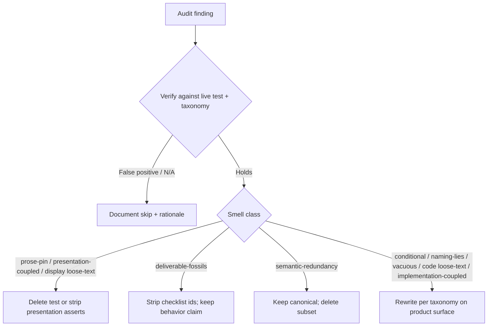

# Task: SLOBAC audit remediation

* Task ID: 20260711-slobac-audit-remediation
* Complexity: Level 3
* Type: refactor (test-suite smell remediation)

Verify each of the 60 findings in `.slobac/2026-07-11T14-58-48/audit.md` against live tests and the [SLOBAC taxonomy](https://texarkanine.github.io/slobac/taxonomy/), then remediate applicable smells. Prefer deleting dashboard-display / skill-docs prose pins over locking copy; keep strong behavioral coverage of product code under `skills/sr-search/`.

## Pinned Info

### Remediation disposition flow

How each verified finding is handled before edit.

## Component Analysis

### Affected Components

- **Doctor / doctor CLI tests** (`tests/test_doctor.py`, `tests/test_doctor_cli.py`): strip B# fossils; fix conditional torch-isolation assert.
- **Engine env / shim / torch tests** (`test_engine_env.py`, `test_shim*.py`, `test_torch_*.py`): strip B/T/F fossils; delete entire prose-pin `test_torch_writers.py`; strengthen torch soft-fail oracles without relying on OR-substrings.
- **Query / query CLI / migrate CLI** (`test_query.py`, `test_query_cli.py`, `test_migrate_cli.py`): `pytest.raises` for read-only; exact TSV oracles; rename Phase-1 fossil; delete migrate help token pin.
- **Ingest** (`test_ingest_claude.py`, `test_ingest_sources.py`, `test_ingest_orchestrator.py`): stop calling `_parse_ts` / `_mtime`; drive via `parse_session` / `discover`; fix naming-lie on progress callback; pin timezone precondition for mtime.
- **Dashboard** (`test_dashboard_metrics.py`, `test_dashboard_static.py`, `test_dashboard_server.py`, `tests-js/dashboard-core.test.mjs`): stop calling `metrics._iso`; delete presentation/aria/PANEL_HELP pins; drop error-message substring discrimination on session API 400s.
- **Warehouse path tests** (`test_warehouse_home_xdg.py`, `test_warehouse_open.py`): delete redundant open-file home/path tests.
- **Packaging / skill hygiene** (`test_packaging.py`, `test_skill_hygiene.py`): delete vacuous front-matter and feature-mention pins; keep architectural forbidden-token fitness tests.
- **Schedule / dispatcher CLI** (`test_schedule_cli.py`, `test_dispatcher_cli.py`): strip B15 fossils; fix "five subcommands" naming-lie. (Broader `test_schedule.py` fossils **not** in the audit → out of scope.)

### Cross-Module Dependencies

- Torch soft-fail tests depend on `stockroom.torch_source` report shape (`action` + `reason`) and monkeypatched runners — oracle changes stay in tests unless exact reason templates need shared constants.
- Ingest timestamp/mtime coverage must route through public `parse_session` / `discover` so private helpers can change freely.
- Dashboard ISO-Z contract is already asserted via public metrics payloads elsewhere; private `_iso` unit test is redundant coupling.

### Boundary Changes

- **None required for product APIs** under the chosen dispositions (exact reason equality + side effects for torch; status-only for session 400 param errors; public-surface coverage for private helpers).
- **Non-goal:** expanding remediation to unlisted fossils (e.g. many `B#` docs in `test_schedule.py`).

### Invariants & Constraints

- Must preserve regression-detection power for kept behavioral tests (semantic-redundancy deletes only strict subsets as prescribed).
- Must prefer deletion over goldenizing dashboard/skill/docs copy when smell is prose-pin, presentation-coupled, or display loose-text.
- Must not call underscore-private helpers from other test modules after remediation.
- Must keep suite green: `make test` / `make test-js` (or project equivalents) for `skills/sr-search`.
- Must only claim findings from the audit as in-scope.

## Open Questions

None - implementation approach is clear. Operator delete preference settles presentation/prose/skill pins; taxonomy prescriptions settle the rest without needing a design fork.

## Test Plan (TDD)

Most work rewrites existing tests (no new product feature). Where a test is rewritten to cover the same behavior through a public surface, the rewritten test is the failing-first artifact under TDD discipline before deleting the private call. Deletions need no new tests — verify by suite green + smell absence.

### Behaviors to Verify

- Doctor probe isolation: when torch is not preloaded → `torch` absent from `sys.modules` after probe (unconditional assert; pin unloaded precondition or skip).
- Ingest sources mtime: discovered session `mtime` is naive UTC and differs from local-naive when offset ≠ UTC (precondition pinned / split, not silent `if`).
- Query owns-connection path: write SQL → raises `duckdb.Error` via `pytest.raises`.
- Query CLI happy path / stdin: exact default TSV lines for `SELECT 1 AS n` (e.g. `["n", "1"]`).
- Claude parse_session: Z-suffix and offset timestamps normalize to naive UTC on public session fields; non-string timestamps rejected/ignored via public parse.
- Sources discover: `DiscoveredSession.mtime` is naive UTC (no `_mtime` call).
- Metrics public payloads: datetime fields emit trailing-`Z` ISO (no `metrics._iso` call).
- Torch ensure missing freeze: `action=="failed"`, no pip, exact `reason` matching SUT template.
- Torch freeze compile timeout: `action=="failed"`, no freeze file, exact timeout `reason` matching SUT template.
- Ingest orchestrator: completes successfully when `on_progress` is omitted (name matches body) **or** spy proves zero emissions if claim kept.
- Dispatcher help: documents all registered subcommands (not "five").
- Warehouse: home creation + path nesting covered once under XDG suite; open suite retains busy/open-gate tests only.
- Deleted: torch writers prose pins; skill feature-mention pin; skeleton front-matter vacuous pin; PANEL_HELP token pin; aria ratio token pin; session-pane emoji/CSS pins; migrate help `migrat` token pin; session API error-substring discrimination.

### Test Infrastructure

- Framework: pytest (Python) + Node built-in test runner (JS) under `skills/sr-search/`
- Test location: `skills/sr-search/tests/`, `skills/sr-search/tests-js/`
- Conventions: `test_*.py`, descriptive docstrings, fixtures like `warehouse_home`, `repo_root`
- New test files: none expected; may delete `tests/test_torch_writers.py` entirely

### Integration Tests

- No new cross-component integration tests; preserve existing ingest→query CLI behavioral tests with stronger oracles.

## Implementation Plan

### Batch 0 — Verify & disposition log

1. Walk all 60 findings; confirm each still present in live code; note any already-fixed or false positive.
    - Files: audit + cited tests
    - Changes: update `tasks.md` checklist with verify ticks before edits

### Batch 1 — Delete presentation / prose / display-oracle tests

2. Delete `tests/test_torch_writers.py` (all three prose-pin tests + F7 fossil module doc).
3. Delete `test_read_skills_document_exact_text_raw_detail` from `tests/test_skill_hygiene.py` (keep forbidden-token fitness tests).
4. Delete `test_skeleton_skill_front_matter` from `tests/test_packaging.py`.
5. Delete PANEL_HELP efficiency/first-prompt token test from `tests-js/dashboard-core.test.mjs`.
6. Delete or strip `test_write_read_chart_aria_describes_ratio_not_absolute_volumes` presentation/token asserts in `tests/test_dashboard_static.py`.
7. Delete or strip emoji/CSS presentation asserts in `test_session_pane_toolbar_and_bubble_layout_contracts` (prefer full test delete if nothing semantic remains).
8. Delete `test_migrate_help_mentions_migration` from `tests/test_migrate_cli.py`.
9. In `test_session_api_returns_detail_and_client_errors`: keep 400 status checks; remove `"session" in error` / `"harness" in error` substring discrimination.

### Batch 2 — Deliverable fossils (Phase A renames only)

10. Strip `B#`/`T#`/`F#`/Phase-1 checklist prefixes from docstrings (and rename `test_query_proves_end_to_end_queryability` if needed) for **only** the audit-listed tests in:
    - `test_doctor.py`, `test_doctor_cli.py`
    - `test_engine_env.py`, `test_shim.py`, `test_shim_cli.py`, `test_shim_runtime.py`
    - `test_torch_source.py`, `test_torch_cli.py`
    - `test_schedule_cli.py`, `test_query_cli.py`
    - Do **not** expand to unlisted schedule fossils.

### Batch 3 — Conditional logic, naming-lies, vacuous assertion

11. `test_probe_never_imports_torch_eagerly`: pin unloaded-torch precondition (or `pytest.skip` when already loaded) and assert unconditionally.
12. `test_mtime_is_naive_utc`: after moving to public discover (Batch 4), pin non-UTC offset via monkeypatch **or** split so the UTC≠local claim always asserts; no silent body `if`.
13. `test_run_query_no_con_is_read_only`: replace try/flag with `pytest.raises(duckdb.Error)`.
14. `test_top_level_help_lists_all_subcommands`: fix docstring to "all registered subcommands" (body already asserts full `SUBCOMMANDS`).
15. `test_on_progress_none_emits_nothing`: rename to match body (completes without callback) — prefer rename over spy unless claim is load-bearing.
16. `test_query_happy_path_prints_result` + `test_query_reads_sql_from_stdin`: exact TSV line oracles.

### Batch 4 — Implementation-coupled → public surface

17. Replace `claude._parse_ts` tests with `parse_session` fixtures covering Z-suffix, offset, and non-string rejection.
18. Replace `sources._mtime` with `discover(...)` + assert on `DiscoveredSession.mtime` (combine with Batch 3 mtime fix).
19. Replace `metrics._iso` direct call with assertion on a public metrics payload datetime field (or delete if already covered by existing payload tests — prefer delete duplicate if coverage exists).

### Batch 5 — Semantic redundancy

20. Delete `test_home_dir_is_auto_created` from `test_warehouse_open.py` (keep XDG canonical).
21. Delete `test_paths_resolve_under_stockroom_home` from `test_warehouse_open.py` (keep XDG canonical).

### Batch 6 — Code-path loose-text (torch)

22. `test_ensure_torch_fails_without_freeze`: assert `action=="failed"`, no pip, and **exact** `reason` equal to the SUT template string.
23. `test_freeze_torch_soft_fails_on_compile_timeout`: assert `action=="failed"`, no freeze file, and **exact** timeout `reason` equal to the SUT template.

### Batch 7 — Verification

24. Run targeted pytest modules touched, then full `make test` and `make test-js` from repo practices.
25. Confirm each audit finding is checked off as remediated or documented N/A.

## Technology Validation

No new technology - validation not required.

## Challenges & Mitigations

- **Private-helper coverage gaps after decoupling:** Mitigation — write minimal public-surface fixtures first; if a behavior cannot be observed publicly, only then consider promoting a helper (taxonomy exception); default is public-only.
- **Torch exact-reason brittleness:** Mitigation — copy the exact production format string into the assert; if build shows drift across paths, extract a module-level reason constant in `torch_source.py` (small, deliberate).
- **Deleting presentation tests removes layout regression signal:** Accepted per operator — product code behavior > display copy.
- **Audit incomplete vs remaining fossils elsewhere:** Mitigation — explicitly out of scope; do not chase unlisted `B#` in `test_schedule.py`.
- **Combined findings on one test** (e.g. doctor torch isolation = conditional + fossil; mtime = conditional + implementation-coupled): Mitigation — fix once per test addressing all listed smells.

## Pre-Mortem

- **Plan failed because we goldenized UI/skill copy "for safety" instead of deleting:** Plan response — Batch 1 is ordered first and disposition diagram pins delete for those smells; do not "strengthen" deleted items.
- **Plan failed by expanding to every fossil in the suite:** Plan response — invariant locks audit-only scope; schedule.py leftovers stay.
- **Plan failed because private-helper rewrites lost timezone/edge coverage:** Plan response — Batch 4 requires fixtures that still assert the same datetime outcomes on public objects before removing private calls.
- **Plan failed by adding a torch `reason_code` API unnecessarily and widening blast radius:** Already avoided — disposition uses exact reason + side effects; Challenge covers constant extraction only if needed.

## Status

- [x] Component analysis complete
- [x] Open questions resolved
- [x] Test planning complete (TDD)
- [x] Implementation plan complete
- [x] Technology validation complete
- [x] Pre-Mortem complete
- [ ] Preflight
- [ ] Build
- [ ] QA

## Build Checklist

### Batch 0 — Verify
- [ ] All 60 findings verified against live tests

### Batch 1 — Deletes
- [ ] Delete torch writers prose-pin file
- [ ] Delete skill hygiene feature-mention test
- [ ] Delete packaging skeleton front-matter vacuous test
- [ ] Delete JS PANEL_HELP token test
- [ ] Delete/strip dashboard aria ratio token test
- [ ] Delete/strip session pane presentation-coupled asserts
- [ ] Delete migrate help loose-text test
- [ ] Drop session API error substring discrimination

### Batch 2 — Fossils
- [ ] Strip audit-listed checklist/phase fossils from docstrings/names

### Batch 3 — Conditional / naming / vacuous
- [ ] Fix doctor torch isolation conditional
- [ ] Fix mtime timezone conditional (with public discover)
- [ ] Fix query read-only try/flag → pytest.raises
- [ ] Fix dispatcher "five subcommands" naming-lie
- [ ] Fix orchestrator on_progress naming-lie
- [ ] Strengthen query CLI vacuous TSV oracles

### Batch 4 — Implementation-coupled
- [ ] Claude `_parse_ts` → public parse_session
- [ ] Sources `_mtime` → discover
- [ ] Metrics `_iso` → public payload or delete duplicate

### Batch 5 — Semantic redundancy
- [ ] Delete redundant warehouse open home/path tests

### Batch 6 — Torch loose-text
- [ ] Exact reason + side effects for missing-freeze ensure
- [ ] Exact reason + side effects for compile timeout freeze

### Batch 7 — Verify green
- [ ] Targeted + full Python/JS suites pass
