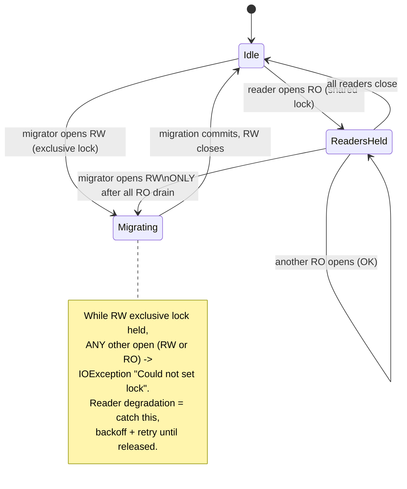

# Task: Migration framework

* Task ID: p1-data-backbone-m2-migration-framework
* Complexity: Level 3
* Type: feature (subsystem — warehouse access + forward-only migrations)

Milestone 2 of the `p1-data-backbone` L4 project. Build the forward-only, numbered SQL migration subsystem inside the `sr-search` engine: a harness-neutral warehouse-open/connection helper (`~/.stockroom/`), a `schema_version` record, a lazy version gate (each consumer checks the version before touching the DB), forward-only application of pending migrations under an exclusive lock, and concurrency-safe reader degradation. The milestone-1 schema (`0001_initial_schema.sql`) ships **in place** as migration `0001` — no file move. The lock primitive and reader wait/backoff semantics are chosen here.

## Pinned Info

### DuckDB cross-process locking model (empirically verified, planning POC)

Load-bearing for the entire concurrency design. Verified on DuckDB 1.5.4 (the locked engine version) via a planning POC:

- A **read-write** connection takes an **exclusive** OS file lock: while it is held, *every* other-process open — RW **or** read-only — fails immediately with `duckdb.IOException: Could not set lock on file …: Conflicting lock is held`.
- A **read-only** connection takes a **shared** lock: other read-only opens succeed; a read-write open fails with the same `IOException`.
- Within a **single process**, a second `connect()` to the same path shares the instance/catalog (no conflict).

**Consequence:** DuckDB itself guarantees migration exclusivity (a migrator holding RW excludes all). The framework's job is (a) coordinate *would-be migrators* so they don't thrash on the RW lock, (b) translate the raw open-time `IOException` into graceful, bounded wait/backoff for readers, and (c) make the writer wait for readers to drain before it can take the RW lock.

## Component Analysis

### Affected Components

- **`stockroom.migrations` package** (`src/stockroom/migrations/`): currently holds `0001_initial_schema.sql` + a docstring-only `__init__.py`. → Gains migration **discovery** (enumerate `NNNN_*.sql` in number order) and the `schema_version` contract. The SQL stays exactly where it is.
- **NEW `stockroom.warehouse` (connection/open helper)**: the harness-neutral warehouse-open contract. Resolves the warehouse path (`~/.stockroom/warehouse.duckdb`, overridable via env for tests), creates `~/.stockroom/` if absent, and opens read-write or read-only connections. This is the single chokepoint every consumer (skills, nightly job) goes through. → New module.
- **NEW migration runner / lazy gate** (likely `stockroom.migrate` or within `stockroom.warehouse`): reads the current `schema_version`, compares to the highest discovered migration number, and — if behind — acquires the exclusive lock, applies each pending migration in a transaction in ascending order, records each in `schema_version`, then returns a ready connection. If current, it is a near-free read of one row.
- **NEW lock primitive**: the cross-process coordination lock that serializes would-be migrators and underpins reader backoff. Exact primitive is **OPEN QUESTION 1**.
- **NEW reader-degradation helper**: a bounded retry/backoff wrapper around "open read-only" that tolerates the migration `IOException`. Semantics are **OPEN QUESTION 2**.
- **Test infrastructure** (`tests/conftest.py`): the existing `schema_con` fixture applies `0001` by raw execute with no runner. → Add fixtures for an on-disk warehouse path (tmp), the migration runner, and multi-process/concurrency harness. `schema_con` stays for the pure schema-contract tests.
- **`memory-bank/techContext.md`**: the Warehouse Schema section already says "the migration framework that applies this SQL … lands in milestone 2." → Update to point at the real runner/warehouse module once built.

### Cross-Module Dependencies

- Every future consumer (ingest m3, `sr-query` m4, search/dashboard) → `stockroom.warehouse.open()` → lazy gate → migration runner → lock primitive. The warehouse helper is the **single entry contract**; the lazy gate is invoked from inside it so no consumer can touch an un-migrated DB.
- Migration runner → `migrations/` discovery (filenames) + `schema_version` table (state) + lock primitive (exclusivity).
- Reader path (`open(read_only=True)`) → reader-degradation helper → DuckDB file lock.

### Boundary Changes

- **New public contract**: `stockroom.warehouse` open functions + the migration runner entrypoint. This is the API every later milestone builds on, so its shape matters (higher blast radius).
- **New DB object**: a `schema_version` table (or equivalent record). This is itself a schema change — decision needed on whether it lives in `0001` or in a dedicated bootstrap step the runner performs before applying numbered migrations (**OPEN QUESTION 3**, lower ambiguity).
- The milestone-1 golden snapshot (`0001_snapshot.json`) pins the *five product tables* filtered to `internal = false`; adding a `schema_version` table must not break that snapshot test — verify the introspection filter excludes/handles it deliberately.

### Invariants & Constraints (must preserve)

- **Forward-only.** No migration is ever edited or reversed; upgrades are data-preserving ("never break your warehouse"). No down-migrations.
- **Preserve data; never force a re-embed.** Migrations transform in place; embeddings (the expensive asset) are never invalidated by the framework itself.
- **0001 ships in place** — the framework wraps the existing file; no move (the `schema_sql_path` fixture pins the packaged path).
- **Harness-neutral warehouse home** — `~/.stockroom/`, never under a harness dir.
- **Hook never migrates** — migration is owned by DB consumers (skills, nightly job), not the session-start hook. (No hook code in this milestone, but the API must make "open + migrate" the explicit consumer action, not a side effect of import.)
- **Locked-uv trust** — any new runtime dependency must enter `uv.lock` via `make lock`; torch never added. Strongly prefer **stdlib-only** for the lock primitive (no new dependency).
- **Test-first**, green `make ci` at the boundary (sync, lock-check, lint, format-check, test, reuse).
- **Clean-room** — lock/migration design reimplemented from first principles + the tech-brief; no `claude-warehouse` lineage; `cursor-warehouse` only via the operator provenance procedure.

## Open Questions

All resolved in the architecture creative phase — see `memory-bank/active/creative/creative-warehouse-concurrency-locking.md`.

- [x] **Q1 — Migration lock primitive.** → **Resolved:** an OS advisory **`fcntl.flock(LOCK_EX)`** on a sidecar `~/.stockroom/.warehouse.lock`, taken by any process before opening DuckDB **read-write** (the single-writer/migrator token). Readers never take it. Chosen over an in-DB lock (structurally circular — needs a RW connection to coordinate RW access) and over DuckDB-lock-only (herd-prone). Crash-safe via OS auto-release on process death (POC-verified); lockfile on WSL-internal ext4 sidesteps the Windows-mount `flock` hazard. stdlib-only → `uv.lock` untouched.
- [x] **Q2 — Reader wait/backoff semantics.** → **Resolved:** readers open RO under a bounded **exponential backoff + jitter** (initial ~50 ms, factor 2, per-attempt cap ~1 s, total ~30 s, all injectable) that catches DuckDB's migration-time `IOException("Could not set lock")`; on timeout raise a typed `WarehouseBusyError` (fail-soft-visible, never block forever). Writers/migrators use the **same** backoff to wait for readers to drain after taking the flock. Lazy gate is double-checked (re-read version after acquiring the flock).
- [x] **Q3 — `schema_version` bootstrap placement.** → **Resolved:** a **runner-owned bootstrap table** created via `CREATE TABLE IF NOT EXISTS` *before* numbered migrations — **not** in `0001`. Keeps the locked `0001` data contract + golden snapshot untouched and lets the runner answer "has `0001` even been applied?". Records version number, filename, applied-at per migration.

## Test Plan (TDD)

> Pending creative resolution of Q1/Q2 — finalized in the post-creative plan pass.

## Implementation Plan

> Pending creative resolution of Q1/Q2 — finalized in the post-creative plan pass.

## Technology Validation

- DuckDB cross-process locking model verified (planning POC above) on the locked DuckDB 1.5.4 — no new dependency for that.
- Lock-primitive dependency question folded into Q1; strong preference for **stdlib-only** (`fcntl`/`os`) so `uv.lock` is untouched. If any new dependency is proposed, it must pass `make lock` hermetically — validated in the creative/preflight pass.

## Challenges & Mitigations

> Finalized post-creative. Known so far:
- **WSL/Windows-mount `flock` semantics** (if Q1 picks a file lock): `flock` on a `drvfs`/9p mount can be unreliable. Mitigation: the warehouse home is `~/.stockroom/` (WSL-internal ext4, not a Windows mount) — keep the lockfile there, and POC `flock` on that path during creative.
- **Stale/crashed lock holder wedging the warehouse**: a crashed migrator must not permanently block. Mitigation: prefer an advisory lock that the OS releases on process death (`flock` auto-releases on fd close/exit) over a manually-deleted lockfile.
- **Snapshot regression** from adding `schema_version`: verify the m1 golden-snapshot introspection deliberately scopes to the five product tables.

## Status

- [x] Component analysis complete
- [x] Open questions resolved
- [ ] Test planning complete (TDD)
- [ ] Implementation plan complete
- [ ] Technology validation complete
- [ ] Preflight
- [ ] Build
- [ ] QA
