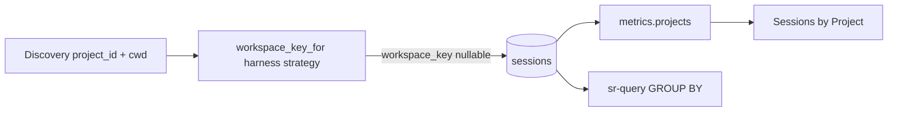

# Task: workspace-key

* Task ID: workspace-key
* Complexity: Level 3
* Type: feature

Add nullable `sessions.workspace_key` with extensible per-harness ETL transforms so same-cwd cross-harness sessions share a queryable rollup key; wire Sessions by Project to that key; document the contract.

## Pinned Info

### Workspace key data flow

Ingest derives `workspace_key` per harness; dashboard and SQL both group on it. `project_id` stays verbatim.

## Component Analysis

### Affected Components
- **`ingest/paths.py` (or sibling)**: encode helpers today → add harness-dispatched `workspace_key_for(harness, *, cwd, project_id) -> str | None` with registry for `cursor` / `claude` (+ default unknown → None)
- **`ingest/model.py`**: `NormalizedSession` gains optional `workspace_key`; docstring: three workspace fields
- **`ingest/writer.py`**: INSERT includes `workspace_key` (compute at write from harness/cwd/project_id if not pre-set)
- **`ingest/__init__.py` / orchestrator**: ensure key set after cwd stamped (writer-side compute is enough if writer always derives)
- **`migrations/0006_workspace_key.sql`**: `ALTER TABLE sessions ADD COLUMN workspace_key TEXT`; header documents contract
- **Schema tests + golden**: `test_schema_0006.py` + cumulative snapshot; update head schema expectations
- **Migration runner tests**: `tests/test_migrate_runner.py` pins head version `5` / applied `[1..5]` → bump to `6` when 0006 lands
- **Ingest golden** `expected_rows.json`: add `workspace_key` per session when cwd known
- **`dashboard/metrics.py` `projects()`**: group/rank by rollup key (`workspace_key` else `project_id` fallback for display continuity); wire `projects` array = those keys; labels from cwd leaf among sessions in bucket
- **JS**: `buildProjectsPanel` likely unchanged if payload shape keeps `projects` + `labels` (+ optional labelTitles from key≠label)
- **Docs**: `docs/architecture/warehouse.md` Workspace identity; `systemPatterns.md` one-liner; migration + paths docs

### Cross-Module Dependencies
- paths strategies → writer INSERT → warehouse column → metrics SELECT/GROUP → chart
- Re-ingest (`--full`) backfills NULL keys on existing rows (no DML backfill in migration — same pattern as 0002)
- `test_migrate_runner` / any head-version pin must track 0006 (preflight amendment)

### Boundary Changes
- Schema: new nullable column
- Metrics API: `projects[]` elements become **rollup keys** (`workspace_key` when set, else `project_id`), not always raw harness slugs — document in metrics docstring; dashboard is sole known consumer
- Ingest model public field `workspace_key`

### Invariants & Constraints
- Must preserve `project_id` as harness-verbatim slug
- Must hold: same absolute `cwd` ⇒ same `workspace_key` across registered harness strategies when both derive from that cwd
- Must hold: different cwds ⇒ different keys
- Must hold: cannot derive ⇒ NULL `workspace_key` (honest); chart coalesce uses `project_id` only as **display grouping fallback**, not as fabricated cross-harness key in the column
- Per-harness strategies must be extensible (add harness = add strategy)
- Creative authority: `creative-project-rollup-layer.md`

## Open Questions

- [x] **Chart vs ETL vs additive column** → Resolved: Option C `workspace_key`. See `creative-project-rollup-layer.md`.
- [x] **Column name** → Resolved: `workspace_key` (not `normalized_project_id`).
- [x] **Per-harness T** → Resolved: harness-dispatched strategies; shared convergence contract.
- [x] **NULL cwd / chart grouping** → Resolved in plan (no further creative): column stays NULL; `metrics.projects` groups by `coalesce(workspace_key, project_id)` so orphan rows still appear without cross-harness merge in the stored column.
- [x] **Metrics `projects[]` meaning** → Resolved in plan: array holds rollup keys (workspace_key or fallback project_id); hover/title uses key when ≠ friendly label.

## Test Plan (TDD)

### Behaviors to Verify

- `workspace_key_for("cursor", cwd="/home/x/stockroom")` → `home-x-stockroom` (leading-sep stripped encode)
- `workspace_key_for("claude", cwd="/home/x/stockroom")` → same key as cursor for that cwd
- `workspace_key_for("claude", cwd="/mnt/v/.../lite-rpg")` ≠ cursor key for `/home/.../lite-rpg`
- `workspace_key_for(any, cwd=None)` → `None`
- `workspace_key_for("future-unknown", cwd="/a/b")` → `None` (or documented default — prefer None)
- Migration 0006 adds column; existing rows survive with NULL key; cumulative schema snapshot
- Writer persists computed `workspace_key` on insert
- Ingest golden sessions with cwd include expected `workspace_key`
- `metrics.projects`: two harnesses, same cwd, different project_ids → one ranked key, summed sessions
- `metrics.projects`: same leaf, different cwds → two keys (update/replace `test_projects_ranking_stays_by_id_when_basenames_collide` expectations as needed)
- NULL workspace_key + project_id only → still appears via coalesce fallback

### Test Infrastructure

- Framework: pytest (`skills/sr-search`); Node tests only if JS payload shape breaks
- Test location: `tests/test_ingest_paths.py` (or new `test_workspace_key.py`), `tests/test_schema_0006.py`, `tests/test_ingest_writer.py` / fixtures, `tests/test_dashboard_metrics.py`, `tests/fixtures/schema/0006_snapshot.json`
- Conventions: match `test_schema_0002` / existing paths tests
- New test files: `test_schema_0006.py`; extend paths/writer/metrics tests

### Integration Tests

- Ingest fixture → warehouse rows have workspace_key aligned with cwd encode
- metrics.projects against migrated_con with dual-harness same cwd

## Implementation Plan

1. [x] **paths: workspace_key_for + harness registry (TDD)**
    - Files: `ingest/paths.py`, `tests/test_ingest_paths.py` (or dedicated)
    - Changes: public `workspace_key_for(harness, *, cwd=None, project_id=None)`; private path helper for “leading-sep-stripped encode”; register `cursor` and `claude` strategies that use cwd when present; unknown harness → None
    - Creative ref: per-harness T + convergence contract

2. [x] **Migration 0006 (TDD)**
    - Files: `migrations/0006_workspace_key.sql`, `tests/test_schema_0006.py`, `tests/fixtures/schema/0006_snapshot.json`, `tests/test_migrate_runner.py` (head version 5→6)
    - Changes: ADD COLUMN; document contract in SQL header; structural only (no backfill DML); update runner “fresh DB lands at head” assertions
    - TDD: failing schema/runner expectations first, then migration file

3. [x] **Model + writer (TDD)**
    - Files: `ingest/model.py`, `ingest/writer.py`, writer/ingest tests, `fixtures/ingest/expected_rows.json`
    - Changes: field on `NormalizedSession`; writer computes via `workspace_key_for` at insert; golden includes keys

4. [x] **metrics.projects rollup (TDD)**
    - Files: `dashboard/metrics.py`, `tests/test_dashboard_metrics.py`
    - Changes: aggregate by `coalesce(workspace_key, project_id)`; labels from cwd leaves in bucket; add same-cwd cross-harness merge test; adjust collide-by-basename test for key semantics

5. **Docs**
    - Files: `docs/architecture/warehouse.md`, `memory-bank/systemPatterns.md`, paths module docstring
    - Changes: workspace_key contract; project_id unchanged; per-harness strategies; chart/SQL share key

6. **Verify**
    - `make test` (and dashboard JS if payload unchanged — expect no JS change)

## Technology Validation

No new technology - validation not required.

## Challenges & Mitigations

- **Golden / schema snapshot churn**: Mitigation — follow 0002 cumulative snapshot pattern; update ingest expected_rows in same step as writer.
- **Hard-coding Cursor encode inside “neutral” helper without harness param**: Mitigation — harness registry required even if both strategies share a private helper today.
- **metrics tests that assumed project_id ranking with colliding leaves**: Mitigation — rewrite assertions around workspace_key; add explicit same-cwd merge case.
- **Existing warehouses**: Mitigation — NULL until `--full` re-ingest (document like 0002).

## Pre-Mortem

- **Plan failed because chart and SQL still disagreed on key meaning**: Mitigation — `projects[]` documented as rollup keys; SQL groups on `workspace_key` column; coalesce only in metrics for NULL-column orphans.
- **Plan failed because a third harness couldn’t plug in without rewriting Cursor/Claude**: Mitigation — registry/strategy map is a required deliverable in step 1, not a shared untyped munge.
- **Plan failed because we mutated project_id “for convenience”**: already covered by invariants + creative.

## Status

- [x] Component analysis complete
- [x] Open questions resolved
- [x] Test planning complete (TDD)
- [x] Implementation plan complete
- [x] Technology validation complete
- [x] Pre-Mortem complete
- [x] Preflight — PASS (amended: migrate_runner head pins; TDD ordering explicit on steps 1–4)
- [ ] Build
- [ ] QA
