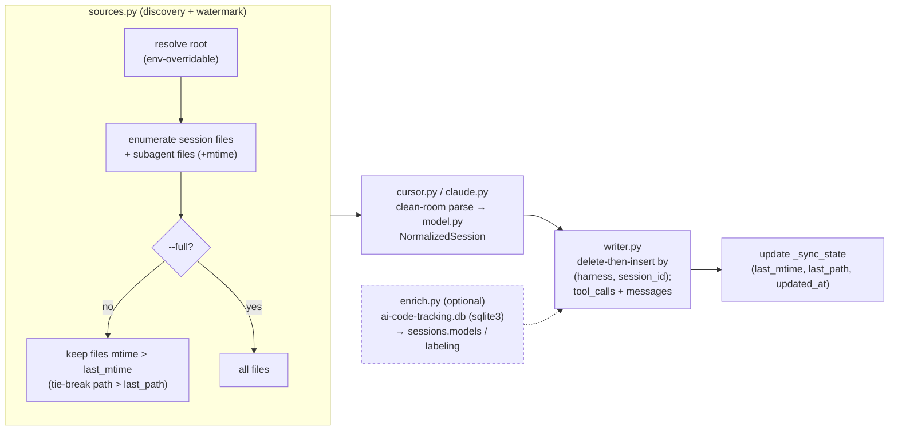

# Task: Trace ingest (ETL)

* Task ID: `p1-data-backbone-m3-trace-ingest`
* Complexity: Level 3
* Type: feature (multi-component ETL subsystem)

Build the incremental, per-source-watermarked ETL that fills the milestone-1 DuckDB schema from the operator's own Cursor and Claude Code history, writing through the milestone-2 `warehouse.open()` chokepoint. Both harnesses are parsed clean-room from their native on-disk formats; subagents are linked to their parents; kept content is stored untruncated; tool **inputs only**; an optional Cursor `ai-code-tracking.db` enrichment fills model/labeling fields when present. A `python -m stockroom.ingest [--full] [--harness …]` entrypoint runs it.

## Pinned Info

### ETL pipeline (per harness, per run)

This is the load-bearing data flow; every component slots into one stage.

### Source record → schema-row mapping

The contract the parsers must satisfy. "DROP" = consumed but never stored (faithful-capture / inputs-only invariants).

| Source construct | Cursor | Claude Code | Destination |
|---|---|---|---|
| Conversation | `<conv>/<conv>.jsonl` (path-derived id) | `mode`/record `sessionId` | `sessions` (1 row) |
| User turn (real prompt) | `{role:"user", message.content:[blocks]}` | `type:"user"`, `content` str **or** list with `text` blocks | `messages` (role=user) |
| Assistant turn | `{role:"assistant", message.content:[blocks]}` | `type:"assistant"`, `message.content:[blocks]`, `model`, `usage` | `messages` (role=assistant) + N `tool_calls` |
| `text` block | kept (incl. `""`) | kept (incl. `""`) | `messages.text` |
| `thinking` block | — | **DROP** | (not captured) |
| `tool_use` block | `{name,input}` (no id) | `{id,name,input}` | `tool_calls` (input whole) |
| `tool_result` / `toolUseResult` | — | user record, `content:[tool_result]` | **DROP** (output) |
| `turn_ended` marker | `{role:"turn_ended",status,error?}` | — | **DROP** (no schema column; turn boundary only) |
| Title | enrichment (optional) | `ai-title.aiTitle` / `custom-title.customTitle` | `sessions.title` |
| Agent name | — | `agent-name.agentName` | `sessions.agent_name` |
| Subagent | child file in `<conv>/subagents/` | child file in `<session>/subagents/agent-*.jsonl` + `.meta.json` | `sessions` (is_subagent, parent linkage) |
| Per-msg model | NULL | `message.model` | `messages.model` |
| Session model set | enrichment → `sessions.models` | NULL | `sessions.models` |
| Token usage | NULL | `message.usage.*` (4 fields) | `messages.{input,output,cache_creation,cache_read}_tokens` |
| Ignorable types | — | `system`, `attachment`, `file-history-snapshot`, `permission-mode`, `last-prompt`, `queue-operation` | **IGNORE** (robustness) |

### Identity & reconstruction algorithm (the headline correctness contract)

- **`message_id = '{session_id}#{ordinal}'`**, `ordinal` = **dense 0-based index over kept messages in conversation (file) order**. Dropped/ignored records do not consume an ordinal.
- **`parent_id`**:
  - **Cursor** (no native ids, linear append): previous kept message's id; NULL at ordinal 0.
  - **Claude** (native `uuid`/`parentUuid` tree that **branches** — evidence: up to 27 multi-child `parentUuid`s in one real file): follow this record's `parentUuid`, walking the (uuid → parentUuid) chain past any dropped records until reaching a **kept** message's uuid; `parent_id = '{session_id}#{that ordinal}'`, else NULL. Native `uuid` is stored only as `source_uuid` provenance, never joined on.
- **`tool_calls.ordinal`** = index of the `tool_use` block within its message's content-block array (faithful to position relative to text).
- **Subagent linkage is at the *session* grain** (own within-session ordinals/parent_ids):
  - **Claude subagent `session_id` = subagent file stem** (e.g. `agent-aaa111`) — **never** `sessionId` (which on disk equals the *parent's*). `parent_session_id` = parent `sessionId`; `agent_id` = `agentId`; `agent_type` = meta.json `agentType`; `spawning_tool_use_id` = meta.json `toolUseId` (joins parent `tool_calls.source_tool_use_id`); `agent_name` = `agent-name.agentName`.
  - **Cursor subagent `session_id` = child file stem**; `parent_session_id` = parent conv id (parent dir); `agent_id` = child stem; `agent_type` = parent Task `tool_use.input.subagent_type`; `spawning_tool_use_id` = NULL (structural link only).

## Component Analysis

### Affected Components

All new, under a new `stockroom.ingest` package — no existing module's behavior changes.

- **`stockroom/ingest/model.py`** (new): harness-neutral intermediate dataclasses `NormalizedSession`, `NormalizedMessage`, `NormalizedToolCall`. Decouples parsers from the SQL schema so each parser's only job is "produce normalized records," and the writer's only job is "persist normalized records." Mirrors the schema's one-meaning-per-field contract.
- **`stockroom/ingest/cursor.py`** (new): clean-room Cursor parser. `parse_session(path) -> NormalizedSession` (+ subagent discovery within the conv dir). Linear ordinal/parent model; `turn_ended` consumed as boundary; empty `text` kept.
- **`stockroom/ingest/claude.py`** (new): clean-room Claude parser. `parse_session(path, subagents=…) -> NormalizedSession`. Record-`type` allowlist; `thinking`/`tool_result`/`toolUseResult` drops; metadata records (`ai-title`/`custom-title`/`agent-name`/`mode`) fold into session fields; `parentUuid`-tree parent reconstruction; per-message model/usage; subagent identity from `agentId`/meta.json.
- **`stockroom/ingest/sources.py`** (new): discovery, path resolution, watermark filtering. Resolves harness roots (default `~/.cursor/projects`, `~/.claude/projects`; overridable via `STOCKROOM_CURSOR_ROOT` / `STOCKROOM_CLAUDE_ROOT` env vars for tests, mirroring `STOCKROOM_HOME`). Enumerates `(session_file, [subagent_files], mtime)`; decodes encoded project-dir names → `project_path` (best-effort, lossy; Claude prefers record-provided `cwd`); applies the `_sync_state` watermark unless `--full`.
- **`stockroom/ingest/enrich.py`** (new): optional Cursor `ai-code-tracking.db` reader (stdlib `sqlite3`). Returns model/labeling enrichment keyed by conversation; **graceful no-op when the DB is absent** (it is absent on the operator's current machine). Strictly limited to model/labeling fields — attribution tables out of scope.
- **`stockroom/ingest/writer.py`** (new): persistence through a passed-in `duckdb` RW connection. `write_session(con, normalized)` does **delete-then-insert by `(harness, session_id)`** (idempotent re-ingest), inserting `messages` then `tool_calls`; `update_watermark(con, harness, source_root, last_mtime, last_path)` upserts `_sync_state`.
- **`stockroom/ingest/__init__.py`** (new): orchestrator `ingest(*, harness=None, full=False, con=None, …) -> IngestSummary`. Wires discovery → parse → (enrich) → write → watermark; opens the warehouse via `warehouse.open(read_only=False)` when no `con` is injected. Returns counts (sessions/messages/tool_calls per harness).
- **`stockroom/ingest/__main__.py`** (new): CLI — `python -m stockroom.ingest [--full] [--harness cursor|claude]`. Prints a short summary.

### Cross-Module Dependencies

- `__main__` → `__init__.ingest` → {`sources`, `cursor`/`claude`, `enrich`, `writer`} ; `writer` → `warehouse.open()` (RW) when `con` not injected.
- `cursor.py` / `claude.py` → `model.py` only (no DB, no I/O beyond reading the file handed to them — pure, unit-testable).
- `writer.py` → `model.py` + a `duckdb` connection (the milestone-1 schema; milestone-2 chokepoint supplies it).
- `enrich.py` → stdlib `sqlite3` only.

### Boundary Changes

- **No schema change.** Ingest writes the existing `0001` tables exactly as locked; **no new migration** is introduced (forward-only invariant untouched). The golden snapshot stays valid.
- **New public surface:** the `python -m stockroom.ingest` entrypoint and two new env-var conventions (`STOCKROOM_CURSOR_ROOT`, `STOCKROOM_CLAUDE_ROOT`). Adopted later by `sr-query`/dashboard/`sr-initialize`. (Flag at preflight, like m2's `STOCKROOM_HOME`.)
- **Writer is the only new DB writer.** It assumes a RW connection (single-writer invariant enforced by `warehouse.open()`'s flock).

### Invariants & Constraints (must preserve)

1. **No truncation at rest** — kept text/tool_input stored whole (guarded by the huge-tool-input fixture round-trip).
2. **Tool inputs only** — `tool_result`/`toolUseResult`/`stdout` never stored.
3. **Thinking not captured** — Claude `thinking` blocks dropped; only `text` kept.
4. **Harness-labeled single schema** — every row carries `harness`; no per-harness tables.
5. **One meaning per column** — per-harness extraction differs, the stored meaning does not; honestly NULL where a grain is absent (no fabrication).
6. **Uniform identity** — `message_id = {session_id}#{ordinal}`; native ids demoted to `source_*` provenance.
7. **Subagents linked to parents** — at session grain via `parent_session_id` (+ `spawning_tool_use_id` for Claude).
8. **Forward-only migrations / no schema mutation** — ingest adds no migration.
9. **Harness-neutral home & locked-uv trust** — write through `warehouse.open()`; no new runtime dependency (stdlib `json`/`sqlite3`/`pathlib` + locked `duckdb`); `uv.lock` untouched.
10. **Clean-room** — both parsers reverse-engineer the harnesses' own on-disk formats; no `claude-warehouse` code/schema/ideas; `cursor-warehouse` only via operator-vetted provenance.
11. **Green `make ci` gate** at the milestone boundary.

## Open Questions

Resolved in-plan (the one genuinely ambiguous item — parent reconstruction — was resolved by an empirical structural probe of the operator's real logs; no creative phase required, matching the complexity-analysis finding that "the rest of the milestone is standard forward-only ETL machinery").

- [x] **Parent/ordinal model across dropped records & branching** → Resolved: dense ordinals over kept messages; Cursor parent = previous-kept (linear); Claude parent = `parentUuid` tree walked to nearest-kept ancestor. **Evidence:** real Claude files have many multi-child `parentUuid`s (branching is common), so positional linking would corrupt reconstruction — the tree is mandatory.
- [x] **Claude subagent `session_id`** → Resolved: subagent file stem (`agent-*`), because subagent records carry the *parent's* `sessionId` (probe-confirmed) and would otherwise collide on the `(harness, session_id)` PK.
- [x] **Cursor `turn_ended` error/status** → Resolved: dropped in v1 (no schema column exists; storing it would require a new migration, out of scope). Documented as a candidate future migration.
- [x] **Watermark granularity & idempotency** → Resolved: one `_sync_state` row per `(harness, source_root)` where `source_root` is the scanned root; selection by `mtime > last_mtime` (tie-break `path > last_path`); idempotent re-ingest via delete-then-insert per `(harness, session_id)`; `--full` ignores the watermark.
- [x] **`project_path`/`cwd` resolution** → Resolved: Claude uses record-provided `cwd` (authoritative); Cursor decodes the encoded workspace-slug dir (documented lossy best-effort); tolerate `/mnt/*` Windows-mount paths as-is (read-only correctness; mount *performance* is a Phase-4 scheduling concern, not ingest).
- [x] **Started/ended for Cursor** → Resolved: NULL (no per-turn wall-clock in Cursor transcripts; do not fabricate a grain we lack).

## Test Plan (TDD)

### Behaviors to Verify

**Cursor parser (`cursor.py`)**
- simple conversation → 1 session, messages in order, dense ordinals, linear parent_ids (root NULL).
- assistant turn with `text` + `tool_use` → 1 message (text kept) + tool_calls with block-index ordinals; `source_tool_use_id` NULL.
- empty `text` block (`""`) → message kept with `text == ""` (not dropped).
- `pathological-many-tools` → one message with many tool_calls, each a distinct ordinal; empty text preserved.
- `turn_ended` (incl. `status:"error"`) → consumed, produces no row; preceding messages intact.
- subagent file under `subagents/` → subagent session: `is_subagent`, `parent_session_id`, `agent_id`, `agent_type` from parent Task input, `spawning_tool_use_id` NULL.

**Claude parser (`claude.py`)**
- simple conversation → user(str)+assistant messages; `thinking` dropped (text only); `tool_use` → tool_call with `source_tool_use_id` set; per-message `model`, 4 token columns populated.
- `tool_result` user record → dropped (no message, no tool_call); the following assistant's `parent_id` resolves past it to the nearest kept ancestor.
- user content as **list of `text` blocks** → kept as a message (probe found this shape); user content list of only `tool_result` → dropped.
- branching `parentUuid` (multi-child) → each child's `parent_id` points to its true `parentUuid` target's kept ordinal (not positional neighbor).
- `pathological-multi-model` → `messages.model` differs per turn; `sessions.models` NULL (claude grain).
- `pathological-huge-tool-input` → `tool_input` round-trips byte-identical (no truncation).
- title/agent-name records → `sessions.title` (ai-title/custom-title), `sessions.agent_name`; `harness_version`, `started_at`=min(ts), `ended_at`=max(ts).
- **unknown/ignorable record types** (`system`, `attachment`, `file-history-snapshot`, `permission-mode`, `last-prompt`, `queue-operation`) → ignored; produce no rows; no crash. (Robustness against real-log diversity the fixtures previously undercounted.)
- subagent (`isSidechain`, `agentId`, meta.json) → subagent session id = file stem; `parent_session_id`=parent sessionId; `spawning_tool_use_id`=meta `toolUseId` joins parent Task `source_tool_use_id`.

**Sources/discovery (`sources.py`)**
- enumerates session + subagent files under an (env-overridden) fixture root, with mtimes.
- `--full` returns all; incremental returns only `mtime > last_mtime` (+ tie-break on `last_path`).
- encoded project-dir decode → plausible `project_path`; Claude `cwd` taken from record.

**Enrichment (`enrich.py`)**
- absent DB → returns empty enrichment, no error (the live machine state).
- present synthetic sqlite fixture → returns model/labeling keyed by conversation; writer applies it to `sessions.models`.

**Writer (`writer.py`)**
- `write_session` inserts sessions/messages/tool_calls satisfying all PKs; re-running is idempotent (delete-then-insert; row counts stable, no PK violation).
- `update_watermark` upserts `_sync_state` (one row per source_root).

**Orchestrator + CLI (`__init__` / `__main__`)** — integration
- `ingest(full=True, con=…)` over the fixtures populates all tables; counts in the summary match table counts.
- second `ingest()` with an advanced watermark is a no-op (no new rows).
- subagent rows link to parents across the whole run (cross-file join holds).
- `python -m stockroom.ingest --full --harness claude` against fixtures (via env-overridden roots + `STOCKROOM_HOME`) exits 0 and writes only claude rows.

### Edge Cases

Empty/truncated JSONL line (skip, don't crash); a session file with zero kept messages (no session row, or session with 0 messages — decide: skip empty); duplicate ingest (idempotency); huge tool_input (no truncation); a subagent whose parent file is absent (link recorded, parent row may be missing — assert no crash); `/mnt/*` cwd values tolerated.

### Test Infrastructure

- Framework: `pytest`, configured in `skills/sr-search/pyproject.toml` (`pythonpath=["src"]`); run via `make test` / `make ci`.
- Test location: `skills/sr-search/tests/`.
- Conventions: `test_*.py`, one module per unit; in-memory/`schema_con`-style DuckDB for writer tests; `tmp_path` + monkeypatched env for discovery/CLI; no `from __future__ import annotations` (m2 convention sweep).
- Fixtures: reuse `tests/fixtures/transcripts/` (m1). **Extend** with: Claude `custom-title`/`agent-name` records and a robustness fixture containing the ignorable record types; a synthetic `ai-code-tracking.db` sqlite fixture for enrichment; **correct the subagent fixture layout** to match real disk (`<project>/<parent-session>/subagents/…`) and trim the meta.json to the real `{agentType,description,toolUseId}` shape. Update `tests/fixtures/transcripts/README.md` accordingly.
- New test files: `test_ingest_cursor.py`, `test_ingest_claude.py`, `test_ingest_sources.py`, `test_ingest_enrich.py`, `test_ingest_writer.py`, `test_ingest_orchestrator.py`, `test_ingest_cli.py`.

### Integration Tests

- Full fixture ingest (`test_ingest_orchestrator.py`): both harnesses → assert cross-table/cross-file invariants (subagent↔parent joins; inputs-only; no truncation; ordinal density; harness labels).
- CLI smoke (`test_ingest_cli.py`): subprocess `python -m stockroom.ingest` against env-pointed fixture roots + tmp `STOCKROOM_HOME`.
- **Golden ingest-output snapshot (preflight radical-innovation, applied):** after a full fixture ingest, query all rows (deterministically sorted) and assert they byte-match a committed `tests/fixtures/ingest/expected_rows.json`. The golden file is generated by the test's *own* query helper (same code path → golden + assertion can never diverge, per the m1 snapshot insight). This locks the entire reconstruction output — every ordinal, `parent_id`, drop, token value, and subagent edge — so any future parser drift is a conscious, reviewed change to the golden file. Mirrors m1's `0001_snapshot.json` and m2's snapshot guard, completing the schema-snapshot → ingest-snapshot lineage.

## Implementation Plan

Ordered so each step builds on the last, starting with the dependency-free core (model) and ending with the orchestrator/CLI. Each step is one RED→GREEN TDD cycle (write failing test(s) first, then implement), one commit per step.

1. **Fixtures correction & extension** — RED: add/adjust fixtures + a test that simply loads them and asserts presence/shape (parser-agnostic). Fix subagent layout to real nesting; add `custom-title`/`agent-name`/ignorable-type Claude fixtures; add synthetic `ai-code-tracking.db`; update fixtures README.
   - Files: `tests/fixtures/transcripts/**`, `tests/fixtures/README`/`transcripts/README.md`, new `tests/fixtures/ai-tracking/` sqlite.
2. **`model.py`** — RED: construct/equality tests for the three dataclasses. GREEN: `NormalizedSession/Message/ToolCall` with all schema-mapped fields.
   - Files: `src/stockroom/ingest/__init__.py` (package), `src/stockroom/ingest/model.py`, `tests/test_ingest_model.py`.
3. **`cursor.py`** — RED: behaviors above. GREEN: linear parser, `turn_ended` boundary, empty-text kept, tool block-index ordinals, subagent discovery within conv dir.
   - Files: `src/stockroom/ingest/cursor.py`, `tests/test_ingest_cursor.py`.
4. **`claude.py`** — RED: behaviors above (allowlist, drops, parentUuid tree, branching, model/usage, metadata records, subagent identity). GREEN.
   - Files: `src/stockroom/ingest/claude.py`, `tests/test_ingest_claude.py`.
5. **`sources.py`** — RED: discovery + decode + watermark filter (`--full` vs incremental) against env-pointed fixture roots. GREEN.
   - Files: `src/stockroom/ingest/sources.py`, `tests/test_ingest_sources.py`.
6. **`enrich.py`** — RED: absent-DB no-op + present-DB read against the synthetic sqlite fixture. GREEN (stdlib `sqlite3`).
   - Files: `src/stockroom/ingest/enrich.py`, `tests/test_ingest_enrich.py`.
7. **`writer.py`** — RED: insert satisfies PKs; idempotent delete-then-insert; watermark upsert (against an in-memory `0001`-schema connection). GREEN.
   - Files: `src/stockroom/ingest/writer.py`, `tests/test_ingest_writer.py`.
8. **`__init__.ingest` orchestrator** — RED: full fixture ingest via injected `con`; counts match; incremental no-op on advanced watermark; cross-file subagent joins; **golden ingest-output snapshot** (`expected_rows.json`, generated via the test's own query helper). GREEN: wire stages; open `warehouse.open(RW)` when `con` is None; apply enrichment.
   - Files: `src/stockroom/ingest/__init__.py`, `tests/test_ingest_orchestrator.py`, `tests/fixtures/ingest/expected_rows.json`.
9. **`__main__` CLI** — RED: subprocess smoke (`--full`, `--harness`) against env-pointed fixtures + tmp home; exit 0; only-selected-harness rows. GREEN: argparse + summary print.
   - Files: `src/stockroom/ingest/__main__.py`, `tests/test_ingest_cli.py`.
10. **Docs reconciliation** — repoint `techContext.md` Warehouse/Ingest note at the real `stockroom.ingest` package + the new env conventions; confirm `systemPatterns.md` ingest-ETL pattern still holds (add a pointer if a durable pattern emerged). Defer durable-pattern entry to reflect if marginal.
    - Files: `memory-bank/techContext.md` (+ `systemPatterns.md` if warranted).
11. **Green gate** — `make ci`: sync, `lock --locked` (uv.lock untouched), ruff lint + format-check, full `pytest`, `reuse lint` (path-based AGPL on new `*.py`/fixtures — no inline SPDX needed; confirm at preflight).

## Technology Validation

**No new technology — validation not required.** All parsing is stdlib `json`; optional enrichment is stdlib `sqlite3`; persistence is the already-locked `duckdb` through the milestone-2 chokepoint. `uv.lock` stays untouched (`make lock-check` guards it). The DuckDB feature set the writer needs (composite-PK inserts, `VARCHAR[]`, `JSON`, `DELETE … WHERE`) was already validated by milestone 1's planning POC and is exercised by the existing schema-contract suite.

## Challenges & Mitigations

- **Real Claude logs are far more diverse than the committed fixtures** (extra record types). → Allowlist-driven `type` handling + an explicit "ignore unknown types" robustness test + fixtures extended to cover the schema-relevant extras; the structural probe (no content) already enumerated the real type set.
- **`parentUuid` branching could silently corrupt reconstruction.** → Tree-based parent resolution with nearest-kept-ancestor walk; a dedicated branching test asserts non-positional linkage.
- **Dropping tool_result/thinking breaks naive parent chains.** → Resolve parents over the *kept* set via the uuid chain; test asserts an assistant after a dropped tool_result links to the right ancestor.
- **Subagent `session_id` collision** (records carry parent's `sessionId`). → Derive subagent id from file stem/`agentId`; PK-collision test on the subagent fixtures.
- **Enrichment DB absent on the live machine.** → Graceful no-op path is a first-class tested behavior; present-DB path tested against a synthetic sqlite fixture.
- **Idempotency / partial re-ingest of a grown file.** → delete-then-insert per session + mtime watermark; duplicate-ingest test asserts stable counts.
- **Lossy project-dir decode (Cursor).** → Documented best-effort; Claude uses authoritative record `cwd`; `project_path` is provenance-ish, not a join key.
- **L4-creep check (carried from the milestone directive's spirit):** this is one cohesive ETL subsystem (parsers + discovery + writer + orchestrator), not independent workstreams — stays Level 3. Re-confirm at preflight.

## Status

- [x] Component analysis complete
- [x] Open questions resolved (in-plan, evidence-backed; no creative phase)
- [x] Test planning complete (TDD)
- [x] Implementation plan complete
- [x] Technology validation complete
- [x] Preflight — PASS (with advisories); golden ingest-snapshot added
- [x] Build — COMPLETE (steps 1-11; `make ci` green: 152 passed, ruff clean, REUSE compliant)
- [x] QA — PASS (semantic review clean; `make ci` re-confirmed green: 152 passed, ruff clean, REUSE 142/142). One non-blocking advisory deferred to REFLECT: `_iter_records` duplicated across the two clean-room parsers (defensible under self-contained-parser design).
