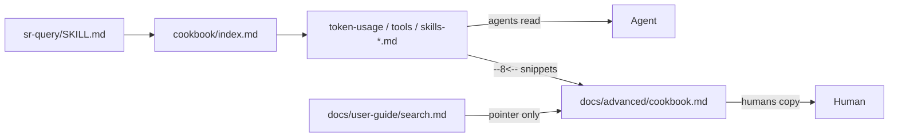

# Task: query-cookbook

* Task ID: query-cookbook
* Complexity: Level 3
* Type: feature

Discoverable `sr-query` cookbook (skill SSOT + docs `pymdownx.snippets` includes) with VIEW token recipes and pure SQL skill/tool-use recipes for Claude + Cursor ([#69](https://github.com/Texarkanine/stockroom/issues/69)), plus thoughtful in-skill cross-links that keep useful inline examples.

## Pinned Info

### Cookbook dual-audience flow

SSOT under the skill; docs render the same bodies. Agents never depend on the docs site.

## Component Analysis

### Affected Components

- **`skills/sr-query/`**: Wrapper skill — add `references/cookbook/` SSOT; index from `SKILL.md`; keep Level-1 inline examples; add discoverability + selective “see also cookbook” links.
- **`docs/advanced/`**: Human TOC + wrappers that snippet-include recipe bodies; update `.pages` / `index.md` nav.
- **`docs/user-guide/search.md`**: Pointer-only into Advanced cookbook (no cloned SQL).
- **`properdocs.yaml`**: Comment update for intentional cookbook includes (snippets already enabled).
- **`skills/sr-search/tests/`**: Structural discoverability/hygiene tests for cookbook presence + SKILL/docs wiring.
- **Dashboard extractors / metrics** (`skill_usage.py`, `metrics.py`): **read-only reference** for encoding recipes — no code change unless a recipe doc comment needs a stable constant citation.

### Cross-Module Dependencies

- Cookbook recipes ← grounded in dashboard candidate SQL + extractor rules (skills) and `tools()` SQL (tools); token recipes ← VIEW `session_token_usage` (migration 0007).
- Docs build (`make docs-build`) ← snippet paths into `skills/sr-query/references/cookbook/` (`base_path: .`, `check_paths: true`).
- Licensing: `skills/**/references/**` already PPL-S via `REUSE.toml` — no carve-out change.

### Boundary Changes

- None to warehouse schema, CLI, or dashboard API.
- New public *documentation* surface: cookbook paths become the agent/human contract for these queries (drift risk documented on each recipe).

### Invariants & Constraints

- Must preserve docs ownership: human prose in `docs/`; recipe bodies SSOT in skill `references/cookbook/`; no user-guide corpus under `references/`.
- Must preserve useful inline `SKILL.md` examples; cookbook links only where clearly better than re-inlining.
- Must hold dual-audience: one edit to a recipe updates agent files and docs site render.
- Must not invent skill identity in SQL that contradicts `skill_usage.py` without an explicit caveat.
- Non-goal: `stockroom skills` CLI / new VIEWs for skill events (promotion ladder Level 3 deferred).
- Non-goal: replacing dashboard extractors with SQL.

## Open Questions

- [x] Cookbook home + dual-audience delivery → Resolved: Option B — skill SSOT + pymdownx snippet includes (see `memory-bank/active/creative/creative-query-cookbook.md`)
- [x] Skills as pure SQL vs promoted-surface card only → Resolved by operator intent (2026-07-20): document pure SQL skill extraction per harness as in #69; encode extractor rules in DuckDB SQL with caveats / drift triggers (overrides early creative Level-3-only preference for skills)
- [x] Snippet include shape → Resolved in creative: short dual-audience recipe `.md` files (title + when + SQL + caveats); docs wrappers add human intro and `--8<--` the recipe file; note SSOT path because Material edit hits the wrapper

## Test Plan (TDD)

### Behaviors to Verify

- Cookbook index + required recipe files exist under `skills/sr-query/references/cookbook/` → discoverable on disk for agents.
- `skills/sr-query/SKILL.md` links to `references/cookbook/` (index) → agents can find the cookbook without guessing.
- `docs/advanced/cookbook.md` (or agreed path) contains `--8<--` includes of those recipe paths → human site shares SSOT.
- `docs/advanced/.pages` (or nav) lists the cookbook → humans can navigate to it.
- User-guide `search.md` may pointer to advanced cookbook; must not duplicate full SQL bodies.
- Edge: docs strict build fails if snippet path wrong (`check_paths: true`) — caught by `make docs-build`.
- Edge: wrapper hygiene still passes (cookbook paths must not introduce forbidden invocation tokens in `SKILL.md`).
- Drift: every name in `stockroom.dashboard.skill_usage._CLAUDE_BUILTIN_COMMANDS` appears in `skills-claude.md` (denylist sync) → recipe cannot silently omit a builtin the extractor excludes.
- Non-goal for automated tests: executing every recipe SQL against a live warehouse (manual smoke during build against a real/local warehouse when available).

### Test Infrastructure

- Framework: pytest under `skills/sr-search/tests/` (engine test tree; `repo_root` fixture already used by hygiene/licensing).
- Conventions: `test_*.py`, parametrize where useful; whole-suite at end via `make test` / `make ci` patterns.
- New test file: `skills/sr-search/tests/test_query_cookbook.py` (structural discoverability + wiring + Claude builtin denylist sync).
- Docs verification: `make docs-build` (strict) as an explicit build step, not a pytest case.

### Integration Tests

- None across Python modules — this feature is documentation + wiring. Structural tests + docs-build suffice.

## Implementation Plan

1. **TDD: write failing cookbook wiring + drift tests (no production files yet)**
    - Files: `skills/sr-search/tests/test_query_cookbook.py`
    - Changes: assert expected cookbook paths exist; `SKILL.md` contains cookbook index link; `docs/advanced/cookbook.md` contains `--8<--` markers for each recipe; `docs/advanced/.pages` lists Cookbook; every `_CLAUDE_BUILTIN_COMMANDS` member appears in `skills-claude.md`. Run → fail.
    - Do not create cookbook/docs content in this step.

2. **Cookbook SSOT: index + recipes (make structural path tests pass)**
    - Files:
        - `skills/sr-query/references/cookbook/index.md`
        - `skills/sr-query/references/cookbook/token-usage.md`
        - `skills/sr-query/references/cookbook/tools.md`
        - `skills/sr-query/references/cookbook/skills-claude.md`
        - `skills/sr-query/references/cookbook/skills-cursor.md`
    - Changes: short dual-audience recipes. Ground SQL in:
        - Tokens: `session_token_usage` (existing SKILL examples + richer variants: top-N, by harness, optional day rollup if simple).
        - Tools: unbounded / high-LIMIT `GROUP BY tool_name` with harness + activity window (`COALESCE(started_at, source_mtime)`), excluding subagents — mirror `metrics.tools` filters without `limit=10`.
        - Skills Claude: user `<command-name>` via `regexp_extract` + builtin `NOT IN` list that includes **every** member of `_CLAUDE_BUILTIN_COMMANDS` (pinned by test); agent `tool_name = 'Skill'` + `json_extract_string(..., '$.skill')`; exclude skill-info blob prefix; document drift trigger → `skill_usage.py` / dashboard tests.
        - Skills Cursor: user `manually_attached_skills` / `Skill Name:` via regexp; agent `Read` of `%/SKILL.md` with path parent as skill name; document residual gaps vs Python extractors.
    - Creative ref: `creative-query-cookbook.md` + operator pure-SQL override.
    - Run targeted tests → path + denylist assertions pass; SKILL/docs wiring still fail until later steps.

3. **Agent discoverability + thoughtful SKILL edits (make SKILL.md link test pass)**
    - Files: `skills/sr-query/SKILL.md`; optionally one line in `skills/sr-search/SKILL.md` routing table if token/skills questions currently point only at inline VIEW.
    - Changes:
        - Add a clear **Cookbook** section (or subsection under Worked examples) linking `references/cookbook/index.md`.
        - Keep existing short worked examples (harness distinct, tools LIMIT 5, token VIEW top-10, scan/refetch).
        - Where a worked example is the tip of a larger recipe set (tools, tokens), add a single “more variants: cookbook → …” pointer — do **not** delete the inline example or replace the whole section with “go load the cookbook.”
        - Do not dump all cookbook SQL into `SKILL.md`.
    - Run targeted tests → SKILL link green.

4. **Human docs: advanced cookbook + nav + user-guide pointer (make docs wiring tests pass)**
    - Files: `docs/advanced/cookbook.md`, `docs/advanced/.pages`, `docs/advanced/index.md` (brief mention), `docs/user-guide/search.md` (pointer only).
    - Changes: human when/why + promotion/drift note; `--8<--` include each recipe from skill paths; note SSOT path for editors; nav entry “Cookbook” in `.pages`; search.md points at Advanced cookbook for gnarly starters.
    - Run targeted tests → docs markers + nav green.

5. **properdocs comment**
    - Files: `properdocs.yaml`
    - Changes: replace “rare use / not a snippet farm” with accurate guidance: snippets for shared cookbook (and similarly intentional dual-audience) bodies; not for composing the whole site from fragments.

6. **Verify full suite + docs build**
    - Run `test_query_cookbook.py` → green; full suite (`make test`); `make docs-build` strict green.
    - Manual smoke (if warehouse present): run one tools + one skills-claude + one token recipe via `stockroom query`.

7. **systemPatterns surgical note**
    - Files: `memory-bank/systemPatterns.md`
    - Changes: one sentence under Docs ownership that `sr-query/references/cookbook/` holds recipe SSOT and Advanced docs may snippet-include those bodies (agents still do not use the docs site as runtime input).

## Technology Validation

No new technology - validation not required. `pymdownx.snippets` already configured; confirm with `make docs-build` after first include.

## Challenges & Mitigations

- **Skill SQL ≠ extractor parity**: Mitigate with recipes that encode known rules (builtin denylist, path parent, Skill tool JSON) and explicit caveats where regex/SQL is lossy; drift trigger points at `skill_usage.py`.
- **Builtin command list drift**: Mitigate by citing the Python frozenset as source of truth and listing the current set in the recipe (or a short “maintain with extractor” note).
- **Snippet path / strict build**: Mitigate with `check_paths: true` + CI `docs-build` + structural tests for include markers.
- **Over-linking SKILL.md**: Mitigate with explicit “keep inline examples” checklist in plan step 3; reviewer reads for thoughtful discoverability.
- **Localdev mirror**: Do not commit `.cursor/skills/stockroom-local/` (symlink tree).

## Pre-Mortem

- **Skill recipes silently diverge from dashboard and operators trust SQL over extractors**: Plan response — every skills recipe names `skill_usage.py` as drift trigger; title/caveat that dashboard metrics remain the product definition for charts; SQL is the ad-hoc full-table escape hatch.
- **Cookbook becomes a second user guide**: Already covered by short-recipe invariant + human prose only in docs wrappers.
- **Agents never find it**: Already covered by structural test requiring `SKILL.md` → cookbook index link + cookbook section.

## Preflight Amendments

- Added Claude builtin denylist sync test (`_CLAUDE_BUILTIN_COMMANDS` ⊆ `skills-claude.md`) so #69 skill SQL cannot drift past the extractor without a red test.
- Tightened per-step TDD wording: step 1 tests only; later steps explicitly make the matching assertions pass.
- Made systemPatterns docs-ownership sentence a required surgical update (not optional).

## Build checklist

- [x] 1. TDD: failing `test_query_cookbook.py` (9 failures confirmed)
- [x] 2. Cookbook SSOT: index + recipes
- [x] 3. Agent discoverability: `SKILL.md` cookbook links
- [x] 4. Human docs: advanced cookbook + nav + search pointer
- [x] 5. `properdocs.yaml` comment
- [x] 6. Verify full suite + docs-build (+ warehouse smoke: tools, tokens, skills-claude)
- [x] 7. `systemPatterns.md` docs-ownership cookbook sentence

## Status

- [x] Component analysis complete
- [x] Open questions resolved
- [x] Test planning complete (TDD)
- [x] Implementation plan complete
- [x] Technology validation complete
- [x] Pre-Mortem complete
- [x] Preflight
- [x] Build
- [ ] QA
