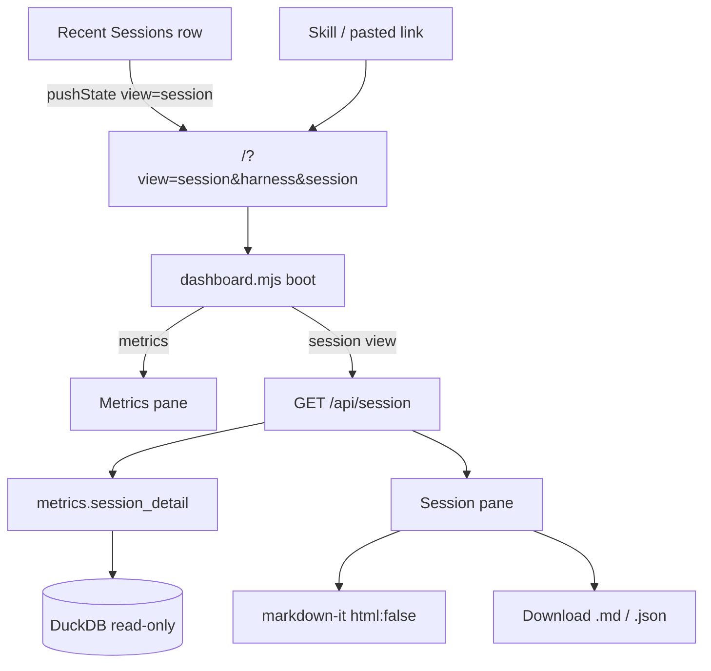

# Task: Session Inspection in Dashboard (#39)

* Task ID: session-inspection-dashboard
* Complexity: Level 3
* Type: feature

Add a dashboard conversation-reconstruction view reachable from Recent Sessions and by deep-linkable session URL, with basic vendored markdown rendering and markdown/JSON export — per [#39](https://github.com/Texarkanine/stockroom/issues/39).

## Pinned Info

### Session inspection flow

Pinned because navigation, API, and export all share one identity contract (`harness` + `session_id`) and one payload.

## Component Analysis

### Affected Components
- **`stockroom.dashboard.metrics`**: Mode-agnostic SQL metrics → add `session_detail()`; extend `sessions()` wire with `session_id`
- **`stockroom.dashboard.server`**: Loopback HTTP → register endpoint; parse required `harness` + `session` (special-case like `limit` on sessions)
- **Dashboard static front-end** (`index.html`, `dashboard.mjs`, `dashboard-data.mjs`, `dashboard-core.mjs`): Single-pane UI → session pane, query-param navigation, markdown render, export helpers
- **Vendored deps + `REUSE.toml`**: Chart.js pattern → vendor `markdown-it-14.1.0.min.js` with MIT override
- **Skills (`sr-dashboard`, light touch on search/query if they surface session ids)**: Document deep-link URL template
- **Licensing / static tests**: Mirror Chart.js offline + MIT assertions for markdown-it

### Cross-Module Dependencies
- Front-end → `/api/session` → `metrics.session_detail` → `warehouse.open_current()`
- List click / deep link share URL template from creative-deep-link-navigation
- Export is client-only from fetched JSON (no write path)

### Boundary Changes
- **API**: New `session` endpoint; `sessions()` gains `session_id`
- **Front-end**: First drill-down view (supersedes P4 "single pane, no drill-downs" product stance for this feature)
- **No schema migration**
- **REUSE.toml**: MIT pin for markdown-it artifact

### Invariants & Constraints
- Read-only `open_current()`; offline; no CDN; no bundler
- Composite identity `(harness, session_id)`; exact text on detail path
- Basic markdown only (markdown-it, no plugins, `html: false`)
- Non-goal: replace CLI `--detail raw`

## Open Questions

- [x] **Deep-link URL & client navigation** → Resolved: `/?view=session&harness=&session=` (see `memory-bank/active/creative/creative-deep-link-navigation.md`)
- [x] **Markdown library & HTML safety** → Resolved: markdown-it UMD, `html: false`, no plugins (see `memory-bank/active/creative/creative-markdown-library.md`)
- [x] **Reconstruction content model** → Resolved: nested tool_calls + MD/JSON export (see `memory-bank/active/creative/creative-reconstruction-content.md`)

## Test Plan (TDD)

### Behaviors to Verify

- `sessions()` includes `session_id` alongside existing fields; still excludes subagents; still snippet-truncates `prompt`
- `session_detail(harness, session_id)` → metadata + messages ordered by `ordinal` with full `text` (no truncation)
- Nested `tool_calls` ordered by tool ordinal; `tool_input` preserved as JSON-compatible structure
- Missing session → empty/not-found signal the server maps to 404
- Subagent session is returned by detail when addressed directly
- Server: `GET /api/session?harness=&session=` 200 with payload; missing params → 400; unknown session → 404
- Server serves vendored markdown-it static file with expected MIME
- Static HTML: markdown-it script local, loaded before dashboard module; no CDN
- Licensing: markdown-it artifact resolves MIT only (REUSE)
- JS: parse/build session view URL from `(harness, session_id)`; detect session view from `URLSearchParams`
- JS: build markdown export string from detail payload (role headings + fenced tool JSON)
- JS: markdown render helper uses `html: false` behavior (script tags escaped) — unit-testable if we wrap init in a pure module; otherwise covered by static config assertion + manual smoke
- Integration: Recent Sessions row is keyboard/click activatable toward session URL (static structure + JS URL helper; full DOM click optional)

### Test Infrastructure

- Framework: pytest (`skills/sr-search/tests/`), Node 22 `node --test` (`skills/sr-search/tests-js/`)
- Conventions: `_seed_session` helpers in `test_dashboard_metrics.py`; HTTP cases in `test_dashboard_server.py`; offline asset order in `test_dashboard_static.py`; pure ESM tests for core/data modules
- New / extended files:
  - Extend `tests/test_dashboard_metrics.py` (session_id + `session_detail`)
  - Extend `tests/test_dashboard_server.py` (`/api/session`, static markdown-it)
  - Extend `tests/test_dashboard_static.py` (load order, session pane landmarks)
  - Extend `tests/test_licensing.py` (markdown-it MIT)
  - New `tests-js/dashboard-session.test.mjs` (URL helpers + markdown export builder)
  - Possibly extract pure helpers into `dashboard-session.mjs` for testability

### Integration Tests

- Server metrics wiring: endpoint registry + query parsing for required session params
- Static + licensing: vendored file present and annotated

## Implementation Plan

Each numbered step is one TDD cycle: **(a) write failing tests → (b) run and confirm fail → (c) implement → (d) run and confirm pass**. Do not start (c) before (a)/(b).

1. **`sessions()` includes `session_id`** ✅
    - Files: `tests/test_dashboard_metrics.py`, `metrics.py`
    - (a) Extend/add assertions that each list row includes `session_id` (and existing fields still hold)
    - (c) Add `session_id` to the `sessions()` wire dict

2. **`session_detail()` reconstruction query** ✅
    - Files: `tests/test_dashboard_metrics.py`, `metrics.py`
    - (a) Tests: ordered messages with full text; nested tool_calls; missing → `None`; subagent addressable; no snippet markers
    - (c) Implement `session_detail(con, harness, session_id)` per `creative-reconstruction-content.md`
    - Register in `ENDPOINTS` only after step 3's server tests expect it (or register here and keep server tests in step 3)

3. **HTTP `/api/session`** ✅
    - Files: `tests/test_dashboard_server.py`, `server.py`, `metrics.ENDPOINTS`
    - (a) Tests: 200 payload; 400 missing params; 404 unknown; static file for markdown-it deferred to step 4
    - (c) Special-case query parsing for required `harness` + `session` (mirror `sessions`/`limit` branch)

4. **Vendor markdown-it 14.1.0 + REUSE** ✅
    - Files: `tests/test_licensing.py`, `tests/test_dashboard_static.py`, `tests/test_dashboard_server.py`, `REUSE.toml`, `static/markdown-it-14.1.0.min.js`, `index.html` script tag
    - (a) Failing licensing/static/server assertions for the new artifact and load order (markdown-it before dashboard module; no CDN)
    - (c) Copy upstream `dist/markdown-it.min.js`, REUSE MIT override, wire `<script>` in `index.html`
    - Creative ref: `creative-markdown-library.md`

5. **Pure session helpers (`dashboard-session.mjs`)**
    - Files: `tests-js/dashboard-session.test.mjs`, `static/dashboard-session.mjs`
    - (a) Node tests for `buildSessionViewSearchParams`, `parseSessionViewParams`, `formatSessionMarkdownExport`, and deep-link copy string helper
    - (c) Implement pure helpers (no DOM)

6. **Session pane UI + navigation**
    - Files: `tests/test_dashboard_static.py` (landmarks/controls), then `index.html`, `dashboard.mjs`, `dashboard-data.mjs`
    - (a) Static tests for session pane regions, back control, export controls, copy-link control, row affordance on Recent Sessions
    - (c) Full-pane swap; fetch detail; markdown-it init (`html: false`); row click → `history.pushState`; boot from query; back; collapsed tool `
`
    - Creative refs: deep-link + content model

7. **Export + copy-link wiring**
    - Files: `tests-js/dashboard-session.test.mjs` (export/copy string already in step 5), `dashboard.mjs`
    - (a) Any remaining helper assertions for JSON serialize identity; (c) wire download buttons + copy-to-clipboard for the canonical deep-link URL on the session header

8. **Skills documentation**
    - Files: `skills/sr-dashboard/SKILL.md` (+ light cross-link elsewhere only if needed)
    - Document URL template: append `?view=session&harness=…&session=…` to the printed dashboard base URL; when to offer it
    - Keep hygiene: only `stockroom dashboard` as engine invocation

9. **Verification**
    - Targeted pytest + `make test-js`, then full `make ci` (incl. REUSE)

## Technology Validation

**New dependency:** markdown-it **14.1.0** (MIT), vendored UMD `dist/markdown-it.min.js` (~124KB).

**PoC (2026-07-10):** Unpacked `npm pack markdown-it@14.1.0`; ran UMD under Node `vm` with `{ html: false, linkify: false, typographer: false }`; confirmed headings/emphasis/code fences render and raw `<script>` is escaped as text. **PASS** — safe to vendor this artifact during build.

No npm/bundler runtime; no other new technology.

## Challenges & Mitigations

- **Large `tool_input` JSON overwhelms UI**: collapsed `
` per tool; full content in export
- **Server endpoint arity differs from windowed metrics**: special-case `/api/session` params like existing `sessions`/`limit` branch; keep other endpoints unchanged
- **`session_id` URL encoding**: always use `URLSearchParams` / `encodeURIComponent`
- **XSS via transcript HTML**: markdown-it `html: false` (validated in PoC)
- **P4 "no drill-downs" docs/comments**: update skill + any stale comments; systemPatterns only if a durable pattern statement becomes wrong
- **JS DOM logic hard to pytest**: extract pure URL/export helpers to `dashboard-session.mjs` for Node tests

## Preflight Amendments

- Strengthened per-step TDD ordering `(a) failing tests → (b) confirm fail → (c) implement → (d) pass`
- Added **Copy deep-link** control on the session header (canonical `view=session` URL) — within brief, high leverage for skills/operators

## Pre-Mortem

- **Plan failed because we treated session id as globally unique**: already constrained — composite key required in URL and API
- **Plan failed because markdown extensions crept in during build**: pin config in one init site + static test asserting no extra plugin script tags; export is the escape hatch
- **Plan failed because detail endpoint silently truncated text like the list view**: explicit invariant + tests asserting full text / no `…(+N)` markers on detail
- **Plan failed because path-based pretty URLs were assumed by skills**: creative chose query params; document exact template in `sr-dashboard` to prevent drift

## Status

- [x] Component analysis complete
- [x] Open questions resolved
- [x] Test planning complete (TDD)
- [x] Implementation plan complete
- [x] Technology validation complete
- [x] Pre-Mortem complete
- [x] Preflight
- [ ] Build
- [ ] QA
