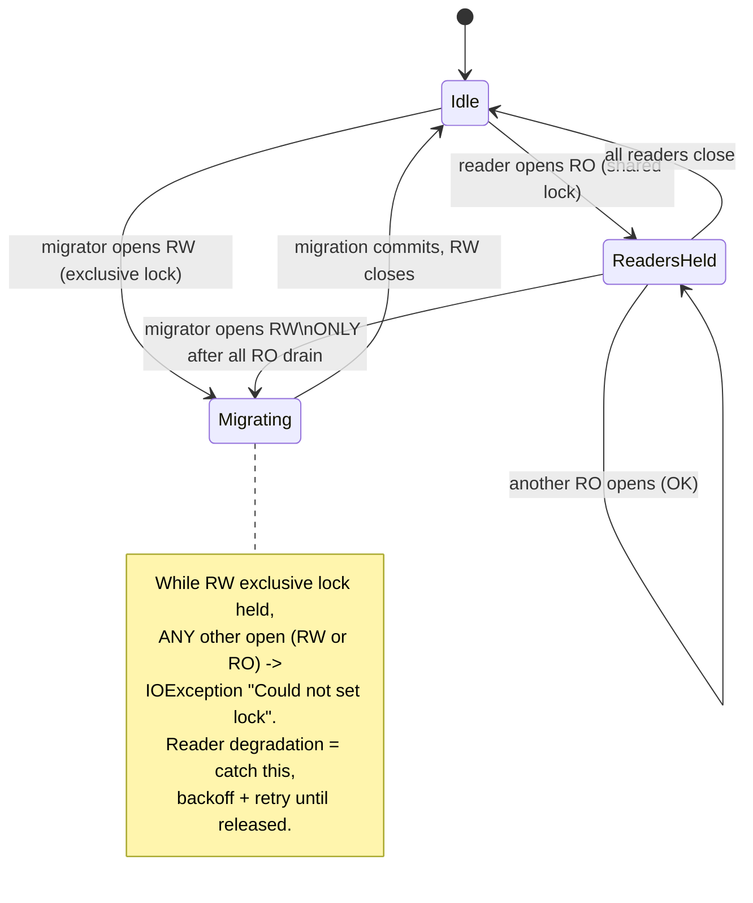

# Task: Migration framework

* Task ID: p1-data-backbone-m2-migration-framework
* Complexity: Level 3
* Type: feature (subsystem — warehouse access + forward-only migrations)

Milestone 2 of the `p1-data-backbone` L4 project. Build the forward-only, numbered SQL migration subsystem inside the `sr-search` engine: a harness-neutral warehouse-open/connection helper (`~/.stockroom/`), a `schema_version` record, a lazy version gate (each consumer checks the version before touching the DB), forward-only application of pending migrations under an exclusive lock, and concurrency-safe reader degradation. The milestone-1 schema (`0001_initial_schema.sql`) ships **in place** as migration `0001` — no file move. The lock primitive and reader wait/backoff semantics are chosen here.

## Pinned Info

### DuckDB cross-process locking model (empirically verified, planning POC)

Load-bearing for the entire concurrency design. Verified on DuckDB 1.5.4 (the locked engine version) via a planning POC:

- A **read-write** connection takes an **exclusive** OS file lock: while it is held, *every* other-process open — RW **or** read-only — fails immediately with `duckdb.IOException: Could not set lock on file …: Conflicting lock is held`.
- A **read-only** connection takes a **shared** lock: other read-only opens succeed; a read-write open fails with the same `IOException`.
- Within a **single process**, a second `connect()` to the same path shares the instance/catalog (no conflict).

**Consequence:** DuckDB itself guarantees migration exclusivity (a migrator holding RW excludes all). The framework's job is (a) coordinate *would-be migrators* so they don't thrash on the RW lock, (b) translate the raw open-time `IOException` into graceful, bounded wait/backoff for readers, and (c) make the writer wait for readers to drain before it can take the RW lock.

## Component Analysis

### Affected Components

- **`stockroom.migrations` package** (`src/stockroom/migrations/`): currently holds `0001_initial_schema.sql` + a docstring-only `__init__.py`. → Gains migration **discovery** (enumerate `NNNN_*.sql` in number order) and the `schema_version` contract. The SQL stays exactly where it is.
- **NEW `stockroom.warehouse` (connection/open helper)**: the harness-neutral warehouse-open contract. Resolves the warehouse path (`~/.stockroom/warehouse.duckdb`, overridable via env for tests), creates `~/.stockroom/` if absent, and opens read-write or read-only connections. This is the single chokepoint every consumer (skills, nightly job) goes through. → New module.
- **NEW migration runner / lazy gate** (likely `stockroom.migrate` or within `stockroom.warehouse`): reads the current `schema_version`, compares to the highest discovered migration number, and — if behind — acquires the exclusive lock, applies each pending migration in a transaction in ascending order, records each in `schema_version`, then returns a ready connection. If current, it is a near-free read of one row.
- **NEW lock primitive**: the cross-process coordination lock that serializes would-be migrators and underpins reader backoff. Exact primitive is **OPEN QUESTION 1**.
- **NEW reader-degradation helper**: a bounded retry/backoff wrapper around "open read-only" that tolerates the migration `IOException`. Semantics are **OPEN QUESTION 2**.
- **Test infrastructure** (`tests/conftest.py`): the existing `schema_con` fixture applies `0001` by raw execute with no runner. → Add fixtures for an on-disk warehouse path (tmp), the migration runner, and multi-process/concurrency harness. `schema_con` stays for the pure schema-contract tests.
- **`memory-bank/techContext.md`**: the Warehouse Schema section already says "the migration framework that applies this SQL … lands in milestone 2." → Update to point at the real runner/warehouse module once built.

### Cross-Module Dependencies

- Every future consumer (ingest m3, `sr-query` m4, search/dashboard) → `stockroom.warehouse.open()` → lazy gate → migration runner → lock primitive. The warehouse helper is the **single entry contract**; the lazy gate is invoked from inside it so no consumer can touch an un-migrated DB.
- Migration runner → `migrations/` discovery (filenames) + `schema_version` table (state) + lock primitive (exclusivity).
- Reader path (`open(read_only=True)`) → reader-degradation helper → DuckDB file lock.

### Boundary Changes

- **New public contract**: `stockroom.warehouse` open functions + the migration runner entrypoint. This is the API every later milestone builds on, so its shape matters (higher blast radius).
- **New DB object**: a `schema_version` table (or equivalent record). This is itself a schema change — decision needed on whether it lives in `0001` or in a dedicated bootstrap step the runner performs before applying numbered migrations (**OPEN QUESTION 3**, lower ambiguity).
- The milestone-1 golden snapshot (`0001_snapshot.json`) pins the *five product tables* filtered to `internal = false`; adding a `schema_version` table must not break that snapshot test — verify the introspection filter excludes/handles it deliberately.

### Invariants & Constraints (must preserve)

- **Forward-only.** No migration is ever edited or reversed; upgrades are data-preserving ("never break your warehouse"). No down-migrations.
- **Preserve data; never force a re-embed.** Migrations transform in place; embeddings (the expensive asset) are never invalidated by the framework itself.
- **0001 ships in place** — the framework wraps the existing file; no move (the `schema_sql_path` fixture pins the packaged path).
- **Harness-neutral warehouse home** — `~/.stockroom/`, never under a harness dir.
- **Hook never migrates** — migration is owned by DB consumers (skills, nightly job), not the session-start hook. (No hook code in this milestone, but the API must make "open + migrate" the explicit consumer action, not a side effect of import.)
- **Locked-uv trust** — any new runtime dependency must enter `uv.lock` via `make lock`; torch never added. Strongly prefer **stdlib-only** for the lock primitive (no new dependency).
- **Test-first**, green `make ci` at the boundary (sync, lock-check, lint, format-check, test, reuse).
- **Clean-room** — lock/migration design reimplemented from first principles + the tech-brief; no `claude-warehouse` lineage; `cursor-warehouse` only via the operator provenance procedure.

## Open Questions

All resolved in the architecture creative phase — see `memory-bank/active/creative/creative-warehouse-concurrency-locking.md`.

- [x] **Q1 — Migration lock primitive.** → **Resolved:** an OS advisory **`fcntl.flock(LOCK_EX)`** on a sidecar `~/.stockroom/.warehouse.lock`, taken by any process before opening DuckDB **read-write** (the single-writer/migrator token). Readers never take it. Chosen over an in-DB lock (structurally circular — needs a RW connection to coordinate RW access) and over DuckDB-lock-only (herd-prone). Crash-safe via OS auto-release on process death (POC-verified); lockfile on WSL-internal ext4 sidesteps the Windows-mount `flock` hazard. stdlib-only → `uv.lock` untouched.
- [x] **Q2 — Reader wait/backoff semantics.** → **Resolved:** readers open RO under a bounded **exponential backoff + jitter** (initial ~50 ms, factor 2, per-attempt cap ~1 s, total ~30 s, all injectable) that catches DuckDB's migration-time `IOException("Could not set lock")`; on timeout raise a typed `WarehouseBusyError` (fail-soft-visible, never block forever). Writers/migrators use the **same** backoff to wait for readers to drain after taking the flock. Lazy gate is double-checked (re-read version after acquiring the flock).
- [x] **Q3 — `schema_version` bootstrap placement.** → **Resolved:** a **runner-owned bootstrap table** created via `CREATE TABLE IF NOT EXISTS` *before* numbered migrations — **not** in `0001`. Keeps the locked `0001` data contract + golden snapshot untouched and lets the runner answer "has `0001` even been applied?". Records version number, filename, applied-at per migration.

## Proposed Module Layout

- **`src/stockroom/migrations/__init__.py`** (exists; docstring-only) → add lightweight, DB-free discovery: `migrations_dir() -> Path`, `discover() -> list[Migration]` parsing `NNNN_<slug>.sql` into `(version:int, path:Path)` sorted ascending. Update the "no runtime behavior" docstring line.
- **`src/stockroom/migrate.py`** (NEW): the runner. `SCHEMA_VERSION_TABLE`, `ensure_schema_version_table(con)`, `current_version(con) -> int` (0 when the bookkeeping table is absent), `apply_pending(con) -> list[int]` (assumes a RW connection held by a flock-holding caller; applies each pending file in ascending order, each in its own transaction together with the `schema_version` insert).
- **`src/stockroom/warehouse.py`** (NEW): the single chokepoint. `WarehouseBusyError`, `home_dir()`/`warehouse_path()`/`lock_path()` (resolve `~/.stockroom/`, override via `STOCKROOM_HOME` env for tests; create dir if absent), a `flock` context manager (`fcntl.flock`), `_open_with_backoff(...)` (catches DuckDB `IOException`, exponential backoff + jitter, raises `WarehouseBusyError` on timeout), and `open(read_only=False, *, migrate=True, **backoff)` wiring the double-checked lazy gate.

## Test Plan (TDD)

### Behaviors to Verify

**Discovery (`tests/test_migrations_discovery.py`)**
- `discover()` over the package dir → `[(1, …/0001_initial_schema.sql)]`, ascending by version.
- Filenames not matching `NNNN_*.sql` → ignored; malformed numbers → not silently mis-ordered.

**Runner (`tests/test_migrate_runner.py`)** — in-memory / tmp-file DuckDB
- `current_version()` on a DB with no bookkeeping table → `0` (bootstrap path).
- `apply_pending()` on a fresh DB → applies `0001`; the five product tables exist; `current_version()==1`; a `schema_version` row records version, filename, non-NULL `applied_at`.
- Idempotency: a second `apply_pending()` → returns `[]`, version unchanged, no duplicate rows.
- Ascending order: with a synthetic temp migrations dir (`0001`,`0002`), applied low→high; version becomes 2.
- Atomicity: a deliberately-failing synthetic migration → its transaction rolls back; `current_version()` unchanged (no half-applied/half-recorded state).
- Version ahead of code (DB version > max known) → no-op, no error (forward-compat read stance).

**Warehouse open (`tests/test_warehouse_open.py`)**
- `STOCKROOM_HOME=tmp` → `warehouse_path()` under tmp; the home dir is auto-created.
- `open(read_only=False)` on a brand-new path → returns a ready connection, schema migrated, `current_version()==1`.
- `open(read_only=True)` on an already-current warehouse → returns a working RO connection; no migration attempted.
- Double-checked gate: when already current, no flock contention path is taken (migration runner not invoked).

**Lock primitive (`tests/test_warehouse_lock.py`)**
- `flock` ctx held → a non-blocking acquire from another fd/process fails; releases on exit.
- (Crash auto-release is covered cross-process in the concurrency suite.)

### Integration / Concurrency Tests (`tests/test_warehouse_concurrency.py`) — multi-process via `subprocess`

- **Reader degradation:** child holds RW (simulated in-progress migration) for a bounded window; parent `open(read_only=True)` with a short timeout raises `WarehouseBusyError`; with a timeout exceeding the window it **succeeds after** the child releases.
- **Writer drain:** child holds RO; parent `open(read_only=False)` backs off until the child closes, then succeeds (or raises `WarehouseBusyError` on a short timeout).
- **Migrator serialization / no double-apply:** two child processes race to open-RW a behind warehouse; both end at the latest version, exactly one set of `schema_version` rows (flock serializes; double-checked gate prevents re-apply); the DB is intact.
- **Typed terminal error:** timeout path raises `WarehouseBusyError`, not a raw `IOException`.

### Test Infrastructure

- Framework: `pytest`, configured in `skills/sr-search/pyproject.toml` (`pythonpath=["src"]`, `testpaths=["tests"]`).
- Conventions: `from __future__ import annotations`, module docstrings, `test_*` names, fixtures in `conftest.py`.
- New `conftest.py` fixtures: `warehouse_home` (tmp dir + `STOCKROOM_HOME` monkeypatch), `tmp_migrations_dir` (synthetic `NNNN_*.sql` for ordering/atomicity tests), and a small helper to spawn a worker subprocess in the engine env. The existing `schema_con`/`schema_sql_path` fixtures stay for the m1 schema-contract tests.
- New test files: the five above. Concurrency workers run via `subprocess` using the same interpreter (`sys.executable`) with `src` on `PYTHONPATH`.

## Implementation Plan

Ordered from fewest dependencies outward; each step is one TDD cycle (RED → GREEN → refactor).

1. **Migration discovery.** Files: `migrations/__init__.py`, `tests/test_migrations_discovery.py`. Add `migrations_dir()`/`discover()`/`Migration` and the filename parser; update docstring.
2. **schema_version bootstrap + `current_version`.** Files: `migrate.py`, `tests/test_migrate_runner.py`. `ensure_schema_version_table` + `current_version` (0 when absent).
3. **`apply_pending` runner.** Files: `migrate.py`, `tests/test_migrate_runner.py`. Per-migration transaction + `schema_version` insert; idempotent; ascending; atomic on failure; version-ahead no-op. Uses `tmp_migrations_dir` for synthetic multi/failing migrations.
4. **Warehouse path resolution + `WarehouseBusyError`.** Files: `warehouse.py`, `tests/test_warehouse_open.py`, `conftest.py` (`warehouse_home`). `home_dir`/`warehouse_path`/`lock_path`, dir creation, `STOCKROOM_HOME` override.
5. **flock ctx + backoff open helper.** Files: `warehouse.py`, `tests/test_warehouse_lock.py`. `_flock` ctx manager + `_open_with_backoff` (catch DuckDB `IOException`, exp backoff + jitter, injectable params, `WarehouseBusyError` on timeout).
6. **`warehouse.open()` chokepoint (lazy gate).** Files: `warehouse.py`, `tests/test_warehouse_open.py`. Double-checked gate: RO version read → if behind, flock + re-check + RW `apply_pending` → reopen in requested mode; writers hold flock for the session.
7. **Concurrency suite.** Files: `tests/test_warehouse_concurrency.py`, `conftest.py` (subprocess helper). Reader degradation, writer drain, migrator serialization, typed terminal error.
8. **Docs + snapshot guard.** Files: `memory-bank/techContext.md` (point the Warehouse Schema note at the real runner/warehouse module), optionally a concise "two-layer warehouse lock" pattern in `memory-bank/systemPatterns.md` (defer wording to reflect if lighter). Confirm m1 `test_schema_0001.py` golden snapshot still green (schema_version is runner-created, absent from `0001`); add an explicit assertion only if the snapshot scope isn't already tight.
9. **Green gate.** Run `make ci` (sync, lock-check, lint, format-check, test, reuse); fix anything; verify `uv.lock` untouched (no new dependency) and REUSE clean (path-based rules cover new `.py`).

## Technology Validation

**No new technology — validation not required for dependencies** (the lock primitive is stdlib `fcntl`/`os`; DuckDB is already locked). `uv.lock` must remain unchanged — a guard at preflight/CI (`make lock-check`). Two planning POCs already de-risk the mechanism on the real engine version (DuckDB 1.5.4) and target filesystem (WSL-internal ext4):
- DuckDB cross-process lock model: RW exclusive (excludes all opens), RO shared; migration-time conflict surfaces as `IOException("Could not set lock")` (pinned diagram above).
- `fcntl.flock`: `LOCK_EX`/`LOCK_NB` semantics and **auto-release on process death** confirmed; `HOME` is on ext4, not a `/mnt` mount.

## Challenges & Mitigations

- **WSL/Windows-mount `flock` unreliability** → warehouse home is `~/.stockroom/` on WSL-internal ext4 (POC-confirmed not under `/mnt`); the lockfile lives there. Documented as a constraint of the warehouse home.
- **Stale/crashed lock holder wedging the warehouse** → `fcntl.flock` auto-releases on process death (POC-confirmed); no TTL/heartbeat/reaper needed.
- **Flaky multi-process timing tests** → assert on *outcomes* (final version, error type, no double-apply), not exact timings; use generous + injectable timeouts and short injectable backoff; synchronize via the lock/sentinel files rather than `sleep` guesses.
- **`fcntl` is POSIX-only (no native Windows)** → accepted; v1 runs under WSL/macOS (POSIX), Windows-native is out of v1. Primitive isolated behind `warehouse.open()` for a contained future swap.
- **Snapshot regression** from `schema_version` → it is runner-created and absent from `0001`, so the m1 `schema_con`/snapshot path is untouched; verified in step 8.
- **L4-creep (preflight directive)** → the deliverable is one cohesive subsystem (one chokepoint module + a runner + discovery) with no independent workstreams; confirm single-sub-run scope at preflight.

## Status

- [x] Component analysis complete
- [x] Open questions resolved
- [x] Test planning complete (TDD)
- [x] Implementation plan complete
- [x] Technology validation complete
- [ ] Preflight
- [ ] Build
- [ ] QA
