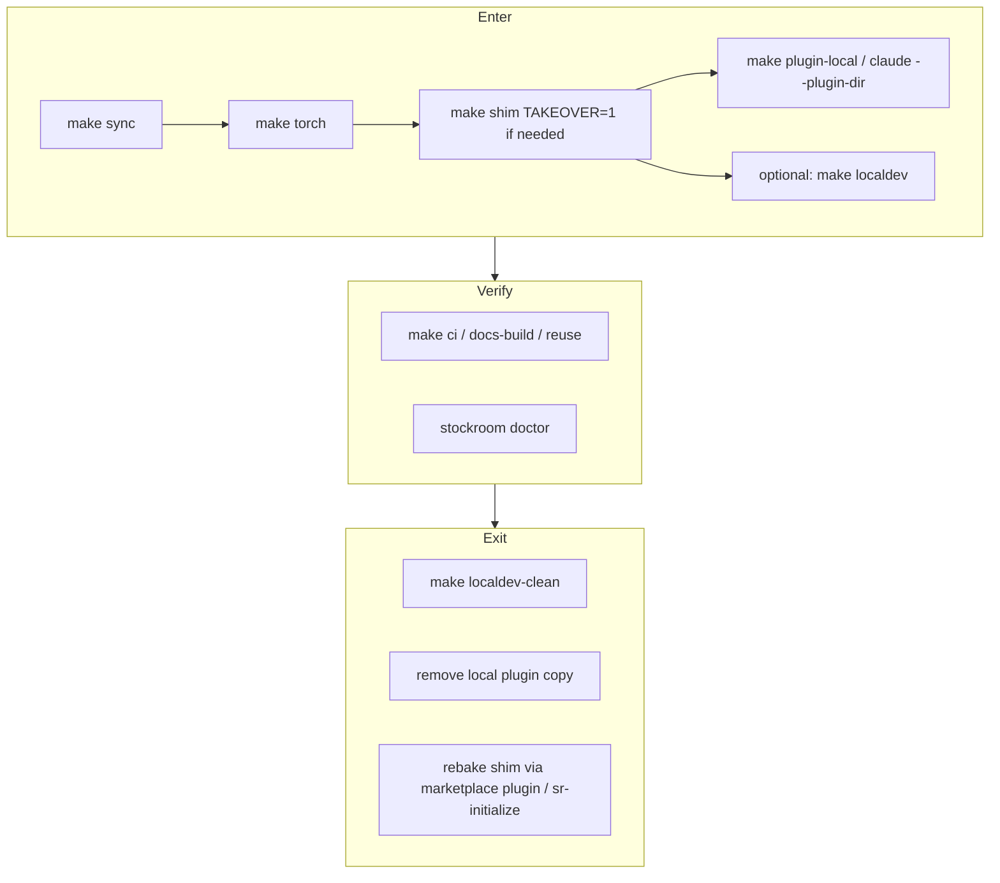

# Task: contributing-localdev-guide

* Task ID: contributing-localdev-guide
* Complexity: Level 3
* Type: enhancement (docs + Makefile atoms)

Bring Contributing to user-guide quality with a complete install → local checkout exclusive → verify → back path. Architecture/Advanced may only accrete rough notes. Creative: Hybrid thin Makefile atoms + narrative docs (`memory-bank/active/creative/creative-contributor-localdev-round-trip.md`).

## Pinned Info

### Contributor localdev round-trip

Why pinned: the whole deliverable is this lifecycle; every implementation step maps to Enter / Verify / Exit.

## Component Analysis

### Affected Components

- **`docs/contributing/`**: development.md kitchen-sink → split lifecycle vs day-to-day; add local-workflow; keep licensing; update `.pages`
- **`CONTRIBUTING.md`**: funnel reorder — local-workflow first for hackers
- **Root `Makefile`**: add `localdev-clean`, optional `plugin-local`, `shim` passthrough for `TAKEOVER=1`; fix stale torch docs comment; `.PHONY` update
- **Cross-links**: `docs/user-guide/troubleshooting/index.md` points at Development for rsync — retarget to local-workflow where appropriate
- **`docs/architecture/` / `docs/advanced/`**: notes-only accretion if orphan content appears during TLC
- **Home / user-guide finished pages**: presentation-quality only — surgical link fixes, no WIP dumps

### Cross-Module Dependencies

- Makefile atoms → documented in local-workflow; development.md lists targets but does not own the lifecycle narrative
- `make shim` / takeover → existing `stockroom.shim` CLI (already tested); Make only wraps
- `plugin-local` rsync → Cursor local plugin path; session-start rectify on the *copy* must not steal a `dev` shim (documented nuance from session `aef4448b`)
- Torch operator SSOT remains `docs/user-guide/troubleshooting/torch.md`; Contributing links, does not fork

### Boundary Changes

- Public contributor interface: new Make targets + new/restructured docs pages (semver N/A; docs/dev UX)
- No engine API / schema changes
- No end-user install path changes

### Invariants & Constraints

- Must preserve: end users bootstrap via `sr-initialize`/marketplace only
- Must preserve: torch held out of lock; `make sync` strips torch; freeze under stockroom home
- Must preserve: shim baked-only succeed-or-refuse; `--takeover` only for dead foreign bakes
- Must hold: `make localdev` ≠ Cursor `plugins/local` (different surfaces)
- Must hold: finished Home/user-guide presentation-quality; Architecture/Advanced may be rough notes
- Non-goal: silent mega `contrib-enter` / fully scripted IDE reload or marketplace reinstall

## Open Questions

- [x] Enter/exit automation & Contributing IA → **Hybrid** (see `memory-bank/active/creative/creative-contributor-localdev-round-trip.md`)

## Test Plan (TDD)

### Behaviors to Verify

Docs / site (gates, not pytest):

- B1: `make docs-build` succeeds with new/renamed contributing pages and updated nav
- B2: CONTRIBUTING.md and user-guide troubleshooting links resolve to the correct contributing pages
- B3: local-workflow documents Enter / Verify / Exit with the hybrid atoms and human gates (reload, marketplace)
- B4: development.md no longer owns the lifecycle story (no competing SSOT)

Makefile atoms (executable checks before code — no pytest theater; shell assertions against Make targets):

- M1: `make localdev` then `make localdev-clean` → no `stockroom-local` symlinks; managed pre-commit marker block removed; idempotent second clean
- M2: `make plugin-local` rsyncs to `PLUGIN_LOCAL_DEST` (default `~/.cursor/plugins/local/stockroom/`) with excludes; `.cursor-plugin/plugin.json` present at destination
- M3: `make -n shim TAKEOVER=1` shows `--takeover`; `make -n shim` does not
- M4: `make localdev-status` prints enough to see skills-mirror / plugin-local / shim ownership hints without changing state

Engine (regression only if Make wrapper touches Python — expected: none):

- Existing shim takeover tests remain green if we only wrap CLI flags

### Test Infrastructure

- Framework: pytest under `skills/sr-search/tests/` for engine; properdocs `--strict` for docs; Makefile behaviors verified by ordered shell checks (M1–M4), not a new pytest suite
- New test files: **none**
- Integration: during build, each Make unit runs its check expecting failure → implement → re-run; then `make docs-build`; `make reuse` if needed; `make ci` only if Python changed

### Integration Tests

- I1: Documented Enter recipe uses only named atoms + human steps (review against creative)
- I2: Exit recipe includes localdev-clean + plugin copy removal + shim rebake guidance
- I3: `localdev-status` usable in Verify / Exit sections of local-workflow

## Implementation Plan

1. **`localdev-clean` (TDD)**
    - Check first: run M1 against current tree (expect missing target / fail)
    - Files: `Makefile`
    - Then: implement remove of `LOCAL_SKILLS_DIR` symlinks; strip managed pre-commit marker block (same markers as `localdev`); idempotent; help text
    - Re-run M1 to green
    - Creative ref: hybrid atoms

2. **`plugin-local` + `shim TAKEOVER` + comment fix (TDD)**
    - Check first: M2/M3 expect fail / no `--takeover` in `make -n shim`
    - Files: `Makefile`
    - Then: `plugin-local` rsync with documented excludes and overridable `PLUGIN_LOCAL_DEST`; `shim` accepts `TAKEOVER=1` → `--takeover`; fix stale `docs/contributor-guide/torch.md` comment → user-guide torch path
    - Re-run M2/M3 to green
    - Creative ref: hybrid atoms

3. **`localdev-status` (TDD)**
    - Check first: M4 expect fail
    - Files: `Makefile`
    - Then: read-only status target (skills-mirror present?, `PLUGIN_LOCAL_DEST` plugin.json?, remind to run `stockroom doctor` / show how to inspect shim bake) — no mutations
    - Re-run M4 to green
    - Preflight amendment: Verify/Exit observability without expanding to mega enter/exit

4. **Docs: add `docs/contributing/local-workflow.md`**
    - Files: new page
    - Changes: presentation-quality Enter / Verify / Exit; distinguish `localdev` vs `plugins/local` vs Claude `--plugin-dir`; footguns (torch after sync/ci, takeover, no symlink for Cursor plugin, third-party hooks toggle → user-guide troubleshooting); use status/clean/plugin-local atoms; link torch SSOT
    - Verify: content review against B3 + `make docs-build` (with step 5)

5. **Docs: slim `development.md` + nav + CONTRIBUTING funnel**
    - Files: `docs/contributing/development.md`, `docs/contributing/.pages`, `CONTRIBUTING.md`
    - Changes: move lifecycle out of development into links to local-workflow; keep Makefile day-to-day, torch-safe contract, two uv projects, ad-hoc invocation; list new targets in help-oriented sections; nav order local-workflow → development → licensing; CONTRIBUTING points hackers at local-workflow first
    - Verify: B2/B4 + docs-build

6. **Cross-links + notes sinks**
    - Files: `docs/user-guide/troubleshooting/index.md` (retarget rsync/local details to local-workflow); optionally Architecture/Advanced notes-only if orphan content appears
    - Changes: surgical; no WIP dumps onto finished user-guide prose
    - Verify: B1/B2 via `make docs-build`

7. **Final gates**
    - Re-run M1–M4; `make docs-build`; `make reuse` if license-relevant paths touched; engine `make ci` only if Python changed (expected skip)

## Technology Validation

No new technology — validation not required. Makefile extensions use existing `rsync`/`awk`/`ln` already assumed by `localdev`.

## Challenges & Mitigations

- **`plugin-local` writes outside the repo**: Mitigate with overridable `PLUGIN_LOCAL_DEST`, document path clearly, never run destructive clean of marketplace installs from Make
- **`localdev-clean` vs user-edited pre-commit**: Mitigate by only removing the marked block (same markers as install)
- **Competing SSOTs** (development vs local-workflow): Mitigate by explicit page jobs in step 4; QA checklist for duplicate recipes
- **Exit path incomplete for marketplace**: Mitigate with honest prose — exit cannot fully automate marketplace reinstall; document “reinstall plugin + sessionStart rectify” / `sr-initialize` as human steps
- **Unrelated leftover creative** (`creative-embedding-invalidation.md`): Leave untouched

## Pre-Mortem

- **Plan fails because we still wrote a mega enter target**: Prevented by creative Decision + Implementation steps scoped to atoms only
- **Plan fails because docs stay kitchen-sink and nobody finds Exit**: Plan response — local-workflow is mandatory new page with Exit as first-class section; funnel updated in CONTRIBUTING
- **Plan fails because Make targets are untested and break pre-commit**: Covered by marked-block-only clean + M1/M4 verify-before-implement ordering (preflight amendment)
- **Plan fails by dumping WIP into user-guide**: Constraint + cross-link step surgical only

## Preflight Amendments

- TDD: each Makefile unit now orders check-fail → implement → re-check (M1–M4)
- Added thin `localdev-status` atom for Verify/Exit observability (still not a mega enter/exit)

## Status

- [x] Component analysis complete
- [x] Open questions resolved
- [x] Test planning complete (TDD)
- [x] Implementation plan complete
- [x] Technology validation complete
- [x] Pre-Mortem complete
- [x] Preflight
- [x] Build
  - [x] Step 1: `localdev-clean` (M1 green)
  - [x] Step 2: `plugin-local` + `shim TAKEOVER` + torch comment (M2/M3 green)
  - [x] Step 3: `localdev-status` (M4 green)
  - [x] Step 4: `local-workflow.md`
  - [x] Step 5: slim development.md + nav + CONTRIBUTING
  - [x] Step 6: cross-links
  - [x] Step 7: final gates (M1–M4, docs-build, reuse; ci skipped — no Python)
- [ ] QA
