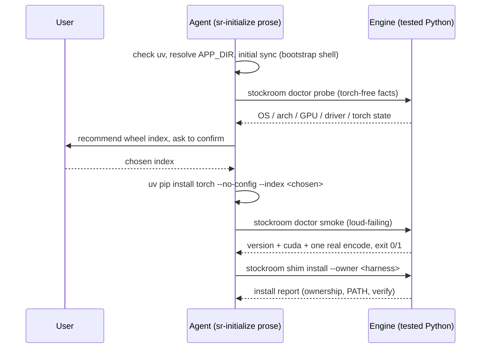

# Task: p3-m3-sr-initialize-torch-cli

* Task ID: p3-m3-sr-initialize-torch-cli
* Complexity: Level 3
* Type: feature

Milestone m3 of `p3-onboarding-cli-scheduling`: the `sr-initialize` onboarding skill's prerequisites/torch/CLI-binding half — prerequisite checks (uv present and usable), platform/accelerator detection, per-machine out-of-band torch provisioning, a loud-failing smoke test (print version, check `cuda.is_available()`, encode one string), and installation of the m2 shim — validated on the Linux/CUDA path and a CPU path (macOS/MPS reasoning folded into the smoke test). Scheduling and first run are m4; wrapper-skill trimming is m5.

## Pinned Info

### Onboarding flow (who owns what)

The m3 architecture in one picture — the boundary between skill prose (judgment, consent, bootstrap) and tested engine Python (facts, verification, guarded writes). Pinned because every implementation step below is one box of this flow.

## Component Analysis

### Affected Components

- `skills/sr-search/src/stockroom/doctor.py` (new): read-only diagnostic module — `probe` (torch-free environment facts) and `smoke` (loud-failing torch/encoder verification). Flat argparse like `stockroom.shim`.
- `stockroom.__main__.SUBCOMMANDS`: seventh row `doctor` (auto-sizing `_usage()` verified in m2; nothing else consumes the dict).
- `skills/sr-initialize/SKILL.md` (new): the operator-invoked onboarding skill (prose). Both manifests expose the whole `skills/` tree — no manifest changes.
- `stockroom.shim` / `stockroom.embed` (unchanged): reused — shim binding via `stockroom shim install --owner <harness>`; smoke encodes through the real `BgeEncoder`.
- Licensing (`REUSE.toml`, unchanged): existing globs already cover the new paths (`skills/**` PPL-S; `skills/**/*.py` re-asserted AGPL); `reuse lint` verifies.
- Docs: README (point ad-hoc/onboarding readers at `sr-initialize`), `memory-bank/techContext.md` (doctor + sr-initialize sections), `memory-bank/systemPatterns.md` (onboarding split note, small).

### Cross-Module Dependencies

- `sr-initialize` (prose) → engine **before the shim exists**: the skill carries the one sanctioned pre-shim bootstrap incantation (plugin-root env var + torch-safe uv flags). The only place outside the shim allowed to know it; m5's no-invocation-token grep targets only `sr-query`/`sr-semantic`/`sr-search`, so no conflict.
- `sr-initialize` → `stockroom doctor probe` / `doctor smoke` → `stockroom shim install`: every post-bootstrap mechanical step is a tested module CLI call.
- `doctor smoke` → `stockroom.embed.BgeEncoder`: the production encode path (also pre-warms the HF model cache). Torch-dependent by definition; injectable for torch-free tests.
- `doctor probe` → `nvidia-smi` subprocess (injectable) + `platform` stdlib + guarded `import torch`.

### Boundary Changes

- Additive only: one new dispatcher subcommand, one new module, one new skill directory. No existing interface changes.

### Invariants & Constraints

Never-do list (from the creative exploration, asked first per the m2 reflection insight):

1. Never run an exact sync after torch is provisioned; the initial `uv sync --frozen --no-config` (pre-torch) is the one legitimate exact sync, and the skill states the ordering explicitly.
2. Never pick the torch wheel silently — `probe` reports facts; the agent recommends; the human confirms.
3. Never report a broken setup as success — `smoke` exercises the real encoder path and fails with one clear stderr line, exit 1.
4. Never write the shim outside the m2 ownership policy (`stockroom shim install --owner <harness>`; `--takeover` only with explicit user consent).
5. Never plant a second incantation garden — one bootstrap incantation in `sr-initialize`, everything else through `stockroom <subcommand>`.

Plus: all Python test-first; skill prose examples executed live before being written in (project invariant); `probe` must run torch-free; POSIX only; green `make ci` (incl. REUSE) at the milestone boundary.

**Errmsg ratchet** (operator-set at the preflight→build gate): every init-path failure message must carry the *next action*, such that addressing it moves the user at least one step closer to a green setup. Naming the problem is not enough. `doctor` knows `APP_DIR`, so its remedies print exact commands (e.g. torch-missing names the engine environment and the literal `uv pip install torch --no-config --index <url>` line against it — the "I have torch globally" user must learn *where* torch has to live, or they loop). Tests assert remedy content, not just failure.

**Idempotent re-entry — the environment is the state**: `sr-initialize` keeps no progress file; re-running it re-probes and skips whatever is already green (torch present → skip provisioning, go to smoke; shim owned and current → no-op rewrite). This is what makes "go install torch your way and come back" a supported flow rather than a dead end.

## Open Questions

- [x] **Q1 — Onboarding logic surface (Python/prose split)** → Resolved: read-only `stockroom doctor` module (`probe` torch-free facts + `smoke` loud-failing real-encoder check) as the dispatcher's seventh subcommand, with skill prose owning bootstrap, the human-confirmed wheel choice, provisioning, and shim binding via `stockroom shim install` (see `memory-bank/active/creative/creative-onboarding-logic-surface.md`)
- [x] **Q2 — Accelerator detection & index recommendation** → Collapsed into Q1: `probe` reports mechanical facts (`platform`, `nvidia-smi`, torch import state); the index-recommendation mapping is judgment and lives in skill prose, confirmed by the user

## Test Plan (TDD)

### Behaviors to Verify

**`doctor probe` — facts, torch-free, never crashes** (`test_doctor.py`, unit with injection):

- B1: probe reports `os`/`arch` from `platform` → stable `key: value` lines.
- B2: `nvidia-smi` present and parseable (injected runner) → GPU name + driver CUDA version reported.
- B3: `nvidia-smi` absent (injected `FileNotFoundError`) → `gpu: none` (or equivalent), exit 0, no error.
- B4: `nvidia-smi` fails or emits garbage (injected) → graceful "unavailable" fact, never a traceback.
- B5: torch not importable (injected importer) → `torch: not installed` reported as a fact.
- B6: torch importable (injected fake module with `__version__` + `cuda.is_available()`) → version and CUDA availability reported.
- B7: probe never imports torch eagerly — importing `stockroom.doctor` and running probe with the injected "absent" importer touches no real torch (CI is torch-free by construction; the module-import test pins it).

**`doctor smoke` — loud-failing verification** (`test_doctor.py`, unit with injection):

- B8: torch missing (injected) → exactly one stderr line, exit 1, no traceback — and the line is a **ratchet**: it names the engine environment (`APP_DIR`) and contains the literal provisioning command (`uv pip install torch --no-config --index`), asserted in the test.
- B9: encoder construction/encode raises (injected factory) → one stderr line naming the failure **plus** the next action (wheel/GPU mismatch → re-run `sr-initialize` and pick a different index), exit 1 (the wrong-wheel kernel-crash surface).
- B10: encode returns a wrong-width vector (injected) → failure with an actionable line (same re-pick remedy), exit 1 (dimension mismatch is a broken setup, not success).
- B11: happy path (injected fake torch + fake encoder) → stdout carries torch version, `cuda.is_available()` result, and an `ok` summary; exit 0.
- B12: real-model smoke — `importorskip("torch")`-gated: `run_smoke` with the real `BgeEncoder` encodes one string and exits 0 (the Linux/CUDA validation, machine-local).

**CLI surface** (`test_doctor_cli.py`, subprocess convention):

- B13: `python -m stockroom.doctor probe` exits 0 in a torch-free env and prints the expected fact keys.
- B14: `python -m stockroom.doctor smoke` in a torch-free env exits 1 with the one-line ratchet diagnosis (remedy command included — the CI-testable loud-failure).
- B15: `python -m stockroom.doctor --help` exits 0 and documents both actions.

**Dispatcher integration** (`test_dispatcher_cli.py` extensions):

- B16: `SUBCOMMANDS` gains `doctor`; top-level `--help` lists it; `stockroom doctor --help` forwards (fingerprint: `probe`).

### Edge Cases

Covered above by design: absent/broken `nvidia-smi` (B3/B4), absent torch (B5/B8/B14), wrong-wheel crash shape (B9), silent-dimension corruption (B10). The "no warehouse yet" state is irrelevant — doctor never touches the warehouse.

### Test Infrastructure

- Framework: pytest (`skills/sr-search/pyproject.toml`), run via `make test` / `make ci`.
- Conventions: injection for hard deps (`FakeEncoder` precedent), subprocess tests for CLI contracts, `importorskip("torch")` for the one real-model edge.
- New test files: `tests/test_doctor.py`, `tests/test_doctor_cli.py`. Extended: `tests/test_dispatcher_cli.py` (tuple + fingerprint).

### Integration Tests

- B16 (dispatcher → doctor forwarding) is the cross-component seam.
- The full onboarding flow (bootstrap → probe → provision → smoke → shim install) is prose orchestration over already-tested units; it is verified live (see step 6), not in pytest — consistent with the "skills verified artisanally" invariant.

## Implementation Plan

1. ✅ **`stockroom.doctor` — probe** (red→green)
    - Files: `skills/sr-search/src/stockroom/doctor.py` (new), `skills/sr-search/tests/test_doctor.py` (new)
    - Changes: `probe_facts(*, smi_runner=…, torch_importer=…) -> list[tuple[str, str]]` (ordered facts: os, arch, gpu, driver-cuda, torch, torch-cuda, engine dir) + `format_facts()`; stub then implement B1–B7 tests; implement to green.
    - Creative ref: probe is facts-only — no index-recommendation logic in Python.
2. ✅ **`stockroom.doctor` — smoke** (red→green)
    - Files: `doctor.py`, `test_doctor.py`
    - Changes: `run_smoke(*, torch_importer=…, encoder_factory=BgeEncoder-by-default) -> int` printing version + CUDA availability, encoding one string, asserting `EMBED_DIM` width; one-stderr-line **ratchet** failures — each remedy carries the next action, torch-missing prints the exact engine-env install command (B8–B11 first, then implement; B12 as the gated real-model test).
    - Creative ref: smoke goes through the production `BgeEncoder` path, not a bare torch import.
3. ✅ **doctor CLI + dispatcher row** (red→green)
    - Files: `doctor.py` (`_build_parser` flat argparse `probe|smoke`, `main(argv)`), `tests/test_doctor_cli.py` (new), `stockroom/__main__.py` (+1 `SUBCOMMANDS` row), `tests/test_dispatcher_cli.py` (tuple + `doctor` fingerprint)
    - Changes: B13–B16 red first; wire `main` and the dispatcher row to green.
4. ✅ **`skills/sr-initialize/SKILL.md`** (prose)
    - Files: `skills/sr-initialize/SKILL.md` (new)
    - Changes: frontmatter matching sibling conventions (operator-facing; model-invocable like siblings); the ordered flow — uv prerequisite check, harness/owner detection (`CURSOR_PLUGIN_ROOT` vs `CLAUDE_PLUGIN_ROOT`; **neither set → dev-checkout context**: the skill says so and defers the shim to `make shim` unless the user insists), engine-dir resolution (**plugin-root env var when set, else sibling-relative to the skill's own directory** — `../sr-search`, the `sr-search` delegation precedent; works identically for plugin installs and the `make localdev` symlink mirror since committed layout = install layout), initial `uv sync --frozen --no-config` (the one legitimate exact sync, ordering stated), `stockroom doctor probe` via the bootstrap incantation, the wheel-recommendation guidance (Linux+NVIDIA → matching `cu*` with the `sm_`-generation caveat; macOS / no GPU → `cpu`) + explicit user confirmation, **the self-managed-torch branch** (user knows their setup → state the requirement — torch importable inside the engine environment at `APP_DIR`, any build that passes smoke — let them install it their way, in-conversation or later; the smoke test is the gate, not the recipe), `uv pip install torch --no-config --index <chosen>` for the guided path, `doctor smoke` (loud-fail handling: wrong wheel → re-pick index, retry), `stockroom shim install --owner <harness>` (relay refusals — including the dev-shim ownership refusal a localdev tester will correctly hit; `--takeover` only on explicit consent; PATH warning relay), **idempotent re-run semantics stated** (probe-driven skip; the environment is the state — "come back later" resumes where the facts say), and the m4 forward-pointer (scheduling/first run land next milestone).
    - Creative ref: the skill is the sanctioned bootstrapper; every shipped example executed live before written in.
5. **Docs**
    - Files: `README.md`, `memory-bank/techContext.md`, `memory-bank/systemPatterns.md`
    - Changes: README — onboarding pointer to `sr-initialize` alongside the ad-hoc section, and add `doctor` to the enumerated subcommand list (README line ~78; preflight finding); techContext — `stockroom.doctor` + `sr-initialize` sections (accretion); systemPatterns — extend the search-surface judgment-vs-mechanism pattern with the onboarding application (short).
6. **Live validation + full gate**
    - Files: none (verification)
    - Changes: execute every SKILL.md example live on this machine; validate the Linux/CUDA path (real `doctor smoke` with provisioned torch, B12 green un-skipped) and the CPU path (`CUDA_VISIBLE_DEVICES="" stockroom doctor smoke` — the o9 spike's CPU-fallback shape); `make ci` green end to end.

## Technology Validation

No new technology — `platform` and `subprocess` are stdlib; `nvidia-smi` is probed, not depended on (absence is a reported fact); the encoder and torch recipe already exist. Validation not required.

## Challenges & Mitigations

- **Smoke is torch-dependent but CI is torch-free**: the torch-absent diagnosis (B8/B14) is CI-testable by construction; the real-model path is the single `importorskip("torch")`-gated test (established convention). Mitigation is structural.
- **`nvidia-smi` output variance / absence**: probe treats every subprocess failure as a reportable fact, never an error (B3/B4); the parser targets `--query-gpu=` CSV mode for stability.
- **First `BgeEncoder` construction downloads the model**: on a cold machine `doctor smoke` needs network once; the skill prose says so (and the pre-warm is a feature — first embed won't pay it). The gated test is safe on this machine (model already cached).
- **Wrong-wheel failures can be ugly (CUDA kernel errors deep in torch)**: `run_smoke` catches broad exceptions from the encode and compresses to one stderr line naming the exception class + message (B9) — loud, but clean.
- **Skill prose drift risk**: mitigated by keeping prose steps to judgment/consent only; every mechanical step is a one-line tested-CLI call, and examples are live-verified before landing.
- **"I already have torch" confusion (globally-installed torch is invisible to the engine venv)**: the smoke's torch-missing ratchet names the engine environment explicitly and prints the exact install command against it (B8/B14), so the self-managed user learns where torch must live on the first failure.
- **Localdev trial run**: `make localdev` mirrors `skills/`, so `sr-initialize` is invocable in-harness from the checkout; sibling-relative engine resolution keeps it working with `CURSOR_PLUGIN_ROOT` unset, and the existing dev-owned shim exercises the ownership-refusal relay rather than being clobbered.
- **Not L4**: single new module + one prose skill + doc accretion — comfortably one workstream.

## Status

- [x] Component analysis complete
- [x] Open questions resolved
- [x] Test planning complete (TDD)
- [x] Implementation plan complete
- [x] Technology validation complete
- [ ] Preflight
- [ ] Build
- [ ] QA
