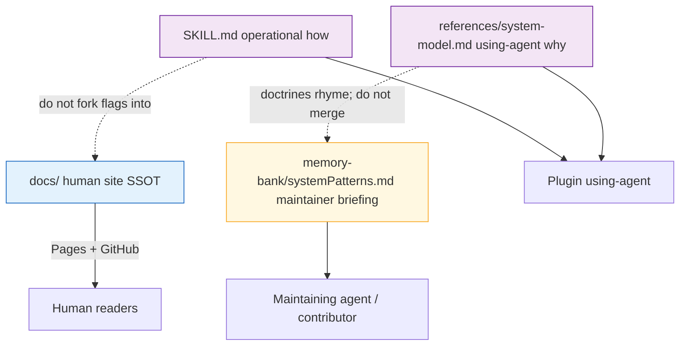

# Task: release-quality-docs

* Task ID: release-quality-docs
* Complexity: Level 3
* Type: documentation / docs-site feature

Ship 1.0-quality documentation for Stockroom while remaining on major version 0: README funnel, CONTRIBUTING, restructured human `docs/` corpus, properdocs site + CI/Pages — per `memory-bank/active/creative/creative-release-quality-docs.md` Option A (lean skills + human site SSOT; dual-audience ≈ `system-model.md` only; snippets ≈ 0).

## Pinned Info

### Audience & ownership map

Why pinned: every implementation step must respect this partition; violating it recreates the rejected snippet-farm / SLOBAC-overfit plans.

## Component Analysis

### Affected Components

- **README.md**: thin product landing → rewrite to what → pitch → quickstart → skills table → docs/contrib/license.
- **CONTRIBUTING.md** (new): contributor entry; ownership rule; system-model vs systemPatterns; pointers to contributor-guide.
- **docs/**: today `using.md`, `development.md`, `torch.md`, `img/` → restructure into user-guide / architecture / contributor-guide (+ advanced CLI, troubleshooting); migrate content; fix internal links.
- **properdocs toolchain** (new): root `pyproject.toml` stub + `[dependency-groups] docs`, `uv.lock`, `properdocs.yaml`, `.gitignore` `site/`, optional local `make docs` target.
- **CI / Pages** (new): docs build workflow (strict) + deploy on release/`workflow_dispatch` (sibling pattern).
- **skills/**: no user-guide corpus under `references/`; keep `system-model.md`; optional one-line guardrail cross-check only if a high-cost warning is missing — prefer not editing skills unless links in docs need accuracy.
- **memory-bank persistent**: no required content change; CONTRIBUTING cites systemPatterns vs system-model.

### Cross-Module Dependencies

- README → docs/user-guide + Pages URL (when known).
- CONTRIBUTING → docs/contributor-guide + systemPatterns + system-model (cite only).
- docs/architecture → link to `skills/sr-search/references/system-model.md` (GitHub-relative), not a snippet farm.
- docs/user-guide/install ← content from today's `docs/using.md`.
- docs/contributor-guide ← `development.md` / `torch.md`.
- properdocs build reads `docs/` + `properdocs.yaml`; CI installs via `uv sync --group docs --frozen`.
- Img assets: keep under `docs/img/` for install screenshots (human/site).

### Boundary Changes

- No Python engine API/schema changes.
- New public surfaces: GitHub Pages doc site; CONTRIBUTING; expanded docs URLs.
- Root gains a docs-only `pyproject.toml` (stub `[project]`, not a publishable package) — parallel to slobac/ai-rizz; does not replace `skills/sr-search/pyproject.toml`.

### Invariants & Constraints

- Must preserve skill-first usage; must not fork `SKILL.md` flag/init step lists into docs.
- Must preserve plugin packing: agents depend on skills + `system-model`, not Pages/`docs/`.
- Must preserve PPL-S carveout boundary (no dumping contributor AGPL-adjacent novels into `references/`).
- Must preserve dual-audience set ≈ `system-model.md` only; snippets ≈ 0.
- Must not document end-user `make`/`uv` bootstrap as alternate to `sr-initialize`.
- Must hold: `properdocs build --strict` clean; `reuse lint` still clean if REUSE.toml needs path updates.
- Non-goal: 1.0 product release / version bump for the sake of docs.

## Open Questions

- [x] Documentation corpus IA (what/where/ownership, skills vs site, snippets, advanced CLI, system-model vs systemPatterns) → Resolved: Option A lean skills + human site SSOT (see `memory-bank/active/creative/creative-release-quality-docs.md`).
- [x] Properdocs toolchain viability on this machine → Resolved in Plan tech validation: `properdocs==1.6.7` + Material + awesome-pages builds `--strict` in scratch PoC.

None remaining — implementation approach is clear.

## Verification Plan

This task is **documentation and docs tooling only** — no production Python/JS behavior. The always-tdd code cycle does **not** apply. Do not add pytest “docs layout” tests for theater.

### Gates

- **`uv run properdocs build --strict`** — link/anchor/nav integrity for the site corpus (primary automated gate; sibling pattern).
- **`make reuse`** — new markdown covered by REUSE aggregates.
- **Acceptance / ownership review** (QA) — README funnel shape; required pages exist; no `skills/**/references/docs/` user-guide dump; `system-model.md` not forked; no flag-table duplication from `SKILL.md`.
- **CI** — docs workflow runs the same strict build on PRs.
- **Manual** — one local `properdocs serve` smoke; Pages Settings handoff after first deploy.

### Out of scope

- Unit/integration pytest for prose quality or “file exists” assertions.
- Fake red/green cycles per markdown page.

## Implementation Plan

Authority: `memory-bank/active/creative/creative-release-quality-docs.md`.

Write the corpus; run gates at natural checkpoints (after toolchain up, after corpus migrate, before handoff). Prefer install / troubleshooting / README before architecture niceties.

1. **Docs toolchain scaffold**
    - Files: `pyproject.toml` (root stub), `properdocs.yaml`, `uv.lock`, `.gitignore` (`site/`), optional `Makefile` `docs` / `docs-serve`.
    - Changes: docs dependency group matching slobac pins; Material + strict validation + GitHub-compatible slugify; snippets config allowed but unused by default.
    - Gate: `uv sync --group docs && uv run properdocs build --strict` on a minimal stub, then grow content.

2. **Restructure docs corpus**
    - Files: `docs/user-guide/**`, `docs/architecture/**`, `docs/contributor-guide/**`, `docs/user-guide/advanced/**`, `docs/img/`; remove obsolete top-level pages after migrate.
    - Changes: substantive pages per creative tree (install ← `using.md`; contributor ← development/torch; new troubleshooting, advanced CLI, using-skills, architecture, licensing, index, `.pages`).
    - Gate: `properdocs build --strict` after migrate/link fixes.

3. **README + CONTRIBUTING**
    - Files: `README.md`, `CONTRIBUTING.md` (new).
    - Changes: funnel README; CONTRIBUTING with ownership rule, system-model vs systemPatterns, contributor-guide pointers.

4. **CI / Pages**
    - Files: `.github/workflows/docs.yaml`; `properdocs.yaml` `site_url` / `repo_url` for `Texarkanine/stockroom`.
    - Changes: PR strict-build gate; deploy on release + `workflow_dispatch`; note Pages Settings handoff.

5. **Licensing / hygiene**
    - Files: `REUSE.toml` as needed.
    - Gate: `make reuse` PASS.

6. **Final verification**
    - Gates: `properdocs build --strict`, `make reuse`, ownership/acceptance review; `make ci` if still applicable to the tree.

## Technology Validation

**New technology:** properdocs docs toolchain at repo root (new to stockroom; established in ai-rizz/slobac).

**PoC (2026-07-11):** `/tmp/stockroom-docs-poc` with `properdocs ~= 1.6`, Material, awesome-pages, pymdown-extensions → `uv sync --group docs` + `uv run properdocs build --strict` → **PASS** (`properdocs==1.6.7`).

No other new runtime dependencies.

## Challenges & Mitigations

- **Strict build fails on links to `../skills/.../system-model.md`:** use absolute `https://github.com/Texarkanine/stockroom/blob/main/skills/...` or keep architecture self-contained with a short paraphrase + “canonical for agents: path in repo” without a fragile relative link; validate during step 2.
- **Root `pyproject.toml` confuses contributors into thinking the engine moved:** comment stub clearly (slobac style); point engine at `skills/sr-search/` in CONTRIBUTING and techContext if we touch it.
- **Content drift from skills:** ownership rule in CONTRIBUTING; do not copy flag tables; review against `SKILL.md` during QA.
- **Pages not live until Settings click:** document operator handoff; README can link to `docs/` on GitHub until Pages URL works.
- **REUSE annotations for many new files:** prefer REUSE.toml path aggregates over per-file headers.

## Pre-Mortem

- **Plan failed because we rebuilt the snippet-farm / put user-guide under `references/`:** already constrained by creative Option A and invariants — treat as hard fail in preflight/QA if violated.
- **Plan failed because docs are beautiful but friends still can't install:** mitigate by prioritizing accurate install + troubleshooting + README quickstart in step 2/3 ordering (write those before architecture niceties).
- **Plan failed because root docs pyproject / lock fights engine uv workflow:** already covered by Challenge (clear stub comments; separate lock at root is fine — engine keeps its own lock under `skills/sr-search/`).

## Status

- [x] Component analysis complete
- [x] Open questions resolved
- [x] Verification plan complete (docs gates — not code TDD)
- [x] Implementation plan complete
- [x] Technology validation complete
- [x] Pre-Mortem complete
- [x] Preflight
- [ ] Build
- [ ] QA
