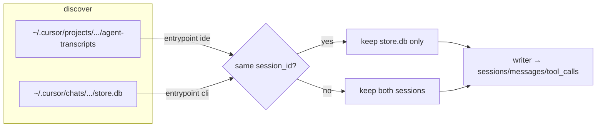

# Task: cursor-cli-and-entrypoint-ingest

* Task ID: cursor-cli-and-entrypoint-ingest
* Complexity: Level 3
* Type: feature

Ingest Cursor Agent CLI chats from `~/.cursor/chats/**/store.db` under `harness='cursor'`, add `sessions.entrypoint` (Claude passthrough + Cursor synthesized `cli`/`ide`), and prefer `store.db` when the same Cursor `session_id` also appears under `agent-transcripts`. No dashboard UI. Linux roots only.

## Pinned Info

### Dual Cursor sources → one harness row

Shows discovery from two Cursor roots, collision preference, and `entrypoint` stamping — the load-bearing shape of the feature.

## Component Analysis

### Affected Components

- **Schema / migrations** (`skills/sr-search/src/stockroom/migrations/`): add nullable `sessions.entrypoint`; golden schema snapshot + `test_schema_0008.py`
- **Ingest model** (`ingest/model.py`): `NormalizedSession.entrypoint: str | None`
- **Writer** (`ingest/writer.py`): persist `entrypoint` on INSERT
- **Claude parser** (`ingest/claude.py`): first-seen native `entrypoint` from JSONL records
- **Cursor IDE parser** (`ingest/cursor.py`): stamp `entrypoint='ide'`
- **Cursor CLI parser** (new `ingest/cursor_chats.py` or similar): ordered root-hash walk of `store.db` → `NormalizedSession` (see creative)
- **Sources / discovery** (`ingest/sources.py`): `cursor_chats_root()`, discover `store.db` sessions; separate `_sync_state` `source_root`
- **Orchestrator** (`ingest/__init__.py`): run chats discovery+watermark; exclude agent-transcript sessions whose `session_id` is covered by a chats store; wire parse path by source kind
- **Docs / skills**: `docs/user-guide/ingest.md`, sr-query schema blurb / system-model if they list `sessions` columns
- **Dashboard**: unchanged (explicit non-goal)

### Cross-Module Dependencies

- sources → orchestrator → parser → model → writer → DuckDB
- Collision set built from chats discovery before filtering transcript discovery (same harness ingest pass or ordered sub-passes)
- `_sync_state` already keys `(harness, source_root)` — chats root gets its own watermark without schema change

### Boundary Changes

- Schema: `sessions.entrypoint TEXT NULL`
- Public warehouse contract: new optional column (additive)
- Env: optional `STOCKROOM_CURSOR_CHATS_ROOT` (mirror `STOCKROOM_CURSOR_ROOT`) for tests

### Invariants & Constraints

- Must preserve harness brands `cursor` / `claude` (no new harness string)
- Must not double-count `(harness, session_id)` across Cursor sources
- Must synthesize Cursor entrypoint from provenance only (no system-prompt heuristics)
- Must pass through Claude native `entrypoint` when present
- Must keep Linux default roots only (no WSL/Windows multi-home)
- Must follow TDD and existing migration “structural only, no backfill” pattern
- Must not change dashboard code in this task

## Open Questions

- [x] How to reconstruct ordered messages from Cursor CLI `store.db`? → Resolved: ordered root-hash walk (see `memory-bank/active/creative/creative-cursor-cli-store-parse.md`)
- None remaining — dual-root watermark + collision preference follow existing `_sync_state` / writer patterns

## Test Plan (TDD)

### Behaviors to Verify

- Migration adds `sessions.entrypoint` (NULL-able); prior rows remain NULL until re-ingest
- Writer persists `entrypoint` on a `NormalizedSession`
- Claude parser: record with `entrypoint: "cli"` / `"claude-desktop"` → session.entrypoint set; missing → None
- Cursor IDE parser: `entrypoint == "ide"`
- Cursor CLI parser: fixture `store.db` → session_id from agentId/dir; entrypoint `cli`; user/assistant ordinals in root order; tool-call args captured; no tool-result rows; reasoning omitted; title from meta.name
- Discovery: finds `store.db` under chats root; watermark independent of projects root
- Orchestrator collision: same id in chats + transcripts → one write; source_path is the store.db; entrypoint `cli`
- Orchestrator non-collision: transcript-only stays `ide`; chats-only ingested as `cli`
- cwd best-effort from Workspace Path in user_info when present

### Edge Cases

- Empty / meta-only store.db → session with zero messages (or skip — prefer empty messages, still upsert session)
- Corrupt / non-JSON leaf in root chain → skip leaf, continue
- Missing `latestRootBlobId` → no messages / safe empty
- Claude records with unknown entrypoint string → store raw string
- Subagents: CLI chats have no subagent_paths in v1 (none discovered)

### Test Infrastructure

- Framework: pytest under `skills/sr-search/tests/`
- Conventions: `test_schema_NNNN.py`, `test_ingest_*.py`, fixtures under `tests/fixtures/`
- New test files: `test_schema_0008.py`, `test_ingest_cursor_chats.py`; extend `test_ingest_claude.py`, `test_ingest_cursor.py`, `test_ingest_sources.py`, `test_ingest_writer.py`, orchestrator/integration as needed
- Fixture: minimal synthetic or trimmed real `store.db` under `tests/fixtures/ingest/cursor_chats/`

### Integration Tests

- End-to-end ingest over a temp tree with both a chats store and a same-id transcript → single warehouse session
- Claude fixture JSONL with `entrypoint: claude-desktop` round-trips column

## Implementation Plan

1. **Schema 0008** — TDD: failing schema test → `0008_entrypoint.sql` + golden snapshot update
    - Files: `migrations/0008_entrypoint.sql`, `tests/test_schema_0008.py`, `tests/fixtures/schema/*`
    - Changes: `ALTER TABLE sessions ADD COLUMN entrypoint TEXT;`
2. **Model + writer** — TDD writer asserts column
    - Files: `ingest/model.py`, `ingest/writer.py`, `tests/test_ingest_writer.py`
    - Changes: field + INSERT list
3. **Claude entrypoint passthrough** — TDD parser
    - Files: `ingest/claude.py`, `tests/test_ingest_claude.py`, fixtures as needed
    - Changes: capture first-seen `entrypoint` on session (same pattern as cwd/version)
4. **Cursor IDE entrypoint='ide'** — TDD
    - Files: `ingest/cursor.py`, `tests/test_ingest_cursor.py`
5. **Cursor CLI store.db parser** — TDD against fixture (creative: root-hash walk)
    - Files: new `ingest/cursor_chats.py`, `tests/test_ingest_cursor_chats.py`, `tests/fixtures/ingest/cursor_chats/`
    - Changes: parse meta + ordered blobs → `NormalizedSession` (`entrypoint='cli'`)
6. **Discovery of chats root** — TDD
    - Files: `ingest/sources.py`, `tests/test_ingest_sources.py`
    - Changes: `CURSOR_CHATS_ROOT_ENV_VAR`, `cursor_chats_root()`, `_discover_cursor_chats()`, surface via discover API or dedicated function used by orchestrator
7. **Orchestrator: dual Cursor roots + collision preference** — TDD
    - Files: `ingest/__init__.py`, integration tests
    - Changes: ingest chats with its `source_root` watermark; build id set; filter transcript discoveries; parse via correct parser; stamp project_id (hash dir) / cwd recovery
8. **Docs** — update ingest user guide + any schema column lists in sr-query skill/cookbook intro
    - Files: `docs/user-guide/ingest.md`, skill schema blurb if present
9. **Verification** — full `skills/sr-search` test suite; manual `stockroom ingest --full` smoke optional

## Technology Validation

No new technology - validation not required (stdlib `sqlite3` + existing DuckDB/ingest stack).

## Challenges & Mitigations

- **Root blob layout drift**: pin fixture(s); parser only requires repeated 32-byte length-delimited fields — fail soft (empty messages) rather than crash ingest
- **Collision filter ordering**: compute chats id set before selecting/writing transcripts; never rely on write-order races
- **cwd for chats**: extract Workspace Path from user_info; leave NULL if absent (honest); `workspace_key` follows existing helper when cwd present
- **Flat agent-transcripts** (same id, not discovered today): out of scope; collision rule still correct when nested transcript exists
- **Backfill**: structural migration only; operators need `--full` for IDE `ide` + Claude entrypoint on old rows — document in ingest.md

## Pre-Mortem

- **Wrong premise: root is not a flat hash list on newer CLI builds** → Plan response: parser treated as best-effort; tests fail on fixture update; add alternate walk only if real samples demand it (already covered by Challenge “layout drift”)
- **Accidentally create harness=`cursor-cli`** → Strengthen invariant in plan/tests: harness string must remain `cursor`
- **Double-count via two watermarks writing same id** → Collision filter is mandatory before transcript write; integration test is the gate
- **Scope creep into dashboard / Windows roots** → Explicit non-goals; preflight should reject plan drift

## Status

- [x] Component analysis complete
- [x] Open questions resolved
- [x] Test planning complete (TDD)
- [x] Implementation plan complete
- [x] Technology validation complete
- [x] Pre-Mortem complete
- [ ] Preflight
- [ ] Build
- [ ] QA
