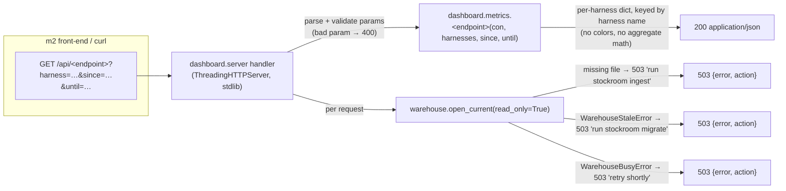

# Task: p4-dashboard / m1 — Dashboard metrics API server

* Task ID: p4-dashboard-m1
* Complexity: Level 3
* Type: feature

A new `stockroom.dashboard` package in the engine serving the dashboard spec's per-harness JSON endpoints (overview, trends, projects, tools, models, efficiency, sessions, wrapped) read-only on port 6767, with repeatable `?harness=` filters and optional `?since=`/`?until=` windows (spec defaults), a non-migrating open path with typed refusal, static-file serving, and port-probe idempotent startup. Plus the two substrate changes the creative phase settled: migration `0004` (`sessions.source_mtime`) and the `warehouse.open_current()` chokepoint variant.

## Pinned Info

### Request flow and refusal mapping

Pinned because every endpoint shares this path — the per-request open, the refusal mapping, and the mode-agnostic per-harness payload are the plan's load-bearing seams.

### Session activity time

Every windowed metric uses `COALESCE(started_at, source_mtime)` as the session's activity time (creative decision: `started_at` where the harness records wall-clock — Claude; `source_mtime` as the honest fallback — Cursor). Metrics scope to non-subagent sessions (`NOT is_subagent`); subagent metrics are a noted future Compare-mode addition (spec).

## Component Analysis

### Affected Components

- **`stockroom.migrations`** (`src/stockroom/migrations/`): forward-only migration home → gains `0004_observation_times.sql` (`ALTER TABLE sessions ADD COLUMN source_mtime TIMESTAMP; ALTER TABLE messages ADD COLUMN first_seen_at TIMESTAMP`); `0001`–`0003` and their snapshots stay frozen.
- **`stockroom.ingest`** (`model.py`, `__init__.py` orchestrator, `writer.py`): ETL → `NormalizedSession` gains `source_mtime`; the orchestrator stamps it from `DiscoveredSession.mtime` (parsers stay pure — no stat); subagents inherit the parent conversation's mtime; the writer inserts the new column **and owns the `first_seen_at` carry-forward** (read existing `(message_id, first_seen_at)` pairs before `_delete_session`; carried value if the `message_id` pre-existed, else seeded from the session's `source_mtime` — writer-internal, parsers and `NormalizedMessage` untouched).
- **`stockroom.warehouse`** (`warehouse.py`): the open chokepoint → gains `WarehouseStaleError` and `open_current(read_only=True)` (open with `migrate=False`, `ensure_vss`, raise typed staleness error when `current_version < head`). `open()` itself is untouched.
- **`stockroom.dashboard`** (new package: `__init__.py`, `metrics.py`, `server.py`, `__main__.py`, `static/index.html` placeholder): the milestone deliverable — metrics queries, HTTP server, CLI with port-probe idempotent startup and CLI-owned daemonization.
- **Tests** (`tests/`): new `test_schema_0004.py` + `fixtures/schema/0004_snapshot.json`, `test_dashboard_metrics.py`, `test_dashboard_server.py`, `test_dashboard_cli.py`; additions to `test_ingest_writer.py`, `test_ingest_orchestrator.py`, `test_warehouse_open.py`.

### Cross-Module Dependencies

- `dashboard.server` → `warehouse.open_current`: the only DB entry; per-request open (fresh-on-refresh is a product requirement; no held read connection to starve the nightly writer).
- `dashboard.server` → `dashboard.metrics`: handler resolves route → metrics function; metrics functions take `(con, harnesses, since, until)` and return JSON-ready dicts (con-injection: unit-testable against `migrated_con`, mirroring the engine convention).
- `dashboard.__main__` → `dashboard.server`: `--foreground` serves in-process; the default detached path re-execs `[sys.executable, -m stockroom.dashboard, --foreground, …]` via an injectable spawn seam.
- `ingest` orchestrator → `sources.DiscoveredSession.mtime`: already computed for the watermark; now also stamped onto sessions.
- m3 (future) → `dashboard.__main__.main(argv)`: the dispatcher registration lands in m3; m1 makes the module runnable (`python -m stockroom.dashboard`) with the standard `main(argv) -> int` shape.

### Boundary Changes

- **Schema:** migration `0004` adds `sessions.source_mtime TIMESTAMP` (uniform provenance meaning: mtime of the session's source transcript at last ingest) and `messages.first_seen_at TIMESTAMP` (uniform observation meaning: when stockroom first observed this message — operator-accepted amendment; `first_seen_at >=` true creation time, granularity = ingest cadence going forward, mtime-seeded at bootstrap so history keeps its spread). Cumulative shape pinned by new `0004_snapshot.json`; operator warehouses pick it up via the normal lazy gate on the next write-path open, values fill on the next ingest touch (`--full` for history).
- **Doctrine (operator-accepted):** `systemPatterns.md` reframed — the warehouse is an append-mostly archive; **rebuild is a degraded recovery path, not an equivalence claim**; no design may depend on future re-ingest of data the harness may prune. (`first_seen_at` exists in no source; orphaned rows already persist forever by construction.)
- **Warehouse public API:** `open_current()` + `WarehouseStaleError` added (new names beside `open()`; nothing existing changes).
- **HTTP API (new public surface):** the eight `/api/*` endpoint shapes per `planning/brainstorm/dashboard-spec.md` — server always returns per-harness data keyed by harness name; harness set enumerated from the DB; no colors, no aggregate math server-side.

### Invariants & Constraints

- Read-only over the warehouse: every dashboard DB touch is `open_current(read_only=True)`; no dashboard write path, ever.
- Non-migrating: the dashboard never runs the migration gate (structural, via `open_current`); refusals name the next action (errmsg ratchet).
- Mode-agnostic, harness-open endpoints: per-harness payloads keyed by name; `SELECT DISTINCT harness`, never hard-coded; colors are m2's client-side concern.
- Port 6767 default; fully offline (stdlib server, no CDN, no network).
- Averages never averaged-of-averages: endpoints return numerator + denominator (`n`) where the client must re-weight.
- Test ROI discipline (operator): unit-test our own logic only (probe decision, URL printing, argument handling, refusal paths, metrics math); daemonization/detach mechanics get manual smoke QA.
- Test-first for all Python; green `make ci` (incl. REUSE) at milestone end.

## Open Questions

- [x] **Cursor sessions have no time data — how do time-windowed metrics get a session time?** → Resolved: migration `0004` adds uniform provenance column `sessions.source_mtime`; dashboard derives activity time as `COALESCE(started_at, source_mtime)`. (see `memory-bank/active/creative/creative-dashboard-session-time-grain.md`)
- [x] **Non-migrating dashboard open path — where do the gate bypass and typed refusal live?** → Resolved: `warehouse.open_current(read_only=True)` chokepoint variant + typed `WarehouseStaleError`; dashboard maps missing/stale/busy to HTTP 503 `{"error", "action"}`. (see `memory-bank/active/creative/creative-dashboard-nonmigrating-open.md`)

## Design Decisions (plan-level)

- **Server stack (the roadmap's build-time pick): stdlib `http.server.ThreadingHTTPServer`** + a routing handler. Zero new locked deps (supply-chain posture), matches the spec's "Python, no external deps, KISS" and the prior art's shape. Threading variant so a slow query can't wedge static-asset serving; each request opens its own connection (no cross-thread sharing).
- **Windows:** `?since=`/`?until=` accept ISO-8601 dates/datetimes; `since` inclusive, `until` exclusive. Defaults per endpoint (spec): overview 30d (prev window = equal-length interval immediately preceding `since`), trends daily 14d + weekly 12w, projects/tools/models/efficiency 30d, sessions no window (recent-N, `?limit=` default 50), wrapped all-time and unaffected by `?harness=`.
- **Model grain:** session grain (spec recommendation) — a session "used" model M if M ∈ its messages' `model` values (Claude) or its `models[]` array (Cursor); union view via one SQL per grain, combined.
- **Write/read tool sets:** module constants in `metrics.py` (write: `Write`, `StrReplace`, `Edit`, `ApplyPatch`, `Delete`, `EditNotebook`; read: `Read`, `ReadFile`, `Grep`, `Glob`, `ListDir`, `ReadLints`, `rg`, `SemanticSearch`); everything else (Shell, Task, MCP, …) is neither. Tunable constants, documented in the module docstring.
- **Efficiency buckets:** by kept-message count — abandoned ≤ 2, short 3–10, medium 11–40, long > 40. First-prompt buckets by ordinal-0 user-message length — short < 100 chars, medium 100–500, detailed > 500; returns `avg_msgs` + `n` per harness for client re-weighting. Constants, documented.
- **Wrapped fields** (mockup + spec): totals (sessions, messages, span), distinct projects, `busiest_harness {name, pct}`, best streak (consecutive active days + range), marathon session (max msgs; project, harness), peak hour (mode of activity-hour + count), `top_tool {name, calls}` (the "Your Type" persona mapping is m2 client-side).
- **Sessions endpoint fields:** `started` (activity time), `harness`, `project_name` (`cwd` basename, else `project_id`), `msgs`, `model` (message-grain mode for Claude / first of `models[]` for Cursor, else NULL), `prompt` (ordinal-0 user text, display-truncated via `stockroom.truncate.truncate_cell(…, "snippet")` — read-time only).
- **Overview extras:** `last_sync` = `MAX(updated_at) FROM _sync_state`; `distinct_projects` server-side rollup (spec exception — projects can't be summed).
- **Harness enumeration is all-time, not window-scoped** (preflight): the active harness set is `SELECT DISTINCT harness FROM sessions` over the whole table; a harness idle within the requested window still appears in `overview.per_harness` with zeroed counts, so the m2 selector never loses an installed harness to a quiet fortnight.
- **`?limit` is capped** (preflight): sessions endpoint clamps `limit` to 500 (bad/negative → 400) so a single request can't flood the response.
- **Idempotent startup:** probe = TCP connect to `127.0.0.1:port`; success → print URL, exit 0. Otherwise spawn the detached foreground child and print the URL. The OS port bind is the mutex: a child losing the bind race (`EADDRINUSE`) exits 0 quietly. No lockfile.
- **Static serving:** files from the packaged `stockroom/dashboard/static/` dir (`/` → `index.html`); resolved paths must stay inside the static root (traversal guard); m1 ships a one-line placeholder `index.html` (m2 replaces it).

## Test Plan (TDD)

### Behaviors to Verify

Substrate:

- Migration `0004` applied via the real chain → `sessions.source_mtime` and `messages.first_seen_at` exist; cumulative snapshot matches `0004_snapshot.json`; `0001`–`0003` snapshots unchanged.
- Full ingest over fixtures → every session row's `source_mtime` equals its source file's statted mtime (dynamic comparison; golden columns unchanged — both new columns are machine-dependent like the watermark); subagent rows carry the parent conversation file's mtime.
- Writer inserts `source_mtime` (unit: write one `NormalizedSession` with a set value → column round-trips).
- `first_seen_at` carry-forward (all writer-unit, against `migrated_con`):
  - First write of a session → every message's `first_seen_at` equals the session's `source_mtime` (bootstrap seeding, incl. Claude sessions — the column is harness-uniform).
  - Re-write of the same session with one appended message and a newer `source_mtime` → pre-existing `message_id`s keep their original `first_seen_at`; only the new message gets the new value (the never-older promise).
  - Re-write with unchanged content → all `first_seen_at` values unchanged (idempotent; `--full` safety is this same path via the orchestrator).
- `open_current` on a current warehouse → returns a read-only connection (write attempt rejected by DuckDB); on a behind-head warehouse → raises `WarehouseStaleError` naming `stockroom migrate`, **without migrating** (version stays behind afterward — the anti-gate assertion).

Metrics (all against `migrated_con` + a seeding helper; all return per-harness dicts keyed by harness name):

- `overview`: per-harness sessions/messages/projects for the window + prev window; `distinct_projects` counts a project touched by two harnesses once; `last_sync` from `_sync_state`; empty warehouse → zeroed shape, no error.
- `trends`: daily sessions per harness over the window (missing days zero-filled, day keys ISO); weekly writes/reads counted from the tool sets, unknown tools in neither.
- `projects`: top-N by total sessions across selected harnesses; each harness's count per project; ordering deterministic.
- `models`: session-grain union — a Claude session with model M in messages counts once; a Cursor session with M in `models[]` counts once; a session using two models counts under both.
- `efficiency`: sessions land in the right message-count bucket (boundary values: 2 → abandoned, 3 → short, 10 → short, 11 → medium, 40 → medium, 41 → long); `first_prompt` buckets by ordinal-0 user length and returns `avg_msgs` + `n` per harness.
- `sessions`: newest-first by activity time, respects `limit`, includes harness/project_name/msgs/model/truncated prompt; subagent sessions excluded.
- `wrapped`: totals, busiest harness pct, streak over synthetic dates, marathon, peak hour, top tool; ignores harness filter.
- Cross-cutting: `?harness=` filtering (single, repeated, unknown-harness value → empty series, not an error); `since`/`until` window edges (inclusive/exclusive); a Cursor session (NULL `started_at`) appears in windowed output via `source_mtime`; subagent exclusion.

Server (in-process `ThreadingHTTPServer` on port 0 — testing our routing/serialization logic):

- Each `/api/*` route returns 200 + `application/json` with the endpoint's shape; unknown `/api/x` → 404 JSON.
- Malformed `since`/`until`/`limit` → 400 JSON naming the parameter.
- Missing warehouse → 503 `{"error", "action": …ingest…}`; stale warehouse → 503 `{…migrate…}` (real behind-head `STOCKROOM_HOME`); shape stable across all three refusals.
- `/` serves `static/index.html`; a traversal path (`/../…`) refuses (404), never escapes the static root.

CLI (probe/spawn seams injected; no real daemon in tests):

- Port already serving → prints `http://127.0.0.1:<port>/`, exit 0, spawn seam not called.
- Port free → spawn seam called with the foreground re-exec argv; URL printed; exit 0.
- `--foreground` → serves in-process (seam not called); `--port` respected in probe, spawn argv, and URL.
- Refusal parity: missing warehouse at startup does **not** prevent serving (server starts; endpoints refuse per request) — the hook must never error.

### Test Infrastructure

- Framework: pytest (`skills/sr-search/pyproject.toml`), run via `make test`.
- Test location: `skills/sr-search/tests/`.
- Conventions: `con`-injection against `migrated_con`; env isolation via `warehouse_home`/`STOCKROOM_HOME`; injectable seams for external effects (the `schedule`/`doctor` precedent); snapshot discipline for schema.
- New test files: `test_schema_0004.py`, `test_dashboard_metrics.py`, `test_dashboard_server.py`, `test_dashboard_cli.py`; new fixture `fixtures/schema/0004_snapshot.json`; a dashboard seeding helper (module-level in `test_dashboard_metrics.py`) inserting controlled sessions/messages/tool_calls.

### Integration Tests

- `test_dashboard_server.py`: real HTTP round-trip (urllib) → handler → `open_current` → metrics over a real ingested-fixture warehouse in a tmp `STOCKROOM_HOME` (the ingest→serve loop, the m1 "done" proof).
- `test_ingest_orchestrator.py` addition: full-chain ingest → `source_mtime` populated (writer + orchestrator + migration together).

## Implementation Plan

Every step is one TDD cycle and its sub-steps are **ordered**: (a) stub interfaces, (b) write the tests, (c) run them and see them fail, (d) implement to green. Never start (d) before (c).

1. [x] **Migration `0004`** (substrate, fewest dependencies)
    - Files: `src/stockroom/migrations/0004_observation_times.sql`, `tests/test_schema_0004.py`, `tests/fixtures/schema/0004_snapshot.json`
    - TDD order: (a) write `test_schema_0004.py` mirroring `test_schema_0003.py` (chain-apply through `0004`, both-columns-present assertion, cumulative snapshot vs `0004_snapshot.json`) → (b) run: fails (no migration file) → (c) write the migration SQL (`ALTER TABLE sessions ADD COLUMN source_mtime TIMESTAMP; ALTER TABLE messages ADD COLUMN first_seen_at TIMESTAMP` + uniform-meaning doc comments: provenance mtime / first-observation time) → (d) regenerate golden via the test's own helper (`STOCKROOM_UPDATE_SCHEMA_GOLDEN=1`), review the diff, re-run green. `0001`–`0003` snapshots frozen.
    - Creative ref: `creative-dashboard-session-time-grain.md` (incl. the operator-accepted amendment)
2. [x] **Ingest populates `source_mtime` + `first_seen_at` carry-forward**
    - Files: `src/stockroom/ingest/model.py`, `src/stockroom/ingest/__init__.py`, `src/stockroom/ingest/writer.py`, `tests/test_ingest_writer.py`, `tests/test_ingest_orchestrator.py`
    - TDD order: (a) add the `NormalizedSession.source_mtime: datetime | None = None` field (interface stub; `NormalizedMessage` untouched — carry-forward is writer-internal) → (b) write the failing tests: writer round-trip of a set `source_mtime`; the three carry-forward behaviors (bootstrap seeding from `source_mtime`, append keeps old + stamps new, unchanged re-write idempotent); orchestrator full-ingest `source_mtime == stat().st_mtime` per session incl. subagents-inherit-parent → (c) run: fail → (d) implement: orchestrator stamps from `DiscoveredSession.mtime` in `_parse_discovered`; writer reads existing `(message_id, first_seen_at)` pairs before `_delete_session` and inserts both columns (carried value or `source_mtime` seed). Golden dump columns untouched (machine-dependent values stay out); ingest docstring documents the retention contract (orphaned rows persist; carry-forward survives `--full`).
3. [x] **`warehouse.open_current` + `WarehouseStaleError`**
    - Files: `src/stockroom/warehouse.py`, `tests/test_warehouse_open.py`
    - TDD order: (a) stub `WarehouseStaleError` + `open_current(read_only=True, **backoff)` with documented signature, empty body → (b) write failing tests: current warehouse → usable RO connection (write rejected); behind-head warehouse → raises `WarehouseStaleError` naming `stockroom migrate` AND version stays behind afterward (anti-gate assertion) → (c) fail → (d) implement: path → `_open_with_backoff` → `ensure_vss` → version check → return or close-and-raise.
    - Creative ref: `creative-dashboard-nonmigrating-open.md`
4. [x] **`dashboard.metrics` — window/filter plumbing + overview + trends**
    - Files: `src/stockroom/dashboard/__init__.py`, `src/stockroom/dashboard/metrics.py`, `tests/test_dashboard_metrics.py`
    - TDD order: (a) stub the module: `parse_window`, harness-filter helper, activity-time SQL constant, `WRITE_TOOLS`/`READ_TOOLS`, `overview()`, `trends()`, and the `ENDPOINTS` registry (name → callable — the single routing source the server and the tests share) → (b) write failing tests (window parsing/defaults/edges, seeded overview incl. `distinct_projects`/`last_sync`/prev-window, trends zero-fill + tool-set classification) → (c) fail → (d) implement to green.
5. [x] **`dashboard.metrics` — projects, tools, models**
    - Files: `src/stockroom/dashboard/metrics.py`, `tests/test_dashboard_metrics.py`
    - TDD order: (a) stub `projects()`, `tools()`, `models()` into the registry → (b) failing tests (top-N ordering, per-harness counts, session-grain model union across both grain columns) → (c) fail → (d) implement.
6. [x] **`dashboard.metrics` — efficiency, sessions, wrapped**
    - Files: `src/stockroom/dashboard/metrics.py`, `tests/test_dashboard_metrics.py`
    - TDD order: (a) stub `efficiency()`, `sessions()`, `wrapped()` + bucket constants → (b) failing tests (bucket boundaries, first-prompt `avg_msgs`+`n`, recent-N ordering/truncation/subagent-exclusion, wrapped rollups incl. streak/peak-hour/marathon/top-tool and selector-immunity) → (c) fail → (d) implement (`sessions()` prompt truncation via `stockroom.truncate.truncate_cell`).
7. [x] **`dashboard.server` — routing, refusals, static**
    - Files: `src/stockroom/dashboard/server.py`, `src/stockroom/dashboard/static/index.html` (placeholder), `tests/test_dashboard_server.py`
    - TDD order: (a) stub `serve(port, …) -> HTTPServer` + handler class routing from `metrics.ENDPOINTS` → (b) failing tests over a real in-process server on port 0 (per-endpoint 200 JSON, unknown-route 404, bad-param 400, the three 503 refusals, static `/` + traversal guard, loopback-only bind, unexpected-exception guard → clean 500 JSON) → (c) fail → (d) implement: `ThreadingHTTPServer` bound to **127.0.0.1 only** (never `0.0.0.0` — local read surface, not a network service), per-request `open_current` with short (~2s) backoff timeout, ISO-date JSON serialization, and a broad per-request guard so no traceback ever leaks as a response body.
8. **`dashboard.__main__` — CLI: probe, URL, detach**
    - Files: `src/stockroom/dashboard/__main__.py`, `tests/test_dashboard_cli.py`
    - TDD order: (a) stub `main(argv) -> int`, `probe(port)`, the injectable spawn seam → (b) failing tests (already-running → URL + exit 0 + no spawn; free port → spawn argv `[sys.executable, -m stockroom.dashboard, --foreground, --port N]` + URL; `--port` respected everywhere; `--foreground` binds in-process; EADDRINUSE → URL + exit 0) → (c) fail → (d) implement (`start_new_session=True`, output to devnull). Detach mechanics themselves: manual smoke in QA (operator testing constraint).
    - Creative ref: advisory 6 (CLI-owned daemonization)
9. **Full-suite gate + docs touch-up**
    - Files: (all above), `skills/sr-search/src/stockroom/dashboard/*` docstrings, `skills/sr-query/SKILL.md`
    - Changes: `make ci` green (format, lint, test, reuse — new `.py` files are AGPL by REUSE.toml's re-assert; the placeholder `index.html` inherits `skills/**` PPL-S, which lints clean); module docstrings in the house narrative style; **update `sr-query`'s schema map** (its "as of migrations 0001–0003" header becomes "0001–0004"; the `sessions` line gains `source_mtime`, the `messages` line gains `first_seen_at` — preflight finding + amendment). No README/roadmap edits in m1 (roadmap port correction is m3 scope). (`systemPatterns.md` doctrine reframe already landed at plan time — operator-accepted.)

## Technology Validation

No new locked dependencies. The server is stdlib `http.server` (the roadmap's deferred "framework pick", resolved here per the spec's no-external-deps/KISS directive and the locked-project supply-chain posture); everything else rides on already-locked `duckdb`. Validation not required beyond the test suite itself.

## Challenges & Mitigations

- **Golden snapshot vs. machine-dependent mtimes:** neither `source_mtime` nor `first_seen_at` enters `expected_rows.json` (the dump has an explicit column list); correctness is asserted dynamically (`== stat().st_mtime` of the fixture file; carry-forward via controlled writer-unit sequences), the watermark's existing treatment.
- **Operator warehouse goes behind-head when `0004` lands:** by design — the dashboard refuses with "run `stockroom migrate`"; the nightly ingest (write path) migrates it transparently. QA smoke covers the refusal + recovery.
- **Nightly writer holds the DB while a request arrives:** DuckDB RW-exclusive lock → `_open_with_backoff` would wait 30s per request. Mitigation: `open_current` calls pass a short timeout (~2s) so requests degrade quickly to the busy 503.
- **Windowed prev-period semantics with custom `since`/`until`:** define prev = equal-length interval ending at `since` (documented in `metrics.py`); tested explicitly.
- **Port-probe/bind race (two session-start hooks at once):** the bind is the mutex; the losing child treats `EADDRINUSE` as success-elsewhere and exits 0. No lockfile (operator decision).
- **Cursor `source_mtime` is last-activity-grained:** daily buckets date a Cursor session by its last write — acceptable for at-a-glance metrics, documented in the endpoint docstring. Message-grain attribution accrues in `first_seen_at` going forward (ingest-cadence granularity) as the recap substrate; v1 panels stay session-grain per the spec.
- **Positional identity vs. carry-forward:** `message_id` is ordinal-derived, so a history-*rewriting* (non-appending) harness edit would shift ordinals and misattribute carried `first_seen_at` values. Accepted soft spot (operator): Cursor transcripts are append-only in practice; the value remains an upper bound on staleness, never a fabricated authorship claim.
- **ThreadingHTTPServer concurrency:** one DuckDB connection per request, never shared across threads; read-only connections coexist (shared lock).

## Status

- [x] Component analysis complete
- [x] Open questions resolved
- [x] Test planning complete (TDD)
- [x] Implementation plan complete
- [x] Technology validation complete
- [ ] Preflight
- [ ] Build
- [ ] QA

---

## Reference: L4 Preflight Findings (milestone-list validation, 2026-07-09)

Status: **PASS with advisories** — recorded for the relevant sub-runs; m1-relevant items are folded into the plan above.

1. **[m1 — addressed above] Hook-launched dashboard vs. the lazy migration gate.** Resolved via `open_current` (creative doc).
2. **[m2 — required scope] REUSE annotation for vendored assets.** `REUSE.toml`'s code re-assert list doesn't cover `*.js`/`*.html`/`*.css`; vendored Chart.js and the front-end need explicit annotations.
3. **[m3 — noted] Hook payload shape.** Dashboard launch chains after `shim rectify` via on-path `stockroom dashboard`; `test_skill_hygiene.py` extends to `sr-dashboard`; port corrections in `planning/roadmap.md` + `planning/tech-brief.md` (3143 → 6767).
4. **[all — caution] Clean-room posture toward `cursor-warehouse`.** Use for shape only; metrics SQL written from `dashboard-spec.md` + stockroom's own schema (honored: this plan's SQL is spec-derived; the reference was not consulted).
5. **[m1 — ACCEPTED, in plan] Windowed endpoints as the recap substrate** (`?since=`/`?until=`, spec defaults).
6. **[m1/m3 — ACCEPTED, in plan] Daemonization lives in the dashboard CLI**; test only our own logic; flaky-by-nature behavior → manual smoke QA.
7. **[m3 — ACCEPTED] One combined session-start hook per harness**; the OS port bind is the mutex.
8. **[m2 — CONFIRMED] REUSE carve-outs for vendored assets**; Chart.js keeps upstream MIT identity.
