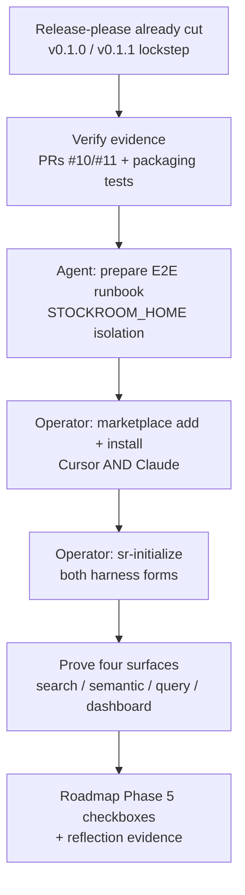

# Task: p5-m3-release-e2e-spine

* Task ID: p5-m3-release-e2e-spine
* Complexity: Level 3
* Type: feature (distribution proof)

Exercise release-please version sync into both plugin manifests, then prove the full spine on a clean machine: marketplace add → install → `sr-initialize` → `sr-search` / `sr-semantic` / `sr-query` / `sr-dashboard` against real Cursor and Claude Code history.

## Pinned Info

### m3 proof spine

Release half is already landed; remaining work is verify + operator-driven marketplace E2E under an isolated warehouse home.

## Component Analysis

### Affected Components
- **release-please / plugin manifests**: Already sync `$.version` into `.cursor-plugin/plugin.json` and `.claude-plugin/plugin.json` via `extra-files`. m3 verifies live cuts (v0.1.0, v0.1.1) — no config change expected unless lockstep is broken.
- **Packaging tests** (`skills/sr-search/tests/test_packaging.py`): Already assert config presence, version lockstep, and `extra-files` targets. Remain the automated regression bar; no new product tests for UI marketplace install.
- **Marketplace catalog** (`txrk9-agent-plugins`): PR #2 merged — stockroom in both Cursor and Claude `marketplace.json`. Prerequisite for E2E; no further catalog edits in m3.
- **Install/usage docs** (`README.md`): Already document marketplace path + local/dev loaders (m1). Touch only if E2E reveals a factual error.
- **Onboarding / surfaces** (`sr-initialize`, `sr-search`, `sr-semantic`, `sr-query`, `sr-dashboard`): Exercised as-is under isolated `STOCKROOM_HOME`; no engine redesign.
- **Roadmap** (`planning/roadmap.md`): Phase 5 checkboxes still open for the release+E2E milestone — update when proof lands.
- **Memory bank**: Creative decision + E2E evidence for reflect/archive; persistent files only if E2E teaches a lasting pattern.

### Cross-Module Dependencies
- Marketplace catalog (merged) → harness UI install → plugin root → `sr-initialize` resolves `APP_DIR` → on-path `stockroom` → warehouse under `STOCKROOM_HOME` / XDG → four surfaces read that warehouse.
- Release-please → tagged source at GitHub → marketplace `source.repo` points at that repo (no version pin in catalog).

### Boundary Changes
- None to public engine APIs or marketplace schema.
- Operational boundary: E2E uses a throwaway `STOCKROOM_HOME`; does not mutate the operator's default warehouse unless they choose to.

### Invariants & Constraints
- Dual-manifest, no-build; versioning in stockroom only; on-path engine invocation; both harnesses always; slobac + official docs as correctness bar; marketplace is a separate repo.

## Open Questions

- [x] **Clean-machine E2E methodology** → Resolved: same-host isolation via fresh `STOCKROOM_HOME` + marketplace reinstall (not local/dev loaders); operator-driven UI install; agent prepares runbook and verifies CLI outcomes. Release half = verify existing cuts, do not re-cut. (see `memory-bank/active/creative/creative-clean-machine-e2e.md`)

## Test Plan (TDD)

### Behaviors to Verify

- **Release lockstep (automated)**: packaging suite → both plugin manifests and `.release-please-manifest.json` share one version; `extra-files` targets both `plugin.json` paths.
- **Release evidence (ephemeral assert)**: GitHub releases `v0.1.0` / `v0.1.1` exist; release PR #11 touched both plugin manifests + manifest + CHANGELOG.
- **Marketplace prerequisite (ephemeral assert)**: `txrk9-agent-plugins` main catalogs include `stockroom` → `Texarkanine/stockroom` with no version field (both harnesses).
- **Clean warehouse (operator + agent)**: with `STOCKROOM_HOME` pointing at an empty dir → after `sr-initialize`, warehouse populates under that home (not the default share path).
- **Four surfaces (operator + agent)**: under that home, `stockroom search` / `semantic` / `query` / `dashboard` (or skill forms) succeed against real Cursor and Claude history.
- **Both harnesses (operator)**: marketplace install + skill invocation forms work in Cursor (`/sr-*`) and Claude (`/stockroom:sr-*`).

### Edge Cases

- Local/dev plugin still loaded → false "install" — runbook must uninstall/disable local loaders first.
- Default warehouse already populated → not a clean proof — require fresh `STOCKROOM_HOME`.
- Marketplace not yet visible in UI after merge → wait/refetch; do not fall back to `--plugin-dir` as the primary claim.
- Release lockstep broken → stop and fix packaging/release config before E2E.

### Test Infrastructure

- Framework: pytest under `skills/sr-search/tests/` (existing packaging tests)
- Conventions: packaging/contract tests for install artifacts; no CI pins on README prose (m1 lesson)
- New test files: **none** — marketplace UI and clean-machine spine are operator proofs, not unit tests
- Ephemeral asserts: shell/python one-shots during build (same pattern as m2), not committed

### Integration Tests

- No new automated integration suite. Cross-component proof is the operator E2E runbook + captured evidence.

## Implementation Plan

1. **Verify release-please exercise (already landed)**
    - Files: `.release-please-manifest.json`, `.cursor-plugin/plugin.json`, `.claude-plugin/plugin.json`, `skills/sr-search/tests/test_packaging.py`
    - Changes: Run packaging tests (must stay green). Ephemeral asserts: tags `v0.1.0`/`v0.1.1`, PR #11 file list includes both manifests. Document evidence in progress / later reflection. **Do not open a new release PR unless lockstep fails.**
    - Creative ref: `creative-clean-machine-e2e.md` (verify, don't re-cut)

2. **Confirm marketplace prerequisite**
    - Files: `txrk9-agent-plugins` `.cursor-plugin/marketplace.json`, `.claude-plugin/marketplace.json` (read-only on `main`)
    - Changes: Ephemeral assert stockroom entries present, no version pin. If missing on `main`, stop — m2 incomplete.

3. **Author operator E2E runbook**
    - Files: `memory-bank/active/e2e-clean-machine-runbook.md` (ephemeral; distilled into reflection/archive)
    - Changes: Ordered checklist — disable local/dev loads; add marketplace URL; install stockroom in Cursor and Claude; `export STOCKROOM_HOME=…` (empty dir); run initialize both harness forms; exercise four surfaces; capture outputs/URLs; note pass/fail per step.

4. **Execute E2E with operator**
    - Files: none in-repo until evidence captured
    - Changes: Operator performs UI steps; agent assists with CLI verification under `STOCKROOM_HOME` (`stockroom doctor`, query counts, surface smokes). Record evidence into the runbook (or a sibling evidence section).

5. **Close Phase 5 bookkeeping**
    - Files: `planning/roadmap.md` (Phase 5 checkboxes), memory-bank progress/tasks
    - Changes: Check off release flow + end-to-end install test / done-when criteria when proof is complete. Fix README only if E2E found a factual doc bug.

6. **No product code by default**
    - If E2E finds a real defect, fix under TDD in the owning component — that becomes a scoped repair inside this build, not a new milestone.

## Technology Validation

No new technology - validation not required. Uses existing release-please, marketplace, `STOCKROOM_HOME`, and on-path `stockroom`.

## Challenges & Mitigations

- **Marketplace UI not agent-automatable**: Mitigation — operator-driven runbook; agent owns prep + CLI verification only.
- **False clean from local plugin / default warehouse**: Mitigation — runbook requires disabling local loaders and a fresh `STOCKROOM_HOME`.
- **Release already done — risk of scope creep into another bump**: Mitigation — creative decision: verify existing cuts; re-cut only if lockstep broken.
- **E2E finds product bugs**: Mitigation — fix under normal TDD in-scope; do not invent a Phase 6.
- **Harness history missing on this host**: Mitigation — unlikely for the operator's box; if a harness has zero data, document which harness was proven and whether the other is blocked.

## Status

- [x] Component analysis complete
- [x] Open questions resolved
- [x] Test planning complete (TDD)
- [x] Implementation plan complete
- [x] Technology validation complete
- [ ] Preflight
- [ ] Build
- [ ] QA
