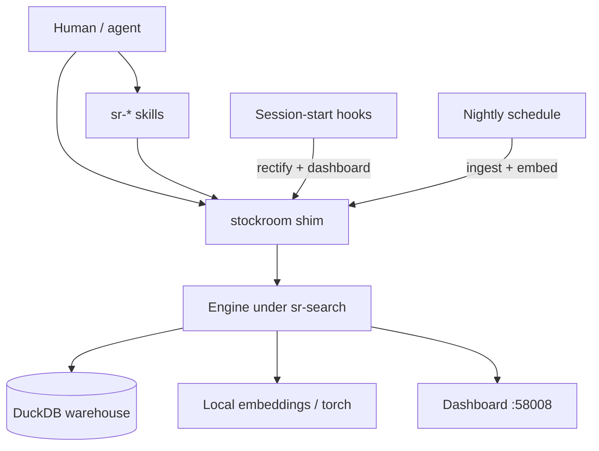

# Task: architecture-docs

* Task ID: architecture-docs
* Complexity: Level 3
* Type: documentation feature

Human Architecture docs section: systems-level mental model for advanced users/contributors (WHAT-first voice; Advanced deferred).

## Pinned Info

### Systems control flow

Primary map for `docs/architecture/index.md` — pieces and who invokes whom.

## Component Analysis

### Affected Components
- `docs/architecture/` — stub overview → systems atlas (`index` + thematic pages)
- `docs/architecture/.pages` — nav for thematic order
- `docs/.pages` — top-level already lists architecture; tweak only if needed
- Cross-links from Home / UG / Contributing / Advanced — light ownership pointers only
- Agent `skills/sr-search/references/system-model.md` — link, do not fork
- Maintainer `memory-bank/systemPatterns.md` — mention, do not mirror

### Cross-Module Dependencies
- Architecture → UG / Contributing / Advanced: outbound procedure links
- Architecture ← codebase / systemPatterns / system-model: synthesize WHAT accurately

### Boundary Changes
- Public docs IA under `docs/architecture/` (new pages)
- No product/runtime interface changes

### Invariants & Constraints
- WHAT-first; WHY only for unusual / Chesterton’s-fence designs
- Inclusion bar from scope creative; exclusions respected
- Advanced out of scope this task
- Docs must build (`make docs-build`)
- Seed topics covered at appropriate depth

## Open Questions

- [x] **Architecture scope & ownership** → Resolved: systems atlas with inclusion bar. See `memory-bank/active/creative/creative-architecture-scope-ownership.md`.
- [x] **Architecture page IA** → Resolved: overview + thematic clusters. See `memory-bank/active/creative/creative-architecture-page-ia.md`.

## Test Plan (TDD)

Docs-only feature: verification is content contracts + strict site build (no pytest for prose).

### Behaviors to Verify

- Reading Architecture index → sees audience framing, control-flow diagram, piece list, links into satellites and to agent system-model / other doc sections
- Reading packaging → understands engine-in-skill, lock hermeticity, torch-out-of-lock, shim `rectify`/`ensure-env` (WHAT + unusual WHY)
- Reading lifecycle → understands hook doctrine, why ingest is scheduled not session-start, dashboard hook launch / offline / torch-safe
- Reading warehouse → understands ETL/RO, truncation doctrine, identity, concurrency (`open`/`open_current`), ingest outlives sources, verify-don’t-invert
- Reading embeddings → understands ST/BGE/384, VSS/HNSW, staleness, search-surface split
- Seed topics from project brief → all present at correct depth
- Excluded topics → not dumped as recipes (torch heal steps, Make loops, CLI tables stay elsewhere)
- Voice → WHAT-first; no design-diary recounting
- `make docs-build` → succeeds strict

### Test Infrastructure

- Framework: properdocs strict build (`make docs-build`)
- Test location: n/a (content checklist in Build/QA; no new test files)
- Conventions: prior docs tasks used content checklist + `make docs-build`
- New test files: none

### Integration Tests

- Nav integration: `.pages` entries resolve; no broken internal links among Architecture pages and to UG/Contributing/Advanced/Home
- Cross-section ownership: spot-check that Architecture does not re-own Contributing Iteration / UG torch troubleshooting / Advanced CLI

## Implementation Plan

1. **Author the verification checklist (tests first)**
    - Files: `memory-bank/active/tasks.md` (Build checklist section)
    - Changes: Expand Behaviors into a page-by-page acceptance checklist of required claims/sections (seed + inventory topics). Checklist starts unchecked — the failing “tests.”
    - Creative ref: scope required-topic table + page contracts

2. **Stub Architecture pages and nav**
    - Files: `docs/architecture/index.md`, `packaging.md`, `lifecycle.md`, `warehouse.md`, `embeddings.md`, `.pages`
    - Changes: Create/overwrite stubs with H1 + section headings matching the checklist (empty bodies or one-line placeholders). Wire `.pages` nav order. No substantive prose yet.

3. **Fill overview (`index.md`)**
    - Files: `docs/architecture/index.md`
    - Changes: Audience; control-flow Mermaid; piece list; satellite links; “change surfaces” table (if you change X → read page Y); pointers to system-model / UG / Contributing / Advanced / licensing
    - Check off overview checklist items as claims land

4. **Fill packaging**
    - Files: `docs/architecture/packaging.md`
    - Changes: dual-manifest / run-in-place; engine in `sr-search`; lock hermeticity; torch out of lock; shim `rectify`/`ensure-env`; outbound procedure links
    - Check off packaging checklist items

5. **Fill lifecycle**
    - Files: `docs/architecture/lifecycle.md`
    - Changes: hook doctrine; scheduled ingest; dashboard hook launch / offline / torch-safe
    - Check off lifecycle checklist items

6. **Fill warehouse**
    - Files: `docs/architecture/warehouse.md`
    - Changes: ETL/RO; truncation; identity; concurrency; ingest outlives sources; verify-don’t-invert; UTC; migration chokepoint
    - Check off warehouse checklist items

7. **Fill embeddings**
    - Files: `docs/architecture/embeddings.md`
    - Changes: ST/BGE/384; VSS/HNSW; staleness; search-surface split; render note
    - Check off embeddings checklist items

8. **Light cross-links + strict build**
    - Files: optional Home / Contributing / Advanced index pointers; all Architecture pages
    - Changes: ensure entry points discover Architecture; run `make docs-build`; fix link/nav failures; confirm checklist fully checked and exclusions still hold

## Technology Validation

No new technology - validation not required (properdocs already in use).

## Challenges & Mitigations

- **Drifting into procedure dumps**: Mitigation — page contracts + exclusion table from scope creative; QA checklist item for recipe blocks.
- **Forking system-model / systemPatterns**: Mitigation — explicit audience pointers; paraphrase WHAT, link for agent compact form; do not paste MB sections.
- **Factual drift vs code**: Mitigation — ground claims in `systemPatterns`, `system-model`, hooks JSON, shim/torch modules before writing; prefer durable constraints over version-specific paths when possible.
- **Broken links after multi-page split**: Mitigation — `make docs-build --strict` + manual nav walk.
- **Stale Contributing path names in MB** (`local-workflow.md` / `development.md`): Out of scope unless Architecture links them — link current `preparation.md` / `iteration.md` only.

## Pre-Mortem

- **Architecture reads as a second Contributing guide**: Plan response — enforce page contracts; zero Make target tables; procedure links outbound only.
- **Readers bounce after index because satellites feel optional**: Plan response — index must frame satellites as the atlas body (“read these to load the model”), not optional appendices.
- **Topic inventory under-includes search-surface / concurrency because seed list dominated writing**: Plan response — Build checklist includes every required-topic row from scope creative, not only seeds.
- **Voice slips into design diary**: Plan response — QA voice pass; cut “we decided / we chose” phrasing.

## Status

- [x] Component analysis complete
- [x] Open questions resolved
- [x] Test planning complete (TDD)
- [x] Implementation plan complete
- [x] Technology validation complete
- [x] Pre-Mortem complete
- [x] Preflight — PASS (TDD ordering amended: checklist → stubs → fill → build; advisory: change-surfaces table on index)
- [ ] Build
- [ ] QA
