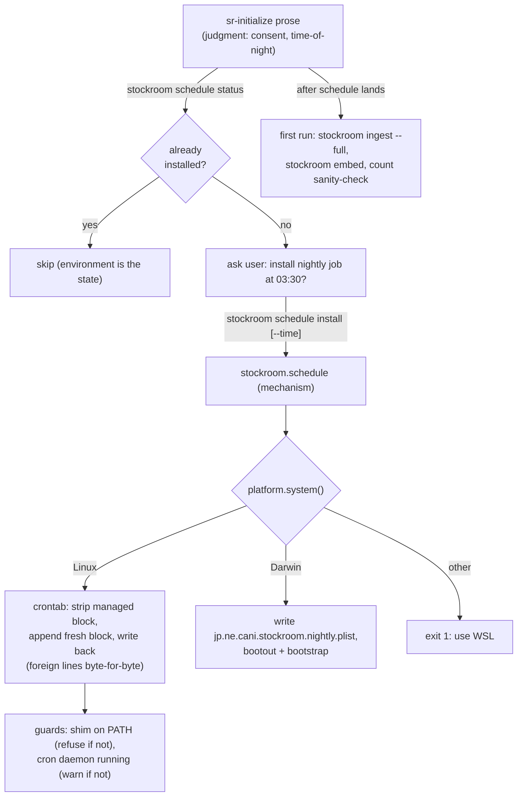

# Task: sr-initialize — scheduling and first run

* Task ID: p3-m4-sr-initialize-scheduling
* Complexity: Level 3
* Type: feature

Milestone m4 of `p3-onboarding-cli-scheduling`: nightly ingest + embed installed via cron (Linux/WSL) or launchd (macOS) with entries invoking the shim (`stockroom ingest` / `stockroom embed`), idempotent re-install semantics, followed by a first full ingest + embed leaving a populated, embedded, query-ready warehouse. Delivered as a new tested `stockroom.schedule` engine module (the dispatcher's eighth subcommand) plus the scheduling/first-run half of the `skills/sr-initialize/SKILL.md` prose.

## Pinned Info

### Scheduling install flow

Pinned because it shows the judgment-vs-mechanism boundary and the never-do guards every step must respect — the whole milestone hangs off this one flow.

## Component Analysis

### Affected Components

- `skills/sr-search/src/stockroom/schedule.py` (**new**): platform-dispatched scheduler-entry management — `install`/`status`/`remove` over cron (marker-delimited managed crontab block) and launchd (owned `jp.ne.cani.stockroom.nightly.plist`), shared payload renderer, install-time absolute `PATH=` resolution, flat CLI. All seams injectable: `crontab` runner, `launchctl` runner, platform `system`, `which` resolver, LaunchAgents dir, cron-daemon check.
- `stockroom.__main__` (`SUBCOMMANDS`): eighth row `schedule` → (`stockroom.schedule`, one-line summary).
- `skills/sr-initialize/SKILL.md`: the "What's next" stub is replaced by two real steps — Step 8 (scheduling: status re-probe → consent → install → relay warnings) and Step 9 (first run: `stockroom ingest --full`, `stockroom embed`, a `stockroom query` count sanity-check) — every example executed live before being written in.
- `README.md`: `schedule` added to the subcommand list (line ~78); the onboarding pointer sentence gains scheduling/first-run.
- `memory-bank/techContext.md` / `memory-bank/systemPatterns.md`: schedule module section; the scheduling application of the judgment-vs-mechanism split and the managed-block idempotency pattern.

### Cross-Module Dependencies

- `stockroom.schedule` → `stockroom.warehouse.home_dir()`: the nightly log lands at `<home>/logs/nightly.log`, `STOCKROOM_HOME`-aware (import is fine — duckdb is in the locked env; schedule is only ever run through uv).
- `stockroom.schedule` → the on-path shim (runtime, by name): entries invoke `stockroom ingest` / `stockroom embed`; install resolves the shim's and uv's dirs via `shutil.which` into the entry's `PATH=` prefix. Never an engine path.
- `stockroom.__main__` → `stockroom.schedule`: lazy import row, same as all seven existing rows.
- `sr-initialize` prose → `stockroom schedule` / `stockroom ingest` / `stockroom embed` / `stockroom query`: all post-shim steps go through the shim.

### Boundary Changes

- New public CLI surface: `stockroom schedule {install|status|remove} [--time HH:MM]` (default `03:30`).
- New rendered-out artifacts outside the repo: the managed crontab block / the LaunchAgents plist — both owned exclusively by `stockroom.schedule` (third artifact writer besides shim + hooks; each has exactly one tested owner).
- No schema, warehouse, or existing-module signature changes.

### Invariants & Constraints

- Entries invoke the shim, never a raw engine path (cross-milestone invariant #2).
- Never touch a crontab line we did not write; never leave two managed blocks; remove/re-install idempotent by construction.
- Never assume the scheduler's PATH — cron runs with `PATH=/usr/bin:/bin`; the entry carries its own absolute `PATH=` prefix inside a `/bin/sh -c` wrapper (a POSIX `PATH=` prefix cannot directly precede an `&&` list).
- Rendered cron lines contain no `%` (cron newline syntax).
- Errmsg ratchet: shim-not-on-PATH refuses naming the fix; daemon-not-running installs with a warning naming the fix; unsupported platform names WSL.
- Torch-safe contract untouched: schedule renders entries, it never syncs; the nightly job runs through the shim's `--no-sync` contract.
- The dispatcher owns all logic; run-in-place packaging holds; REUSE globs already cover `src/stockroom/*.py` and `tests/**`.

## Open Questions

- [x] **Q1: Scheduling logic surface and idempotent entry management.** → Resolved: new flat `stockroom.schedule` module (eighth subcommand, `install | status | remove`) — cron via a marker-delimited managed crontab block, launchd via an owned plist; entries invoke the shim by name with an install-time-resolved absolute `PATH=` prefix; judgment (consent, time-of-night, first run) stays in `sr-initialize` prose (see `memory-bank/active/creative/creative-scheduling-surface.md`).

## Test Plan (TDD)

### Behaviors to Verify

Payload & shared rendering:

- **B1** `render_payload()` → `date; stockroom ingest && stockroom embed` with `>> <home>/logs/nightly.log 2>&1` redirection, `STOCKROOM_HOME`-aware → contains no engine path and no `%` character (the `%`-guard is an explicit assertion, not incidental)
- **B2** `--time` validation: `03:30` default; `22:15` renders `15 22 * * *` / Hour=22,Minute=15; `9:5`, `24:00`, `abc` → clean error naming the `HH:MM` format, exit 2

Cron half (injected `crontab` runner + `which` + daemon check):

- **B3** install on an empty crontab (runner raises the "no crontab for user" failure → treated as empty) → written content is exactly the managed block (BEGIN/END markers, schedule line with absolute `PATH=` prefix from the injected `which` results, `/bin/sh -c` wrapper)
- **B4** install with pre-existing foreign lines → foreign lines preserved byte-for-byte, block appended
- **B5** install over an existing managed block (possibly with a different time) → old block stripped, exactly one fresh block in the result (idempotent re-install)
- **B6** install when `which("stockroom")` fails → refuses exit 1, stderr names binding the shim first (`sr-initialize` / `make shim`)
- **B7** install when the cron-daemon check reports not-running → still writes, report carries a warning naming the fix; daemon running → no warning (default check matches `cron` *or* `crond` — distro name variance; verified `cron` live on this machine)
- **B8** remove → strips the block, preserves foreign lines; remove when no block / no crontab → clean no-op exit 0
- **B9** status → "installed" + the schedule line when the block exists; "not installed" otherwise; on the cron platform also a `daemon: running|not running` fact line (facts only, the `doctor probe` convention — makes re-entry probing honest about a schedule that exists but cannot fire); always a `log: <home>/logs/nightly.log` fact line (operator gate decision: "where are the logs?" is answered by the same command that answers "is it installed?" — discoverability is structural, never memorized); exit 0 both ways

launchd half (injected `launchctl` runner + agents dir):

- **B10** install writes a valid plist (parsed back via `plistlib`): label `jp.ne.cani.stockroom.nightly`, `ProgramArguments` = `/bin/sh -c '<payload>'`, `EnvironmentVariables.PATH` absolute, `StartCalendarInterval` Hour/Minute, stdout/stderr → the nightly log; `launchctl` called bootout-then-bootstrap, bootout failure (not loaded) tolerated
- **B11** re-install → file rewritten, single plist (idempotent); remove → bootout + file deleted; remove when absent → clean no-op exit 0
- **B12** status reads the plist → installed (with interval) / not installed; same `log:` fact line as B9 (the log-path fact is platform-independent)
- **B13** shim-not-on-PATH refusal applies on Darwin too (shared guard, not per-platform)

Platform dispatch & CLI:

- **B14** unsupported `system` (e.g. `Windows`) → exit 1, stderr names WSL as the supported Windows path
- **B15** CLI (subprocess, `test_schedule_cli.py`): `schedule --help` exit 0 documenting the three actions + `--time`; invalid action exit 2; `status` against an injected-empty environment works through real argv parsing (env-var seams: `STOCKROOM_HOME`; cron runner faked via a stub `crontab` on PATH)
- **B16** dispatcher integration (`test_dispatcher_cli.py`): `schedule` added to the `SUBCOMMANDS` tuple + fingerprint (`--time`) — eighth-row extension, mechanical per the m3 insight

Log-dir behavior:

- **B17** install creates `<home>/logs/` if absent (so the 03:30 redirection cannot fail on a missing directory)

### Test Infrastructure

- Framework: pytest, configured in `skills/sr-search/pyproject.toml`; run via `make test` / `make ci`
- Test location: `skills/sr-search/tests/`
- Conventions: unit tests with injected seams (the `smi_runner`/`torch_importer` precedent from `test_doctor.py`); CLI tests as real subprocesses (`test_doctor_cli.py` / `test_query_cli.py` convention); dispatcher fingerprint table extension (`test_dispatcher_cli.py`)
- New test files: `tests/test_schedule.py` (B1–B14, B17), `tests/test_schedule_cli.py` (B15); extended: `tests/test_dispatcher_cli.py` (B16)

### Integration Tests

- B16 exercises dispatcher → `stockroom.schedule` lazy import + help forwarding end to end
- B15 exercises argv parsing → action dispatch through a real subprocess
- Full-flow scheduling + first run is live/artisanal (prose orchestration over tested units), per the project invariant — see step 6 of the implementation plan

## Implementation Plan

1. **Payload rendering + time validation** (`stockroom.schedule`, TDD red→green)
    - Files: `skills/sr-search/src/stockroom/schedule.py` (new), `skills/sr-search/tests/test_schedule.py` (new)
    - Changes: module docstring (design record pointer), `render_payload(home)`, `parse_time("HH:MM") -> (hour, minute)`, marker constants; tests B1–B2
    - Creative ref: `creative-scheduling-surface.md` → "Shared command rendering"
2. **Cron half** (TDD red→green)
    - Files: `schedule.py`, `test_schedule.py`
    - Changes: `CrontabRunner` seam (argv → stdout, raising on failure; "no crontab" failure = empty), `_strip_managed_block`, `cron_install/cron_remove/cron_status`, `which`-based PATH-prefix resolution, shim-missing refusal, injectable daemon check (`pgrep -x cron` default) with the install-with-warning shape, log-dir creation; tests B3–B9, B17
    - Creative ref: "Cron: marker-delimited managed block"
3. **launchd half** (TDD red→green)
    - Files: `schedule.py`, `test_schedule.py`
    - Changes: plist build via `plistlib` (label `jp.ne.cani.stockroom.nightly`), injectable agents dir + `launchctl` runner, `launchd_install/remove/status` (bootout tolerated, bootstrap `gui/<uid>`), shared shim guard; tests B10–B13
    - Creative ref: "launchd: an owned plist file"
4. **Platform dispatch, CLI, and dispatcher row** (TDD red→green)
    - Files: `schedule.py`, `test_schedule.py`, `skills/sr-search/tests/test_schedule_cli.py` (new), `skills/sr-search/src/stockroom/__main__.py`, `skills/sr-search/tests/test_dispatcher_cli.py`
    - Changes: flat parser (`action` choices + `--time`), `main(argv)` with injectable `system`, unsupported-platform refusal; `SUBCOMMANDS["schedule"]` eighth row; dispatcher tuple + `--time` fingerprint; tests B14–B16
5. **`sr-initialize` SKILL.md — scheduling + first run** (prose; every example executed live first)
    - Files: `skills/sr-initialize/SKILL.md`
    - Changes: replace the "What's next" stub with Step 8 (re-probe via `stockroom schedule status`, consent + time-of-night default 03:30, `stockroom schedule install`, relay the daemon warning and any refusal verbatim) and Step 9 (first run: `stockroom ingest --full`, then `stockroom embed` — noting first-model-download if the smoke didn't pre-warm — then a `stockroom query` count sanity-check); idempotent re-entry statement extended to cover scheduling
    - Creative ref: "Judgment stays in prose"
6. **Docs accretion + live validation + full gate**
    - Files: `README.md`, `memory-bank/techContext.md`, `memory-bank/systemPatterns.md`
    - Changes: README subcommand list gains `schedule`; onboarding pointer covers scheduling/first-run; techContext gains a `stockroom.schedule` section; systemPatterns records the managed-block/owned-plist idempotency pattern under the judgment-vs-mechanism split
    - Live validation on this machine (WSL/cron path): back up the real crontab (`crontab -l > backup`), `stockroom schedule install` → verify block + foreign-line preservation against the backup, re-install idempotency, `status`, `remove`, re-install; verify the cron-daemon warning behavior honestly (check `pgrep -x cron` state first); first run through the shim (`stockroom ingest --full`, `stockroom embed`, count sanity-check) leaving the operator's warehouse populated and embedded; macOS/launchd path is unit-tested here and artisanally validated by the operator on the M4 (the m3 precedent); `make ci` green end to end

## Technology Validation

No new technology — `plistlib`, `shutil.which`, `subprocess` are stdlib; `crontab`/`launchctl` are OS binaries reached through injectable runners (present live: `/usr/bin/crontab` on this machine). Validation not required.

## Challenges & Mitigations

- **The operator's real crontab carries live foreign entries** (including the legacy cursor-warehouse job): live validation backs up the crontab first and diffs foreign lines byte-for-byte after every mutate step; the filter logic itself is unit-locked (B4/B5/B8) before it ever touches the real thing.
- **launchd cannot run on WSL**: the launchd half is fully covered by injected-seam unit tests (B10–B13); real-machine validation is artisanal on the operator's M4 (exactly how m3's macOS path was closed). The plist is built with `plistlib` so structural validity is testable without launchd.
- **cron's hostile environment** (minimal PATH, `%` syntax, no login shell): mitigated structurally — absolute `PATH=` prefix resolved at install time, `/bin/sh -c` wrapper, `%`-free payload pinned by B1; the live first-wake observation is a post-milestone reality check the operator can do the next morning (log file timestamps).
- **First full ingest + embed duration on real history**: run through the shim exactly as the skill prescribes; the embedding model is already cached from m3's smoke test, and ingest/embed are the m1/m2-tested surfaces — this validates orchestration, not new code.
- **A dead cron daemon on WSL boxes**: the install-with-warning shape (B7) plus the ratchet remedy text; verified live against this machine's actual daemon state.

## Status

- [x] Component analysis complete
- [x] Open questions resolved
- [x] Test planning complete (TDD)
- [x] Implementation plan complete
- [x] Technology validation complete
- [ ] Preflight
- [ ] Build
- [ ] QA
