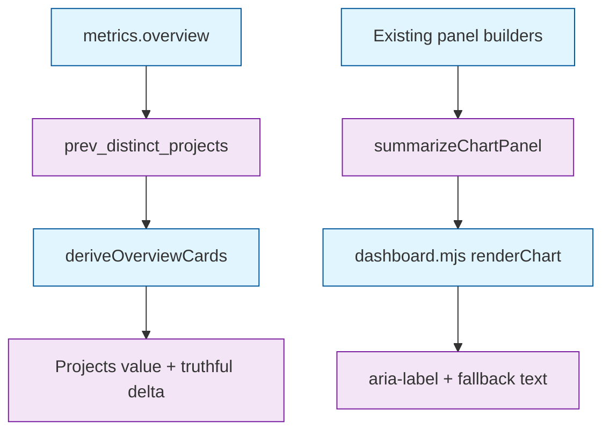

# Task: p4-dashboard / m2 — Vendored single-pane front-end (QA rework)

* Task ID: p4-dashboard-m2
* Complexity: Level 3
* Type: Feature (plan rework after QA FAIL)

Close the two substantive QA blockers against the otherwise-complete m2 dashboard: make the Projects KPI delta semantically truthful via an additive overview previous-window distinct count, and supply content-bearing accessible summaries for every chart canvas. Preserve the shipped offline single-pane surface, mode-agnostic endpoints, Node/pytest contracts already green, and the settled interaction/testing creative decisions.

## Pinned Info

### Rework Ownership

This diagram fixes the two remaining seams: the server owns the previous distinct rollup, pure core owns both the Projects delta baseline and chart summary text, and the adapter only applies already-tested strings to the canvas.

## Component Analysis

### Affected Components

- **Overview metrics** — `skills/sr-search/src/stockroom/dashboard/metrics.py` already materializes current and previous per-harness project sets and current `distinct_projects` → add filtered `prev_distinct_projects` as the previous-window union size under the same harness selection.
- **Pure client KPI derivation** — `dashboard-core.mjs` `deriveOverviewCards` correctly uses `distinct_projects` for the Projects value but deltas against summed `prev_projects` → switch the Projects baseline to `prev_distinct_projects` and stop summing previous project counts for that card.
- **Pure chart accessibility** — `dashboard-core.mjs` panel builders already return labels/datasets/empty → add `summarizeChartPanel(title, mode, model)` that turns those models into concise measured-content summaries, including an explicit no-data sentence.
- **Browser adapter** — `dashboard.mjs` `renderChart` currently sets title/mode-only `aria-label` and leaves static title-only canvas fallback text → apply the tested summary to both `aria-label` and canvas fallback/`textContent` on every rebuild, including empty and runtime-unavailable paths.
- **Static shell** — `index.html` canvas fallbacks remain title-only placeholders until the adapter overwrites them after the first successful render; no structural HTML change is required beyond keeping `role="img"` and an initial `aria-label`.
- **Python overview contracts** — `tests/test_dashboard_metrics.py` and empty/server overview shapes → assert the additive field on empty, populated, filtered, and shared-project cases.
- **Node client contracts** — `tests-js/dashboard-core.test.mjs` → assert Projects delta uses `prev_distinct_projects`, and assert summary text for aggregate, compare, empty, and multi-series panels.
- **Creative / plan authorities** — `creative-projects-kpi-previous-window.md` records the additive-field decision; interaction-contract canvas summary requirement remains binding and needs no redesign.

### Cross-Module Dependencies

- `metrics.overview` → overview JSON → `deriveOverviewCards`: Projects value stays `distinct_projects`; Projects delta baseline becomes `prev_distinct_projects`.
- Panel builders → `summarizeChartPanel` → `renderChart`: summary text is derived only from already-built panel models; the adapter does not invent metric prose.
- Per-harness `projects` / `prev_projects` remain available for KPI breakdown bars and are unchanged by this rework.

### Boundary Changes

- **Additive public JSON field:** `GET /api/overview` gains `prev_distinct_projects: number`. Existing fields keep their meanings. No schema, migration, ingest, CLI, or other endpoint changes.
- **No new runtime dependency, package, or network path.**

### Invariants and Constraints

- Every dashboard database request remains read-only through `warehouse.open_current()`.
- Projects remains a distinct count for the selected set; it is never replaced by a summable card.
- KPI meanings stay mode-independent.
- Canvas accessibility must convey measured content, not merely chart titles/modes.
- Warehouse-derived strings still enter the document through `textContent`/attributes, never raw HTML.
- Tests follow stub → fail → implement; browser visual checks stay in manual QA.
- `make ci` remains green at the milestone boundary, including Torch restore/smoke after exact sync.

## Open Questions

- [x] Interaction and presentation contract → Resolved earlier: contract-first native dashboard (see `creative-dashboard-interaction-contract.md`).
- [x] Test-first strategy for client logic → Resolved earlier: Node 22 built-in runner for pure modules (see `creative-dashboard-js-testing.md`).
- [x] Projects KPI previous-window contract → Resolved: add additive `prev_distinct_projects` and delta Projects against it; keep per-harness `prev_projects` for breakdowns (see `creative-projects-kpi-previous-window.md`).

## Test Plan

### Behaviors to Verify

#### Automated Python Overview Behaviors

- Empty overview → includes `prev_distinct_projects: 0` beside `distinct_projects: 0`.
- Populated overview with previous-window activity → `prev_distinct_projects` equals the union size of previous project ids under the active harness filter.
- Shared project across harnesses in the previous window → `prev_distinct_projects` is less than `sum(prev_projects)` and matches the distinct union.
- Filtered harness selection → both `distinct_projects` and `prev_distinct_projects` narrow to that selection; unknown harness selection returns zeros for both.

#### Automated JavaScript Unit Behaviors

- Overview with shared previous projects where `sum(prev_projects) > prev_distinct_projects` and current distinct equals previous distinct → Projects delta is no-change / correct percentage, never the false decline produced by summing `prev_projects`.
- Missing/null `prev_distinct_projects` → Projects delta degrades safely through existing `formatDelta` guards rather than throwing.
- Aggregate panel model with labels and one summed dataset → summary names the chart, mode, and measured label/value pairs or a compact equivalent that includes real values.
- Compare panel model with multiple harness datasets → summary includes mode and per-harness measured content rather than title alone.
- Empty panel model → summary states no data for the period without inventing values.
- Write/read dual-series model → summary covers both Writes and Reads series.
- Input panel models passed through summarization → remain unchanged.

#### Automated Static / Adapter Boundary Behaviors

- Existing semantic canvas `role="img"` and non-empty initial `aria-label` contracts remain green.
- No new offline/network/licensing regressions; existing static and REUSE suites stay green.

#### Manual Browser Behaviors

- Projects card on a multi-harness warehouse with shared projects shows a delta consistent with distinct current vs distinct previous, not a false drop from double-counted previous harness projects.
- Each chart canvas exposes an `aria-label`/fallback summary that a screen-reader or accessibility inspector can read with actual values or an explicit no-data sentence after render.
- Aggregate/Compare and selection changes refresh summaries with the rebuilt charts.

### Test Infrastructure

- Frameworks: existing pytest 8 and Node 22 `node:test` / `node:assert/strict`.
- Locations: `skills/sr-search/tests/test_dashboard_metrics.py`, `skills/sr-search/tests-js/dashboard-core.test.mjs`; extend existing files rather than adding new suites unless a clean split is required.
- Conventions unchanged: descriptive `test_*` Python cases; native ESM Node imports; no npm/package.json.

### Integration Tests

- Preserve the existing fixture ingest → overview HTTP integration; extend only if the response-shape assertion hard-codes the overview object without the new field.
- Manual browser QA covers the Projects delta and canvas summary readability against the real warehouse.

## Implementation Plan

1. [x] **Fail and implement the overview previous-distinct contract.**
    - Files: `skills/sr-search/tests/test_dashboard_metrics.py`, `skills/sr-search/src/stockroom/dashboard/metrics.py`, and any overview empty-shape assertions in `tests/test_dashboard_server.py` that hard-code the payload.
    - Extend/add tests for empty, populated, filtered, unknown-harness, and shared-previous-project cases requiring `prev_distinct_projects`.
    - Run the focused metrics tests and confirm failure against the current payload.
    - Implement the previous-window union in `metrics.overview` without changing existing field meanings.
    - Creative ref: `creative-projects-kpi-previous-window.md`.

2. [x] **Fail and implement the Projects KPI delta baseline switch.**
    - Files: `skills/sr-search/tests-js/dashboard-core.test.mjs`, `skills/sr-search/src/stockroom/dashboard/static/dashboard-core.mjs`.
    - Rewrite the existing `deriveOverviewCards` assertion that currently expects Projects `+100%` from `distinct_projects: 2` versus summed `prev_projects: 1`; give it an explicit `prev_distinct_projects` and the matching truthful delta.
    - Add a shared-previous-project fixture where `sum(prev_projects) > prev_distinct_projects` so the old summed baseline cannot silently pass.
    - Cover missing/null `prev_distinct_projects` through the existing `formatDelta` guards.
    - Run the focused Node test and confirm failure against the current summed-baseline implementation.
    - Change Projects delta to `formatDelta(distinct_projects, prev_distinct_projects)` and stop accumulating `previousProjects` from `prev_projects` for that card.

3. [x] **Fail and implement pure chart summary generation.**
    - Files: `skills/sr-search/tests-js/dashboard-core.test.mjs`, `skills/sr-search/src/stockroom/dashboard/static/dashboard-core.mjs`.
    - Stub then implement tests for Aggregate, Compare, empty, and dual-series summaries; assert immutability of the input model.
    - Run the focused Node suite and confirm failure against the missing export.
    - Implement `summarizeChartPanel(title, mode, model)` as a pure export that reads only `empty`, `labels`, and `datasets`.
    - Creative ref: `creative-dashboard-interaction-contract.md` accessibility notes.

4. [x] **Wire the adapter to tested summaries and verify static contracts.**
    - Files: `skills/sr-search/src/stockroom/dashboard/static/dashboard.mjs`, `skills/sr-search/tests/test_dashboard_static.py` only if an assertion must acknowledge dynamic fallback text.
    - In `renderChart`, set both `aria-label` and canvas fallback text from `summarizeChartPanel`; keep the existing no-data element for visual empty state.
    - Do not invent summary prose in the adapter. If a gap appears, return to Step 3.
    - Rerun focused Node and static/server suites.

5. [x] **Manual accessibility/delta smoke and full milestone gate.**
    - Files: none expected beyond fixes discovered by smoke; update `memory-bank/techContext.md` only if the additive overview field needs a durable pointer.
    - Verify Projects delta and canvas summaries in the real browser against populated data in Aggregate and Compare.
    - Run formatting/linting, focused suites, then full `make ci`; restore Torch and rerun the production encoder smoke as the established boundary check.

## Technology Validation

No new technology — validation not required. The rework uses the existing Python metrics module, native ES modules, Node 22 test runner, and Chart.js accessibility application boundary already validated for m2.

## Challenges & Mitigations

- **Shared-project fixtures are easy to under-specify:** seed at least one previous-window project touched by two harnesses so `sum(prev_projects) > prev_distinct_projects` is observable in both Python and Node tests.
- **Summary text can become verbose or lossy:** keep summaries concise and deterministic; prefer label/series/value fragments over narrative paragraphs; never truncate the underlying chart data to make the summary shorter.
- **Adapter temptation to hand-write accessibility copy:** forbid metric prose in `dashboard.mjs`; only apply the tested pure summary.
- **Empty-shape drift across server tests:** update every hard-coded overview expected object in the same step as the metrics change so CI does not flap on additive-field absence.
- **Exact-sync Torch removal remains known tooling debt:** restore the documented per-machine Torch build after `make ci` before calling the milestone gate complete.

## Status

- [x] Component analysis complete
- [x] Open questions resolved
- [x] Test planning complete (TDD)
- [x] Implementation plan complete
- [x] Technology validation complete
- [x] Preflight
- [x] Build
- [x] QA

## QA Findings

- **PASS (clean):** KISS/DRY/YAGNI/completeness/regression/integrity/documentation review of the rework diff found no blockers and no trivial debris requiring in-QA fixes.
- **Completeness:** All five plan steps are present in code and tests — additive overview field, Projects delta baseline switch with shared-previous anti-regression, pure `summarizeChartPanel` (aggregate/compare/empty/dual-series/immutability), adapter wiring of `aria-label` + canvas fallback, and techContext pointer.
- **Integrity:** No TODOs, debug scaffolding, or adapter-invented metric prose; summary text remains pure-core-owned.
- **Regression:** Existing per-harness `prev_projects` breakdowns, mode-agnostic KPIs, and static `role="img"` contracts remain intact.

## Preflight Findings

- **PASS after in-phase amendment:** TDD ordering, conventions, dependency impact, conflicts, completeness, and public-boundary checks found no blocker for the QA rework.
- **Completeness hardening:** Step 2 now explicitly rewrites the existing Node Projects `+100%` assertion that encodes the buggy summed `prev_projects` baseline, and adds the shared-previous-project fixture as a separate anti-regression.
- **Accounted downstream shapes:** empty overview equality in `test_dashboard_metrics.py` and `test_dashboard_server.py`, plus the full populated overview equality, must gain `prev_distinct_projects` in Step 1; wrapped's separate `distinct_projects` field is unrelated.
- **Radical innovation:** none with enough ROI inside scope; keeping summary generation pure and additive-only on overview remains the smallest correct fix.
- **Advisories:** none that warrant plan changes before build.
