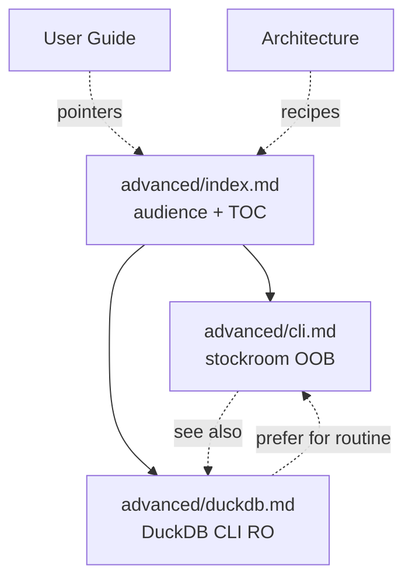

# Task: advanced-usage-docs

* Task ID: advanced-usage-docs
* Complexity: Level 3
* Type: docs / enhancement

Bring Advanced docs to presentation quality: power-user escape hatches after initialize (out-of-band `stockroom` CLI + DuckDB CLI), minimalism vs User Guide, landing + two satellites.

## Pinned Info

### Docs ownership map

Advanced sits between UG (product how-to) and Architecture (systems atlas). Confirmed satellites only.

## Component Analysis

### Affected Components
- `docs/advanced/index.md` — rewrite landing (audience, is/isn’t, TOC)
- `docs/advanced/cli.md` — rewrite as out-of-band stockroom CLI (not encyclopedia)
- `docs/advanced/duckdb.md` — **new** DuckDB RO escape hatch
- `docs/advanced/.pages` — Overview → CLI → DuckDB
- Inbound links in `docs/user-guide/**`, `docs/architecture/**`, possibly `docs/index.md` — retarget DuckDB-specific pointers to `duckdb.md`
- Persistent MB — only if Advanced ownership pointers become wrong (unlikely)

### Cross-Module Dependencies
- UG owns ingest/embed catch-up, dashboard, torch, installed layout / warehouse path topology
- Architecture points at Advanced for CLI/DuckDB recipes
- Contributing owns checkout `uv`/`make` — Advanced must not teach end-user `uv`
- Skills / system-model own agent flag tables — Advanced uses `--help` + links

### Boundary Changes
- Docs IA only; new page `duckdb.md`; prose rewrite of existing Advanced pages
- No product/API/schema changes

### Invariants & Constraints
- Must preserve: not a second onboarding track; initialize owns bootstrap/heal
- Must not present clone `make`/`uv` as initialize substitute
- Must preserve landing + sub-pages shape
- Must hold minimalism (creative Option B topic cut)
- Must hold docs ownership boundaries

## Open Questions

- [x] **Topic inventory & ownership cut** → Resolved: Escape-hatch duo (CLI OOB + DuckDB); omit `uv`, omit catch-up/heal/dashboard deep dives (see `memory-bank/active/creative/creative-advanced-topic-inventory.md`)
- [x] **Page IA under landing + sub-pages** → Resolved: `index.md` + `cli.md` + `duckdb.md`; keep `cli.md` slug (see `memory-bank/active/creative/creative-advanced-page-ia.md`)

## Test Plan (TDD)

Docs-only verification (same pattern as architecture-docs / contributing guides). No new pytest.

### Behaviors to Verify

- **B1 Landing frames Advanced**: Reading `advanced/index.md` → reader knows audience (post-initialize power user), that this is not second onboarding, and finds TOC to CLI + DuckDB
- **B2 CLI OOB depth**: `cli.md` → explains shim/`PATH` invocation without agent; covers `query`/`semantic` + `--format`/`--detail`; points other subcommands to UG/`--help`/initialize; does **not** deep-dive ingest/embed/dashboard/heal/migrate/uv
- **B3 DuckDB RO**: `duckdb.md` → warehouse path (link Installed layout), `duckdb -readonly` open recipe, prefer `stockroom query` for routine, caveats (locks / no presentation layer / don’t write)
- **B4 No ownership blur**: Advanced does not re-own UG catch-up recipes, Architecture doctrines, or Contributing `uv`/`make` loops
- **B5 Nav + inbound**: `.pages` lists Overview → CLI → DuckDB; Architecture/UG links that meant DuckDB point at `duckdb.md` where appropriate; no broken relatives under strict build
- **B6 Build**: `make docs-build` PASS

### Edge Cases

- Scaffold encyclopedia table of all subcommands must not survive as Advanced-owned depth
- `uv` must not appear as an end-user Advanced recipe
- Warehouse filename claims must match Installed layout (`warehouse.duckdb` under `$STOCKROOM_HOME`)

### Test Infrastructure

- Framework: docs content checklist in this tasks file + `make docs-build` (properdocs `--strict`)
- Test location: checkboxes under Implementation Plan / Build checklist (no pytest files)
- Conventions: architecture-docs / release-quality-docs docs-only gates
- New test files: none

### Integration Tests

- Strict site build (link/nav integrity across Advanced + inbound retargets)

## Implementation Plan

1. **Stub content checklist** (fail closed until prose lands)
    - Files: `memory-bank/active/tasks.md` (this Build checklist)
    - Changes: unchecked B1–B6 items below

2. **Rewrite landing**
    - Files: `docs/advanced/index.md`
    - Changes: power-user audience; is/isn’t; TOC to CLI + DuckDB; outbound Architecture / UG; no encyclopedia
    - Creative ref: page-IA Option B; topic-inventory Option B

3. **Rewrite CLI satellite**
    - Files: `docs/advanced/cli.md`
    - Changes: OOB stockroom invocation; `query`/`semantic` + format/detail; env overrides with Installed-layout links; short “other commands” pointer (not heal recipes); see-also DuckDB
    - Creative ref: topic-inventory include list; page-IA `cli.md` contract

4. **Add DuckDB satellite**
    - Files: `docs/advanced/duckdb.md` (new)
    - Changes: path → Installed layout; `duckdb -readonly "$STOCKROOM_HOME/warehouse.duckdb"` (or equivalent); prefer `stockroom query`; locks / migrations / presentation caveats; see-also CLI
    - Creative ref: page-IA Option B

5. **Nav**
    - Files: `docs/advanced/.pages`
    - Changes: Overview → CLI → DuckDB

6. **Inbound link audit**
    - Files: grep-driven updates under `docs/` (Architecture warehouse/embeddings, UG search/ingest/troubleshooting, etc.)
    - Changes: DuckDB-specific “escape hatch” pointers → `duckdb.md`; CLI OOB stays on `cli.md`; fix any broken relatives from prior renames only if they block strict build

7. **Fill checklist + strict build**
    - Run: `make docs-build`
    - Mark B1–B6 complete only after reading pages against behaviors

8. **Persistent MB** (conditional)
    - Only if Advanced ownership sentence in `systemPatterns.md` / `techContext.md` is factually wrong — surgical fix, no drive-by

### Build checklist

- [ ] B1 Landing frames Advanced
- [ ] B2 CLI OOB depth (no encyclopedia / no uv recipe)
- [ ] B3 DuckDB RO page
- [ ] B4 Ownership boundaries hold
- [ ] B5 Nav + inbound links
- [ ] B6 `make docs-build` PASS

## Technology Validation

No new technology — validation not required (properdocs already in tree).

## Challenges & Mitigations

- **Scaffold encyclopedia regresses into final prose**: Mitigation — B2 checklist explicitly forbids full heal/subcommand deep-dives; start from rewrite not polish-in-place of the table.
- **DuckDB page duplicates Installed layout**: Mitigation — path facts link out; page owns only open recipe + caveats.
- **Inbound links still say “CLI” for DuckDB topics**: Mitigation — step 6 grep audit; Architecture change-surfaces can name DuckDB page.
- **Strict build fails on unrelated stale links**: Mitigation — fix only what blocks the build (same as architecture-docs side-effect policy); do not widen into other sections’ content.

## Pre-Mortem

- **Plan failed because Advanced became a second user guide**: Response — creative Option B already cuts topics; B4 checklist is the gate; if build drifts, cut prose rather than add recipes.
- **Plan failed because `uv` was demanded mid-build**: Response — out of scope per creative; would be a new open question / rework, not sneak into this plan.
- **Plan failed because DuckDB RO recipe was wrong for the installed DuckDB CLI**: Response — verify `-readonly` against local `duckdb --help` during build (already confirmed on this machine); cite official DuckDB CLI docs URL in prose.

## Status

- [x] Component analysis complete
- [x] Open questions resolved
- [x] Test planning complete (TDD)
- [x] Implementation plan complete
- [x] Technology validation complete
- [x] Pre-Mortem complete
- [ ] Preflight
- [ ] Build
- [ ] QA
