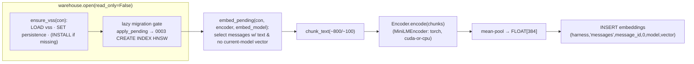

# Task: Phase 2 · Milestone 1 — Embedding pipeline

* Task ID: `p2-embeddings-search` (sub-run m1)
* Complexity: Level 3
* Type: feature (new subsystem)

Land the deferred VSS/HNSW vector index as forward-only migration `0003`, and a
local `sentence-transformers` (`all-MiniLM-L6-v2`, 384-dim) embedding pipeline:
chunk-and-mean-pool of long text into one `FLOAT[384]` vector per message,
written through the `warehouse.open()` chokepoint, re-embedding only
un-embedded/changed content. Runs on the Phase 0 torch contract; built test-first
under torch-free CI.

## Pinned Info

### Embedding pipeline data flow



### Torch-free testability seam

```mermaid
flowchart TD
    P["chunk_text() — pure stdlib"] -->|unit test, no torch| T1["test_embed_chunking"]
    FAKE["FakeEncoder (deterministic vectors)"] --> EP["embed_pending(con, encoder)"]
    EP -->|injected encoder, migrated_con, no torch| T2["test_embed_pipeline"]
    REAL["MiniLMEncoder (lazy-imports sentence_transformers)"] -->|importorskip('torch')| T3["test_embed_real_model (skipped in CI)"]
```

## Component Analysis

### Affected Components

- **`stockroom.migrations` (`0003_embeddings_hnsw_index.sql`)** — new file. Current: ships `0001`+`0002`. Change: add `0003` = `SET hnsw_enable_experimental_persistence=true; CREATE INDEX embeddings_vector_hnsw ON embeddings USING HNSW (vector) WITH (metric='cosine')`. No `INSTALL`/`LOAD` in the file (precondition: vss loaded by caller). Discovery is automatic.
- **`stockroom.warehouse`** — add `ensure_vss(con)` (LOAD; INSTALL-if-missing; SET persistence). `open()` calls it on the migrator RW connection (before `apply_pending`) and on every returned connection. Boundary change (see below).
- **`stockroom.embed` (new module)** — `chunk_text()`, `Encoder` protocol, `MiniLMEncoder` (lazy torch import, device select), `embed_text()`, `embed_pending(con, encoder, *, embed_model)`, `EMBED_MODEL`/`EMBED_DIM` constants, and a `__main__`-style CLI entry (`python -m stockroom.embed`) mirroring `stockroom.query`'s single-module shape.
- **`stockroom.ingest.writer`** — cascade-delete a session's `embeddings` in the existing per-`(harness, session_id)` delete-then-insert, so re-ingested (possibly changed) content is re-embedded next run.
- **Test infra (ripple from new migration head = 3)** — `test_migrate_runner.py` (two `==2`/`[1,2]` assertions → `3`/`[1,2,3]`, + `ensure_vss` on real-chain applies), `test_warehouse_open.py` (three `current_version == 2` → `3`; repoint head snapshot), `conftest.py::migrated_con` (call `ensure_vss` before `apply_pending`), new `test_schema_0003.py` + `fixtures/schema/0003_snapshot.json`. `test_migrations_discovery.py` is robust (uses `len(found)` / `>= {1,2}`).

### Cross-Module Dependencies

- `stockroom.embed` → `stockroom.warehouse.open()` (read-write) for the CLI path; → injected `Encoder` for logic (testable without torch).
- `stockroom.warehouse.open()` → `ensure_vss()` → DuckDB `vss` extension (loaded per-connection).
- `0003` (HNSW index) → requires `vss` loaded on the applying connection (established by chokepoint/fixture, not by the migration SQL).
- `stockroom.ingest.writer` → `embeddings` table (cascade-delete on session rewrite).

### Boundary Changes

- **`warehouse.open()` now loads `vss` and sets experimental persistence on every connection** (post-`0003` the schema contains an HNSW index; per-connection SET is required to create/modify it; readers need `vss` for vector ops in m2). New public-ish helper `ensure_vss(con)`.
- **New migration `0003`** advances the schema head 2 → 3 (a test-suite-wide event; see ripple list).
- **`embeddings` becomes a write target** of a second writer (`stockroom.embed`) besides ingest — both go through the chokepoint (`read_only=False`), preserving the single-writer contract.

### Invariants & Constraints preserved

No truncation at rest (only bounded chunks reach the model; full `text` untouched); storage/embedding decoupled; torch-safe contract (torch never in the lock; tests torch-free; `--no-sync`); locked-uv trust (no new runtime dependency — `vss` is a DuckDB extension, not a Python dep); chokepoint-only DB access with `read_only` enforcement; incremental not from-scratch; schema changes only via forward-only numbered migration (`0003`); harness-labeled & cross-harness (embeddings ride the `harness` column); clean-room (engine reimplemented from briefs/spike, not ported).

## Open Questions

- [x] **VSS extension provisioning + where the HNSW index lives** → Resolved: thin `0003` migration (index only, no `INSTALL`/`LOAD`); chokepoint `ensure_vss(con)` loads `vss` + sets persistence on every open and centralizes the (provisioning-time) `INSTALL`; test fixtures call `ensure_vss` before applying the real chain. (`memory-bank/active/creative/creative-vss-provisioning-and-index.md`)
- [x] **Embedding owner grain (what gets embedded)** → Resolved: **messages only** for m1 (`owner_table='messages'`, `owner_id=message_id`, `chunk_index=0`); `tool_calls` embedding deferred (additive later via the existing `owner_table` column). (`creative-embedding-owner-grain.md`)
- [x] **Incremental re-embed — new & changed detection** → Resolved: **A+B** — select owners lacking a current-`embed_model` vector (new + model change), plus session-grained embedding cascade-delete in `ingest.writer` (catches edits); no schema column added. (`creative-incremental-reembed-detection.md`)

## Test Plan (TDD)

### Behaviors to Verify

- **Chunking — short text** → single chunk equal to the input (no splitting under the size threshold).
- **Chunking — long text** → multiple chunks of ~800 chars with ~100-char overlap; concatenated coverage is complete; deterministic.
- **Chunking — empty/whitespace** → no chunks (caller skips embedding).
- **embed_text(text, encoder)** → returns a single length-384 vector = mean-pool of the per-chunk vectors (verified against a deterministic `FakeEncoder`).
- **embed_pending — fresh DB** → embeds every non-empty message exactly once; writes `(harness,'messages',message_id,0,EMBED_MODEL,vector)` with a 384-vector; tool_calls untouched.
- **embed_pending — incremental** → a second run with no new content is a no-op (no duplicate rows); after inserting a new message, only that message is embedded.
- **embed_pending — skips empty text** → messages with NULL/whitespace `text` get no embedding row.
- **embed_pending — model-aware** → a row embedded under a different `embed_model` does not satisfy the current model's selection (re-embedded under the current model).
- **ingest.writer cascade** → re-ingesting (delete-then-insert) a `(harness, session_id)` removes that session's `embeddings`, so they re-embed next run; other sessions' embeddings are untouched.
- **`0003` migration** → after applying the chain, an HNSW index named `embeddings_vector_hnsw` exists on `embeddings(vector)` with cosine metric; the index is usable for `array_cosine_distance` KNN; a delete against the live index succeeds.
- **`0003` schema golden** → cumulative post-`0003` schema (columns + PKs + the new index) byte-matches `0003_snapshot.json`; `0001`/`0002` snapshots stay frozen.
- **chokepoint `ensure_vss`** → an opened warehouse has `vss` loaded and can run a vector query / live-index delete; `open()` on a fresh path migrates to head version 3.
- **Edge — KNN correctness** → with deterministic vectors, the nearest neighbor by cosine is the expected row (sanity that metric + index wiring are right).
- **Real-model integration (torch-gated)** → `MiniLMEncoder` encodes a string to a 384-vector on CPU; `pytest.importorskip("torch")` so CI (torch-free) skips it.

### Test Infrastructure

- Framework: `pytest`, configured in `skills/sr-search/pyproject.toml` (`[tool.pytest.ini_options]`, `pythonpath = ["src"]`). Run via `make test` / `make ci` from repo root.
- Test location: `skills/sr-search/tests/`.
- Conventions: one test module per engine module (`test_<module>.py`); schema migrations get `test_schema_NNNN.py` + a `fixtures/schema/NNNN_snapshot.json` golden updated via `STOCKROOM_UPDATE_SCHEMA_GOLDEN=1`; library entrypoints take an injected `con=`/encoder for torch-free/DB-free unit tests (the `run_query(sql, *, con=None)` precedent); real-model paths are `importorskip`-gated.
- New test files: `tests/test_embed.py` (chunking + pipeline w/ FakeEncoder + torch-gated real-model), `tests/test_schema_0003.py`, `tests/fixtures/schema/0003_snapshot.json`. Modified: `tests/test_migrate_runner.py`, `tests/test_warehouse_open.py`, `tests/test_ingest_writer.py`, `tests/conftest.py`.

### Integration Tests

- **Chokepoint → migration → vector op**: `warehouse.open(read_only=False)` on a fresh `STOCKROOM_HOME` yields a v3 warehouse with `vss` loaded; insert embeddings, run a cosine KNN, delete against the live index — all succeed (exercises `ensure_vss` + `0003` + experimental persistence end to end).
- **Ingest → embed → re-ingest**: ingest a fixture session, `embed_pending` it, re-ingest the same session, confirm its embeddings were cascaded and re-embedded; other sessions stable.

## Implementation Plan

Ordered; each step is one TDD cycle (failing test → implement → green). Start at the component with fewest dependencies (chunker) and work outward to the chokepoint/migration ripple.

1. **Chunker** — `stockroom.embed.chunk_text(text, *, size=800, overlap=100)`.
    - Files: `src/stockroom/embed.py` (new, chunker + `EMBED_MODEL`/`EMBED_DIM` constants + `Encoder` protocol stub); `tests/test_embed.py`.
    - Changes: pure stdlib sliding-window chunker; empty/whitespace → `[]`.
2. **Pool + injected-encoder pipeline** — `embed_text()`, `embed_pending(con, encoder, *, embed_model=EMBED_MODEL)`.
    - Files: `src/stockroom/embed.py`; `tests/test_embed.py` (FakeEncoder).
    - Changes: chunk → encode → mean-pool → length-384; selection query (new + current-model, non-empty text); insert `(harness,'messages',message_id,0,model,vector)`. Tested against `migrated_con` with a deterministic FakeEncoder — **no torch**.
    - Creative ref: `creative-embedding-owner-grain.md`, `creative-incremental-reembed-detection.md` (selection A).
3. **`ensure_vss` + `0003` migration** — index DDL + chokepoint extension loading.
    - Files: `src/stockroom/migrations/0003_embeddings_hnsw_index.sql` (new); `src/stockroom/warehouse.py` (`ensure_vss`, wired into `open()`); `tests/test_schema_0003.py` + `tests/fixtures/schema/0003_snapshot.json` (new); `tests/conftest.py` (`migrated_con` calls `ensure_vss`).
    - Changes: thin migration (SET persistence + CREATE HNSW INDEX); `ensure_vss` (LOAD/INSTALL-if-missing/SET); `open()` ensures vss on migrator + returned connections; schema golden captures the index.
    - Creative ref: `creative-vss-provisioning-and-index.md`.
4. **Migration-head ripple** — update assertions coupled to "head == 2".
    - Files: `tests/test_migrate_runner.py` (`[1,2]`→`[1,2,3]`, `==2`→`==3`, `ensure_vss` before real-chain applies), `tests/test_warehouse_open.py` (three `==2`→`==3`; repoint head snapshot ref to `0003_snapshot.json`).
    - Changes: assertion + fixture updates only; no behavior change to the runner.
5. **Incremental cascade (changed detection)** — `ingest.writer` drops a session's embeddings on rewrite.
    - Files: `src/stockroom/ingest/writer.py`; `tests/test_ingest_writer.py`.
    - Changes: in the per-`(harness, session_id)` delete-then-insert, also delete that session's `embeddings` rows.
    - Creative ref: `creative-incremental-reembed-detection.md` (B).
6. **Real-model encoder + CLI** — `MiniLMEncoder`, `python -m stockroom.embed`.
    - Files: `src/stockroom/embed.py`; `tests/test_embed.py` (torch-gated real-model test).
    - Changes: lazy `sentence_transformers` import, `cuda` if `torch.cuda.is_available()` else `cpu`, model `all-MiniLM-L6-v2`; CLI opens warehouse RW via chokepoint, builds the encoder, runs `embed_pending`, prints a count. `importorskip("torch")` gates the real encode test.
7. **Docs** — accrete memory-bank tech context + skill stub note.
    - Files: `memory-bank/techContext.md` (new "Embeddings (`stockroom.embed`)" + `0003`/VSS note), `memory-bank/systemPatterns.md` (VSS-loaded-at-chokepoint + embed-writer-is-second-writer pattern), `skills/sr-search/SKILL.md` (note embedding pipeline landed; search behavior still m2/m3). Update at the end of build, reviewed.

## Technology Validation

**No new dependency.** `duckdb`, `sentence-transformers`, `numpy` are already declared and locked (`pyproject.toml` / `uv.lock`); `vss` is a DuckDB *extension* provisioned at runtime, not a Python package — so **`uv.lock` is not touched** (locked-uv trust invariant preserved). Torch remains out of the lock (Phase 0 contract).

Spike (2026-06-28, DuckDB 1.5.4, this machine) validated the load-bearing primitives:
- `INSTALL vss` + `LOAD vss` succeed; extension caches to `~/.duckdb/extensions/.../vss.duckdb_extension` (`REPOSITORY` install mode → confirms `INSTALL` is the network op, `LOAD` is offline-safe).
- HNSW cosine index returns correct nearest neighbor (query == row ⇒ distance 0.0).
- `DELETE`/`INSERT` against a **live** index work with experimental persistence on; the index **survives reopen** of a persistent DB and still answers KNN.
- `LOAD vss` + `SET persistence` + `CREATE INDEX … USING HNSW` run **inside the runner's `BEGIN/COMMIT`** and on an `:memory:` connection.
- CPU `all-MiniLM-L6-v2` → 384-dim encode was already proven green in `planning/spikes/o9-torch/` (`smoke.py`); not re-run (torch is provisioned out of band and absent here by design).

## Challenges & Mitigations

- **`vss` network `INSTALL` vs. offline posture** → `INSTALL` confined to `ensure_vss` (install-on-missing); migration SQL never installs; `sr-initialize` (Phase 4) pre-warms the cache so end-user runtime is network-free. CI/dev autoinstall (network present) keeps tests green.
- **Experimental-persistence durability risk** → accepted per roadmap/tech-brief (the documented price of deletes against a live index); persistence flag set per-connection by the chokepoint.
- **Torch absent in CI** → all pipeline logic is tested via the pure chunker + an injected `FakeEncoder` against `migrated_con`; the only torch-dependent test is `importorskip`-gated. A design that needs torch to test the pipeline would fail `make ci` — explicitly avoided.
- **`0003` head-version ripple** → enumerated, bounded set of assertion/fixture updates (Step 4) + a new `0003_snapshot.json`; `0001`/`0002` goldens stay frozen (forward-only).
- **Widening into `ingest.writer` (Phase-1 code)** → the cascade is ~a few lines in the one place that already rewrites sessions, directly tested; chosen over a heavier `source_hash` schema column.
- **Second writer to `embeddings`** → both ingest and embed go through `warehouse.open(read_only=False)`; the single-writer flock contract is preserved (no concurrent writers by construction).

## Status

- [x] Component analysis complete
- [x] Open questions resolved (3/3, high confidence)
- [x] Test planning complete (TDD)
- [x] Implementation plan complete
- [x] Technology validation complete (no lock change; spike green)
- [ ] Preflight
- [ ] Build
- [ ] QA
