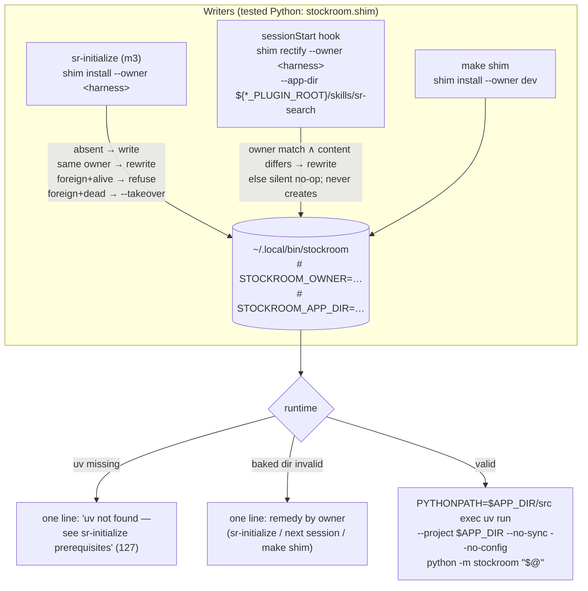

# Task: p3-m2-stockroom-shim

* Task ID: p3-m2-stockroom-shim
* Complexity: Level 3
* Type: feature

Milestone m2 of L4 project `p3-onboarding-cli-scheduling`: a REUSE-covered shim template shipped in the engine plus tested generation/installation logic that writes `~/.local/bin/stockroom` with a baked `APP_DIR`, **succeed-or-refuse** runtime semantics (no self-resolution — operator hard constraint), staleness healing via **session-start hook rectification** with explicit **ownership** (the two-harness resolution), a clear one-line uv-missing failure, a PATH-membership check, dev-repo parity (`make shim`), and the README ad-hoc-invocation section rewritten around `stockroom <subcommand>`.

> **Rework note (2026-07-08):** the original "always-scan, version-ranked" runtime resolution was vetoed by the operator (layout-coupled root list; supply-chain injection surface; violates "the shim ALWAYS finds the right stockroom — never guesses"). Replaced by baked-only shim + hook rectification + ownership. Decision record: `memory-bank/active/creative/creative-shim-staleness-resolution.md` (revised).

## Pinned Info

### Shim lifecycle: writers and runtime

Pinned because every test case maps onto one of these paths. Three writers (all through the same tested `stockroom.shim` code), one dumb runtime (decided in the revised `creative-shim-staleness-resolution.md`).

## Component Analysis

### Affected Components
- **`src/stockroom/shim_template.sh`** (new): POSIX-sh template; header markers (`STOCKROOM_OWNER`, `STOCKROOM_APP_DIR`, generator version), uv check, baked-dir validity check, exec. **No resolution logic of any kind.**
- **`src/stockroom/shim.py`** (new): `render(app_dir, owner)`, `install(dest, app_dir, owner, *, takeover=False)`, `rectify(dest, app_dir, owner)`, `main(argv) -> int` (subactions `install` / `rectify`; `--app-dir`, `--dest`, `--owner`, `--takeover`). All ownership/takeover/no-op policy lives here (tested).
- **`src/stockroom/__main__.py`** (dispatcher): sixth `SUBCOMMANDS` row `"shim"`.
- **`hooks/cursor-hooks.json`** + **`hooks/claude-hooks.json`** (new): sessionStart entries invoking `shim rectify` at `${CURSOR_PLUGIN_ROOT}` / `${CLAUDE_PLUGIN_ROOT}`, silenced, short timeout.
- **`.cursor-plugin/plugin.json`** / **`.claude-plugin/plugin.json`**: gain `"hooks"` pointers to their respective configs (Claude supports a custom hooks path).
- **`Makefile`**: `shim` target (`--owner dev`, checkout engine dir).
- **`README.md`**: ad-hoc-invocation section rewritten around installed `stockroom <subcommand>`.
- **`REUSE.toml`**: add `skills/**/*.sh` to the code-shaped AGPL re-assert list (`hooks/*.json` sits outside `skills/` — base AGPL already covers it).
- **`memory-bank/techContext.md`** + **`memory-bank/systemPatterns.md`**: shim section; hook-discipline invariant amended (operator-sanctioned): sessionStart launches the dashboard *and* rectifies the shim — still never ingests, never migrates, never errors, never blocks.

### Cross-Module Dependencies
- `shim.py` → `stockroom.__version__` (header stamp) and `stockroom.__file__` (default `--app-dir`).
- Rendered shim → dispatcher (`python -m stockroom`); install-time verify → dispatcher `--version` (the m1 probe).
- Hook configs → dispatcher `shim rectify` (the raw torch-safe incantation with the env-var root — legitimate here: hooks.json is committed plugin content, not a rendered-out artifact, and the env var is the harness's own delivery mechanism).
- m3 (`sr-initialize`) will drive `stockroom shim install --owner <harness>`; m4 cron/launchd entries invoke the shim.

### Boundary Changes
- New public CLI surface: `stockroom shim install|rectify` (additive).
- New on-disk artifact outside the repo: `~/.local/bin/stockroom` (written only via the three explicit writers; ownership-guarded).
- Plugin manifests gain hook pointers — first hooks the plugin ships (packaging-contract change, test-pinned).

### Verified Facts
- Cursor exports/substitutes `CURSOR_PLUGIN_ROOT` for plugin hooks (docs + staff confirmation + cursor-warehouse's live hooks.json on this machine); Claude exports/substitutes `CLAUDE_PLUGIN_ROOT` (docs). Both point at the *current* install root; Claude's "changes on each plugin update," previous dir retained ~7 days.
- Claude `.claude-plugin/plugin.json` supports `"hooks": "./<path>.json"`; Cursor manifest has the `"hooks"` pointer field (cursor-warehouse precedent).
- Cursor `sessionStart` is fire-and-forget (non-blocking); both harnesses support per-hook timeouts.
- Hook schemas differ (Cursor `{"version":1,"hooks":{"sessionStart":[…]}}` vs Claude `{"hooks":{"SessionStart":[{"hooks":[…]}]}}`) → two config files, mirroring the dual-manifest pattern.

### Invariants & Constraints
- **Succeed-correctly-or-refuse**: the shim never guesses; no scanning, no ranking, no fallback resolution (operator hard constraint).
- Torch-safe contract structural in the shim (`--no-sync --no-config`).
- Shim does environment plumbing only; all policy in tested Python.
- Single writer per shim: ownership marker; only the owner (harness hook / init / `make shim` for dev) may rewrite; takeover only when the incumbent's baked dir is dead and only with the explicit flag.
- Hook discipline (amended): rectify is silent, non-blocking, never errors, never creates a missing shim.
- Run-in-place packaging holds; REUSE compliance repo-wide.

## Open Questions

- [x] **Q1 — Staleness healing & two-harness resolution** → Resolved (REVISED after operator veto of the scan design): baked-only succeed-or-refuse shim; sessionStart hook rectification using the harness-provided plugin root; explicit ownership with decline/takeover policy (see `memory-bank/active/creative/creative-shim-staleness-resolution.md`)
- [x] **Q2 — Shim generation surface & template home** → Resolved: `stockroom.shim` module CLI as the dispatcher's sixth subcommand; template in-package at `src/stockroom/shim_template.sh`; `make shim` delegates with `--owner dev` (see `memory-bank/active/creative/creative-shim-generation-surface.md`, revised notes)

## Test Plan (TDD)

### Behaviors to Verify

**Render / install / rectify unit level (`stockroom.shim` library):**
- `render(app_dir, owner)` → output contains baked `APP_DIR`, owner marker, `--no-sync`, `--no-config`, `PYTHONPATH="$APP_DIR/src"`, `exec uv run`, version stamp
- `install` to absent dest → file exists, mode `0o755`, content == `render(...)`
- re-`install`, same owner → replaced cleanly (idempotent, no temp debris)
- `install`, different owner, incumbent's baked dir **alive** → refused, dest untouched, message names the owner
- `install`, different owner, incumbent's baked dir **dead** → refused without `--takeover`; succeeds with `--takeover`
- `rectify`, owner matches, rendered content differs (moved root *or* template change) → rewritten
- `rectify`, owner matches, content identical → no-op
- `rectify`, owner mismatch → no-op (never touches a foreign shim)
- `rectify`, dest absent → no-op (never creates)
- default `app_dir` → resolves to the engine dir containing the running package
- PATH-membership reported; install-time `--version` verify attempted only when dest dir is on `PATH`, skip reason reported otherwise
- corrupt/unreadable header in existing dest → treated as foreign (refuse), never crashes

**Shim runtime level (rendered script as subprocess; fixture `HOME`; stub `uv` on `PATH`):**
- baked dir valid → execs; stub `uv` observes correct `APP_DIR`, `PYTHONPATH`, `--no-sync`, `--no-config`, and verbatim args (incl. spaces)
- baked dir missing/invalid → one-line stderr remedy matching the owner (harness-owned → `sr-initialize` / next session; dev-owned → `make shim`), nonzero exit, no shell noise
- `uv` absent → one-line `uv not found — see sr-initialize prerequisites`, exit 127

**CLI + dispatcher level (subprocess):**
- `python -m stockroom.shim --help` → exits 0, documents `install` / `rectify` / flags
- `install` / `rectify` via CLI against tmp dest + fixture engine dirs → correct exit codes (refusals nonzero for `install`, no-ops zero for `rectify`)
- `python -m stockroom shim --help` forwards; top-level `--help` lists `shim`; `test_dispatcher_cli.py` SUBCOMMANDS + fingerprint extended

**Packaging / hooks contract (extends `test_packaging.py` conventions, `repo_root` fixture):**
- both manifests carry `"hooks"` pointers; both hook configs exist and parse
- each config's sessionStart command contains its harness's `${*_PLUGIN_ROOT}`, `shim rectify`, `--owner <harness>`, and output silencing; a timeout is set
- schema shape per harness (Cursor `version`/`sessionStart`; Claude `SessionStart` wrapper)

**Licensing:**
- `shim_template.sh` resolves AGPL, not PPL-S (extends `test_licensing.py`); `reuse lint` green

### Test Infrastructure

- Framework: pytest (`skills/sr-search/pyproject.toml`); run via `make test` / `make ci`
- Conventions: subprocess-CLI convention (`test_query_cli.py` / `test_dispatcher_cli.py`); repo-root artifact assertions (`test_packaging.py`)
- New test files: `tests/test_shim.py` (render/install/rectify unit), `tests/test_shim_runtime.py` (rendered-script subprocess), `tests/test_shim_cli.py` (CLI subprocess)
- Runtime harness: fixture `HOME` with fake engine dirs (`pyproject.toml` present/absent) + stub `uv` executable printing argv + `PYTHONPATH`
- Modified: `test_dispatcher_cli.py`, `test_licensing.py`, `test_packaging.py` (hook contract)
- **Not machine-testable**: live in-harness hook firing — the hook *artifacts* are test-pinned; live behavior is verified artisanally by the operator (project invariant for prompt/harness surfaces)

### Integration Tests

- Full chain torch-free: `stockroom shim install` through the real dispatcher → real shim in tmp dest → shim executed with stub `uv` against fixture engine dir → observed exec contract
- Rectify chain: install as owner A at root X → `rectify --owner A --app-dir Y` → shim now bakes Y; `rectify --owner B --app-dir Z` → unchanged

## Implementation Plan

1. **REUSE layer** — licensing test first
    - Files: `skills/sr-search/tests/test_licensing.py`, `REUSE.toml`
    - Changes: red test asserting `shim_template.sh` resolves AGPL; add `skills/**/*.sh` to annotation block 3 (template stub from step 2 pairs with it)
2. **Template + `render`** — `tests/test_shim.py` (render cases) red → green
    - Files: `skills/sr-search/src/stockroom/shim_template.sh`, `skills/sr-search/src/stockroom/shim.py`
    - Changes: template with header markers + substitution slots; `render(app_dir, owner)`
    - Creative ref: both creative docs (revised)
3. **Shim runtime behaviors** — `tests/test_shim_runtime.py` red → template logic green
    - Files: `shim_template.sh`, runtime fixtures (fixture-`HOME` builder, stub `uv`)
    - Changes: uv check → baked-dir validity check → exec; owner-appropriate one-line error remedies
4. **Install / rectify policy** — `tests/test_shim.py` (policy cases) red → green
    - Files: `skills/sr-search/src/stockroom/shim.py`
    - Changes: atomic 0o755 write, ownership read-back from dest header, refuse/takeover rules, rectify no-op rules, PATH check + conditional verify, report
5. **CLI + dispatcher wiring** — `tests/test_shim_cli.py` + `test_dispatcher_cli.py` updates red → green
    - Files: `shim.py` (argparse `main`), `src/stockroom/__main__.py`
    - Changes: `install`/`rectify` subactions + flags; `"shim"` row in `SUBCOMMANDS`
6. **Hook artifacts** — `test_packaging.py` hook-contract cases red → green
    - Files: `hooks/cursor-hooks.json`, `hooks/claude-hooks.json`, `.cursor-plugin/plugin.json`, `.claude-plugin/plugin.json`
    - Changes: sessionStart `shim rectify` entries per harness schema, silenced + timeout; manifest `"hooks"` pointers
7. **Dev parity** — `make shim`
    - Files: `Makefile`
    - Changes: `shim:` target — `PYTHONPATH=$(ENGINE)/src $(UV_RUN) python -m stockroom shim install --owner dev --app-dir $(ENGINE)` (with `##` help comment)
8. **Documentation**
    - Files: `README.md`, `memory-bank/techContext.md`, `memory-bank/systemPatterns.md`
    - Changes: README ad-hoc section rewritten around installed `stockroom <subcommand>` (raw incantation demoted to bootstrap footnote); techContext shim/hook section; systemPatterns hook-discipline amendment recorded

## Technology Validation

No new dependencies — template is POSIX sh + coreutils; generation/policy is stdlib-only Python; hook configs are static JSON. Validation not required.

## Challenges & Mitigations

- **Dual hook schemas** (Cursor ≠ Claude): two committed config files, each shape pinned by packaging tests; mirrors the established dual-manifest pattern.
- **Hook discipline** (never errors, never blocks): command silences stdout/stderr and swallows failure (`|| true`), short timeout in config, Cursor sessionStart is fire-and-forget by design; `rectify` itself is a fast no-op in the steady state.
- **Live hook firing untestable from pytest**: artifacts test-pinned; live verification is the operator's artisanal pass (project invariant) — flagged for the QA phase checklist.
- **Takeover could clobber a working foreign shim**: takeover requires *both* a dead incumbent baked dir *and* the explicit `--takeover` flag; refusals are loud and name the incumbent owner.
- **Update→next-session staleness window**: bounded (Claude retains the old dir ~7 days; shim keeps running the owner's previous install meanwhile — deterministic, never a guess); if pruned early, the shim refuses with the remedy. Accepted by operator.
- **Tests must never touch real `~/.local/bin`, caches, or PATH**: all writes via `--dest` into tmp; fixture `HOME`; stub `uv`.

## Status

- [x] Component analysis complete
- [x] Open questions resolved (2 creative documents; Q1 revised after operator veto)
- [x] Test planning complete (TDD)
- [x] Implementation plan complete
- [x] Technology validation complete
- [ ] Preflight (re-run pending after rework)
- [ ] Build
- [ ] QA
