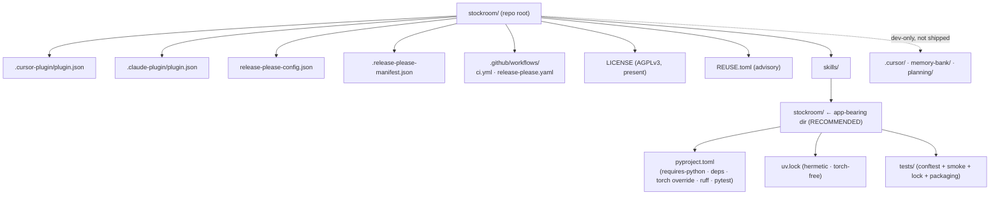

# Task: Phase 0 — Foundations

* Task ID: p0-foundations
* Complexity: Level 3
* Type: feature (foundational scaffold / substrate)

Stand up the trustworthy, reproducible, test-first substrate for stockroom: a dual-manifest plugin scaffold (Cursor + Claude Code) over a shared `skills/` tree with no build step, a hermetically locked uv project that holds torch out of the lock, release-please versioning that syncs into both manifests, and a test/lint/format harness. No product behavior ships in this phase.

## Pinned Info

### Target Repository Layout (end of Phase 0)

Pinned because every later phase reads or writes against this layout, and the one non-obvious choice — the app living *inside* a skill directory rather than at repo root (a deliberate deviation from the `slobac` template) — is the single design decision that needs operator confirmation.

## Component Analysis

### Affected Components

- **Plugin manifests + skills tree** (new): `.cursor-plugin/plugin.json`, `.claude-plugin/plugin.json`, and the `skills/` directory they point at. Establishes committed-layout = install-layout, both harnesses from day one.
- **Locked uv project** (new): lives in the app-bearing skill directory (`skills/stockroom/`). `pyproject.toml` + hermetic `uv.lock`. Encodes the proven torch-exclusion override from the O9 spike.
- **release-please versioning** (new): `release-please-config.json` + `.release-please-manifest.json` + `.github/workflows/release-please.yaml`. Syncs one version into both plugin manifests in lockstep.
- **Test/lint/format harness** (new): pytest + ruff configured in `pyproject.toml`; a minimal `.github/workflows/ci.yml` that runs them; the trivial green test.
- **AGPLv3 licensing** (verify/extend): `LICENSE` is already present and is AGPLv3; confirm, and add an advisory `REUSE.toml` mirroring the `slobac` pattern (AGPL default, `**/shared/**` as NOASSERTION).

### Cross-Module Dependencies

- `release-please-config.json` → both `plugin.json` files: writes `$.version` into each via `extra-files` (lockstep version sync).
- `.github/workflows/ci.yml` → the uv project in `skills/stockroom/`: runs `uv sync` + ruff + pytest.
- Future `sr-*` skills (later phases) → the app in `skills/stockroom/`: will invoke it by relative path. Phase 0 only establishes the home.
- Packaging tests (in `skills/stockroom/tests/`) → repo-root artifacts (`.cursor-plugin/`, `.claude-plugin/`, `.release-please-manifest.json`): resolved via a `repo_root` conftest fixture (walks up to the `.git` dir).

### Boundary Changes

- Establishes the **repo layout contract** and the **invocation/packaging contract** for the entire project — highest blast radius in the roadmap. This is why the app-home decision below is surfaced for confirmation.

### Invariants & Constraints (must hold at end of phase)

- `uv.lock` contains **zero** torch / nvidia / cuda entries; every package is sourced from PyPI and carries hashes (hermetic, produced by `uv lock --no-config`).
- `pyproject.toml` carries `requires-python` and `override-dependencies = ["torch; python_full_version < '3'"]`.
- Both `plugin.json` versions equal each other and equal `.release-please-manifest.json`.
- No build step: committed layout = install layout.
- AGPLv3 in place. No product behavior/code.

## Open Questions

- [x] **App-bearing directory location & name** → **Resolved (recommended, pending operator confirmation at preflight):** a dedicated `skills/stockroom/` engine directory holds `pyproject.toml` / `uv.lock` (and, later, migration SQL + scripts), with **no `SKILL.md` in Phase 0** (it is shared app payload, not yet an invokable skill). Rationale: all five future `sr-*` skills depend on the shared app; hanging it off one user-facing skill (e.g. `sr-initialize`) creates an asymmetric "four skills reach into a fifth" dependency. A dedicated home gives every skill a stable relative path. **Alternative considered:** fold the app into the eventual `sr-initialize/` skill dir (closer to the tech brief's literal "one skill directory also contains the app" wording) — rejected for the coupling reason, but cheap to switch via `git mv` if the operator prefers it. *This is the #1 item to confirm before build.*
- [x] **Linter/formatter** → **Resolved:** `ruff` (single tool for both lint and format), configured in `pyproject.toml`. Modern Python default; satisfies the "formatter and linter" milestone with one dependency.
- [x] **Test framework** → **Resolved:** `pytest` (Python convention; matches `slobac`; tech brief points to it), in a PEP 735 `dev` dependency-group.
- [x] **Runtime deps in the Phase 0 lock** → **Resolved:** include `duckdb`, `sentence-transformers`, `numpy` (the spike's proven set). Required, not optional: the torch-exclusion override is only *provable* when `sentence-transformers` (torch's transitive source) is present, and the acceptance criterion "no torch/cuda/nvidia in the lock" is meaningless without it. Declaring settled dependencies is substrate, not product code.

## Test Plan (TDD)

### Behaviors to Verify

- **Trivial harness sanity**: pytest runs → one trivial test passes (proves the test runner is wired).
- **Lock is hermetic & torch-free**: parse `skills/stockroom/uv.lock` → contains no package whose name is `torch` or matches `nvidia-*` / `cuda-*`; every `[[package]]` has hashes; no source points outside `pypi.org`.
- **pyproject encodes the torch contract**: `pyproject.toml` → `requires-python >= 3.11` present **and** the exact `override-dependencies` torch marker present.
- **Manifests valid & versions in lockstep**: both `plugin.json` files parse as JSON, carry the required keys (`name`, `version`, Cursor manifest also `skills` → `./skills/`), and their `version` equals each other **and** equals `.release-please-manifest.json`'s `"."` value.
- **release-please syncs both manifests**: `release-please-config.json` parses and declares `extra-files` entries writing `$.version` into *both* `plugin.json` paths.
- **Edge — skills pointer resolves**: the Cursor manifest's `skills` path (`./skills/`) exists as a directory.

### Test Infrastructure

- Framework: `pytest` (new), in `skills/stockroom/`.
- Test location: `skills/stockroom/tests/`.
- Conventions: `test_*.py`; a `conftest.py` providing a session-scoped `repo_root` fixture (locates the dir containing `.git`) so packaging tests can read repo-root artifacts without hardcoded relative depth.
- New test files:
  - `tests/test_smoke.py` — trivial sanity.
  - `tests/test_lock_hermetic.py` — lock torch-free / hashed / PyPI-sourced; pyproject torch contract.
  - `tests/test_packaging.py` — manifest validity, version lockstep, release-please config, skills pointer.

### Integration Tests

- `test_packaging.py` is effectively an integration test across the repo-root packaging artifacts and the manifest pair (verifies they agree), driven from the app project's pytest.

## Implementation Plan

> Each numbered step is one TDD cycle: write the failing test(s) first, then create the artifact(s) to make them pass, then tidy.

1. **Bootstrap the uv project + pytest harness** (app-home decision applies here)
   - Files: `skills/stockroom/pyproject.toml` (`[project]` with `requires-python = ">=3.11"`; runtime deps `duckdb`, `sentence-transformers`, `numpy`; `[tool.uv] override-dependencies` torch marker + `required-version`; `[dependency-groups] dev = ["pytest ~= 8", "ruff ~= 0.x"]`; `[tool.pytest.ini_options]` testpaths/pythonpath; `[tool.ruff]` config), `skills/stockroom/tests/conftest.py` (`repo_root` fixture), `skills/stockroom/tests/test_smoke.py`.
   - TDD: write `test_smoke.py` (fails — no project/runner) → add pyproject + dev group so `uv run --no-sync pytest` (after a sync) discovers and passes it.
   - Note: create `skills/stockroom/` here per the resolved app-home decision.
2. **Generate the hermetic, torch-free lock**
   - Files: `skills/stockroom/tests/test_lock_hermetic.py`, then `skills/stockroom/uv.lock`.
   - TDD: write `test_lock_hermetic.py` (fails — no `uv.lock`) → run `uv lock --no-config` in `skills/stockroom/` → assert torch-free/hashed/PyPI + pyproject torch contract pass. (Mechanism already proven in `planning/spikes/o9-torch/`.)
3. **Dual-manifest plugin scaffold**
   - Files: `.cursor-plugin/plugin.json`, `.claude-plugin/plugin.json`, ensure `skills/` exists; `skills/stockroom/tests/test_packaging.py` (manifest+pointer portions).
   - TDD: write the manifest assertions (fail — no manifests) → create both manifests (`name: "stockroom"`, `version: "0.0.0"`, `license: "AGPL-3.0-or-later"`, author/homepage/repository, Cursor adds `displayName`/`category`/`skills: "./skills/"`) → pass.
4. **release-please wiring**
   - Files: `release-please-config.json`, `.release-please-manifest.json` (`{ ".": "0.0.0" }`), `.github/workflows/release-please.yaml`; extend `test_packaging.py` (version-lockstep + release-please extra-files assertions).
   - TDD: write the lockstep/extra-files assertions (fail) → author the config (adapt `slobac`'s: `release-type: simple`, `bump-minor-pre-major`, `extra-files` → both `plugin.json` `$.version`) + manifest + workflow → pass.
5. **Lint/format + CI + docs**
   - Files: `[tool.ruff]` already in pyproject (run `ruff format` + `ruff check` clean), `.github/workflows/ci.yml` (uv sync + ruff check + ruff format --check + pytest), `.gitignore` (`.venv/`, `__pycache__/`, etc.), `README.md` (replace "under construction": what stockroom is + the **torch-safe run contract** — `uv run --no-sync` / `--inexact`, never an exact sync), advisory `REUSE.toml`.
   - TDD: this step is config/docs; the harness tests from steps 1–4 are the regression guard. Run the full suite + ruff clean to close the phase.

## Technology Validation

- **uv + torch-exclusion override + hermetic lock**: already validated end-to-end in `planning/spikes/o9-torch/` (38 pkgs, 533 hashes, zero torch/cuda/nvidia, working CPU+GPU embed). Phase 0 re-runs `uv lock --no-config` in the new `skills/stockroom/` location to confirm the mechanism holds in-place.
- **pytest / ruff**: standard, low-risk; validated by the harness running green.
- **release-please**: config validity is checkable locally; an actual on-demand release requires the repo on GitHub with the app-token/PAT configured (see Challenges).

## Challenges & Mitigations

- **"release-please can cut a release on demand" can't be fully exercised locally.** It needs the repo pushed to GitHub plus `HELPER_APP_ID`/`HELPER_APP_PRIVATE_KEY` (per `slobac`'s workflow) or a PAT. **Mitigation:** Phase 0 proves config *validity* and version-lockstep via tests; the live release path is genuinely exercised in Phase 5 (the roadmap already places end-to-end release there). Flag the acceptance criterion as "config correct + workflow present," not "a release was actually cut," and confirm that reading with the operator.
- **uv run from a subdirectory + ambient `~/.config/uv/uv.toml` leakage.** Mitigated by `--no-config` on `uv lock` (proven in the spike); document the torch-safe invocation in the README.
- **App-home as an unintended invokable skill.** Mitigated by shipping `skills/stockroom/` with no `SKILL.md` in Phase 0 (payload dir, not a skill). Revisit when the first real skill lands.
- **Packaging tests reaching repo-root from inside the app project.** Mitigated by the `repo_root` conftest fixture rather than brittle `../../` paths.
- **REUSE/SPDX vs. single AGPL license.** stockroom is uniformly AGPLv3 (unlike `slobac`'s multi-license split), so `REUSE.toml` is simpler and advisory — not a roadmap requirement. Keep it minimal or defer.

## Status

- [x] Component analysis complete
- [x] Open questions resolved (1 pending operator confirmation: app-home location)
- [x] Test planning complete (TDD)
- [x] Implementation plan complete
- [x] Technology validation complete
- [ ] Preflight
- [ ] Build
- [ ] QA
