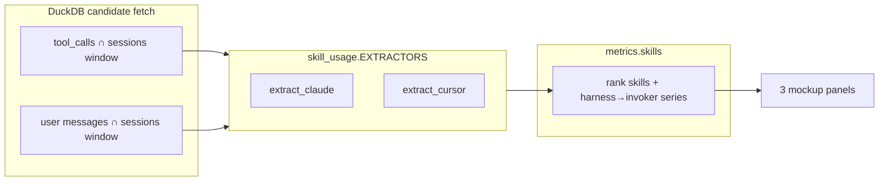

# Task: dashboard-skill-usage

* Task ID: dashboard-skill-usage
* Complexity: Level 3
* Type: feature

Skill Usage dashboard for [#63](https://github.com/Texarkanine/stockroom/issues/63): harness-extensible extraction + `/api/skills`, then three aggregate/compare chart mockups in the main dashboard (Tool Usage 1×1 size) so the operator can pick a visual before final layout placement.

## Pinned Info

### Skill-usage data flow

Pinned because every implementation step hangs off this pipeline (SQL candidates → extractors → aggregate → mockup panels).

## Empirical Extraction Findings

| Harness | Invoker | Signal | Skill name |
| --- | --- | --- | --- |
| Claude | user | `messages.role='user'` with `<command-name>/…</command-name>` | strip leading `/` from command-name |
| Claude | agent | `tool_calls.tool_name='Skill'` | `json_extract_string(tool_input, '$.skill')` |
| Claude | — | user text starting `Base directory for this skill:` | **ignore** (synthetic blob) |
| Cursor | agent | `Read` whose path ends with `/SKILL.md` | parent directory basename |
| Cursor | user | none observed | extractor no-op for now |

Counting: every discrete matching event counts (user 10 + agent 5 = 10 and 5).

## Component Analysis

### Affected Components
- **`stockroom.dashboard.skill_usage` (new)**: per-harness extractors + registry; normalized `SkillUse` events.
- **`stockroom.dashboard.metrics`**: add `skills()`; register in `ENDPOINTS`.
- **Dashboard static UI**: three mockup panels + panel builders + data fetch wiring.
- **Tests**: Python metrics/extractor tests; JS panel/data tests; static HTML smoke as needed.

### Cross-Module Dependencies
- `metrics.skills` → candidate SQL → `skill_usage` extractors → aggregate payload.
- `dashboard-data.mjs` → `/api/skills` → `buildSkills*Panel` → `renderChart`.

### Boundary Changes
- New public endpoint `/api/skills`.
- New Python module `skill_usage.py`.
- Temporary mockup panels in main metrics view (final placement follow-up).

### Invariants & Constraints
- Offline read-only `open_current()`; no schema migration.
- Server mode-agnostic; client aggregate/compare.
- Extractors differ by harness; event shape does not.
- No Claude skill-blob counting.
- No mondo multi-harness skill-identity SQL.
- Mockup phase does not reshuffle final layout.

## Open Questions

- [x] **Extractor architecture & API shape** → Resolved: candidate SQL + `EXTRACTORS` registry + server aggregate into `{skills, invokers, calls: {harness: {user, agent}}}` (see `memory-bank/active/creative/creative-skill-extractor-architecture.md`)
- [x] **Mockup chart set** → Resolved: ship Set A trio — nested doughnut, stacked bar, tools-like (see `memory-bank/active/creative/creative-skill-usage-mockups.md`)

## Test Plan (TDD)

### Behaviors to Verify

**Extractors (`skill_usage`)**
- Claude user command-name → `(skill, user)` event
- Claude Skill tool → `(skill, agent)` event
- Claude skill-blob user message → no event
- Claude non-skill user/tool → no event
- Cursor Read `…/niko/SKILL.md` → `("niko", "agent")`
- Cursor Read non-skill path → no event
- Cursor Read with `path` key (and ignore absent `file_path`)
- Unknown harness → empty iterator
- Multiple events in one session all count

**`metrics.skills`**
- Window + harness filter applied (subagents excluded)
- Ranks skills by total; respects `limit`; tie-break by name
- Response shape: aligned `calls[harness][invoker]` arrays
- Empty window → empty `skills` + zero/empty series
- Mix of Claude user+agent and Cursor agent aggregates correctly

**API / static**
- `/api/skills` registered and accepts `harness`/`since`/`until`
- Client request plan includes `skills`
- Each of three panel builders: aggregate non-empty model; compare multi-dataset model; empty payload → empty flag

### Edge Cases
- Skill name case / path normalization (`SKILL.md` suffix only)
- Command-name with args; skill tool with empty skill string → drop
- Sessions outside window ignored
- Harness deselected on client still present in payload (existing pattern)

### Test Infrastructure
- Framework: pytest (`skills/sr-search`); Node 22 built-in test runner for JS (`make test-dashboard-js`)
- Location: `skills/sr-search/tests/`, `skills/sr-search/tests-js/`
- Conventions: helpers `_seed_session` / `_seed_tool` in `test_dashboard_metrics.py`; JS imports panel builders
- New files: `tests/test_dashboard_skill_usage.py` (extractor unit + metrics.skills; real-shaped fixture strings inline or under `tests/fixtures/dashboard/`)
- Extend: `tests-js/dashboard-core.test.mjs`, `tests-js/dashboard-data.test.mjs` (hardcoded endpoint name list), `tests/test_dashboard_static.py` (panel id list includes `tools-panel` today)

### Integration Tests
- Seeded DuckDB → `metrics.skills` end-to-end (in `test_dashboard_skill_usage.py` or metrics suite)
- Optional: HTTP handler smoke if existing server tests cover ENDPOINTS generically

## Implementation Plan

Each numbered unit below is one TDD cycle: write/extend failing tests first, then implement until green, then refactor if needed.

1. **Extractors — tests then stubs then green** ✅
    - Files: `tests/test_dashboard_skill_usage.py`, `src/stockroom/dashboard/skill_usage.py`
    - TDD: write failing extractor tests first (include 2–3 fixture strings shaped like real warehouse rows: Claude command-name, Skill tool JSON, Cursor `SKILL.md` Read path); stub `SkillUse` / empty extractors / `EXTRACTORS` / `iter_skill_uses`; implement parsers to green
    - Creative ref: extractor architecture

2. **`metrics.skills` — tests then stub then green** ✅
    - Files: `tests/test_dashboard_skill_usage.py`, `metrics.py` (candidate helpers may live in `skill_usage.py`)
    - TDD: write failing ranking/window/shape tests first; stub `skills()` + `ENDPOINTS["skills"]`; implement candidate SQL + aggregation to green

3. **Client fetch — tests then wire** ✅
    - Files: `tests-js/dashboard-data.test.mjs`, `static/dashboard-data.mjs`
    - TDD: extend failing assertion that request plan includes `skills` (list currently hardcodes endpoint names); then add `"skills"` to `ENDPOINTS`

4. **Panel builders — tests then stubs then green** ✅
    - Files: `tests-js/dashboard-core.test.mjs`, `static/dashboard-core.mjs`
    - TDD: write failing tests for `buildSkillsNestedPanel` / `buildSkillsStackedPanel` / `buildSkillsToolsLikePanel` (aggregate + compare + empty); stub builders; implement encodings to green
    - Creative ref: mockup set

5. **Markup/render — tests then wire** ✅
    - Files: `tests/test_dashboard_static.py`, `static/index.html`, `static/dashboard.mjs`
    - TDD: extend failing static assertions for the three mockup panel ids (suite already pins `tools-panel`); then add panels + `renderChart` wiring + empty states at Tool Usage 1×1 size

6. **Verify** ✅
    - Run `make test-dashboard-py` and `make test-dashboard-js` (or project equivalents); fix task-related failures
    - Manual: open dashboard, confirm three mockups respond to Aggregate/Compare and time window
    - Docs: skip `docs/user-guide/dashboard.md` unless it catalogs `/api/*` endpoints (it does not today)

## Technology Validation

No new technology — validation not required (Chart.js already vendored; DuckDB/Python/JS stack unchanged).

## Challenges & Mitigations

- **Read volume / path key heterogeneity**: Mitigate with SQL candidate filter on `Skill` OR Read+`%/SKILL.md` via `path`/`file_path` COALESCE; extractors remain source of truth.
- **Nested doughnut in Chart.js without plugins**: Mitigate with two doughnut datasets (outer/inner radius) or two canvases in one panel; stacked bar is the fallback if nested proves flaky.
- **Compare-mode visual overload (4 stacks)**: Mitigate with harness hue + invoker alpha as decided in creative; keep legend labels `{harness} · {invoker}`.
- **False positives from skill blobs**: Mitigate with explicit ignore rule + unit test.
- **Cursor user invoker absent**: Document as intentional no-op; series still includes `user` zeros for shape stability.

## Pre-Mortem

- **Wrong layer: treat skill blobs as user uses** → Plan response: locked ignore rule + tests in steps 1–2 (already in Empirical Findings).
- **API shape too chart-specific, forces rewrite when picking a winner** → already covered by Challenge-adjacent creative decision: one series payload, panels reshape — keep panels presentation-only.
- **Mockups block usability of the real dashboard** → Plan response: “(mockup)” titles; follow-up deletes losers after pick; if grid feels too tall, operator can say so before placement pass.
- **Candidate SQL accidentally becomes mondo harness CASE** → Plan response: invariant + code review checklist — skill naming only in extractors.

## Status

- [x] Component analysis complete
- [x] Open questions resolved
- [x] Test planning complete (TDD)
- [x] Implementation plan complete
- [x] Technology validation complete
- [x] Pre-Mortem complete
- [x] Preflight — PASS (TDD steps re-encoded; static/JS endpoint touchpoints added; fixture-shaped extractor cases added)
- [x] Build
- [x] QA — PASS (KISS: simplified skills() harness loop; no substantive gaps)

## Preflight Amendments

- Re-encoded Implementation Plan so every unit states test-before-code (blocked TDD encoding risk on former steps 5/8).
- Explicitly include `test_dashboard_static.py` panel-id assertions and `dashboard-data.test.mjs` endpoint list.
- Extractor tests must include real-shaped warehouse fixture strings (not only abstract seeds).
