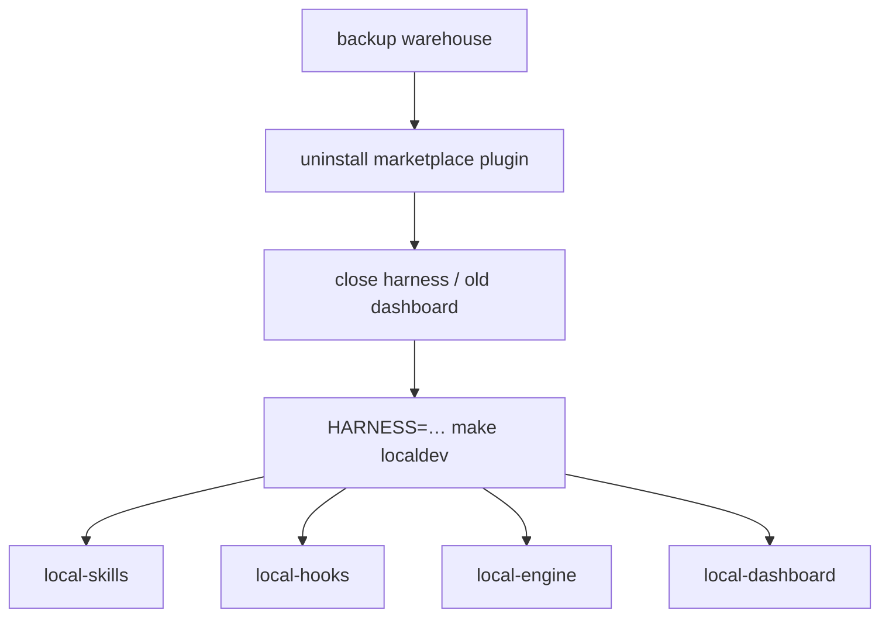

# Task: contributing-localdev-guide

* Task ID: contributing-localdev-guide
* Complexity: Level 3
* Type: enhancement (rework² — thin `local-*` atoms + `HARNESS`)

Throw out the mega-`localdev` recipe. Keep shim FORCE + deleted `plugin-local`. Reshape Make into named atoms; `localdev` only composes them. Harness-dependent atoms require `HARNESS=cursor|claude` and error if unset/invalid.

## Pinned Info

### Enter composition

### Locked atom inventory

| Target | `HARNESS`? | Role |
| --- | --- | --- |
| `local-skills` | required | Wire checkout skills for that harness |
| `local-hooks` | required | PATH project hooks for that harness only |
| `local-engine` | no | `shim TAKEOVER=1 FORCE=1` + `ensure-env` (owner `dev`) |
| `local-dashboard` | no | Bounce `stockroom dashboard` |
| `localdev` | required | Invokes the four atoms above |
| `localdev-clean` | required | Undo that harness’s managed bits (not warehouse/shim) |
| `localdev-status` | optional | Report managed vs shim sections |

Usage: `HARNESS=cursor make localdev`

## Cruft to throw out

- Fat inlined `localdev` recipe (skills+hooks+shim+ensure-env+dashboard as one opaque body)
- Dual-harness hook install in one call (install Cursor *and* Claude always)
- Docs that present `make localdev` without `HARNESS`
- Any leftover `plugin-local` references (already scrubbed; keep B2 gate)
- Preflight amendment that justified stuffing ensure-env *inside* an opaque localdev — ensure-env lives in **`local-engine`** atom instead

## Keep (already done / still valid)

- Shim `force` policy + CLI `--force` + tests S1–S5
- `make shim` low-level bake with optional `TAKEOVER=1` / `FORCE=1`
- `plugin-local` deleted
- PATH-based hooks (creative B) — no PLUGIN_ROOT
- Status section separator (localdev-managed vs shim)
- `hooks/localdev_hooks.py` — **slim**: require `--harness`, touch only that harness’s file

## Component Analysis

### Affected Components

- **`Makefile`**: replace mega-`localdev` with atoms + composer; `HARNESS` guard helper; clean/status per inventory
- **`hooks/localdev_hooks.py`**: `--harness {cursor,claude}` required; install/clean one harness
- **`docs/contributing/local-workflow.md`**: rip-it-out uses `HARNESS=… make localdev`; appendix documents each `local-*` atom
- **`docs/contributing/development.md`**, troubleshooting: match new targets / `HARNESS`
- **`memory-bank/techContext.md` / `systemPatterns.md`**: point at atom composition
- **Tests**: keep S1–S5; rewrite `test_localdev_hooks.py` for harness-scoped API; shell checks M1–M7 below

### Cross-Module Dependencies

Order inside `localdev`: `local-skills` → `local-hooks` → `local-engine` → `local-dashboard`  
(hooks files may be written before shim claim; they run later at sessionStart against on-path `stockroom`.)

### Boundary Changes

- Make: public atom targets + required `HARNESS` for harness-scoped ones
- Unchanged: shim CLI `--force` contract

### Invariants & Constraints

- Must preserve: succeed-or-refuse without FORCE; agents/skills never recommend FORCE
- Must preserve: TAKEOVER alone insufficient for live foreign
- Must hold: warehouse backup in rip-it-out story
- Must hold: `localdev-clean` does not touch warehouse, marketplace, or on-path shim
- Must hold: harness atoms error clearly when `HARNESS` unset or not `cursor`/`claude`
- Non-goal: `dashboard stop/restart` subcommands

## Open Questions

- [x] Project hooks + FORCE → creative B (PATH + two-key) — still binding for hook *content*
- [x] Mega one-shot vs atoms → **atoms + composer** (operator 2026-07-12; nk-refresh)
- [x] Atom inventory → table above (operator confirmed)
- [ ] Claude `local-skills`: what filesystem wiring is real today?

### Claude skills (minor — resolve in build with default)

If no stable Claude project-skills mirror exists: `HARNESS=claude make local-skills` prints a short “use `claude --plugin-dir $(CURDIR)` for session skills” and exits 0 (documented no-op), **or** exits nonzero asking for `--plugin-dir` — **prefer exit 0 + message** so `localdev` still completes hooks/engine/dashboard for Claude. Flag in docs appendix.

## Test Plan (TDD)

### Already green (do not regress)

- S1–S5 shim FORCE
- M1: `TAKEOVER=1 FORCE=1` vs plain `shim`
- M2: `plugin-local` gone
- B2: no `plugin-local` in user-facing docs

### New / revised Make checks

- M3: `make local-skills` / `local-hooks` / `localdev` / `localdev-clean` without `HARNESS` → nonzero + message
- M4: `HARNESS=nope make local-hooks` → nonzero
- M5: `make -n local-engine` shows takeover+force and ensure-env; no `HARNESS` required
- M6: `make -n HARNESS=cursor localdev` shows it invoking local-skills, local-hooks, local-engine, local-dashboard
- M7: `localdev-status` still has `=== localdev-managed ===` / `=== shim ===` separator
- M8: `HARNESS=cursor make -n localdev-clean` touches cursor hooks path / skills mirror; not warehouse

### Hooks helper (pytest)

- H1: `--harness cursor` install writes only `.cursor/hooks.json` managed marker; no PLUGIN_ROOT
- H2: `--harness claude` install writes only settings.local.json
- H3: clean for one harness preserves the other
- H4: missing `--harness` → nonzero

### Docs

- B1: `make docs-build` green
- B3: rip-it-out first; `HARNESS=… make localdev`; appendix lists atoms; FORCE warned

## Implementation Plan

1. **Slim `hooks/localdev_hooks.py` (TDD)** — H1–H4; drop dual-install; require `--harness`
2. **Makefile atoms** — check M3–M8 fail against current mega-recipe → implement:
   - `require-harness` guard
   - `local-skills` / `local-hooks` / `local-engine` / `local-dashboard`
   - `localdev` composer; `localdev-clean` / `localdev-status`
   - Delete inlined mega body
3. **Docs + memory-bank pointers** — rewrite local-workflow / development / troubleshooting snippets for atoms + `HARNESS`; techContext/systemPatterns
4. **Gates** — pytest (shim + localdev_hooks); M1–M8; docs-build; `make format` / `make ci`

## Challenges & Mitigations

- **Claude skills mirror unclear**: default no-op+message (open question default above)
- **Cursor project hooks experiment-gated**: document; `local-dashboard` still bounces once via composer
- **FORCE abuse**: unchanged two-key; only via `local-engine` / explicit `shim` flags
- **Pre-commit guard**: keep only on Cursor `local-skills` (skills mirror); do not over-guard unrelated project hooks forever

## Pre-Mortem

- **Plan fails by shipping another mega-recipe**: inventoried atoms; composer-only `localdev`
- **Plan fails by silent dual-harness writes**: `HARNESS` required
- **Plan fails leaving docs on old one-shot**: B3 + development target list

## Technology Validation

No new technology.

## Status

- [x] Prior rework: shim FORCE, plugin-local deleted, PATH hooks concept
- [x] nk-refresh: mega-recipe rejected; atoms + `HARNESS` locked
- [x] Atom inventory confirmed
- [x] Implementation plan (rework²) complete
- [ ] Preflight on this plan
- [ ] Build (atoms reshape)
- [ ] QA
