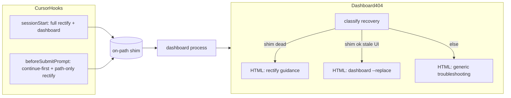

# Task: cursor-beforesubmit-shim-rectify-and-dashboard-recovery-ux

* Task ID: cursor-beforesubmit-shim-rectify-and-dashboard-recovery-ux
* Complexity: Level 3
* Type: feature / enhancement

Cursor macOS `sessionStart` misses leave the shim/dashboard unhealed. Add a trimmed non-blocking `beforeSubmitPrompt` path-only rectify suspenders path (keep `sessionStart`; no `workspaceOpen`), and improve dashboard static/document 404 recovery UX with shim-first classification (never `--replace` when the shim is the problem).

## Pinned Info

### Hook + recovery control flow

Why pinned: two surfaces (Cursor hook vs dashboard HTTP) share the shim-first invariant.

```mermaid
flowchart LR
  subgraph CursorHooks
    SS[sessionStart: full rectify + dashboard]
    BSP[beforeSubmitPrompt: continue-first + path-only rectify]
  end
  subgraph Dashboard404
    Probe[classify recovery]
    Probe -->|shim dead| R1[HTML: rectify guidance]
    Probe -->|shim ok stale UI| R2[HTML: dashboard --replace]
    Probe -->|else| R3[HTML: generic troubleshooting]
  end
  SS --> Shim[(on-path shim)]
  BSP --> Shim
  Shim --> Dash[dashboard process]
  Dash --> Dashboard404
```

## Component Analysis

### Affected Components

- **`hooks/cursor-hooks.json`**: today only `sessionStart` (full rectify + dashboard, timeout 300). → Add `beforeSubmitPrompt`: drain stdin, emit `{"continue":true}`, background path-only rectify; tiny timeout; no dashboard.
- **`stockroom.shim`**: `rectify` always calls `ensure_engine_env`. → Add path-only mode (`--path-only` / `ensure_env=False`) that only create/rebake; default unchanged for sessionStart.
- **`stockroom.dashboard.server`**: `_not_found` → bare JSON. → Static/document 404s render HTML via recovery classifier; `/api/*` 404 stays JSON.
- **`stockroom.dashboard.recovery` (new)**: classify shim_rectify | dashboard_replace | generic using shim header + APP_DIR liveness + static_root / identity checks.
- **Packaging tests** (`tests/test_packaging.py`): sessionStart-only assertions. → Add beforeSubmitPrompt contract; keep sessionStart full-path pins.
- **Shim tests** (`tests/test_shim.py`, `tests/test_shim_cli.py`): “rectify always ensures” → default still ensures; path-only skips.
- **Docs**: `docs/architecture/lifecycle.md`, `docs/user-guide/dashboard.md`, `docs/user-guide/troubleshooting/index.md` — suspenders path + recovery UX / `--replace` ordering.

### Cross-Module Dependencies

- beforeSubmitPrompt → `uv python find` + `python -m stockroom shim rectify --path-only` (needs `CURSOR_PLUGIN_ROOT`)
- recovery classifier → `shim._read_header` / public header reader + `DEFAULT_DEST` + filesystem; optional `dashboard.identity.read`
- sessionStart unchanged dependency on full `rectify` + `stockroom dashboard`

### Boundary Changes

- Public CLI: `stockroom shim rectify --path-only` (new flag; default behavior preserved)
- HTTP: non-API 404 responses become `text/html` recovery pages (API 404 JSON preserved)
- Cursor hooks schema: second event key `beforeSubmitPrompt`

### Invariants & Constraints

- Must never block prompt submit (continue-first, parent exits after spawn)
- Must never advise `--replace` when shim is missing/dead
- Path-only must not run `ensure_engine_env`
- sessionStart remains full ensure + dashboard; no `workspaceOpen`
- Hook commands remain fault-tolerant (`|| true`)
- SPA session-not-found stays client-side; API JSON 404 for missing session unchanged

## Open Questions

- [x] OQ1 Non-blocking trimmed beforeSubmitPrompt → Resolved: continue-first + background `--path-only` rectify (skip ensure-env). See `memory-bank/active/creative/creative-beforesubmit-rectify-trim.md`
- [x] OQ2 Recovery detection vs generic page → Resolved: ordered classifier (shim_rectify | dashboard_replace | generic); API stays JSON; static/document gets HTML. See `memory-bank/active/creative/creative-dashboard-recovery-ux.md`

## Test Plan (TDD)

### Behaviors to Verify

- Path-only rectify skips `ensure_engine_env` and still creates missing owned shim → installed
- Path-only rectify rebakes owned drifted shim → rectified
- Default rectify still calls `ensure_engine_env` (regression)
- Cursor hooks: `beforeSubmitPrompt` present; command has continue JSON, path-only/skip-ensure, no `stockroom dashboard`, backgrounds work; small timeout
- Cursor hooks: `sessionStart` still full rectify+dashboard, timeout 300, no workspaceOpen
- Classifier: shim absent/dead APP_DIR → `shim_rectify`; page body has rectify guidance and must **not** contain `dashboard --replace`
- Classifier: live shim + missing `index.html` in static_root → `dashboard_replace`; page mentions `--replace`
- Classifier: live shim + healthy static → `generic`; ordered remedies (shim-first) + docs link to `https://texarkanine.github.io/stockroom/user-guide/troubleshooting/#dashboard`
- HTTP: `GET /cute-puppies` → 404 HTML (not bare JSON object as sole body)
- HTTP: `GET /api/nope` → 404 JSON `{"error":"not found"}` (unchanged machine contract)
- HTTP: missing session API → still JSON 404 (existing test)

### Test Infrastructure

- Framework: pytest (+ xdist) under `skills/sr-search/tests/`
- Conventions: behavior-named `test_*.py`; server tests use `_running_server` helper
- New files: `tests/test_dashboard_recovery.py` (classifier + HTML contracts)
- Extend: `tests/test_packaging.py`, `tests/test_shim.py`, `tests/test_shim_cli.py`, `tests/test_dashboard_server.py`

### Integration Tests

- Packaging JSON load + command string contracts (hooks ↔ CLI flags)
- Live HTTP server with injected `static_root` / monkeypatched shim dest for recovery classes

## Implementation Plan

1. **Shim path-only mode (TDD)**
    - Files: `skills/sr-search/src/stockroom/shim.py`, `tests/test_shim.py`, `tests/test_shim_cli.py`
    - Changes: `rectify(..., *, ensure_env: bool = True)`; CLI `--path-only` sets `ensure_env=False`; docs in argparse help; update “always ensure” tests for default vs path-only
    - Creative ref: `creative-beforesubmit-rectify-trim.md`

2. **Cursor beforeSubmitPrompt hook (TDD)**
    - Files: `hooks/cursor-hooks.json`, `tests/test_packaging.py`
    - Changes: add event; continue-first; background path-only rectify via `uv python find`; no dashboard; timeout ~10; keep sessionStart as-is
    - Creative ref: `creative-beforesubmit-rectify-trim.md`

3. **Recovery classifier (TDD)**
    - Files: new `skills/sr-search/src/stockroom/dashboard/recovery.py`, `tests/test_dashboard_recovery.py`
    - Changes: `classify(...)` + HTML render helpers; shim-dead never includes `--replace`
    - Creative ref: `creative-dashboard-recovery-ux.md`

4. **Server wires HTML 404 for non-API (TDD)**
    - Files: `skills/sr-search/src/stockroom/dashboard/server.py`, `tests/test_dashboard_server.py`, `tests/test_dashboard_recovery.py`
    - Changes: `_not_found` / static miss → HTML via classifier; API path keeps JSON `_send_json(404, …)`

5. **Docs**
    - Files: `docs/architecture/lifecycle.md`, `docs/user-guide/dashboard.md`, `docs/user-guide/troubleshooting/index.md` (and architecture packaging note if needed)
    - Changes: document suspenders path-only beforeSubmitPrompt; recovery page + shim-first / `--replace` rule; mention macOS sessionStart unreliability briefly

6. **Full suite**
    - `make test` (or project-equivalent) before claiming build done

## Technology Validation

No new technology — validation not required. Uses existing Cursor hook events, stdlib HTTP, existing shim header parsing.

## Challenges & Mitigations

- **Cursor still blocks until hook process exits:** Parent must print continue, spawn child, exit immediately; keep short hook timeout; fail-open.
- **Background rectify storms:** Path-only is cheap/idempotent; accept for v1; flock later if needed.
- **False `--replace` advice:** Classifier short-circuits on dead/missing shim; unit-test forbids `--replace` substring in that HTML.
- **API clients expecting JSON on all 404s:** Only change non-API / document responses.
- **Existing “rectify always ensures” tests:** Split default vs `--path-only` cases deliberately.

## Pre-Mortem

- **Plan fails because path-only is insufficient and users still have empty envs with no sessionStart:** Already accepted tradeoff (OQ1); docs + sr-initialize remain; do not expand beforeSubmitPrompt to full ensure without new evidence.
- **Plan fails because we over-built detection and ship wrong advice:** Covered by Challenge (hard-rule tests) + generic fallback bucket.
- **Plan fails because we treated API session 404 as recovery HTML and broke the SPA:** Explicit invariant + keep existing JSON session 404 test.

## Status

- [x] Component analysis complete
- [x] Open questions resolved
- [x] Test planning complete (TDD)
- [x] Implementation plan complete
- [x] Technology validation complete
- [x] Pre-Mortem complete
- [ ] Preflight
- [ ] Build
- [ ] QA
