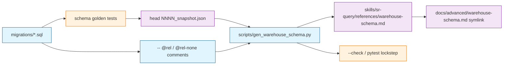

# Task: warehouse-schema-docs

* Task ID: warehouse-schema-docs
* Complexity: Level 3
* Type: feature

Put a query-facing visual warehouse schema (Mermaid ERD) in the `sr-query` skill and in human docs, generated from the existing head schema golden snapshot (not a dummy DuckDB), with a stdlib generator local developers can run and a CI/`--check` gate that fails on drift. See `memory-bank/active/projectbrief.md` and [issue #127](https://github.com/Texarkanine/stockroom/issues/127).

## Pinned Info

### Derivation pipeline

Why pinned: the whole feature is this pipeline. Dummy-warehouse generation was the issue's first idea; this diagram is the chosen substitute.

```mermaid
flowchart LR
    classDef source fill:#e1f5fe,stroke:#01579b;
    classDef artifact fill:#f3e5f5,stroke:#7b1fa2;
    classDef gate fill:#fff3e0,stroke:#ef6c00;

    Mig["migrations/*.sql"]:::source --> Tests["schema golden tests"]:::gate
    Tests --> Snap["head NNNN_snapshot.json"]:::artifact
    Mig --> Rel["-- @rel / @rel-none comments"]:::source
    Snap --> Gen["scripts/gen_warehouse_schema.py"]:::source
    Rel --> Gen
    Gen --> Skill["skills/sr-query/references/warehouse-schema.md"]:::artifact
    Skill --> Docs["docs/advanced/warehouse-schema.md symlink"]:::artifact
    Gen --> Check["--check / pytest lockstep"]:::gate
```

Logical FKs are **not** in DuckDB (deliberate 0001 invariant). Edges come from `-- @rel` / `-- @rel-none` comments in the migration SQL (invisible to DuckDB, same diff as the DDL). `session_token_usage` already appears in the head snapshot via `duckdb_columns()`; entities with an empty `primary_key` are drawn as views.

**Comment grammar** (stdlib regex over `skills/sr-search/src/stockroom/migrations/*.sql`):

- `-- @rel <from>(<cols>) -> <to>(<cols>) [: <label>]` — logical child→parent (or view→base). Mermaid is drawn `to ||--o{ from`. Optional label becomes the relationship caption (e.g. `owner_table=messages`).
- `-- @rel-none <entity>` — this snapshot entity has no ERD edges (`_sync_state`).
- Place the comment immediately above the `CREATE TABLE` / `CREATE VIEW` that introduces `<from>` (or the `@rel-none` entity). Repeated `@rel` lines for polymorphic `embeddings`.
- Coverage gate: every key in the head snapshot `tables` appears as a `<from>`, a `<to>`, or `@rel-none`. Every `<from>`/`<to>`/`@rel-none` name must exist in the snapshot (typos fail). An entity must not be both `@rel-none` and a `<from>`. Column names listed in `@rel` must exist on that entity in the snapshot.

## Component Analysis

### Affected Components
- **Schema goldens** (`skills/sr-search/tests/fixtures/schema/`, `_introspect_schema`): already the migrated product schema (tables + PKs + indexes). **No format change required.** Head today is `0008_snapshot.json` (six names: `sessions`, `messages`, `tool_calls`, `embeddings`, `_sync_state`, `session_token_usage`).
- **Migrations SQL** (`skills/sr-search/src/stockroom/migrations/*.sql`): today encode DDL + design-comment invariants, including “no DB-level FOREIGN KEYs”. → Add `-- @rel` / `-- @rel-none` lines above the CREATEs that introduce each product entity. Comments only; goldens and DuckDB apply are unchanged.
- **ERD generator** (`scripts/gen_warehouse_schema.py`, new): stdlib-only reader of the head snapshot **and** the migration `@rel` comments → committed markdown with a Mermaid `erDiagram`. No engine venv, no torch, no on-path `stockroom`, no dummy DB.
- **`sr-query` skill**: `SKILL.md` currently tells agents to introspect `information_schema` and keeps a hand-maintained column catalog "as of migrations 0001–0008". → Point at the generated ERD as the picture; keep join/guardrail doctrine; keep live introspection as a *check*, not the only map.
- **Human docs (Advanced)**: cookbook already uses skill-SSOT + `docs/advanced/cookbook/` symlinks. → Same pattern for the schema page. Architecture `warehouse.md` stays doctrine (no DDL dump); it only routes to the picture.
- **Engine pytest**: new `test_warehouse_schema_docs.py` (generator behavior + lockstep + docs symlink), next to `test_query_cookbook.py`.
- **Make / CI**: new `schema-docs` / `schema-docs-check` targets; engine CI and `make ci` run the check. Docs site CI stays a strict properdocs build (mermaid fence already enabled in `properdocs.yaml`). `lint` / `format` / `format-check` also ruff `../scripts` from the engine cwd so the new stdlib generator is in the same Python lane as the engine (`scripts/localdev.sh` is ignored by ruff).

### Cross-Module Dependencies
- **migrations → goldens**: existing `STOCKROOM_UPDATE_SCHEMA_GOLDEN=1` pytest path. Unchanged; still the schema lock.
- **migrations `@rel` → generator → skill reference**: logical edges travel with the DDL; goldens still supply entities/columns. A new table without `@rel`/`@rel-none` fails coverage even if the golden was updated.
- **goldens → generator → skill reference**: one-way derive of boxes/attributes. Contributors who change schema update the head snapshot, declare `@rel` in the same migration, then run `make schema-docs`.
- **skill reference → docs symlink**: docs must not fork the body (cookbook contract).
- **generator `--check` → CI**: same function pytest lockstep calls; Make is a thin wrapper so humans and CI share one command.

### Boundary Changes
- **No warehouse DDL / runtime schema change** (SQL comments are not constraints).
- **New contributor convention**: `-- @rel` / `-- @rel-none` in migrations is the logical-edge SSOT for the ERD.
- **New committed skill resource** (PPL-S via existing `skills/**/references/**` REUSE override). Hub layout remains install layout — the file is committed, not generated post-install.
- **New contributor command** `make schema-docs` (write) / `make schema-docs-check` (fail on drift).
- **Public query picture** moves from a stale-prone SKILL prose catalog to a generated ERD. Join rules stay in SKILL.md.

### Invariants & Constraints
- Must preserve committed-layout-equals-install (no generate-on-main for skills).
- Must preserve migrations as DDL source of truth; goldens remain the migrated-schema lock; the ERD is derived.
- Must preserve "no DB-level FOREIGN KEYs" — `@rel` comments document logical relationships only; they are not `REFERENCES` clauses.
- Must hold: every product entity in the head snapshot is `@rel`-accounted (from, to, or `@rel-none`), so a new table cannot ship as a floating box.
- Must hold: generator and `--check` run with CPython stdlib only (no plugin install, no engine `.venv` required to regenerate).
- Must preserve Architecture as explanation, not a DDL dump (`docs/architecture/warehouse.md`).
- Non-goal: a `stockroom schema` CLI, live-warehouse dump as the SSOT, or generating files on the `main` branch after merge.
- Non-goal: `-- @doc` column-meaning comments, or harvesting inline `--` comments from the migration chain into a generated data dictionary. Operator rejected (2026-08-29): forward-only migrations scatter prose across files; an older file can still contain a string that a later migration made false, sitting next to strings that are still true. Meanings that a human must *read* belong in one current document (Architecture / SKILL guardrails / the generated ERD of *head* structure), not in the historical SQL log.

## Open Questions

None - implementation approach is clear. Dummy DuckDB was rejected in favor of the existing head golden snapshot. Dual-audience placement follows the cookbook symlink pattern. Operator chose preflight's `@rel` comment convention over a Python `RELATIONSHIPS` list (2026-08-29). Operator rejected `-- @doc` / harvesting migration inline comments as a data dictionary (2026-08-29): layered migrations are a write log, not a readable glossary. No creative phase.

## Test Plan (TDD)

### Behaviors to Verify

- **Toy render**: a 2-table snapshot dict (PKs + types including `FLOAT[384]`) → mermaid `erDiagram` containing both entity names, PK markers, and sanitized types (no raw `[` `]` that break Mermaid).
- **Link-free body**: rendered markdown contains no relative markdown links (cookbook recipe-body rule: the same bytes are served from the skill path and the docs symlink). `https://` URLs are allowed; none are required.
- **View heuristic**: an entity with `primary_key: []` is emitted as a view (not a base table), including `session_token_usage` in the toy or a dedicated case.
- **Logical relationships**: `@rel` edges from SQL comments appear as Mermaid relationship lines; `@rel-none` entities appear as boxes with no edges.
- **@rel parser**: toy SQL with two `@rel` lines and one `@rel-none` yields those edges/entities; ordinary `--` comments and DDL are ignored; a contradictory `@rel-none` + `@rel` for the same `<from>` is an error.
- **@rel coverage**: given a snapshot and a rel set, every snapshot table name is a from, a to, or rel-none; an unknown name in `@rel` fails; a snapshot name in neither set fails; a column listed in `@rel` that is missing from that entity fails.
- **Head snapshot coverage**: rendering the repo's head `NNNN_snapshot.json` includes every key under `tables`.
- **Repo @rel coverage**: parsing the real `migrations/` tree accounts for every head-snapshot entity (fails until the comments exist).
- **Lockstep**: `check(repo_root)` / CLI `--check` succeeds when the committed SSOT matches a fresh render; fails (nonzero, no write) when the committed file is missing or differs.
- **Write**: CLI default writes `skills/sr-query/references/warehouse-schema.md` so a subsequent `--check` passes.
- **Dual-audience symlink**: `docs/advanced/warehouse-schema.md` is a symlink whose resolve() is the skill SSOT (cookbook contract).

### Edge Cases

- Head snapshot discovery: highest numeric `NNNN_snapshot.json` wins (`0005` has no file; today `0008`).
- DuckDB types `VARCHAR[]`, `FLOAT[384]`, `HUGEINT`, `JSON` are sanitized for Mermaid attributes.
- `--check` does not write the SSOT on failure.
- `_sync_state` is included (it is in the snapshot) even though SKILL calls it uninteresting to query.
- Indexes are **not** required on the ERD (HNSW is snapshot data, not query-forming structure); a one-line generated note is enough.
- A later migration that `CREATE`s a table without `@rel`/`@rel-none` fails coverage even when the golden JSON was regenerated.
- Column lists in `@rel` may contain spaces after commas; labels may contain `=` (embeddings `owner_table=…`).

### Test Infrastructure

- Framework: pytest (`skills/sr-search/pyproject.toml`, xdist `addopts -n auto`)
- Test location: `skills/sr-search/tests/`
- Conventions: `test_*.py`, `repo_root` fixture from `conftest.py`; cookbook dual-audience tests in `test_query_cookbook.py` as the symlink precedent
- New test files: `skills/sr-search/tests/test_warehouse_schema_docs.py`
- Importing the generator: `importlib` from `repo_root / "scripts/gen_warehouse_schema.py"` (script is not an engine package)

### Integration Tests

- Lockstep + symlink + repo `@rel` coverage tests are the cross-component integration (migrations comments ↔ goldens ↔ generator ↔ skill file ↔ docs path).
- Do **not** add SKILL.md phrase/link change-detectors. Do **not** assert on `ci.yaml` text, `.pages` nav labels, or Architecture wording.

## Implementation Plan

**Build progress**

- [x] 1. ERD generator and @rel parser
- [x] 2. Migration @rel annotations and repo coverage
- [x] 3. Commit SSOT + repo lockstep
- [x] 4. Dual-audience docs symlink
- [x] 5. Make check wrapper
- [x] 6. Engine CI step
- [x] 7. sr-query skill text
- [x] 8. Human docs routing
- [x] 9. Contributor regen loop
- [x] 10. Standing-contract memory-bank pointers
- [x] 11. Visible Mermaid view alias (QA rework)
- [x] 12. Compact SKILL column-meaning guardrails (QA rework)

### 1. ERD generator and @rel parser — executable

- Files: `scripts/gen_warehouse_schema.py`, `skills/sr-search/tests/test_warehouse_schema_docs.py`
- Creative ref: none (operator accepted preflight `@rel` sketch)

1. Stub tests: empty cases in `test_warehouse_schema_docs.py` for toy render, type sanitization, view heuristic, `@rel` parser (toy SQL), parser contradiction, coverage helper (pass/fail/typo), relationship lines from parsed rels, link-free body, head-snapshot entity names, `--check` fail-when-missing (tmp_path), write-then-check (tmp_path).
2. Stub interface: `scripts/gen_warehouse_schema.py` with `load_head_snapshot(fixtures_dir)`, `parse_rels(sql_text)`, `parse_rels_dir(migrations_dir)`, `assert_coverage(snapshot, rels)`, `render_markdown(snapshot, rels)`, `ssot_path(repo_root)`, `check(repo_root)`, `write(repo_root)`, and `main(argv)` — documented signatures, empty/raise bodies.
3. Write tests and run red: assertions on mermaid `erDiagram` text, sanitized `FLOAT[384]`, empty-PK view marking, parsed edges/labels, coverage failures, no relative `](…)` links, every head-snapshot table name present in a render, `check` nonzero on missing/mismatch, `write` then `check` ok. Run `cd skills/sr-search && uv run --no-sync --no-config pytest -n0 tests/test_warehouse_schema_docs.py -v` (expect FAIL).
4. Write code and run green: stdlib `json` + `pathlib` + `re`; discover max `NNNN_snapshot.json`; parse `@rel` / `@rel-none` per the pinned grammar; `check()` runs `assert_coverage` then compares render (tmp_path tests supply a tiny `migrations/` + snapshot so coverage can pass without the real tree). Emit markdown template (title, "logical relationships / no DB FKs", mermaid fence, short index note) **with zero relative markdown links** (human cross-links live on the pages in step 8, not in the generated body). CLI `python3 scripts/gen_warehouse_schema.py` writes, `--check` compares. Re-run the same pytest until green. Do **not** yet require the real migrations to parse (that's step 2); toy SQL and tmp_path cover the parser.

### 2. Migration @rel annotations and repo coverage — executable

- Files: `skills/sr-search/src/stockroom/migrations/0001_initial_schema.sql`, `skills/sr-search/src/stockroom/migrations/0007_session_token_usage.sql`, `skills/sr-search/tests/test_warehouse_schema_docs.py`
- Creative ref: none

1. Stub tests: `test_repo_migrations_rel_coverage(repo_root)` empty — `assert_coverage(load_head_snapshot(...), parse_rels_dir(migrations_dir))`.
2. Stub interface: none new.
3. Write tests and run red: coverage assertion against the real tree (fails until comments exist).
4. Write code and run green: add comments only (no DDL changes):
   - `0001`: `@rel-none _sync_state`; `@rel messages(harness, session_id) -> sessions(harness, session_id)`; `@rel tool_calls(harness, session_id, message_id) -> messages(harness, session_id, message_id)`; two `@rel` lines on `embeddings` → `messages` / `tool_calls` with labels `owner_table=messages` and `owner_table=tool_calls`.
   - `0007`: `@rel session_token_usage(harness, session_id) -> sessions(harness, session_id) : rolls up`.
   - `sessions` is a `<to>` only (no `@rel-none`). Re-run pytest green. Existing `test_schema_*.py` must still pass (comments are invisible to DuckDB).

### 3. Commit SSOT + repo lockstep — executable

- Files: `skills/sr-query/references/warehouse-schema.md` (generated), `skills/sr-search/tests/test_warehouse_schema_docs.py` (add lockstep against `repo_root`)
- Creative ref: none

1. Stub tests: add `test_committed_ssot_matches_head_snapshot_render(repo_root)` (empty).
2. Stub interface: none new (`check(repo_root)` already stubbed in step 1).
3. Write tests and run red: assert `check(repo_root)` is success (will fail until the file exists and matches).
4. Write code and run green: run the generator once to write the SSOT; re-run pytest green.

### 4. Dual-audience docs symlink — executable

- Files: `docs/advanced/warehouse-schema.md` (symlink), `docs/advanced/.pages`, `skills/sr-search/tests/test_warehouse_schema_docs.py`
- Creative ref: none (cookbook pattern)

1. Stub tests: `test_docs_warehouse_schema_symlinks_to_skill_ssot(repo_root)` empty.
2. Stub interface: none.
3. Write tests and run red: same assertions as `test_docs_cookbook_pages_symlink_to_ssot_recipes` (is_symlink + resolve to skill SSOT).
4. Write code and run green: create the symlink; add a `Warehouse schema` entry to `docs/advanced/.pages` in the same step (`omitted_files: warn` + no `- ...` wildcard means a page without a nav entry fails `make docs-build`). Do not assert on the nav label (prose). Pytest green.

### 5. Make check wrapper — executable

- Files: `Makefile`, `skills/sr-search/tests/test_warehouse_schema_docs.py`
- Creative ref: none

1. Stub tests: `test_make_schema_docs_check_passes(repo_root)` empty — subprocess `make schema-docs-check` from `repo_root`, assert returncode 0 (precedent: `test_coverage_collection.py` running Make).
2. Stub interface: none (Make target is the interface).
3. Write tests and run red: assertion on returncode 0 (fails until the target exists).
4. Write code and run green: `schema-docs` → `python3 scripts/gen_warehouse_schema.py`; `schema-docs-check` → `python3 scripts/gen_warehouse_schema.py --check`; add `schema-docs-check` to `make ci` and `.PHONY`. Extend `lint` / `format` / `format-check` with a second recipe line `$(UV_RUN) ruff check ../scripts` (and `ruff format` / `ruff format --check` on the same path) so the generator is in the engine ruff lane (`UV_RUN` already cwd's into `skills/sr-search`; `../scripts` is the repo `scripts/` dir; POSIX `localdev.sh` is ignored). Keep the Make pytest as an existence pin only — do not duplicate lockstep assertions there. Pytest green.

### 6. Engine CI step — prose/policy

- Files: `.github/workflows/ci.yaml`
- No tests: prose/policy artifact (workflow YAML). Drift is already gated by pytest in this same job.

1. Add a named step `Warehouse schema docs lockstep` with `working-directory: ${{ github.workspace }}` running `make schema-docs-check` (after engine tests so a missing Make target still fails the job if pytest were skipped in a future CI edit).
2. Engine-job `Lint` and `Format check` currently run `ruff check` / `ruff format --check` with cwd `skills/sr-search` and **do not** call root `make lint`. Extend those two commands to also cover `../scripts` (e.g. `ruff check . ../scripts` and `ruff format --check . ../scripts`) so the generator is gated in CI, not only on a local `make lint`. `make schema-docs-check` does not substitute for this.

### 7. sr-query skill text — prose/policy

- Files: `skills/sr-query/SKILL.md`
- No tests: prose/policy artifact

1. In "What's in the warehouse", lead with a link to [`references/warehouse-schema.md`](references/warehouse-schema.md) as the visual schema.
2. Keep live `information_schema` as a *verify* query, not the primary map.
3. Remove the stale-prone per-column catalog ("as of migrations 0001–0008"); keep identity/join rules, token-grain VIEW guidance, `tool_input` JSON guardrail, `_sync_state` "not interesting" note.

### 8. Human docs routing — prose/policy

- Files: `docs/advanced/index.md`, `docs/advanced/duckdb.md`, `docs/user-guide/search.md`, `docs/architecture/warehouse.md`
- No tests: prose/policy artifact

1. Advanced index + DuckDB + Search: link the picture for query-forming (these pages are single-path, so relative links are fine). Nav already landed in step 4.
2. Architecture warehouse Migrations section: route to Advanced for the ERD; do not paste DDL or the mermaid into Architecture (inclusion bar).

### 9. Contributor regen loop — prose/policy

- Files: `docs/contributing/iteration/engine.md`
- No tests: prose/policy artifact

1. Add a new section (this loop is not documented anywhere in `docs/` today — `STOCKROOM_UPDATE_SCHEMA_GOLDEN` exists only in `tests/test_schema_*.py`). Cover: schema change → declare `-- @rel` / `-- @rel-none` on the new entity in that migration → update head golden (`STOCKROOM_UPDATE_SCHEMA_GOLDEN=1` on the relevant `test_schema_NNNN.py`) → `make schema-docs` → commit migration comments + snapshot + generated ERD. Coverage fails if the `@rel` line is omitted. Add the new Make targets to the "Relevant Make Targets" table.
2. Note: regen needs CPython 3 and the repo; it does not need `sr-initialize`, torch, or an on-path shim.

### 10. Standing-contract memory-bank pointers — prose/policy

- Files: `memory-bank/techContext.md` (Warehouse Schema section), `memory-bank/systemPatterns.md` (docs ownership sentence)
- No tests: prose/policy artifact

1. Surgical only if the standing-contract probe fires: techContext points at generated Advanced/skill ERD + `make schema-docs` + `@rel` comments as logical-edge SSOT; systemPatterns docs-ownership mentions schema SSOT beside the cookbook. Skip productContext (no product-audience change).

### 11. Visible Mermaid view alias (QA rework) — executable

- Files: `scripts/gen_warehouse_schema.py`, `skills/sr-search/tests/test_warehouse_schema_docs.py`, `skills/sr-query/references/warehouse-schema.md` (regenerated)
- Creative ref: none (QA finding)

1. Tighten `test_view_heuristic_marks_empty_primary_key_as_view` to require a Mermaid entity alias `name["name (view)"]` and to reject `%% view:` comments. Drop the toy-render ban on all `[` `]` in the fence (that was a FLOAT[384] belt; keep the unsanitized-type asserts).
2. Run red, then emit aliases for empty-PK entities; keep relationship ids as the SQL name. `make schema-docs` to refresh the SSOT.

### 12. Compact SKILL column-meaning guardrails (QA rework) — prose/policy

- Files: `skills/sr-query/SKILL.md`
- No tests: prose/policy artifact

1. Under "What's in the warehouse", after the ERD pointer, add a compact note covering only what the picture cannot show: `project_id` as verbatim slug/grouping key; `cwd` / `workspace_key` nullable and different rollups; `entrypoint` via `SELECT DISTINCT`; `messages.text` is the whole turn and thinking is not captured; `tool_calls` is inputs only, never outputs.
2. Do not restore the exhaustive catalog or an `as of migrations NNNN` pin.

## Technology Validation

No new technology - validation not required. Stdlib `python3` + `re`, existing pytest, existing Mermaid in properdocs, existing cookbook symlink pattern, existing schema goldens. `@rel` is a comment convention, not a DuckDB feature.

## Challenges & Mitigations

- **Mermaid vs DuckDB types**: `FLOAT[384]` / `VARCHAR[]` can break attribute syntax. Mitigation: sanitize to mermaid-safe tokens; unit-test those types.
- **Mermaid vs DuckDB types**: `FLOAT[384]` / `VARCHAR[]` can break attribute syntax. Mitigation: sanitize to mermaid-safe tokens; unit-test those types.
- **No declared FKs**: a dump of `information_schema` would be boxes with no edges. Mitigation: `-- @rel` comments in the same migration as the CREATE, plus coverage so a new entity cannot ship undeclared.
- **View vs table in snapshot**: `session_token_usage` sits under `tables` with an empty PK. Mitigation: empty PK → view in the diagram; do not churn golden JSON format.
- **Large `sessions` entity (~24 attrs)**: busy but appropriate for docs (illustrate-complexity: completeness beats brevity on the site). Do not split unless preflight/build finds it unreadable.
- **Two-step contributor workflow** (golden then ERD): now three beats — `@rel` coverage, golden snapshot, generated markdown. CI fails if any is skipped; contributing docs name the sequence.
- **This checkout has no localdev plugin install**: generator is stdlib and reads fixtures already in the tree; engine pytest still uses `uv run` as today.

## Pre-Mortem

- **Plan assumed we must stand up DuckDB to know the schema**: false — goldens already introspect migrations. Response: pipeline pinned above; dummy DB is a non-goal.
- **SKILL column catalog left in place, ERD added beside it, they drift independently**: plan step 7 deletes the catalog and points at the generated file.
- **Check only in docs CI, so a migration PR that skips docs job description still merges**: put pytest lockstep + `make schema-docs-check` on the engine CI job (always runs on PRs).
- **Generator heuristic mis-labels a future heap table as a view**: product tables have PKs by invariant; contributing note covers it. Already covered by Challenges (view heuristic).
- **`scripts/*.py` silently unlinted**: first Python outside the engine dir. Plan step 5 extends root Make ruff to `../scripts`. Plan step 6 extends the engine-job `Lint` / `Format check` commands the same way, because CI does not invoke `make lint`.
- **Relative links in the generated body work in docs and break in the skill (or vice versa)**: plan step 1 forbids them; a unit test asserts it.
- **New table ships as a floating box because edges lived in a Python list nobody updated**: `@rel` coverage in the same migration file. Already the point of step 2.
- **`-- @doc` as a generated data dictionary**: rejected. Migrations are layered; readers would assemble meaning from a dozen files where an old comment can be wrong next to a still-correct one. `@rel` stays viable because coverage is against the *head* snapshot (current names only) and edges are structural, not prose to read.
- **Hub≠install because someone generates the ERD in a post-merge main job**: non-goal / invariant; files are committed on the PR.

## Status

- [x] Component analysis complete
- [x] Open questions resolved
- [x] Test planning complete (TDD)
- [x] Implementation plan complete
- [x] Technology validation complete
- [x] Pre-Mortem complete
- [x] Preflight
- [x] Build
- [x] QA — FAIL
- [x] Build (QA rework)
- [x] QA — FAIL (round 2)
- [x] Build (QA rework: SKILL column meanings)

## QA Results

- **FAIL (round 1, resolved):** The generated Mermaid ERD marked `session_token_usage` with `%% view: …`, which does not render. Rework emits `name["name (view)"]` aliases.
- **FAIL (round 2, Build must rerun):** Plan unit 7 removed the version-pinned per-column catalog, which is correct for *structure*. The same edit also deleted meanings the ERD cannot express, and they now appear nowhere in the skill payload: `project_id` is the verbatim project-dir slug and grouping key; `cwd` / `workspace_key` are nullable and serve different rollups; `entrypoint` should be discovered with `SELECT DISTINCT`; `messages.text` is the whole message and thinking is not captured; `tool_calls` holds inputs only, never outputs. Add a compact note under "What's in the warehouse" — no exhaustive column list, no `as of migrations NNNN` pin.
