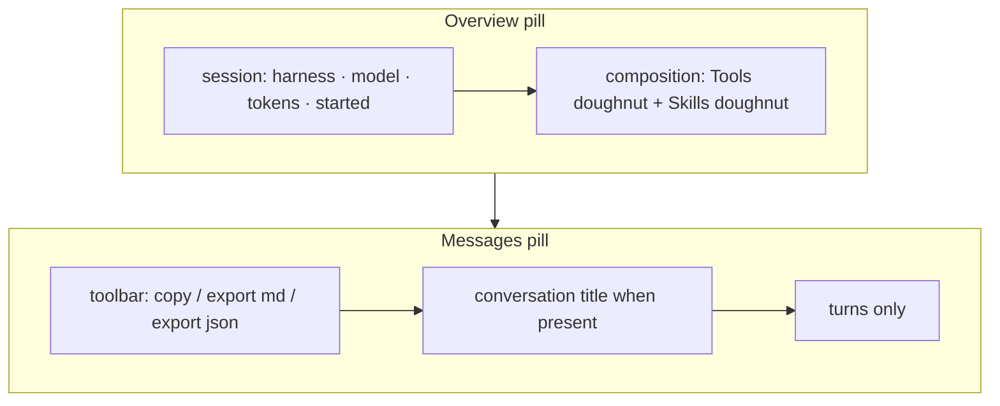

# Task: conversation-summary-tool-skill-pie-charts

* Task ID: conversation-summary-tool-skill-pie-charts
* Complexity: Level 3
* Type: feature

Per-conversation tool & skill distribution on the dashboard session view (layout **F-a**), plus an advanced query cookbook recipe. Closes [#107](https://github.com/Texarkanine/stockroom/issues/107).

## Pinned Info

### F-a layout

```mermaid
flowchart TD
  subgraph overview["Overview pill"]
    S["session: harness · model · tokens · started"]
    C["composition: Tools doughnut + Skills doughnut"]
    S --> C
  end
  subgraph messages["Messages pill"]
    T["toolbar: copy / export md / export json"]
    H["conversation title when present"]
    M["turns only"]
    T --> H --> M
  end
  overview --> messages
```

Creative record: `memory-bank/active/creative/creative-session-distribution-placement.md`

## Component Analysis

### Affected Components
- **Dashboard session UI** (`static/index.html`, `dashboard.mjs`, `dashboard-session.mjs`, CSS): split `#session-pane` into overview + messages cards per F-a.
- **Chart helpers** (`dashboard-core.mjs` `buildToolsPanel` / `buildSkillsNestedPanel`; `dashboard.mjs` `renderChart`): reuse metrics doughnut language for session-scoped canvases.
- **Session detail API** (`metrics.session_detail`, `server.py` `/api/session`): add `title`, session-scoped tools/skills aggregates; skills via `skill_usage.iter_skill_uses` on session-scoped rows.
- **Query cookbook** (`skills/sr-query/references/cookbook/` + docs symlinks): new per-session tools/skills recipe + index rows.

### Cross-Module Dependencies
- Session UI → `GET /api/session` → `session_detail` → DuckDB + `skill_usage`
- Cookbook independent of dashboard (same warehouse tables)

### Boundary Changes
- Extend `session_detail` JSON: `title`, `tools`, `skills` (shapes aligned with `/api/tools` + `/api/skills` for one session)
- New cookbook recipe file + docs symlink

### Invariants & Constraints
- Offline / vendored Chart.js only
- Preserve deep links `?view=session&harness=&session=` + `#msg-N`
- Messages card is transcript chrome only (toolbar + title + turns)
- Overview has no “conversation overview” header
- Composition: charts only, no explanatory prose
- Cookbook SSOT under `skills/sr-query/references/cookbook/`

## Open Questions

- [x] Session overview distribution placement → **F-a** (see creative doc). Toolbar in messages card; F-b rejected.

## Test Plan (TDD)

### Behaviors to Verify

- Session detail with tool calls → API includes tools aggregate matching counts by `tool_name`
- Session with skill uses → API includes skills aggregate from `iter_skill_uses` on that session only
- Session with `sessions.title` set → API `title` is that string; UI messages heading uses it
- Session with null/empty title → UI falls back to existing harness/session display pattern
- Empty tools/skills → composition shows empty state (no broken charts)
- Meta overview shows only harness, model, tokens, started (not project/subagent in that band — subagent may remain elsewhere if already required; default: four metrics only per F)
- Static landmarks: overview session/composition sections + messages toolbar/title/turns present
- Cookbook recipe exists, indexed, docs symlink to SSOT
- Existing `#msg-N` deep-link / export / copy-link behaviors do not regress

### Test Infrastructure

- Framework: pytest (+ xdist) for Python; Node 22 built-in runner for dashboard JS (`make test-dashboard-js` / `make test-dashboard-py`)
- Test location: `skills/sr-search/tests/`, `skills/sr-search/tests-js/`
- Conventions: `test_*.py`, `*.test.mjs`; dashboard fixtures already in metrics/server tests
- New test files: none required if extensions fit existing suites; optional thin helper tests in `dashboard-session.test.mjs` / `dashboard-core.test.mjs`

### Integration Tests

- `test_dashboard_server.py`: `/api/session` returns new fields
- `test_dashboard_static.py`: F-a landmarks in `index.html`

## Implementation Plan

1. **API — session_detail aggregates + title** (TDD)
   - Files: `metrics.py` (`session_detail`), `tests/test_dashboard_metrics.py`, `tests/test_dashboard_server.py`
   - Changes: SELECT `title`; compute tools rollup from session `tool_calls`; skills via session-scoped candidates + `iter_skill_uses`; return shapes compatible with `buildToolsPanel` / `buildSkillsNestedPanel`
   - Creative ref: F-a composition data

2. **JS helpers — meta entries for overview** (TDD)
   - Files: `dashboard-session.mjs` (`buildSessionMetaEntries` or new builder), `tests-js/dashboard-session.test.mjs`
   - Changes: overview meta = harness, model, tokens, started only; title resolution helper for messages heading

3. **HTML/CSS — F-a structure** (TDD via static tests)
   - Files: `static/index.html`
   - Changes: overview card (`session` + composition chart shells); messages card (toolbar, `#session-title`, turns); CSS for stacked pills matching dashboard tokens

4. **JS — renderSessionDetail wiring** (TDD)
   - Files: `dashboard.mjs` (`renderSessionDetail`, element refs, `renderChart` names)
   - Changes: mount overview meta + composition charts via `buildToolsPanel` / `buildSkillsNestedPanel`; messages toolbar unchanged; title on messages card

5. **Cookbook recipe**
   - Files: `skills/sr-query/references/cookbook/session-tools-skills.md` (name may vary), cookbook `index.md`, `docs/advanced/cookbook/index.md`, symlink under `docs/advanced/cookbook/`
   - Changes: per-session tool + skill distribution SQL; **When:** blurb; indexes + symlink

6. **Docs touch** (if user-guide session section needs a sentence)
   - Files: `docs/user-guide/dashboard.md` — brief note that session view shows composition charts

7. **Verify**
   - `make test-dashboard-py`, `make test-dashboard-js`, targeted cookbook test, then broader `make test` as required before done

## Technology Validation

No new technology — validation not required (vendored Chart.js already in use).

## Challenges & Mitigations

- **Skill extraction harness differences**: Reuse `skill_usage.iter_skill_uses`; do not invent a parallel extractor.
- **Payload shape mismatch with panel builders**: Mirror `/api/tools` and `/api/skills` field names so builders need no special-case mode.
- **Title availability**: Many sessions may lack `title` — keep fallback heading.
- **Chart lifecycle on re-render**: Destroy/replace charts on session navigation like metrics pane does.

## Pre-Mortem

- **Charts wired client-side from nested tool_calls only, skills forgotten**: Plan requires API skills aggregate + skill_usage — already covered by Challenge 1 / step 1.
- **UI keeps meta inside messages card**: Static landmark tests + F-a HTML step force split.
- **Cookbook drifts from SSOT**: `test_query_cookbook.py` symlink contract — already covered.

## Status

- [x] Component analysis complete
- [x] Open questions resolved
- [x] Test planning complete (TDD)
- [x] Implementation plan complete
- [x] Technology validation complete
- [x] Pre-Mortem complete
- [x] Preflight
- [x] Build
- [x] QA

### Build checklist

- [x] API session_detail title + tools/skills aggregates
- [x] JS meta/heading helpers + F-a HTML/CSS + renderSessionDetail charts
- [x] Cookbook session-tools-skills + docs symlink
- [x] User-guide session inspection note
- [x] `make test-dashboard-py` / `make test-dashboard-js`
