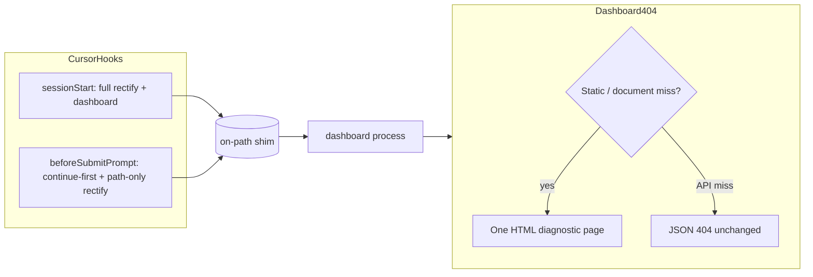

# Task: cursor-beforesubmit-shim-rectify-and-dashboard-recovery-ux

* Task ID: cursor-beforesubmit-shim-rectify-and-dashboard-recovery-ux
* Complexity: Level 3
* Type: feature / enhancement

Cursor macOS `sessionStart` misses leave the shim/dashboard unhealed. Add a trimmed non-blocking `beforeSubmitPrompt` path-only rectify suspenders path (keep `sessionStart`; no `workspaceOpen`), and when the dashboard cannot serve real UI, return one in-memory diagnostic HTML page (ordered remedies + online manual links) instead of bare JSON 404.

## Pinned Info

### Hook + recovery control flow

Why pinned: suspenders heal vs broken-listener UX are separate surfaces; recovery MVP is one page, not a classifier.

```mermaid
flowchart LR
  subgraph CursorHooks
    SS[sessionStart: full rectify + dashboard]
    BSP[beforeSubmitPrompt: continue-first + path-only rectify]
  end
  subgraph Dashboard404
    Broken{Static / document miss?}
    Broken -->|yes| Page[One HTML diagnostic page]
    Broken -->|API miss| JSON[JSON 404 unchanged]
  end
  SS --> Shim[(on-path shim)]
  BSP --> Shim
  Shim --> Dash[dashboard process]
  Dash --> Dashboard404
```

## Component Analysis

### Affected Components

- **`hooks/cursor-hooks.json`**: today only `sessionStart` (full rectify + dashboard, timeout 300). → Add `beforeSubmitPrompt`: drain stdin, emit `{"continue":true}`, background path-only rectify; tiny timeout; no dashboard.
- **`stockroom.shim`**: `rectify` always calls `ensure_engine_env`. → Add path-only mode (`--path-only` / `ensure_env=False`) that only create/rebake; default unchanged for sessionStart.
- **`stockroom.dashboard.server`**: static miss → bare JSON via `_not_found`. → Static/document misses serve in-memory diagnostic HTML; `/api/*` and session-miss keep JSON `_not_found()`.
- **`stockroom.dashboard.recovery` (new, thin)**: render one self-contained HTML diagnostic page (copy + ordered remedies + docs links). No classifier in MVP. Module must be importable at server start so it still works if the plugin tree is later deleted from disk.
- **Packaging tests** (`tests/test_packaging.py`): sessionStart-only assertions. → Add beforeSubmitPrompt contract; keep sessionStart full-path pins.
- **Shim tests** (`tests/test_shim.py`, `tests/test_shim_cli.py`): “rectify always ensures” → default still ensures; path-only skips.
- **Docs**: `docs/architecture/lifecycle.md`, `docs/user-guide/dashboard.md`, `docs/user-guide/troubleshooting/index.md` — suspenders path + diagnostic page; ensure troubleshooting anchors cover shim / ensure-env / `--replace`.

### Cross-Module Dependencies

- beforeSubmitPrompt → `uv python find` + `python -m stockroom shim rectify --path-only` (needs `CURSOR_PLUGIN_ROOT`)
- server static miss → `dashboard.recovery` HTML (stdlib only; no warehouse open)
- sessionStart unchanged dependency on full `rectify` + `stockroom dashboard`

### Boundary Changes

- Public CLI: `stockroom shim rectify --path-only` (new flag; default behavior preserved)
- HTTP: static/document 404 responses become `text/html` diagnostic pages (API 404 JSON preserved)
- Cursor hooks schema: second event key `beforeSubmitPrompt`

### Invariants & Constraints

- Must never block prompt submit (continue-first, parent exits after spawn)
- Path-only must not run `ensure_engine_env`
- sessionStart remains full ensure + dashboard; no `workspaceOpen`
- Hook commands remain fault-tolerant (`|| true`)
- Diagnostic page remedies are **ordered shim-first** (rectify / new session / ensure-env / `sr-initialize` before `--replace`) so copy never leads with `--replace` as the only fix
- SPA session-not-found stays client-side; API JSON 404 for missing session unchanged
- Recovery HTML is generated from in-memory code loaded at process start (no read of deleted plugin files)

## Open Questions

- [x] OQ1 Non-blocking trimmed beforeSubmitPrompt → Resolved: continue-first + background `--path-only` rectify (skip ensure-env). See `memory-bank/active/creative/creative-beforesubmit-rectify-trim.md`
- [x] OQ2 Recovery detection vs generic page → Resolved (operator MVP, 2026-07-30): **one generic diagnostic page** when the listener cannot serve real UI; no shim-vs-replace classifier in this task. Exact FS probing deferred. See `memory-bank/active/creative/creative-dashboard-recovery-ux.md` (MVP amendment)

## Test Plan (TDD)

### Behaviors to Verify

- Path-only rectify skips `ensure_engine_env` and still creates missing owned shim → installed
- Path-only rectify rebakes owned drifted shim → rectified
- Default rectify still calls `ensure_engine_env` (regression)
- Cursor hooks: `beforeSubmitPrompt` present; command has continue JSON, path-only/skip-ensure, no `stockroom dashboard`, backgrounds work; small timeout
- Cursor hooks: `sessionStart` still full rectify+dashboard, timeout 300, no workspaceOpen
- Diagnostic HTML: includes shim-first ordered remedies; mentions ensure-env / initialize path; includes `--replace` only after shim/env guidance; links to online manual (`https://texarkanine.github.io/stockroom/user-guide/troubleshooting/` and relevant anchors)
- HTTP: `GET /cute-puppies` → 404 `text/html` diagnostic page (not bare JSON object as sole body)
- HTTP: `GET /` with missing `index.html` in `static_root` → same diagnostic HTML (broken-listener recognition)
- HTTP: `GET /api/nope` → 404 JSON `{"error":"not found"}` (unchanged machine contract)
- HTTP: missing session API → still JSON 404 (existing test)

### Test Infrastructure

- Framework: pytest (+ xdist) under `skills/sr-search/tests/`
- Conventions: behavior-named `test_*.py`; server tests use `_running_server` helper
- New files: `tests/test_dashboard_recovery.py` (HTML content contracts — not classifier matrix)
- Extend: `tests/test_packaging.py`, `tests/test_shim.py`, `tests/test_shim_cli.py`, `tests/test_dashboard_server.py`

### Integration Tests

- Packaging JSON load + command string contracts (hooks ↔ CLI flags)
- Live HTTP server with injected empty/missing `static_root` serving diagnostic HTML

## Implementation Plan

1. **Shim path-only mode**
    - Files: `skills/sr-search/src/stockroom/shim.py`, `tests/test_shim.py`, `tests/test_shim_cli.py`
    - TDD: (a) add failing tests for `rectify(..., ensure_env=False)` / CLI `--path-only` skipping ensure + still create/rebake; (b) keep/adjust default “always ensures” regression; (c) implement `ensure_env` kwarg + `--path-only` until green
    - Creative ref: `creative-beforesubmit-rectify-trim.md`

2. **Cursor beforeSubmitPrompt hook**
    - Files: `hooks/cursor-hooks.json`, `tests/test_packaging.py`
    - TDD: (a) add failing packaging tests for `beforeSubmitPrompt` (continue JSON, `--path-only`, no dashboard, background/detach marker, small timeout) and sessionStart unchanged; (b) edit `cursor-hooks.json` until green
    - Creative ref: `creative-beforesubmit-rectify-trim.md`

3. **Diagnostic page module**
    - Files: new `skills/sr-search/src/stockroom/dashboard/recovery.py`, `tests/test_dashboard_recovery.py`
    - TDD: (a) failing tests that rendered HTML has ordered remedies (shim/session → ensure-env/`sr-initialize` → `--replace`) + docs URLs; (b) implement in-memory HTML renderer until green — **no classifier**
    - Ensure `server` imports recovery at module load (so it survives plugin-dir deletion)
    - Creative ref: `creative-dashboard-recovery-ux.md` (MVP)

4. **Server wires HTML 404 for static/document misses**
    - Files: `skills/sr-search/src/stockroom/dashboard/server.py`, `tests/test_dashboard_server.py`, `tests/test_dashboard_recovery.py`
    - TDD: (a) failing HTTP tests: `/cute-puppies` and `/` with missing index → 404 HTML; `/api/nope` and missing session → JSON 404 unchanged; (b) route **static miss** through recovery HTML — keep `_not_found()` as JSON for API/session
    - Creative ref: `creative-dashboard-recovery-ux.md` (MVP)

5. **Docs** (prose; no behavior tests)
    - Files: `docs/architecture/lifecycle.md`, `docs/user-guide/dashboard.md`, `docs/user-guide/troubleshooting/index.md`
    - Changes: suspenders path-only beforeSubmitPrompt; diagnostic page behavior; macOS sessionStart note; ensure anchors the page links to exist and mention shim / ensure-env / `--replace`

6. **Full suite**
    - Run whole test suite before claiming build done

## Technology Validation

No new technology — validation not required. Uses existing Cursor hook events and stdlib HTTP.

## Challenges & Mitigations

- **Cursor still blocks until hook process exits:** Parent must print continue, spawn child, exit immediately; keep short hook timeout; fail-open.
- **Background rectify storms:** Path-only is cheap/idempotent; accept for v1; flock later if needed.
- **Wrong single-cause advice on one page:** Order remedies shim-first and link docs; do not claim a single root cause in MVP.
- **API clients expecting JSON on all 404s:** Only change static/document responses.
- **Recovery code missing after plugin wipe:** Import recovery at server startup; HTML from string constants in that module.
- **Existing “rectify always ensures” tests:** Split default vs `--path-only` cases deliberately.

## Pre-Mortem

- **Plan fails because path-only is insufficient and users still have empty envs with no sessionStart:** Accepted; diagnostic page + docs must mention ensure-env / `sr-initialize`, not only path rectify.
- **Plan fails because a “helpful” page still leads with `--replace`:** Mitigate with ordered-remedy content tests.
- **Plan fails because we treated API session 404 as recovery HTML and broke the SPA:** Explicit invariant + keep existing JSON session 404 test.

## Status

- [x] Component analysis complete
- [x] Open questions resolved
- [x] Test planning complete (TDD)
- [x] Implementation plan complete
- [x] Technology validation complete
- [x] Pre-Mortem complete
- [x] Preflight (re-validated after MVP amendment 2026-07-30)
- [ ] Build
- [ ] QA

## Preflight Amendments

- Per-unit TDD ordering explicit (test → implement) for steps 1–4.
- Static HTML recovery must not reuse `_not_found()` wholesale — API/session JSON 404 stays on that helper.
- **MVP (2026-07-30):** drop shim-vs-replace classifier and public shim header reader requirement; one in-memory diagnostic page with ordered remedies + online manual links.
