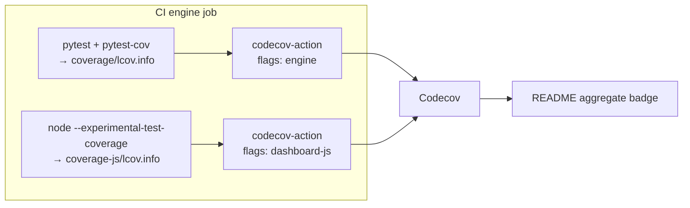

# Task: codecov-readme-badges

* Task ID: codecov-readme-badges
* Complexity: Level 3
* Type: feature (CI/tooling)

Wire Codecov into stockroom: collect coverage from the engine pytest and dashboard JS test-run roots, upload flagged reports from CI, and show one aggregate Codecov badge on the root README (a16n-lite). Creative decision: `memory-bank/active/creative/creative-coverage-aggregation.md`.

## Pinned Info

### Coverage upload flow

CI collects two lcov reports, uploads each with a Codecov flag; the default project badge aggregates both for the commit.

```mermaid
flowchart LR
  subgraph CI["CI engine job"]
    Py["pytest + pytest-cov\n→ coverage/lcov.info"]
    Js["node --experimental-test-coverage\n→ coverage-js/lcov.info"]
    UpE["codecov-action\nflags: engine"]
    UpJ["codecov-action\nflags: dashboard-js"]
    Py --> UpE
    Js --> UpJ
  end
  UpE --> CC[Codecov]
  UpJ --> CC
  CC --> Badge["README aggregate badge"]
```

## Component Analysis

### Affected Components
- **Engine pytest / uv project** (`skills/sr-search/`): add `pytest-cov` to `dev`; `[tool.coverage.*]` for source/omit; emit `coverage/lcov.info`
- **Dashboard JS tests** (`tests-js/`, `make test-dashboard-js`): coverage via Node 22 built-ins (`--experimental-test-coverage` + `lcov` reporter); emit `coverage-js/lcov.info`; keep default `make test-dashboard-js` human-readable (coverage on dedicated target / CI path)
- **CI** (`.github/workflows/ci.yaml`): run coverage-enabled tests; two `codecov/codecov-action@v7` uploads with flags
- **Codecov config** (`codecov.yml`, new at repo root): flag paths + carryforward; status checks off initially (a16n)
- **README**: one aggregate Codecov badge beside REUSE
- **Makefile**: `coverage` / `coverage-engine` / `coverage-dashboard-js` (or equivalent) mirroring CI collection; `test` stays without forcing coverage noise
- **gitignore**: ignore coverage output dirs / `.coverage`
- **Contributor docs**: note coverage Make targets + `CODECOV_TOKEN` in iteration docs (`engine.md` / `dashboard.md` / index as appropriate)

### Cross-Module Dependencies
- CI orchestrates both roots and uploads; Codecov merges by commit SHA for the project badge
- Badge URL is flag-agnostic; flag URLs remain available for later README use
- Local Make targets should mirror CI so contributors can reproduce reports

### Boundary Changes
- No product/runtime API changes
- Dev dependency: `pytest-cov` (+ lock regenerate via `make lock`)
- Ops: GitHub Actions secret `CODECOV_TOKEN` (outside repo; document)

### Invariants & Constraints
- Must preserve green `make test` / existing CI steps' pass semantics
- Must not invent a third test framework
- Both roots collected; flags `engine` + `dashboard-js`; README aggregate only
- Prefer a16n upload/action/carryforward patterns

## Open Questions

- [x] OQ1: Coverage aggregation vs per-root presentation → Resolved: **Flags + aggregate README (a16n-lite)** (see `memory-bank/active/creative/creative-coverage-aggregation.md`)

## Test Plan (TDD)

### Behaviors to Verify

- **Engine lcov emit**: running the engine coverage command on the test suite (or a narrow subset) → writes `skills/sr-search/coverage/lcov.info` containing `SF:` paths under `src/stockroom/` and not treating `tests/` as the primary covered package
- **Dashboard JS lcov emit**: running the JS coverage command → writes `skills/sr-search/coverage-js/lcov.info` containing `SF:` paths under `src/stockroom/dashboard/static/` 
- **JS include scope**: coverage report → does not treat `tests-js/*.test.mjs` as the dominant covered surface when include filters are applied (assert static modules appear; test files absent or excluded per config)
- **make test unchanged semantics**: `make test-dashboard-js` without coverage flags → still runs and passes (no required lcov side effect)
- **Negative / edge**: coverage command with missing Node 22 → same failure mode as today for dashboard JS; engine coverage without sync'd `pytest-cov` → clear failure after lock/sync

### Test Infrastructure

- Framework: pytest (engine) + Node built-in test runner (dashboard JS)
- Test location: `skills/sr-search/tests/` for collection plumbing tests
- Conventions: subprocess CLI tests exist (`test_*_cli.py`); prefer a focused `tests/test_coverage_collection.py` that subprocesses the same commands Make/CI will use on a small subset
- New test files: `skills/sr-search/tests/test_coverage_collection.py`
- Out of scope as change-detectors: asserting README badge markdown text, asserting full `codecov.yml` prose

### Integration Tests

- Subprocess: engine coverage collection produces parseable lcov with stockroom SF paths
- Subprocess: dashboard JS coverage collection produces parseable lcov with static SF paths
- Build-phase verification: full `make coverage` (or CI-equivalent) + lock-check after adding pytest-cov

## Implementation Plan

1. **Stub coverage-collection tests** (TDD — empty bodies)
    - Files: `skills/sr-search/tests/test_coverage_collection.py`
    - Changes: suite + case signatures for engine lcov emit, JS lcov emit, JS include scope, and `make test-dashboard-js` unchanged semantics; no assertions yet

2. **Implement coverage-collection tests** (TDD — red)
    - Files: `skills/sr-search/tests/test_coverage_collection.py`
    - Changes: fill assertions; subprocess the **root Make targets** (`coverage-engine`, `coverage-dashboard-js`, `test-dashboard-js`) so local/CI/Make stay one SSOT; expect fail until steps 3–4 exist
    - Note: narrow the engine coverage invocation via a Make variable (e.g. `COVERAGE_PYTEST_ARGS`) if full-suite subprocess is too heavy for the unit test — default Make target still runs the full suite

3. **Add pytest-cov + coverage config**
    - Files: `skills/sr-search/pyproject.toml`, `skills/sr-search/uv.lock` (via `make lock`)
    - Changes: `pytest-cov` in `dev`; `[tool.coverage.run]` source=`stockroom` / omit tests & vendored; `[tool.coverage.report]` as needed; do **not** put `--cov` in default `addopts` (keep `make test` fast/unchanged — coverage opt-in)
    - Creative ref: engine flag paths → `skills/sr-search/src/stockroom/`

4. **Make targets for coverage**
    - Files: `Makefile`
    - Changes: `coverage-engine` (pytest with `--cov=stockroom --cov-report=lcov:coverage/lcov.info` etc.), `coverage-dashboard-js` (mkdir + node experimental coverage + lcov destination + `--test-coverage-include` for static), `coverage` depending on both; leave `test` / `test-dashboard-js` as-is
    - Creative ref: dual-root collection

5. **Green the collection tests**; iterate include/omit / Make knobs until assertions pass

6. **codecov.yml**
    - Files: `codecov.yml` (repo root)
    - Changes: flags `engine` / `dashboard-js` with paths + `carryforward: true`; project/patch status `enabled: false` initially; comment config optional (condensed like a16n)
    - Creative ref: a16n-lite flags

7. **CI upload**
    - Files: `.github/workflows/ci.yaml`
    - Changes: replace plain pytest/JS test steps with **root Make** `coverage-engine` / `coverage-dashboard-js` (working-directory `${{ github.workspace }}`) so CI and local share SSOT; avoid a second full suite run; two `codecov/codecov-action@v7` steps with `files:` (paths under `skills/sr-search/…`), `flags:`, `token: ${{ secrets.CODECOV_TOKEN }}`, `fail_ci_if_error: false`
    - Creative ref: dual flagged uploads

8. **gitignore coverage artifacts**
    - Files: `.gitignore`
    - Changes: `.coverage`, `coverage/`, `coverage-js/`, `htmlcov/` under engine or repo-wide patterns as appropriate

9. **README badge**
    - Files: `README.md`
    - Changes: aggregate Codecov badge URL for `Texarkanine/stockroom` next to REUSE
    - Creative ref: aggregate-only README surface

10. **Contributor docs** (prose — no behavior tests owed)
    - Files: `docs/contributing/iteration/engine.md`, `docs/contributing/iteration/dashboard.md` (and index table if targets are listed there)
    - Changes: document coverage Make targets; note `CODECOV_TOKEN` required for uploads; badge 404 until first successful upload is expected

11. **Verification**
    - Run new collection tests; full `make test` / `make ci` locally as feasible; confirm lcov artifacts gitignored

## Technology Validation

- **pytest-cov**: new uv `dev` dependency — validate via `make lock` + `make sync` + `coverage-engine` producing lcov (PoC during build Step 2–4)
- **Node coverage**: no new dependency — already validated (`lcov` reporter writes Codecov-ready file on Node v22.22.1)
- **codecov-action@v7**: match a16n; token is external secret (cannot fully validate upload offline — CI after merge/PR)

## Challenges & Mitigations

- **Double suite cost if CI runs tests then coverage**: Mitigation — single pytest invocation with coverage in CI; local `make test` stays coverage-free
- **xdist + coverage**: Mitigation — pytest-cov supports xdist; if flaky, CI uses `-n0` for coverage run only
- **JS coverage includes test files / wrong paths**: Mitigation — `--test-coverage-include` for `src/stockroom/dashboard/static/**`; asserted in tests
- **CODECOV_TOKEN missing**: Mitigation — `fail_ci_if_error: false` so PRs stay green; document secret setup for badge activation
- **Badge 404 until first upload**: Mitigation — document as expected; not a code bug
- **Aggregate % dominated by Python**: Accepted tradeoff of Creative B; flags remain for inspection

## Pre-Mortem

- **Plan failed because CI ran coverage twice / doubled wall time and flaked**: Prefer one coverage-enabled test invocation per root in CI (Challenge already covers); do not add a separate full re-run
- **Plan failed because we treated "aggregate vs separate" as mutually exclusive and skipped flags**: Already decided against — Creative B keeps flags
- **Plan failed because default `addopts --cov` slowed every local pytest and annoyed contributors**: Keep coverage off default `addopts`; only Make coverage targets / CI enable it
- **Plan failed because Codecov rejected Node lcov path layout**: Assert SF paths in tests; adjust `--test-coverage-include` / working-directory before relying on upload

## Preflight Amendments

- Split TDD into stub → implement tests (red) → production → green (explicit test-before-code per executable unit)
- CI invokes root Make coverage targets (SSOT with local) instead of inlining pytest/node argv in the workflow
- Collection tests subprocess Make targets (same SSOT); optional `COVERAGE_PYTEST_ARGS` for narrow test-time engine runs

## Status

- [x] Component analysis complete
- [x] Open questions resolved
- [x] Test planning complete (TDD)
- [x] Implementation plan complete
- [x] Technology validation complete
- [x] Pre-Mortem complete
- [x] Preflight
- [ ] Build
- [ ] QA
