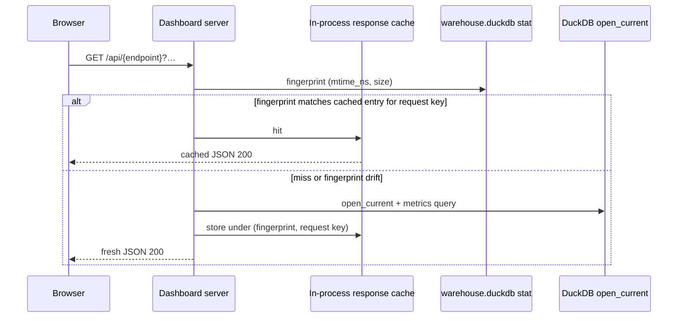

# Task: dashboard-freshness-cache

* Task ID: dashboard-freshness-cache
* Complexity: Level 3
* Type: feature

Cache dashboard API payloads so a browser refresh does not recompute warehouse metrics when nothing has been ingested or backfilled. Invalidation must cover ingest and backfill (backfill does not advance `_sync_state`).

## Pinned Info

### Cache hit vs miss on API GET

Shows why the freshness check is a cheap `stat()` before any DuckDB work, and why ingest/backfill need not call the dashboard.

```mermaid
sequenceDiagram
    participant Browser
    participant Server as Dashboard server
    participant Cache as In-process response cache
    participant FS as warehouse.duckdb stat
    participant DB as DuckDB open_current

    Browser->>Server: GET /api/{endpoint}?…
    Server->>FS: fingerprint (mtime_ns, size)
    alt fingerprint matches cached entry for request key
        Server->>Cache: hit
        Cache-->>Browser: cached JSON 200
    else miss or fingerprint drift
        Server->>DB: open_current + metrics query
        Server->>Cache: store under (fingerprint, request key)
        Server-->>Browser: fresh JSON 200
    end
```

## Component Analysis

### Affected Components

- **`stockroom.dashboard.server`**: Routes `/api/*`; currently opens a fresh `open_current` connection per request and always runs the metrics endpoint. → Consult in-process cache before open; store successful JSON payloads after compute; clear/ignore entries when warehouse fingerprint drifts.
- **New `stockroom.dashboard.cache` (or equivalent helper module)**: Does not exist. → Own fingerprinting (`warehouse.warehouse_path().stat()` → `(mtime_ns, size)`), thread-safe store keyed by `(fingerprint, endpoint, canonical_query)`, hit/miss/clear-on-drift API.
- **`stockroom.dashboard.metrics`**: Pure SQL → JSON payload functions. → Unchanged contracts; still the miss-path compute engine.
- **`stockroom.ingest` / `stockroom.backfill`**: Writers that change warehouse content. → No code changes for invalidation (file fingerprint covers them). Covered by integration tests that mutate the warehouse and assert cache miss → fresh payload.
- **Dashboard SPA (`static/*.mjs`)**: Remounts on refresh and re-fetches. → No required client changes for MVP; benefit comes from faster server responses.
- **Docs (`docs/user-guide/dashboard.md`, optionally contributing iteration note)**: State freshness ownership. → Note that the long-lived server caches API responses until the warehouse file changes (ingest/backfill/other writers).

### Cross-Module Dependencies

- Server → cache helper → `warehouse.warehouse_path()` for `stat` (no DB open on hit).
- Server → `warehouse.open_current` + `metrics.ENDPOINTS` on miss only.
- Ingest/backfill → warehouse file (implicit invalidation); no import edge into dashboard.

### Boundary Changes

- Internal: new cache module; `_DashboardServer` gains cache state.
- Public HTTP JSON shapes unchanged; no new required query params.
- No warehouse schema / migration changes.
- Optional (non-MVP unless cheap): `ETag` header derived from fingerprint — defer unless it falls out naturally.

### Invariants & Constraints

- Must preserve read-only dashboard (`open_current`, no migrate, no write).
- Must not serve stale JSON after ingest or backfill writes.
- Must not rely on `_sync_state` alone for freshness.
- Must remain correct under `ThreadingHTTPServer` concurrent GETs.
- Must preserve existing 400/404/503 behavior (do not cache error responses that depend on transient busy/stale, or cache only successful 200 JSON bodies).
- Cache is process-local; process replace/restart cold-starts (acceptable).

## Open Questions

- [x] **Cache placement and freshness signal** → Resolved: server in-process response cache keyed by warehouse file `(mtime_ns, size)` + request identity; no ingest/backfill hooks (see `memory-bank/active/creative/creative-dashboard-cache-architecture.md`).

## Test Plan (TDD)

### Behaviors to Verify

- Cold miss then hit: first `GET /api/overview` computes; second identical request returns the same JSON without requiring a second warehouse open (inject opener / counter).
- Fingerprint drift invalidates: after a warehouse write that changes file `stat`, next GET recomputes and returns updated data.
- Ingest invalidates: seed warehouse → cache warm → run ingest that adds rows → next GET reflects new data (not stale cache).
- Backfill invalidates without watermark move: warm cache → backfill write path that inserts sessions while `_sync_state` unchanged → next GET reflects new data.
- Request-key isolation: different query strings (`harness`, `since`/`until`, session id, sessions paging) do not share cache entries.
- Errors not sticky: 503 busy/stale/missing and 404 session-miss are not served forever from cache after the underlying state recovers (do not cache non-200, or equivalent policy).
- Thread safety smoke: concurrent identical GETs after warm-up do not corrupt responses (same JSON body).
- Read-only open does not bust cache: repeated hits leave fingerprint stable (unit-level on fingerprint helper + server hit path).

### Test Infrastructure

- Framework: `pytest` (+ `pytest-xdist`) under `skills/sr-search/tests/`
- Conventions: `warehouse_home` fixture; `_running_server` helper in `test_dashboard_server.py`; injectable `open_warehouse`
- New test files: `tests/test_dashboard_cache.py` (unit: fingerprint + store); extend `tests/test_dashboard_server.py` (HTTP hit/miss/invalidation). Prefer unit tests with a tiny DuckDB file for fingerprint/write behavior; integration for ingest/backfill.

### Integration Tests

- Server + ingest: warm → ingest → assert overview (or targeted endpoint) changes / opener called again.
- Server + backfill-shaped write: mutate warehouse without updating `_sync_state` → assert cache miss and fresh payload (can simulate with direct SQL write if full backfill fixture is heavy; prefer real backfill adapter fixture if already available and cheap).

## Implementation Plan

1. **Unit: fingerprint + store** (TDD) — DONE
    - Files: `skills/sr-search/tests/test_dashboard_cache.py` (new), `skills/sr-search/src/stockroom/dashboard/cache.py` (new)
    - Changes: `warehouse_fingerprint(path) -> tuple[int, int] | None`; thread-safe `ResponseCache` with `get`/`put`/`invalidate_if_stale` keyed by fingerprint + endpoint + canonical query; clear-all on fingerprint change.
    - Creative ref: `creative-dashboard-cache-architecture.md`

2. **Canonical request key + server miss/hit wiring** (TDD) — DONE
    - Files: `tests/test_dashboard_cache.py`, `tests/test_dashboard_server.py`, `src/stockroom/dashboard/cache.py`, `src/stockroom/dashboard/server.py`
    - Changes: shared `canonical_request_key(endpoint, query)` (sorted harnesses; last-wins scalars; same semantics as current query parsing) used for cache keys; `_DashboardServer` holds a `ResponseCache`; `_serve_api` / `_serve_session` fingerprint + cache **before** `_open_readonly`; on 200 success, `put`; injectable opener counter proves hits skip DuckDB open entirely.
    - Creative ref: same
    - Preflight amendment: canonicalize keys in one helper so routing and cache cannot drift.

3. **Invalidation via warehouse write** (TDD)
    - Files: `tests/test_dashboard_server.py` (and/or `test_dashboard_cache.py`)
    - Changes: tests that write to the warehouse (ingest and a no-watermark mutation representing backfill) and assert subsequent responses are fresh.

4. **Error / concurrency contracts** (TDD)
    - Files: `tests/test_dashboard_server.py`
    - Changes: assert non-200 not cached; concurrent GETs return identical valid JSON after warm-up.

5. **Docs**
    - Files: `docs/user-guide/dashboard.md`; `docs/architecture/lifecycle.md` (dashboard freshness sentence); `docs/contributing/iteration/dashboard.md` only if it currently implies every refresh always re-queries.
    - Changes: document that the long-lived server caches API JSON until `warehouse.duckdb` changes on disk (ingest, backfill, or other writers). Prose-only — no change-detector tests.

6. **Verification**
    - Run targeted dashboard tests, then full suite per project rules.

## Technology Validation

No new technology - validation not required. Uses stdlib `threading` + `Path.stat` + existing DuckDB open path.

## Challenges & Mitigations

- **Large payload memory**: Snapshot fan-out caches ~10 endpoints × filter variants. Mitigation: clear-all on fingerprint drift; monitor; add LRU only if needed (YAGNI).
- **False invalidation after embed/migrate**: Accepted; correctness over stickiness (creative tradeoff).
- **Canonical query key bugs** (`parse_qs` list order / harness order): Normalize the same way metrics already interprets query (sorted harnesses, last-wins for scalars) when building the cache key.
- **Injectable opener tests vs real skip-open**: Prefer a wrapping counter around the real opener so hit path truly avoids DuckDB.
- **Backfill fixture cost**: If full cursor vscdb backfill is heavy in CI, use a controlled write that inserts fact rows without touching `_sync_state`, and document it as the backfill invalidation contract; add a lighter real-backfill test only if fixtures already support it cheaply.

## Pre-Mortem

- **Plan assumed file fingerprint always moves on warehouse content change, but some write path does not**: Creative verified normal DuckDB commits; keep an explicit test that a content insert without `_sync_state` update invalidates — if that test ever fails on a real adapter, reopen creative for a SQL content epoch.
- **Plan optimized server cache but user pain was actually SPA/JS render cost**: Server cache still helps multi-GB open/query; if UAT still feels slow after hits, measure client render separately (out of scope unless confirmed).
- **Caching 200s accidentally papers over 503 recovery**: Challenge already says do not cache non-200 — keep that as a hard AC in tests.

## Status

- [x] Component analysis complete
- [x] Open questions resolved
- [x] Test planning complete (TDD)
- [x] Implementation plan complete
- [x] Technology validation complete
- [x] Pre-Mortem complete
- [x] Preflight — PASS (2026-07-30); amendment: shared `canonical_request_key`; architecture lifecycle docs in step 5
- [ ] Build
- [ ] QA

## Preflight Findings

- TDD encoding: steps 1–4 are test-before-code per executable unit; step 5 docs are prose-only (no change-detectors).
- Conventions: new `dashboard/cache.py` matches sibling modules (`recovery`, `identity`, `metrics`); tests under `tests/test_dashboard_*.py`.
- No existing response-cache utility to reuse; LLM token “cache_*” fields are unrelated.
- Dependency impact confined to dashboard server + tests + docs; ingest/backfill untouched for invalidation.
- Advisory applied: shared canonical request key helper to prevent query-key drift.
