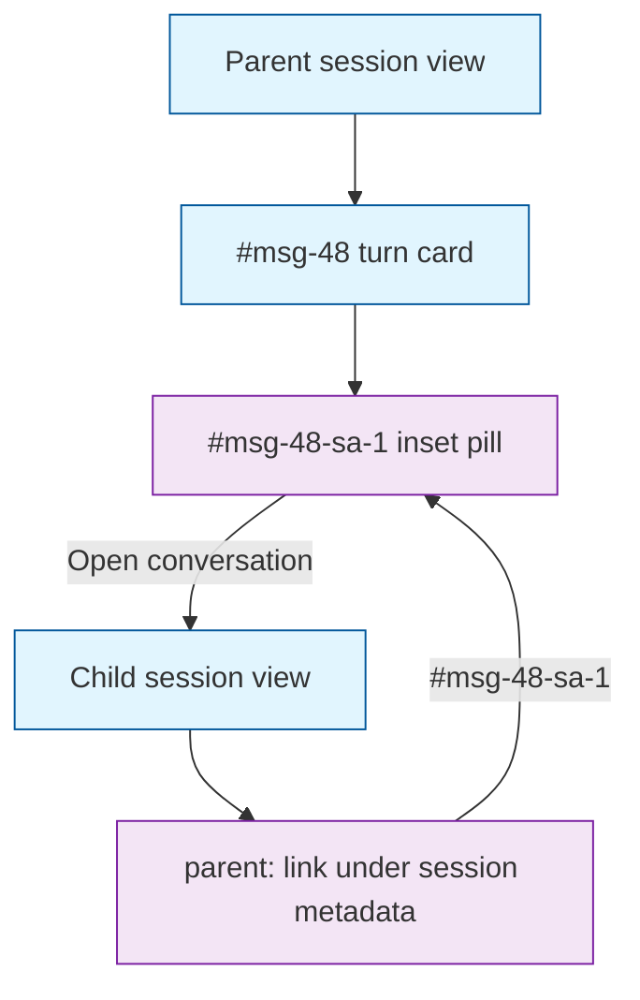

# Task: dashboard-subagent-pills

* Task ID: dashboard-subagent-pills
* Complexity: Level 3
* Type: feature

Surface warehouse-linked subagent sessions as distinct inline pills in the dashboard conversation reconstruction, plus a `parent:` line on subagent views. Existing `#msg-N` numbering stays; new anchors are `#msg-{ordinal}-sa-{n}`.

## Pinned Info

### Parent and child navigation

How a reader hops from a launching turn to a child reconstruction and back, without renumbering ordinary messages.

```mermaid
flowchart TD
    classDef view fill:#e1f5fe,stroke:#01579b;
    classDef pill fill:#f3e5f5,stroke:#7b1fa2;

    Parent["Parent session view"]:::view --> Turn["#msg-48 turn card"]:::view
    Turn --> Spawn["#msg-48-sa-1 inset pill"]:::pill
    Spawn -->|"Open conversation"| Child["Child session view"]:::view
    Child --> ParentLine["parent: link under session metadata"]:::pill
    ParentLine -->|"#msg-48-sa-1"| Spawn
```

## Component Analysis

### Affected Components

- **`stockroom.dashboard.spawns` (new)**: none today → pure read-time association + label. No warehouse writes.
- **`stockroom.dashboard.metrics.session_detail`**: reconstructs one session (messages + nested tools; already returns `is_subagent` / `parent_session_id`; does not exclude subagents) → attach `messages[].subagents` and `parent_spawn`.
- **`/api/session` (`dashboard.server`)**: already serves `session_detail` JSON → no new route; payload grows.
- **`dashboard-session.mjs`**: `#msg-N` helpers only (`^#msg-(\d+)$`) → spawn anchors, fragment resolver, deep-link + parent-line href helpers.
- **`dashboard.mjs` + `index.html`**: renders turns and session-meta → sibling inset pills, `parent:` line, CSS, scroll-to-either-hash.
- **User-guide session docs** (`docs/user-guide/dashboard.md`, `memory-bank/techContext.md`): document `#msg-N` only → mention `#msg-N-sa-M`.

### Cross-Module Dependencies

- `session_detail` → `associate_children` (in-process; one extra `sessions` query for children, and for a child view one query of the parent's tools + siblings).
- `dashboard.mjs` → `/api/session` JSON → `dashboard-session.mjs` helpers for ids, hashes, parent hrefs.
- Sessions list / metrics stay `NOT is_subagent`. No ingest, no schema.

### Boundary Changes

- **`session_detail` JSON (dashboard-only consumer)**:
  - every message gains `subagents: [{session_id, agent_type, agent_name, title, spawn_index, label}]` (empty list when none);
  - top-level `parent_spawn` is always present: `null` or `{session_id, message_ordinal, spawn_index}`.
- **Fragment contract**: `#msg-N` unchanged; `#msg-N-sa-M` is new (`M >= 1`).
- **No schema / ingest change.** `source_tool_use_id` is used server-side only and is not added to public `tool_calls` JSON.

### Invariants

- `#msg-N` still identifies the existing turn card; `parseMessageHash` stays `^#msg-(\d+)$`.
- A child session appears in at most one pill.
- Claude children with `spawning_tool_use_id` attach only via that join.
- Cursor zip uses the same typed-Task slots ingest uses for `agent_type`.
- Sessions browse list remains top-level only.
- Child transcript text is never copied into the parent view.
- Exports (markdown/JSON) stay the current conversation body — no subagent pills in this task.

## Open Questions

- [x] Spawn-to-turn association → Resolved: Claude provenance join + Cursor typed-Task zip at read time; leftover children hang off the last Task-bearing turn else last message (see `memory-bank/active/creative/creative-spawn-association.md`).
- [x] Subagent pill chrome → Resolved: sibling inset card under the launching turn; heading-as-single-link; `parent:` under session metadata (see `memory-bank/active/creative/creative-subagent-pill-chrome.md`).

## Test Plan (TDD)

### Behaviors to Verify

- Claude child with `spawning_tool_use_id` matching a parent Task → pill on that Task's message ordinal, `spawn_index` 1.
- Cursor children ordered by `source_path` zip to `Task` calls that have `subagent_type`, in `(message.ordinal, tool.ordinal)` order.
- Cursor `Task` with null `subagent_type` (nudge) does not consume a zip slot (motivating session: child on 48, not 55).
- Two children on one turn → `sa-1` then `sa-2` without changing message ordinals.
- Extra typed Tasks beyond child count → no pill for the extra Task.
- Extra children beyond typed Tasks → leftover rule (last Task-bearing turn, else last message).
- Every message in `session_detail` has `subagents` (possibly `[]`); top-level sessions have `parent_spawn: null`.
- Child `session_detail` sets `parent_spawn` from the same association; missing parent row → `parent_spawn: null` but `parent_session_id` still set.
- Label fallback: Task `description`, then `agent_name`, `title`, `agent_type`, else `"Subagent"`.
- `parseMessageHash("#msg-48-sa-1")` is null; `parseSubagentHash("#msg-48-sa-1")` is `{ordinal: 48, spawnIndex: 1}`; `#msg-48` still parses as 48.
- `buildSessionDeepLink(..., {ordinal, spawnIndex})` appends `#msg-N-sa-M`; ordinal-only still `#msg-N`.
- Fragment resolver finds `#msg-N` or `#msg-N-sa-M` under the turns root.
- Parent-line helper: hidden when not a subagent; href includes spawn hash when `parent_spawn` is present; hash-less parent session href when `parent_spawn` is null.

### Edge Cases

- No children → all `subagents` empty; no pills rendered.
- Child whose parent is not in the warehouse → `parent:` can still link by `parent_session_id` without hash.
- Invalid hashes (`#msg-48-sa-0`, `#msg-48-sa-`, `#msg-12x`) → no scroll target.
- Message ordinal 0 is a valid launch ordinal (do not treat 0 as missing).

### Test Infrastructure

- Framework: `pytest` + `pytest-xdist` (engine); Node 22 built-in runner (`make test-dashboard-js`).
- Test location: `skills/sr-search/tests/`, `skills/sr-search/tests-js/`.
- Conventions: `test_<behavior>` functions; dashboard metrics tests seed via `_seed_session` / `_seed_tool` in `test_dashboard_metrics.py`.
- New test files: `skills/sr-search/tests/test_dashboard_spawns.py`.
- Existing files to extend: `test_dashboard_metrics.py` (session_detail payload; exact message dict must gain `subagents: []` and `parent_spawn: null`), `tests-js/dashboard-session.test.mjs`.
- `_seed_tool` does not write `source_tool_use_id` today — extend that helper (or UPDATE after insert) for Claude join fixtures.

### Integration Tests

- `session_detail` + associate helper: seeded parent/child rows → nested `subagents` and child `parent_spawn` agree.
- No new HTTP route test beyond existing `/api/session` (payload is `session_detail`). `test_dashboard_server.py` only asserts message text; leave it unless it starts failing.

## Implementation Plan

### 1. Spawn association helper — executable

- Files: `skills/sr-search/src/stockroom/dashboard/spawns.py`, `skills/sr-search/tests/test_dashboard_spawns.py`
- Creative ref: `memory-bank/active/creative/creative-spawn-association.md`, label rule in `creative-subagent-pill-chrome.md`

1. Stub tests: empty cases in `test_dashboard_spawns.py` for Claude join, Cursor typed zip, untyped Task skipped, multi-child `spawn_index`, leftover fallback, label chain.
2. Stub interface: `associate_children(harness, tools, children) -> list[placement]`, `spawn_label(...)`, small dataclasses/`TypedDict`s for tool rows, child rows, placements (`launch_ordinal`, `spawn_index`, `session_id`, `label`, identity fields).
3. Write tests and run red: assert the motivating Cursor pair (typed Task @ 48, untyped Task @ 55, one child) places `launch_ordinal=48, spawn_index=1`.
4. Write code and run green: implement join / zip / leftover / label in `spawns.py` only.

### 2. session_detail payload — executable

- Files: `skills/sr-search/src/stockroom/dashboard/metrics.py`, `skills/sr-search/tests/test_dashboard_metrics.py`
- Creative ref: `creative-spawn-association.md`

1. Stub tests: new cases for parent `messages[].subagents`, child `parent_spawn`, missing-parent `parent_spawn is None`; extend `_seed_tool` with optional `source_tool_use_id`.
2. Stub interface: `session_detail` still the same function; document the new keys. Query children (`parent_session_id = this session`) and, when `is_subagent`, the parent's tools + sibling children.
3. Write tests and run red: existing exact message dict fails until `subagents: []` / `parent_spawn: null` are specified — update that fixture as part of writing the new assertions, not by weakening it.
4. Write code and run green: `session_detail` selects `source_tool_use_id` for association only (omit from public `tool_calls`); call `associate_children`; nest results. Do not add a new HTTP route.

### 3. Hash and parent-link helpers — executable

- Files: `skills/sr-search/src/stockroom/dashboard/static/dashboard-session.mjs`, `skills/sr-search/tests-js/dashboard-session.test.mjs`
- Creative ref: `creative-subagent-pill-chrome.md`

1. Stub tests: `parseMessageHash` rejects `#msg-48-sa-1`; new `parseSubagentHash` / `subagentAnchorId` / resolver / `buildSessionDeepLink` spawn option / `buildParentLineHref`.
2. Stub interface: `subagentAnchorId(ordinal, spawnIndex)`, `parseSubagentHash(hash)`, extend `resolveMessageAnchorElement` (or add `resolveSessionAnchorElement`) and `buildSessionDeepLink` / `sessionLocationWithMessageHash` with optional `spawnIndex`; `buildParentLineHref(baseUrl, harness, parentSessionId, parentSpawn)`.
3. Write tests and run red: `#msg-0-sa-1` is valid; `#msg-48-sa-0` is not; ordinal-only deep links unchanged.
4. Write code and run green: keep `parseMessageHash` exclusive; spawn parser is `^#msg-(\d+)-sa-(\d+)$` with `spawnIndex >= 1`.

### 4. Session render and CSS — executable

- Files: `skills/sr-search/src/stockroom/dashboard/static/dashboard.mjs`, `skills/sr-search/src/stockroom/dashboard/static/index.html`
- Creative ref: `creative-subagent-pill-chrome.md`

1. Stub tests: none in `dashboard.mjs` (DOM orchestrator). Behavior that can be tested already lives in steps 1–3. Add a tiny helper in `dashboard-session.mjs` if render needs a "should show parent line" predicate, and test that there.
2. Stub interface: `#session-parent` paragraph immediately after `#session-meta` in `index.html`; `.session-subagent` CSS; `elements.sessionParent` in `dashboard.mjs`.
3. Write tests and run red: run the step-3 helper tests if a new predicate is added; otherwise this step's red is the missing DOM from step-3 helpers already going green.
4. Write code and run green: after each `.session-turn`, append sibling `<article class="session-subagent" id="msg-N-sa-M">` with one heading `<a>` to the child session (no hash). Fill `#session-parent` only when `is_subagent`. `scrollToMessageHash` uses the extended resolver. CSS: `align-self: flex-start`; width ~70–80%; `margin-left: 1.5rem`; tinted `color-mix` surface/border as in the creative. Wire `sessionParent` into the loading/reset path so a parent session does not keep a stale `parent:` line.

### 5. Session deep-link docs — prose/policy

- Files: `docs/user-guide/dashboard.md`, `memory-bank/techContext.md`
- No tests: prose/policy artifact
- Creative ref: n/a (documents the chosen hash)

1. Add one example line for `#msg-{ordinal}-sa-{n}` next to the existing `#msg-{ordinal}` note.
2. Surgically extend the techContext session-view sentence so it names both fragment forms.

## Technology Validation

No new technology - validation not required.

## Challenges & Mitigations

- **Existing exact `session_detail` message dict** will fail when `subagents` is added: update that assertion in the same TDD step; do not drop exactness.
- **`_seed_tool` omits `source_tool_use_id`**: extend the helper so Claude fixtures do not hand-roll SQL.
- **`dashboard.mjs` is not unit-tested**: keep association, labels, hashes, and parent hrefs in tested modules; `dashboard.mjs` only mounts DOM.
- **Leftover children look like they belong to the last Task turn**: documented fallback; test it so it is intentional, not a surprise.
- **Live UAT** on `604ead72-…` / `bc960b66-…` is verification after build, not a substitute for seeded tests (warehouse recency can move).

## Pre-Mortem

- **Wrong layer (JS re-joins tools)**: already covered — association is server-side; `source_tool_use_id` stays off the public tool JSON.
- **`#msg-48-sa-1` stolen by `#msg-N` parser**: already covered — exclusive `parseMessageHash`; dedicated spawn parser.
- **Plan treated this as an ingest/schema feature**: cut that — current rows are sufficient; if build discovers they are not, stop and open a new question rather than sneaking a migration.
- **Pills rendered inside `#msg-N` so spawn hashes scroll to the turn**: plan step 4 requires siblings; if a review finds them nested, that is a failed step, not a CSS tweak.
- **Operator sees the nudge Task and expects a second pill**: not a bug — untyped Task is not a spawn slot. Mention in QA notes if the live example is used.

## Status

- [x] Component analysis complete
- [x] Open questions resolved
- [x] Test planning complete (TDD)
- [x] Implementation plan complete
- [x] Technology validation complete
- [x] Pre-Mortem complete
- [ ] Preflight
- [ ] Build
- [ ] QA
