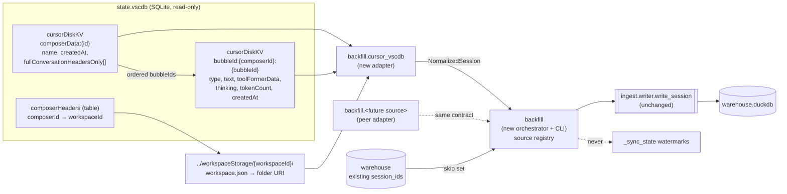

# Task: Cursor state.vscdb one-shot backfill

* Task ID: cursor-vscdb-backfill
* Complexity: Level 3
* Type: feature

One-shot, opt-in backfill of legacy Cursor `state.vscdb` composers into the warehouse ([#84](https://github.com/Texarkanine/stockroom/issues/84)), selecting every composer the warehouse does not already have — tokens are not a selection gate. Core nightly ingest is untouched.

## Pinned Info

### Corpus facts (probed 2026-07-25 on this machine)

Source: the operator's Cursor `globalStorage/state.vscdb` (5.7 GB), reached over a WSL→Windows mount.

| Fact | Value |
|---|---|
| `composerData` keys | 2,039 |
| Already in warehouse (by `session_id`) | 1,131 |
| **Backfill candidates** | **908** |
| ...with ≥1 resolvable bubble | 609 (+26 legacy inline) |
| ...empty drafts (0 bubbles) | 273 |
| Bubbles to reconstruct | ~75,800 |
| Candidates with nonzero bubble tokens | 418 |
| Date span | 2025-03 → 2026-07 |
| `cwd` resolvable via `workspaceStorage` | 437 |
| Warehouse messages today (all harnesses) | 43,892 |

### Data flow

```mermaid
flowchart LR
    subgraph vscdb["state.vscdb (SQLite, read-only)"]
        CH["composerHeaders (table)<br/>composerId → workspaceId"]
        CD["cursorDiskKV<br/>composerData:{id}<br/>name, createdAt,<br/>fullConversationHeadersOnly[]"]
        BB["cursorDiskKV<br/>bubbleId:{composerId}:{bubbleId}<br/>type, text, toolFormerData,<br/>thinking, tokenCount, createdAt"]
    end
    WJ["../workspaceStorage/{workspaceId}/<br/>workspace.json → folder URI"]

    CD -->|ordered bubbleIds| BB
    CH --> WJ
    CD --> P["backfill.cursor_vscdb<br/>(new adapter)"]
    BB --> P
    WJ --> P
    P -->|NormalizedSession| BF["backfill<br/>(new orchestrator + CLI)<br/>source registry"]
    FUT["backfill.&lt;future source&gt;<br/>(peer adapter)"] -.->|same contract| BF
    WH[("warehouse<br/>existing session_ids")] -->|skip set| BF
    BF --> W[["ingest.writer.write_session<br/>(unchanged)"]]
    W --> DB[(warehouse.duckdb)]
    BF -.->|never| SS["_sync_state watermarks"]
```

## Component Analysis

### Affected Components

- **`stockroom.backfill` (NEW package)**: harness-neutral one-shot orchestrator + `main(argv)` CLI. Owns the source registry, the skip set, writing, and the summary; knows nothing about SQLite or composers. Deliberately a **sibling of** `stockroom.ingest`, not a member: nothing on the nightly path imports it.
- **`stockroom.backfill.cursor_vscdb` (NEW adapter)**: the one backfill source that exists today. Clean-room parser turning one composer plus its bubbles into a `NormalizedSession`; owns its read-only SQLite access and `workspace.json` lookups. A second harness's legacy store drops in beside it as a peer module (D3).
- **`stockroom.__main__`**: dispatcher `SUBCOMMANDS` table → add `backfill`.
- **`stockroom.ingest.writer`**: **unchanged**, reused (`write_session`). `update_watermark` deliberately never called.
- **`stockroom.ingest.model`**: **unchanged**, reused as the parser/writer contract.
- **`stockroom.ingest.paths`**: **unchanged**; `workspace_key_for` continues to run inside the writer.
- **`stockroom.config`**: add `[cursor].state_vscdb` (no discoverable default exists on WSL→Windows, where the DB lives on the Windows side).
- **`stockroom.warehouse`**: **unchanged**, reused via `open(read_only=False)`.
- **Docs**: `docs/user-guide/ingest.md`, `docs/user-guide/installed-layout.md`, `docs/advanced/cli.md`, `docs/architecture/lifecycle.md`, `docs/contributing/iteration.md`.
- **Tests**: new parser / orchestrator / CLI modules, a shared vscdb-builder fixture, and the dispatcher `SUBCOMMANDS` ratchet.

### Cross-Module Dependencies

- `backfill` → each registered adapter (`backfill.cursor_vscdb`, …) → `ingest.model`
- `backfill` → `ingest.writer.write_session` → DuckDB (only SQL touchpoint for session rows; adapters issue no warehouse SQL)
- `backfill` → `warehouse.open(read_only=False)` (flock single-writer invariant)
- `backfill.cursor_vscdb` → `config` / env / CLI flag for the vscdb path
- `__main__` → `backfill` (lazy import at dispatch)
- **No edge** from `ingest.ingest()` or `schedule` to any new module — that absence *is* the "not nightly" guarantee, and is asserted by tests.

### Boundary Changes

- **New public CLI surface**: `stockroom backfill [--source NAME]`, defaulting to every registered source.
- **New config key**: `[cursor].state_vscdb`, plus `STOCKROOM_CURSOR_STATE_VSCDB` env override and a `--state-vscdb` flag (adapter-specific, mirroring `ingest --ai-tracking-db`).
- **No schema change**; no change to `ingest.ingest()`.

### Invariants & Constraints

1. `schedule.render_payload()` must continue to render exactly `stockroom ingest && stockroom embed`.
2. `ingest.ingest()` behavior and Cursor `_sync_state` watermarks must be unaffected.
3. Backfill never deletes or overwrites a session it did not create; composers already in the warehouse are skipped.
4. The writer stays the single SQL touchpoint for session persistence.
5. `state.vscdb` is opened strictly read-only; operator Cursor state is never mutated.
6. No truncation at rest.
7. Thinking/reasoning blocks are never stored.
8. Tool *results* are never stored; tool *inputs* are stored whole.
9. Tokens are stored at the grain the source reports: a bubble's nonzero allowlisted `tokenCount` lands on *that bubble's* message; session `*_tokens` stay NULL (migration `0007` forbids inventing them from message sums); zero fills become NULL, never `0`; `tokenCountUpUntilHere` / `contextUsagePercent` never mapped.
10. Fail-soft: absent, unreadable, or actively-written vscdb yields a clear message and nonzero exit — never a traceback.

## Open Questions

- [x] **OQ1 — How do bubbles become warehouse messages?** → Resolved: one *storable* bubble (non-empty text or a tool call) becomes one message; thinking-only and empty bubbles are dropped; tool calls stay on their own bubble-message rather than being merged into the preceding turn. See `memory-bank/active/creative/creative-vscdb-message-reconstruction.md`.
- [x] **OQ2 — What are `project_id`, `cwd`, `workspace_key`?** → Resolved: `project_id` = native `composerHeaders.workspaceId` (same hash-as-project_id precedent as Cursor CLI chats), `cwd` = folder resolved from `../workspaceStorage/{workspaceId}/workspace.json`, `workspace_key` left to the writer's existing derivation so vscdb sessions converge with same-`cwd` transcript sessions. See `memory-bank/active/creative/creative-vscdb-workspace-identity.md`.

## Decisions Taken In Plan (evidence-backed)

- **D1 — Read strategy: `mode=ro`, falling back to `immutable=1`.** Measured against the live 5.7 GB DB on the mount:

  | Open mode | Result |
  |---|---|
  | `file:…?mode=ro` | ❌ `disk I/O error` (WAL locking unsupported on the mount) |
  | `file:…?mode=ro&nolock=1` | ❌ `unable to open database file` |
  | **`file:…?immutable=1`** | ✅ 669,928 rows counted in 4.2 s |
  | copy 5.7 GB locally, then `mode=ro` | ⚠️ 60 s, and yielded `database disk image is malformed` when Cursor wrote mid-copy |

  `mode=ro` is correct where it works (local DBs, WAL respected); `immutable=1` is the only thing that works on the mount. Its caveat — the `-wal` tail is invisible, so the newest writes are not seen — is harmless for a historical backfill. Copying is strictly worse: slower *and* less reliable.
- **D2 — Key reads use index range bounds, never `LIKE`.** Measured on the mount for one composer's bubbles: `key >= 'bubbleId:{cid}:' AND key < 'bubbleId:{cid};'` → **0.05 s** (`SEARCH … USING INDEX`), vs `key LIKE 'bubbleId:{cid}:%'` → **2.88 s** (`SCAN`). SQLite will not use an index for `LIKE` under the default case-insensitive setting. This retires the "hybrid prefix vs full scan" pain recorded in the aborted `enhance-cursor-tokens` archive — that work was slow because it used `LIKE`.
- **D3 — Surface: a `stockroom backfill` subcommand over a registry of per-source adapters.** Backfill is a *cross-harness* capability that happens to have exactly one known source today; the package is shaped for the second one from the start, mirroring how `ingest` is an orchestrator plus per-harness parser modules (`cursor.py`, `cursor_chats.py`, `claude.py`).

  | Piece | Role |
  |---|---|
  | `backfill/__init__.py` | registry `_SOURCES`, skip set, write loop, per-source summary, CLI |
  | `backfill/cursor_vscdb.py` | today's only adapter |
  | *(future)* `backfill/<harness>_<store>.py` | drops in as a peer; no orchestrator surgery |

  The adapter contract is four names, checked by a registry-conformance test that runs over every registered source: `NAME` (registry key, e.g. `cursor-vscdb`), `HARNESS` (scopes the skip set and labels the summary), `resolve_source(override) -> Path` (flag → env → config, raising a `BackfillError` that names all three), and `candidates(source) -> list[str]` + `parse_all(source, ids) -> Iterator[NormalizedSession]` (cheap id enumeration first so the skip set is applied *before* the expensive parse). Adapters never touch the warehouse; the orchestrator owns all of it.

  Multi-source runs are tolerant the way ingest is: a source with no configured path is reported and skipped, and only an explicitly named unconfigured source (or *all* sources unconfigured) is an error.

  Rejected: a flag on `stockroom ingest` (puts legacy store reads one typo from the nightly command); a separate distribution (packaging cost, no user benefit); and a single-module `backfill.py` hardcoding Cursor (cheaper today, but it makes the second source a refactor rather than a file).
- **D4 — Provenance: `entrypoint = 'ide'`, `source_path = <vscdb path>`.** `entrypoint` means *surface*, and these are genuinely IDE conversations; a third value would corrupt the column's meaning. `source_path` is what makes backfilled rows identifiable (and trivially reversible: one `DELETE … WHERE source_path = …`).
- **D5 — Selection: skip composers already in the warehouse; skip composers with zero reconstructable messages** (273 of 908 are empty drafts).
- **D6 — Tokens: message-grain, on the bubble that reports them; session `*_tokens` stay NULL.** *(Revised in plan review — the original session-Σ was inherited from the aborted `enhance-cursor-tokens` enrich design, where the message rows belonged to a different parser and `sessions` was the only reachable grain. This task authors the message rows from the very bubbles carrying the counts, so that constraint no longer applies.)* Three pieces of evidence:

  1. **Migration `0007` forbids the Σ**: "ingest must never invent them \[session tokens\] from message sums." A session-Σ write also makes `session_token_usage.token_grain` report `'session'` for data whose grain is `message` — the view would mislabel it.
  2. **Nothing is lost by attributing per-message.** Probed 120 composers / 14,446 bubbles: every nonzero `tokenCount` sits on a *storable* bubble (74 of them); the 3,336 bubbles OQ1 drops carry **0%** of input and output tokens. The Σ's only theoretical advantage — capturing tokens on dropped bubbles — does not exist in the data.
  3. **The values are per-request usage, exactly like Claude's.** They appear on assistant bubbles with `inputTokens` = that turn's whole prompt context (observed 6,078 / 5,535 / 96,782). Storing them per message makes vscdb sessions roll up through `session_token_usage` with the same semantics as Claude's, instead of a hand-rolled sum that double-counts context while claiming to be a native session total.

  Consequence, as intended: token-bearing backfilled conversations report `token_grain='message'`; tokenless backfilled ones and all ordinary Cursor ingest report `'none'`. Zero fills are written as NULL, not `0` — Cursor stamps `{0,0}` on unmetered turns, and `0` would assert a turn cost nothing.

## Test Plan (TDD)

### Test Infrastructure

- Framework: `pytest` (+`pytest-xdist`, `-n auto`) configured in `skills/sr-search/pyproject.toml`.
- Test location: `skills/sr-search/tests/`.
- Conventions: one module per parser (`test_ingest_*.py`); module + per-test docstrings; assertions directly on `NormalizedSession` attributes; unreadable sources return `None`/typed errors rather than raising; orchestrator tests inject the `migrated_con` fixture; CLI tests run the real command as a subprocess with `STOCKROOM_HOME` pointed at `tmp_path`.
- New test files: `tests/test_backfill_cursor_vscdb.py` (adapter), `tests/test_backfill.py` (orchestrator + registry conformance), `tests/test_backfill_cli.py`.
- Modified: `tests/conftest.py` (vscdb-builder fixture), `tests/test_config.py`, `tests/test_dispatcher_cli.py`.
- Fixtures are **synthesized in-test** via a `build_vscdb(...)` conftest factory (composers, bubbles, headers, workspace.json), not committed as a binary — the shapes under test are numerous and a hand-built SQLite file keeps each case legible.
- The ingest golden snapshot (`fixtures/ingest/expected_rows.json`) is **not** extended: backfill is not part of the default corpus ingest.

### Behaviors to Verify

**Parser — identity & structure**

- Composer with bubbles → session with `harness='cursor'`, `session_id=<composerId>`, `entrypoint='ide'`, `source_path=<vscdb path>`.
- Bubble `type` 1/2 → message `role` `user`/`assistant`; unknown type → no message.
- Kept messages get dense 0-based ordinals and a linear `parent_ordinal` chain.
- Composer `name` → session `title`; absent → `None`.

**Parser — the OQ1 keep/drop contract**

- Bubble with non-empty text → message with that text stored whole.
- Bubble with only `thinking` → **no message**, and the thinking text appears nowhere.
- Wholly empty bubble → no message.
- Tool bubble (empty text + `toolFormerData`) → assistant message with one tool call.
- Tool bubble with text → message with text **and** tool call at `ordinal=1`; tool-only bubble → tool call at `ordinal=0`.
- Tool call carries `tool_name` from `name`, `source_tool_use_id` from `toolCallId`, and `tool_input` parsed from `rawArgs` (falling back to `params`, then the raw string).
- `toolFormerData.result` is **not** present anywhere in the emitted session.

**Parser — ordering & robustness**

- Order follows `fullConversationHeadersOnly`.
- Headers absent but legacy inline `conversation[]` present → messages come from the inline array.
- Header referencing a nonexistent bubble row → that entry is skipped, the rest survive.
- Corrupt (non-JSON) bubble value → skipped, rest survive.
- Composer with neither headers nor inline conversation, or with no storable bubbles → parser returns `None`.

**Parser — timestamps & tokens**

- Bubble ISO `createdAt` → message `ts` as naive UTC; session `started_at`/`ended_at` = min/max.
- No bubble timestamps → `started_at` falls back to `composerData.createdAt` (epoch ms); `ended_at` `None`.
- Bubble with nonzero `tokenCount` → *that* message's `input_tokens`/`output_tokens`; the session's `*_tokens` stay `None`.
- Bubble with `{0,0}` or absent `tokenCount` → that message's token fields are `None`, not `0` — including within a session whose other messages do carry tokens.
- `tokenCountUpUntilHere` / `contextUsagePercent` present → ignored entirely.
- Tokens on a bubble that OQ1 drops (thinking-only) are not smuggled onto a neighbouring message.

**Parser — workspace identity (OQ2)**

- `composerHeaders.workspaceId` → session `project_id`.
- `workspace.json` `{"folder": "vscode-remote://wsl%2Bubuntu/home/u/p"}` → `cwd == "/home/u/p"`.
- `{"folder": "file:///tmp/p"}` → `cwd == "/tmp/p"`.
- Multi-root `{"workspace": …}`, missing file, missing `workspaceStorage` dir, or no `workspaceId` → `cwd is None`, no exception.
- Composer with no `composerHeaders` row → `project_id is None`.

**Parser — read ladder (D1)**

- A normal local DB opens via `mode=ro`.
- When `mode=ro` raises `sqlite3.OperationalError`, the reader retries with `immutable=1` and succeeds.
- A non-SQLite file raises the typed backfill error, not a bare `sqlite3` exception.

**Orchestrator — source registry (D3)**

- Every module in `_SOURCES` satisfies the adapter contract: unique `NAME` matching its registry key, a non-empty `HARNESS`, and callable `resolve_source` / `candidates` / `parse_all`. (Parametrized over the registry, so a future adapter is checked the day it lands.)
- The orchestrator applies the skip set using each adapter's `HARNESS`, and calls `candidates` before `parse_all` (skip happens pre-parse) — verified with a stub adapter registered for the test.
- `--source NAME` runs only that source; an unknown name errors listing the registered ones.
- With several sources registered, one that is unconfigured is reported and skipped while the other still runs; an explicitly named unconfigured source, or *all* sources unconfigured, is an error.
- No adapter issues warehouse SQL: the stub adapter is handed no connection and the run still writes.

**Orchestrator — run behavior**

- Composers absent from the warehouse are written: `sessions`, `messages`, `tool_calls` rows appear.
- A composer whose `session_id` already exists is skipped, and the pre-existing row is **byte-identical** afterwards (proves no delete-then-insert clobber).
- `_sync_state` is unchanged by a run (no rows added, existing watermark untouched).
- Running twice produces identical warehouse contents and a second summary reporting everything as skipped.
- Summary reports, per source, candidates / written / skipped-existing / skipped-empty plus message and tool-call counts.
- `--dry-run` writes nothing but reports what it would write.
- Absent vscdb path → typed error naming the flag, env var, and config key.

**Guard tests (encode the invariants)**

- `schedule.render_payload(home)` contains no `backfill` token.
- The `stockroom.ingest` package source contains no reference to `backfill` (no import edge onto the nightly path).

**CLI**

- `stockroom backfill --help` exits 0 and mentions `--dry-run` and `--source` (listing registered source names).
- End-to-end subprocess run against a synthesized vscdb writes rows into a `STOCKROOM_HOME` warehouse and prints a summary.
- Missing/unreadable vscdb → nonzero exit, one-line message, no traceback.
- Dispatcher lists `backfill` in top-level help and forwards to it.

### Integration Tests

- **Adapter → writer → warehouse** (`migrated_con`): a synthesized composer round-trips into `sessions`/`messages`/`tool_calls` with correct `message_id` expansion and a writer-derived `workspace_key` matching a same-`cwd` session written by ordinary ingest (proves the OQ2 convergence claim).
- **Token grain through the rollup view (D6)**: after backfilling a token-bearing composer, `session_token_usage` reports `token_grain = 'message'`, `*_native IS NULL`, and `*_total` equal to the sum of the message rows; a tokenless backfilled composer reports `'none'`.
- **Backfill alongside ingest**: run ordinary `ingest.ingest()` over the fixture corpus, then backfill; assert ingest-authored rows are untouched and watermarks unmoved.

## Implementation Plan

1. **Config key** — TDD cycle: `[cursor].state_vscdb`
    - Files: `src/stockroom/config.py`, `tests/test_config.py`
    - Changes: add `cursor_state_vscdb: Path | None` to `Settings`; extractor mirroring `_ai_tracking_dbs_from_table` (string → `Path.expanduser()`, invalid → `None`); never raise.
2. **vscdb reader + composer discovery** — TDD cycle
    - Files: `src/stockroom/backfill/cursor_vscdb.py` (new), `tests/test_backfill_cursor_vscdb.py` (new), `tests/conftest.py` (add `build_vscdb` factory fixture)
    - Changes: `NAME`/`HARNESS`; `resolve_source(override)` (flag → env → config, typed error naming all three); `open_readonly(path)` implementing the D1 ladder; `candidates(source)` and composer-header lookup using D2 range bounds; module docstring recording the source shape and both creative decisions.
3. **Message reconstruction** — TDD cycle (the OQ1 contract)
    - Files: `src/stockroom/backfill/cursor_vscdb.py`, `tests/test_backfill_cursor_vscdb.py`
    - Changes: `parse_all(source, ids)` over a per-composer `_parse_composer(...) -> NormalizedSession | None`; bubble ordering from headers with legacy-inline fallback; keep/drop predicate; tool-call extraction (result dropped); ISO timestamp parsing via `stockroom.timestamps`; per-message token attribution (D6) with `{0,0}` → `None`.
    - Creative ref: `creative-vscdb-message-reconstruction.md`
4. **Workspace identity** — TDD cycle
    - Files: `src/stockroom/backfill/cursor_vscdb.py`, `tests/test_backfill_cursor_vscdb.py`
    - Changes: `workspace_folder(workspace_root, workspace_id)` with URI decoding and memoization; wire `project_id`/`cwd` into the parse; leave `workspace_key` to the writer.
    - Creative ref: `creative-vscdb-workspace-identity.md`
5. **Orchestrator + registry** — TDD cycle (D3)
    - Files: `src/stockroom/backfill/__init__.py` (new), `tests/test_backfill.py` (new)
    - Changes: package docstring stating the adapter contract; `_SOURCES` registry; `BackfillError`, `SourceSummary`, `BackfillSummary(by_source)`; `backfill(*, source=None, source_paths=None, con=None, dry_run=False, on_progress=None)` — resolve → `candidates` → subtract the per-`HARNESS` skip set → `parse_all` → `writer.write_session`; per-composer and per-source fail-soft; **no** `update_watermark` call; registry-conformance and stub-adapter tests; guard tests for the schedule payload and the ingest import edge.
6. **CLI + dispatcher** — TDD cycle
    - Files: `src/stockroom/backfill/__init__.py` (`main`), `src/stockroom/__main__.py`, `tests/test_backfill_cli.py` (new), `tests/test_dispatcher_cli.py` (ratchet)
    - Changes: argparse with `--source` (choices from the registry), `--state-vscdb`, `--dry-run`, `--verbose`; per-source summary print; errors → exit 1 with a one-line remedy; add `backfill` to `SUBCOMMANDS` with a one-line summary; add name + `--dry-run` fingerprint to the dispatcher test.
7. **Documentation**
    - Files: `docs/user-guide/ingest.md` (new "Backfill legacy history" section: framed per source with a table whose sole row is `cursor-vscdb` today — what it recovers, that the corpus is finite and the command is not scheduled, the `immutable=1` staleness caveat, the embed backlog it creates, and how to undo it), `docs/user-guide/installed-layout.md` (`[cursor].state_vscdb` in the config table), `docs/advanced/cli.md` (subcommand entry incl. `--source`), `docs/architecture/lifecycle.md` (explicitly outside the nightly path), `docs/contributing/iteration.md` (subcommand list + how to add a backfill adapter).

## Technology Validation

No new dependencies: `sqlite3` is stdlib (already used by `cursor_chats` and `enrich`), DuckDB and the writer already exist. Proof-of-concept executed against the live 5.7 GB DB during planning and recorded above as D1/D2 — open-mode ladder verified, index range-scan verified at 0.05 s per composer with `EXPLAIN QUERY PLAN` confirming index use.

## Challenges & Mitigations

- **The DB is written by a running Cursor while we read it**: torn or malformed reads are real (observed during planning). Mitigation: the D1 ladder plus per-composer `try/except` so one bad row cannot abort the run, and a top-level handler that reports "close Cursor and re-run" rather than a traceback.
- **Multi-GB DB on a slow 9p mount**: mitigated by D2 range bounds (0.05 s per composer ⇒ ~30 s for 609 composers) and by streaming per composer instead of loading all bubbles.
- **Corpus roughly doubles**: ~60k new messages against 43,892 today, so the next `stockroom embed` will run far longer than usual. Mitigation: backfill never embeds; the docs state the expectation explicitly.
- **No discoverable default path on WSL→Windows**: mitigated by three explicit inputs (flag, env, config) and an error message naming all three.
- **A buggy skip set could clobber ingest-authored rows** (the writer deletes by `(harness, session_id)`): mitigated by the byte-identical-after-skip test.
- **Composer ids share a namespace with agent-transcript session ids** — that is *why* 1,131 already match. This is a feature: it makes "skip existing" exact rather than heuristic.

## Pre-Mortem

- **We backfilled ~900 sessions and the operator wants them gone.** No undo exists in the plan. Response: `--dry-run` is in scope (step 6), and the docs must document the one-line reversal (`DELETE FROM … WHERE source_path = '<vscdb>'`), which D4 makes exact.
- **A composer backfilled today later shows up in agent-transcripts and duplicates.** It cannot: both write the same `session_id`, and the writer's delete-then-insert means ordinary ingest simply supersedes the backfilled row with the higher-fidelity transcript version. Recorded as an insight rather than a plan change.
- **The premise is wrong because those 908 composers are junk.** Partly true and already handled: 273 are empty drafts and D5 skips them. The remaining 635 have a median of 28 bubbles, which is real conversation.
- **`immutable=1` silently returns a stale snapshot and we under-backfill.** Accepted and bounded: what is missing is the WAL tail, i.e. the newest activity, which ordinary ingest already covers. Re-running the one-shot picks it up later; idempotency makes that safe.
- **Ceremony exceeds the payoff — this could have been a script.** Rejected on the operator's explicit "no code golf, good-quality software" instruction, and because the thing writes to the shared warehouse: skip-set correctness and watermark isolation are exactly where a throwaway script would do damage.

## Status

- [x] Component analysis complete
- [x] Open questions resolved
- [x] Test planning complete (TDD)
- [x] Implementation plan complete
- [x] Technology validation complete
- [x] Pre-Mortem complete
- [ ] Preflight
- [ ] Build
- [ ] QA
