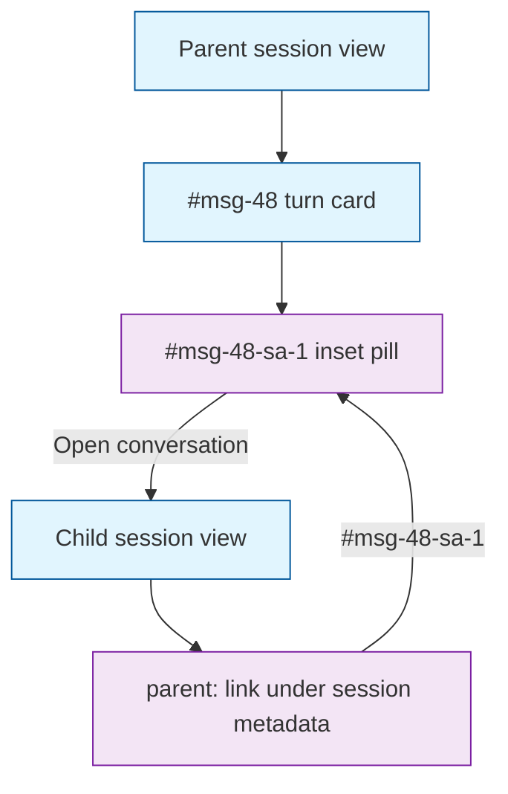
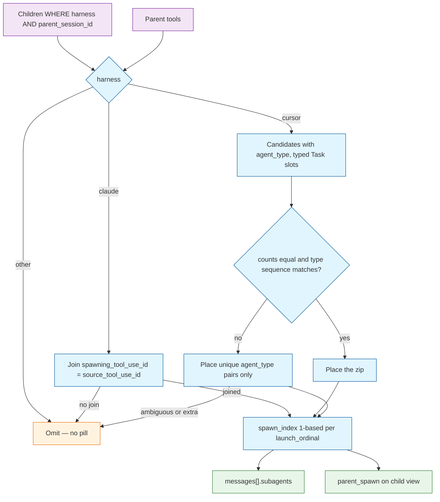

# Task: dashboard-subagent-pills

* Task ID: dashboard-subagent-pills
* Complexity: Level 3
* Type: feature

Surface warehouse-linked subagent sessions as distinct inline pills in the dashboard conversation reconstruction, plus a `parent:` line on subagent views. Existing `#msg-N` numbering stays; new anchors are `#msg-{ordinal}-sa-{n}`.

This is a re-plan after preflight `FAIL (blocking)`. Operator decisions: Claude unmatched spawn ids are omitted; JSON export keeps the new session-detail fields; a pill is a positive claim and must never be a guessed turn.

## Pinned Info

### Parent and child navigation

How a reader hops from a launching turn to a child reconstruction and back, without renumbering ordinary messages.

```mermaid
flowchart TD
    classDef view fill:#e1f5fe,stroke:#01579b;
    classDef pill fill:#f3e5f5,stroke:#7b1fa2;

    Parent["Parent session view"]:::view --> Turn["#msg-48 turn card"]:::view
    Turn --> Spawn["#msg-48-sa-1 inset pill"]:::pill
    Spawn -->|"Open conversation"| Child["Child session view"]:::view
    Child --> ParentLine["parent: link under session metadata"]:::pill
    ParentLine -->|"#msg-48-sa-1"| Spawn
```

### Association policy

A pill is a positive claim. Omit when uncorroborated. Missing a pill is acceptable; a pill on the wrong turn is not.

```mermaid
flowchart TD
    classDef store fill:#f3e5f5,stroke:#7b1fa2;
    classDef logic fill:#e1f5fe,stroke:#01579b;
    classDef out fill:#e8f5e9,stroke:#2e7d32;
    classDef drop fill:#fff3e0,stroke:#ef6c00;

    Kids["Children WHERE harness AND parent_session_id"]:::store --> Branch{"harness"}:::logic
    Tools["Parent tools"]:::store --> Branch
    Branch -->|"claude"| Join["Join spawning_tool_use_id = source_tool_use_id"]:::logic
    Branch -->|"cursor"| Cursor["Candidates with agent_type, typed Task slots"]:::logic
    Branch -->|"other"| Omit["Omit — no pill"]:::drop
    Join -->|"no join"| Omit
    Join -->|"joined"| Index["spawn_index 1-based per launch_ordinal"]:::logic
    Cursor --> Aligned{"counts equal and type sequence matches?"}:::logic
    Aligned -->|"yes"| Zip["Place the zip"]:::logic
    Aligned -->|"no"| Unique["Place unique agent_type pairs only"]:::logic
    Zip --> Index
    Unique --> Index
    Unique -->|"ambiguous or extra"| Omit
    Index --> Msg["messages[].subagents"]:::out
    Index --> Back["parent_spawn on child view"]:::out
```

## Component Analysis

### Affected Components

- **`stockroom.dashboard.spawns` (new)**: none today → pure read-time association + label. No warehouse writes. Inputs are harness, parent tools, and children.
- **`stockroom.dashboard.metrics.session_detail`**: reconstructs one session (messages + nested tools; already returns `is_subagent` / `parent_session_id`; does not exclude subagents) → attach `messages[].subagents` and `parent_spawn`. Child, parent, and sibling queries filter on `(harness, session_id)`.
- **`/api/session` (`dashboard.server`)**: already serves `session_detail` JSON → no new route; payload grows.
- **`dashboard-session.mjs`**: `#msg-N` helpers and exporters only → spawn anchors, generic fragment parser, parent-line href, transcript/parent-line render model, JSON identity export of the new fields.
- **`dashboard.mjs` + `index.html`**: renders turns and session-meta → mounts the render model (sibling inset pills, `parent:` line), CSS, hashchange that accepts either fragment form, loading-path reset of the parent line.
- **User-guide session docs** (`docs/user-guide/dashboard.md`, `memory-bank/techContext.md`): document `#msg-N` only → mention `#msg-N-sa-M`.

### Cross-Module Dependencies

- `session_detail` → `associate_children` (in-process). Extra `sessions` query for children of this `(harness, session_id)`. For a child view: parent row + parent tools + sibling children, all keyed by the same harness.
- Render model in `dashboard-session.mjs` → `/api/session` JSON. `dashboard.mjs` only mounts that model and wires hashchange to the fragment helper.
- Sessions list / metrics stay `NOT is_subagent`. No ingest, no schema.

### Boundary Changes

- **`session_detail` JSON (dashboard-only consumer)**:
  - every message gains `subagents: [{session_id, agent_type, agent_name, title, spawn_index, label}]` (empty list when none);
  - top-level `parent_spawn` is always present: `null` or `{session_id, message_ordinal, spawn_index}`.
- **Fragment contract**: `#msg-N` unchanged; `#msg-N-sa-M` is new (`M >= 1`). A generic fragment helper accepts either form so `hashchange` can scroll spawn targets.
- **JSON export**: full `session_detail` object, including the new fields. Markdown export stays the conversation body (no pill chrome).
- **No schema / ingest change.** `source_tool_use_id` is used server-side only and is not added to public `tool_calls` JSON.

### Invariants

- `#msg-N` still identifies the existing turn card; `parseMessageHash` stays `^#msg-(\d+)$`.
- A child session appears in at most one pill.
- Claude children attach only via the provenance join. Missing or unmatched `spawning_tool_use_id` yields no pill.
- A pill is a corroborated assignment. Cursor leftover is forbidden. An unchecked zip that can shift after a hole is forbidden.
- Cursor places only when corroborated: aligned zip (`len(candidates) == len(slots)` and each `child.agent_type == slot.subagent_type`) or, failing that, unique `agent_type` pairs. Candidates are children with non-null `agent_type`. Slots are the same typed-Task list ingest uses (`_parent_subagent_types`).
- Association is a harness→technique map (`claude` → provenance join, `cursor` → corroborated zip). Unknown harness → no placements. The map site in `spawns.py` gets a comment: adding a third harness is the cue to lift the two techniques out, not to add another `elif` that copies Cursor knobs.
- Child, parent, and sibling SQL filters on both `harness` and `session_id` / `parent_session_id`.
- Sessions browse list remains top-level only.
- Child transcript text is never copied into the parent view.
- Markdown export stays roles / text / tools. JSON export keeps `messages[].subagents` and `parent_spawn`.

## Open Questions

- [x] Spawn-to-turn association → Resolved: Claude provenance join + Cursor corroborated zip (aligned type sequence, else unique `agent_type` only). No leftover (see `memory-bank/active/creative/creative-spawn-association.md`).
- [x] Subagent pill chrome → Resolved: sibling inset card under the launching turn; heading-as-single-link; `parent:` under session metadata (see `memory-bank/active/creative/creative-subagent-pill-chrome.md`).
- [x] Claude unmatched spawn id → Resolved by operator: refuse to guess; omit the child.
- [x] JSON export of new fields → Resolved by operator: keep `messages[].subagents` and `parent_spawn`; do not redact.
- [x] False-positive pills → Resolved by operator: omit rather than guess. Cursor leftover and unchecked shifting zip are forbidden.

## Test Plan (TDD)

### Behaviors to Verify

- Claude child with `spawning_tool_use_id` matching a parent Task → pill on that Task's message ordinal, `spawn_index` 1.
- Claude child whose `spawning_tool_use_id` is missing or does not join any parent tool → no placement (not leftover).
- Cursor children with `agent_type` set, counts equal to typed Task slots, and `agent_type` matching each slot's `subagent_type` in `source_path` / `(message.ordinal, tool.ordinal)` order → aligned zip, place all.
- Cursor `Task` with null `subagent_type` (nudge) does not consume a slot (motivating session: one typed Task @ 48, one child → place on 48).
- Two corroborated children on one turn → `sa-1` then `sa-2` without changing message ordinals.
- Extra typed Tasks beyond candidate count → no zip; place only unique `agent_type` pairs; extras omitted (not leftover).
- Extra Cursor children, or children with `agent_type is None` → omitted, not hung on the last Task or last message.
- Missing middle child (counts disagree) and remaining types collide → no placements (do not shift).
- Missing child of a unique type, other types still unique → place the remaining unique pairs only.
- Aligned zip type-sequence mismatch (counts equal, one `agent_type` ≠ slot type) → do not zip; unique pairs only.
- Every message in `session_detail` has `subagents` (possibly `[]`); top-level sessions have `parent_spawn: null`.
- Child `session_detail` sets `parent_spawn` from the same association; missing parent row → `parent_spawn` is null but `parent_session_id` still set.
- Same `session_id` string on two harnesses does not leak children or parent_spawn across harnesses.
- Label fallback: Task `description`, then `agent_name`, `title`, `agent_type`, else `"Subagent"`.
- `parseMessageHash("#msg-48-sa-1")` is null; `parseSubagentHash("#msg-48-sa-1")` is `{ordinal: 48, spawnIndex: 1}`; `#msg-48` still parses as 48.
- Generic fragment helper accepts `#msg-N` and `#msg-N-sa-M` and rejects `#msg-48-sa-0`, `#msg-48-sa-`, `#msg-12x`.
- `buildSessionDeepLink(..., {ordinal, spawnIndex})` appends `#msg-N-sa-M`; ordinal-only still `#msg-N`.
- Fragment resolver finds `#msg-N` or `#msg-N-sa-M` under the turns root.
- Parent-line helper: hidden when not a subagent; href includes spawn hash when `parent_spawn` is present; hash-less parent session href when `parent_spawn` is null.
- Transcript render model emits a turn item then sibling subagent items (not nested inside the turn), with `anchorId` / child href / label filled in.
- `formatSessionJsonExport` keeps `messages[].subagents` and `parent_spawn` when they are on the detail object.
- `formatSessionMarkdownExport` still emits only heading, project, roles, text, and fenced tools — no pill chrome — even when `subagents` is present.

### Edge Cases

- No children → all `subagents` empty; render model is turns only; no pills mounted.
- Child whose parent is not in the warehouse → `parent:` can still link by `parent_session_id` without hash.
- Invalid hashes (`#msg-48-sa-0`, `#msg-48-sa-`, `#msg-12x`) → fragment helper is null; no scroll target.
- Message ordinal 0 is a valid launch ordinal (do not treat 0 as missing).
- Unmatched Claude child viewed directly → `is_subagent` true, `parent_spawn` null, hash-less parent href.
- Uncorroborated Cursor child viewed directly → `is_subagent` true, `parent_spawn` null, hash-less parent href.

### Test Infrastructure

- Framework: `pytest` + `pytest-xdist` (engine); Node 22 built-in runner (`make test-dashboard-js`). No new DOM harness and no new JS dependencies.
- Test location: `skills/sr-search/tests/`, `skills/sr-search/tests-js/`.
- Conventions: `test_<behavior>` functions; dashboard metrics tests seed via `_seed_session` / `_seed_tool` in `test_dashboard_metrics.py`. Render tests stay in the existing Node helper suite (querySelector-shaped roots, no jsdom).
- New test files: `skills/sr-search/tests/test_dashboard_spawns.py`.
- Existing files to extend: `test_dashboard_metrics.py` (session_detail payload; exact message dict must gain `subagents: []` and `parent_spawn: null`), `tests-js/dashboard-session.test.mjs`.
- `_seed_tool` does not write `source_tool_use_id` today — extend that helper (or UPDATE after insert) for Claude join fixtures. Child session rows need `is_subagent`, `parent_session_id`, `spawning_tool_use_id`, `agent_type`, `source_path` via UPDATE or optional `_seed_session` kwargs.

### Integration Tests

- `session_detail` + associate helper: seeded parent/child rows → nested `subagents` and child `parent_spawn` agree.
- Cross-harness collision: cursor parent `P` with a child, plus a claude session also named `P` with a different child → each `session_detail` sees only its own harness's children / parent_spawn.
- No new HTTP route test beyond existing `/api/session` (payload is `session_detail`). `test_dashboard_server.py` only asserts message text; leave it unless it starts failing.

## Implementation Plan

### 1. Spawn association helper — executable ✅

- Files: `skills/sr-search/src/stockroom/dashboard/spawns.py`, `skills/sr-search/tests/test_dashboard_spawns.py`
- Creative ref: `memory-bank/active/creative/creative-spawn-association.md` (including Operator Amendment), label rule in `creative-subagent-pill-chrome.md`

1. Stub tests: empty cases in `test_dashboard_spawns.py` for Claude join, Claude unmatched omit, Cursor aligned zip, untyped Task skipped, unique-type rescue, count-mismatch omit (no shift), extra-child omit, null-`agent_type` omit, type-sequence mismatch, multi-child `spawn_index`, label chain.
2. Stub interface: `associate_children(harness, tools, children) -> list[placement]`, `spawn_label(...)`, small dataclasses/`TypedDict`s for tool rows, child rows, placements (`launch_ordinal`, `spawn_index`, `session_id`, `label`, identity fields). Do not implement join/zip yet. No `message_ordinals`.
3. Write tests and run red: assert the motivating Cursor pair (typed Task @ 48, untyped Task @ 55, one child with matching `agent_type`) places `launch_ordinal=48, spawn_index=1`. Assert a Claude child whose spawn id does not join is absent. Assert two same-type children with one slot (or one missing sibling) produce no placements. Assert a unique `explore` child still places when a `generalPurpose` sibling is missing.
4. Write code and run green: implement join / corroborated zip / unique-type rescue / omit / label in `spawns.py` only. Branch on harness only as a map onto those two techniques; unknown harness returns no placements. Put a comment on that map: a third harness is the moment to extract `provenance_join` / `corroborated_zip` (order, slots, corroboration), not to copy Cursor's Task/`source_path` knobs into another `elif`. Also name `_parent_subagent_types` in the `spawns.py` docstring as the sibling slot rule.

### 2. session_detail payload — executable

- Files: `skills/sr-search/src/stockroom/dashboard/metrics.py`, `skills/sr-search/tests/test_dashboard_metrics.py`
- Creative ref: `creative-spawn-association.md`

1. Stub tests: new cases for parent `messages[].subagents`, child `parent_spawn`, missing-parent `parent_spawn is None`, unmatched Claude child omitted from the parent payload, uncorroborated Cursor child omitted (count hole / null `agent_type`), cross-harness collision; extend `_seed_tool` with optional `source_tool_use_id`.
2. Stub interface: keep `session_detail` the same function; document the new keys on the return value only. Do not add child/parent SQL or call `associate_children` in this step.
3. Write tests and run red: existing exact message dict fails until `subagents: []` / `parent_spawn: null` are specified — update that fixture as part of writing the new assertions, not by weakening it. Cross-harness case fails until queries include `harness`.
4. Write code and run green: `session_detail` selects `source_tool_use_id` for association only (omit from public `tool_calls`); query children with `harness = ? AND parent_session_id = ?`; when `is_subagent`, load the parent by `(harness, parent_session_id)` plus that parent's tools and sibling children; call `associate_children`; nest results. Do not add a new HTTP route.

### 3. Hash, fragment, parent-link, and export helpers — executable

- Files: `skills/sr-search/src/stockroom/dashboard/static/dashboard-session.mjs`, `skills/sr-search/tests-js/dashboard-session.test.mjs`
- Creative ref: `creative-subagent-pill-chrome.md` (including Operator Amendment)

1. Stub tests: `parseMessageHash` rejects `#msg-48-sa-1`; new `parseSubagentHash` / `subagentAnchorId` / generic fragment helper / resolver / `buildSessionDeepLink` spawn option / `buildParentLineHref`; JSON export retains `subagents` and `parent_spawn`; markdown export still has no pill chrome when those fields are present.
2. Stub interface: `subagentAnchorId(ordinal, spawnIndex)`, `parseSubagentHash(hash)`, `parseSessionFragment(hash)` (or `isSessionFragmentHash`) that accepts `#msg-N` or `#msg-N-sa-M`; extend `resolveMessageAnchorElement` (or add `resolveSessionAnchorElement`) and `buildSessionDeepLink` / `sessionLocationWithMessageHash` with optional `spawnIndex`; `buildParentLineHref(baseUrl, harness, parentSessionId, parentSpawn)`.
3. Write tests and run red: `#msg-0-sa-1` is valid; `#msg-48-sa-0` is not; ordinal-only deep links unchanged; `parseSessionFragment("#msg-48-sa-1")` is non-null so a hashchange gate using it would scroll; JSON stringify of a detail with the new fields still matches `formatSessionJsonExport`; markdown of the same detail has no `session-subagent` / "Open conversation" / `#msg-N-sa-M` chrome.
4. Write code and run green: keep `parseMessageHash` exclusive; spawn parser is `^#msg-(\d+)-sa-(\d+)$` with `spawnIndex >= 1`; fragment helper is the OR of the two parsers. Do not change `dashboard.mjs` in this unit except if a one-line hashchange swap can land after the helper is green — prefer that swap in unit 4 with the other `dashboard.mjs` edits so this unit stays helper-only.

### 4. Transcript render model, then session mount — executable

- Files: `skills/sr-search/src/stockroom/dashboard/static/dashboard-session.mjs`, `skills/sr-search/tests-js/dashboard-session.test.mjs`, then `dashboard.mjs`, `index.html`
- Creative ref: `creative-subagent-pill-chrome.md`

This unit exists so sibling pill insertion, parent-line visibility, and generated link/anchor data have a failing test before `dashboard.mjs` / `index.html` production changes. There is no DOM harness; the contract is a pure model the mount walks.

1. Stub tests: `sessionTranscriptItems(detail, {baseUrl})` (or `buildSessionTranscriptModel`) cases for turn-then-sibling-subagent order, empty `subagents`, `anchorId` `msg-N-sa-M`, child href without hash, parent-line hidden when `is_subagent` is false, parent-line href with and without `parent_spawn`.
2. Stub interface: `sessionTranscriptItems` / `sessionParentLine` (or one model returning `{items, parentLine}`) in `dashboard-session.mjs` only. Do not edit `dashboard.mjs` or `index.html` yet.
3. Write tests and run red: two subagents on ordinal 48 produce items `[turn 48, subagent sa-1, subagent sa-2]` as siblings, not a nested property of the turn; parent line is null for a top-level session.
4. Write code and run green, in this order:
   1. Implement the render-model helpers until the new tests pass.
   2. Only then mount: `#session-parent` immediately after `#session-meta`; `.session-subagent` CSS (`align-self: flex-start`; width ~70–80%; `margin-left: 1.5rem`; tinted `color-mix` surface/border); `elements.sessionParent` in `dashboard.mjs`; walk `sessionTranscriptItems` and append sibling `<article class="session-subagent" id="msg-N-sa-M">` with one heading `<a>` to the child session (no hash); fill `#session-parent` from `sessionParentLine`; `scrollToMessageHash` uses the extended resolver; hashchange uses `parseSessionFragment` (or equivalent) instead of `parseMessageHash` alone; clear `sessionParent` on the loading/reset path so a parent session does not keep a stale `parent:` line.

### 5. Session deep-link docs — prose/policy

- Files: `docs/user-guide/dashboard.md`, `memory-bank/techContext.md`
- No tests: prose/policy artifact
- Creative ref: n/a (documents the chosen hash)

1. Add one example line for `#msg-{ordinal}-sa-{n}` next to the existing `#msg-{ordinal}` note.
2. Surgically extend the techContext session-view sentence so it names both fragment forms.

## Technology Validation

No new technology - validation not required. No jsdom, no new front-end dependency. Render tests use the existing Node helper style (plain objects with `querySelector`).

## Challenges & Mitigations

- **Existing exact `session_detail` message dict** will fail when `subagents` is added: update that assertion in the same TDD step; do not drop exactness.
- **`_seed_tool` omits `source_tool_use_id`**: extend the helper so Claude fixtures do not hand-roll SQL.
- **`dashboard.mjs` is not unit-tested**: specify pill order, parent-line visibility, and href/anchor data in `sessionTranscriptItems` / `sessionParentLine`; `dashboard.mjs` only mounts that model and swaps the hashchange predicate.
- **Cursor zip can still lie when two compensating holes leave one shared type**: documented residual; no further warehouse signal. Do not invent leftover or time-proximity to "fix" it.
- **Preflight advisory `association_method`**: out of scope. Confidence badges do not make a guessed turn true. Do not add the field in this task.
- **Live UAT** on `604ead72-…` / `bc960b66-…` is verification after build, not a substitute for seeded tests (warehouse recency can move). This machine has one live dashboard; do not rectify the shim or restart `:58008` from a parallel worktree.

## Pre-Mortem

- **Wrong layer (JS re-joins tools)**: already covered — association is server-side; `source_tool_use_id` stays off the public tool JSON.
- **`#msg-48-sa-1` stolen by `#msg-N` parser**: already covered — exclusive `parseMessageHash`; dedicated spawn parser; hashchange uses the generic fragment helper.
- **Plan treated this as an ingest/schema feature**: cut that — current rows are sufficient; if build discovers they are not, stop and open a new question rather than sneaking a migration.
- **Pills rendered inside `#msg-N` so spawn hashes scroll to the turn**: the render model must emit sibling items; if a review finds pills nested inside the turn article, that is a failed unit 4, not a CSS tweak.
- **Unit 4 again schedules no failing render test**: already covered — model tests go red before any `dashboard.mjs` / `index.html` edit.
- **Cursor extras silently become leftover**: already covered — leftover is gone; extra/null-`agent_type` children are omit tests.
- **Count mismatch still zips and shifts**: already covered — aligned zip requires count and type sequence; hole with colliding types must place nothing.
- **JSON export surprise**: already covered — invariant revised; JSON keeps the fields; markdown stays pill-free; both have tests.
- **Cross-harness `session_id` collision attaches the wrong child**: already covered — composite-identity queries + collision test.
- **Operator sees the nudge Task and expects a second pill**: not a bug — untyped Task is not a spawn slot. Mention in QA notes if the live example is used.

## Status

- [x] Component analysis complete
- [x] Open questions resolved
- [x] Test planning complete (TDD)
- [x] Implementation plan complete
- [x] Technology validation complete
- [x] Pre-Mortem complete
- [x] Preflight
- [ ] Build
- [ ] QA
