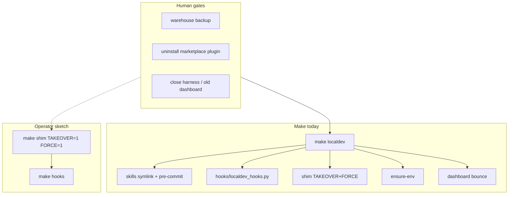

# Troubleshooting: localdev one-shot over-automation

**Created:** 2026-07-12-191942  
**Trigger:** Operator interrupt during `/niko-build` — why isn't `make localdev` just `shim TAKEOVER=1 FORCE=1` + `hooks`? Are we automating too much?  
**Parent task:** contributing-localdev-guide (BUILD interrupted at gates / format-check)

## Diagnostic checklist

- [x] Load memory bank (projectbrief, systemPatterns, techContext)
- [x] Step back: identify core component (contributor enter / `make localdev` composition)
- [x] Map structure (Makefile recipe, creative B, docs rip-it-out)
- [x] Hypothesize broadly
- [x] Gather evidence (locked requirements vs shipped shape vs operator sketch)
- [x] Confirm root cause (design conflation, not a runtime bug)
- [x] Operator decision on slim composition (atoms + HARNESS)
- [x] Atom inventory confirmed; plan rewritten in tasks.md
- [ ] Preflight + build reshape

## Core functionality in scope

Contributor **enter path**: after marketplace uninstall, wire this checkout so CLI + harness use checkout code. Surfaces: on-path shim, project hooks, skills discovery, optional dashboard.

## System map

| Piece | Where it lives today | Named atom? |
| --- | --- | --- |
| Skills mirror + pre-commit | inlined in `localdev` | No (was the old whole `localdev`) |
| PATH hooks install/clean | `hooks/localdev_hooks.py`, called only from localdev/clean | No `make hooks` |
| Shim claim | `make shim` + flags | Yes |
| ensure-env | inlined after shim | No (also a CLI: `stockroom shim ensure-env`) |
| dashboard bounce | inlined | No (CLI: `stockroom dashboard`) |

## Hypotheses (broad)

1. **Locked rework required the mega one-shot** — projectbrief item 4 literally lists skills + hooks + shim + dashboard; we faithfully over-implemented.
2. **We conflated “one operator command” with “one fat recipe”** — composition (`localdev` → atoms) would satisfy one-shot without opacity.
3. **ensure-env + dashboard are enter-doc concerns**, not Make concerns — already covered by `make sync`/`make torch` and hooks’ own `stockroom dashboard`.
4. **Skills mirror is load-bearing after plugin uninstall** — omitting it breaks `/sr-*` in Cursor for this project; operator sketch omitted it intentionally or assumed another load path.
5. **Hooks without a `make hooks` atom** made the recipe look heavier than the design needed.
6. **First creative hybrid warned against mega-enter**; rework “one-shot” walked that back without re-checking composition.

## Evidence

- **projectbrief rework §4:** `make localdev` = skills + project hooks + claim shim + bounce dashboard.
- **creative B:** same four edges; quality #2 = “Simplicity (one `make localdev`)”; option C was “no hooks in localdev.”
- **Preflight amendment:** also stuffed `ensure-env` into localdev (fifth side effect).
- **First creative (contributor-localdev-round-trip):** Option D Hybrid — thin atoms, **no silent mega `contrib-enter`**.
- **Makefile ~90–123:** single recipe does five jobs; no `hooks` phony target.
- **Operator sketch:** wants composition of two atoms (`shim`, `hooks`) — skills/ensure-env/dashboard absent from the Make one-shot.

## Confirmed root cause

Not a build failure. **Design conflation:** we treated the rework’s “one-shot” as permission to inline every enter side effect into one opaque `localdev` recipe (skills + pre-commit + hooks helper + shim + ensure-env + dashboard), instead of a thin composer over named atoms. That recreates the mega-enter the first creative rejected, while still matching the letter of rework §4.

Confidence: **high** on the conflation diagnosis; **medium** on which pieces belong in Make vs docs (needs operator call).

## Operator decision (2026-07-12)

Locked direction (supersedes mega-recipe and A/B/C sketch):

1. **Separate Make target per localdev concern** (`local-skills`, `local-hooks`, `local-engine`, …).
2. **`make localdev` only composes** — invokes all atoms.
3. **Harness-dependent targets require `HARNESS`** (`cursor` | `claude`); error if unset/invalid.
4. Harness-independent targets (engine/shim, dashboard) do not require `HARNESS`.

### Proposed atom inventory

| Target | `HARNESS`? | Does |
| --- | --- | --- |
| `local-skills` | required | Wire checkout skills for that harness |
| `local-engine` | no | `shim TAKEOVER=1 FORCE=1` + `ensure-env` |
| `local-dashboard` | no | Bounce `stockroom dashboard` |
| `localdev` | required | Composes the three above |
| `localdev-clean` | required | Undo harness-managed bits |
| `localdev-status` | optional | Report state |

**Hooks:** not automated. Operator insight: putting `hooks/` in the local project still leaves `CURSOR_PLUGIN_ROOT` unset after uninstall. Manual docs note only for bootstrap-surface changes.

Usage: `HARNESS=cursor make localdev`

## Status

Operator locked composition model and confirmed atom inventory. **Plan rewritten in `tasks.md` (rework²).** Next: `/niko-preflight` then `/niko-build`.
