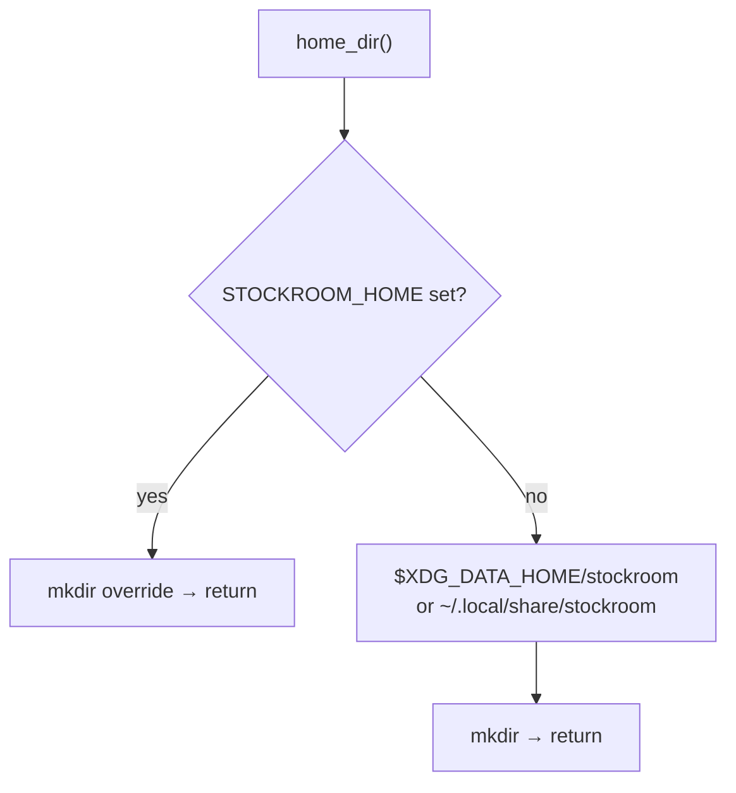

# TASK ARCHIVE: xdg-base-directory-layout

## SUMMARY

Adopted the XDG Base Directory layout for stockroom-owned runtime data on all Unix-like platforms (Linux, WSL, macOS), per [issue #3](https://github.com/Texarkanine/stockroom/issues/3). Default home is `$XDG_DATA_HOME/stockroom` (else `~/.local/share/stockroom`); `STOCKROOM_HOME` remains an absolute override. Warehouse DB, lock, and scheduler logs share a single tree under that home. Doctor probe reports `home` and `home-source`. Living docs, O1/brainstorm language, and spike defaults were reconciled. **Legacy `~/.stockroom/` migration was explicitly waived** by the operator (two private installs; fresh install / manual `cp`) and did not ship.

## REQUIREMENTS

From the project brief (amended mid-plan):

1. On all Unix-like platforms, resolve stockroom paths via XDG data-home env + Freedesktop default — one layout everywhere; no macOS Application Support tree.
2. `STOCKROOM_HOME` remains an absolute override over XDG resolution.
3. Dependents of `home_dir()` (`warehouse_path`, `lock_path`, schedule log path) follow the new resolution.
4. `stockroom doctor` reports which home is active and how it was chosen (`home`, `home-source`).
5. Docs/skills / memory bank name the new default paths; reconcile stale O1 "XDG-aware" planning language.
6. Tests cover XDG env resolution and default-path fallback (including macOS-like unset-`XDG_*` environments).

**Constraints / waivers**

- Out of scope: harness ingest roots; Windows-native paths; scheduler mechanism changes beyond log *path*.
- Out of scope (operator waiver vs issue #3 migration acceptance): legacy `~/.stockroom/` detection, auto-migration, conflict handling, or doctor legacy facts.

**Acceptance (as delivered)**

1. `home_dir()` and dependents resolve via XDG data home + spec defaults ✓
2. `STOCKROOM_HOME` still overrides everything ✓
3. No migration code ships; issue #3 migration items waived for this task ✓
4. Memory bank / tech context updated; O1 language reconciled ✓
5. Tests cover XDG env + default fallback ✓
6. Doctor reports active home and home-source ✓

## IMPLEMENTATION

### Path resolution

### Approach

- **`stockroom.warehouse`**: Pure `resolve_home() -> (Path, source)` with sources `STOCKROOM_HOME` | `XDG_DATA_HOME` | `default`; `home_dir()` = resolve + mkdir. `warehouse_path` / `lock_path` unchanged relative to home.
- **`stockroom.doctor`**: Probe facts `home` + `home-source` via `resolve_home()` (no mkdir side effect). No legacy keys.
- **`stockroom.schedule`**: No API change — still uses `warehouse.home_dir()` for log path; docstring alignment only.
- **Tests**: New `tests/test_warehouse_home_xdg.py`; doctor fact/CLI coverage; docstring sweep in fixtures/open tests.
- **Docs**: `systemPatterns.md`, `techContext.md`, brainstorm O1/D7, `tech-brief.md`, spike `export_dataset.py` (+ README). Historical archives left as-is. Canonical edits under `skills/` only (`.cursor/skills/stockroom-local` is localdev symlink).

### Key files

| Area | Files |
|------|--------|
| Path policy | `skills/sr-search/src/stockroom/warehouse.py` |
| Doctor | `skills/sr-search/src/stockroom/doctor.py` |
| Schedule docs | `skills/sr-search/src/stockroom/schedule.py` |
| Tests | `tests/test_warehouse_home_xdg.py`, `tests/test_doctor.py`, `tests/test_doctor_cli.py`, `tests/conftest.py`, `tests/test_warehouse_open.py` |
| Docs / planning | memory-bank persistent files, brainstorm O1/D7, spike export path |

### Creative decisions inlined

#### Q1 — XDG directory layout shape (adopted)

**Selected:** Single tree under `$XDG_DATA_HOME/stockroom/` (default `~/.local/share/stockroom/`), including `logs/nightly.log`.

**Options considered**

- **A — Single data tree**: DB, lock, and logs under data home; `STOCKROOM_HOME` replaces that one root.
- **B — Split data vs state**: DB+lock under DATA; logs under STATE; override collapses both.
- **C — Symlink compat**: Relocate under XDG but keep `~/.stockroom` as a compatibility symlink.

**Rationale:** Ranked simplicity and predictability beat mild XDG purity for a regenerable log. Preserves the existing `home_dir()` → warehouse / lock / schedule-log dependency graph and the singular `STOCKROOM_HOME` contract. Issue #3 explicitly allows keeping logs under the data home. Splitting STATE later remains additive.

**Tradeoff:** Nightly logs live under DATA rather than STATE until durable non-log state appears.

#### Q2 — Legacy home migration (superseded; not implemented)

Creative exploration selected **safe auto-migrate at path resolve** (detect before mkdir; hard refuse when both warehouses exist and diverge; doctor legacy facts). Mid-plan the operator waived migration entirely: only two private installs; fresh install / manual `cp`. The creative doc was retained on disk during the task as historical exploration and is **not** product intent. Issue #3 migration acceptance was waived for this task.

### Build steps executed

1. TDD: XDG / override path resolution (`resolve_home` / `home_dir`)
2. TDD: Doctor home facts (probe + CLI)
3. Docstring / comment sweep
4. Memory bank + planning reconciliation (no migration story)
5. Skills / operator docs + spike default path
6. Full verification

## TESTING

- Targeted new XDG and doctor tests written first (TDD); expected red then green.
- Full engine/CI recipe: `make test` — **425 passed, 3 skipped** (JS suite **32 passed**); `make lint` clean; ruff format applied.
- `/niko-preflight` PASS on amended (no-migration) plan; advisory applied: pure `resolve_home()` so doctor probe does not mkdir.
- `/niko-qa` PASS — no substantive findings; no trivial debris.

Behaviors covered: `STOCKROOM_HOME` wins; `XDG_DATA_HOME` set; default when XDG unset; auto-create on `home_dir()`; warehouse/lock under resolved home; doctor `home` / `home-source`; schedule tests under override still pass.

## LESSONS LEARNED

### Technical

- Split “pure resolve + label” from “mkdir on use” is the right seam when diagnostics and writers share path policy: doctor stays side-effect-free while `home_dir()` remains the write-side chokepoint.
- Single data-home tree (including logs) avoided schedule API churn and kept one operator story.

### Process

- When an issue’s acceptance includes migration but the operator has only private installs, pin that waiver in the project brief *before* creative — Q2’s auto-migrate exploration was high-quality and unused.
- Mid-cycle scope cut correctly forced re-preflight; the gate worked as designed.
- Preflight’s `resolve_home` advisory prevented an easy doctor side-effect (calling `home_dir()` from probe).

## PROCESS IMPROVEMENTS

- For private/low-install products, confirm whether issue acceptance checkboxes (especially migration) apply before deep creative design on that surface.
- Keep creative docs that are superseded by operator waiver on disk during the task as “historical exploration,” but mark them superseded in the plan so build does not implement them.

## TECHNICAL IMPROVEMENTS

None surfaced beyond the shipped seam (`resolve_home` vs `home_dir`). Future STATE/CONFIG/CACHE trees remain additive if durable non-log state appears; not required now.

## NEXT STEPS

- Operator machines: manual `cp` of `warehouse.duckdb` into the new home; re-`schedule install` if an old crontab/plist still redirects logs to `~/.stockroom/logs/`.
- Issue #3: close or annotate with the migration waiver for this delivery.
- Unrelated working-tree note at archive time: `planning/roadmap.md` had uncommitted Phase 5 milestone wording edits — left out of this archive commit.
