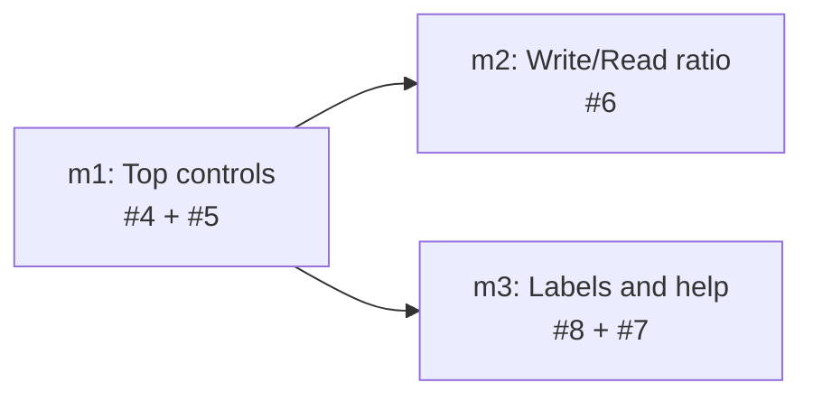

# TASK ARCHIVE: Dashboard Polish (#4–#8)

## SUMMARY

Level 4 polish of the local stockroom dashboard across GitHub issues #4–#8: date-range presets with honest windowed labels and prior-period deltas, Aggregate/Compare as one exclusive segmented control, Write/Read as a true ratio series, friendly project display names with `project_id` on hover, and clickable info-icon help on Session Efficiency and First-Prompt Quality.

Delivered as three milestones (m1 L3 → m2 L2 → m3 L3) in planned serial order. All cross-milestone invariants held (read-only warehouse, fully offline, mode-agnostic harness-keyed API, client-owned Aggregate/Compare, Wrapped all-time, `project_id` as identity key, port 6767). Post-m3 operator rework restored adaptive trends granularity for bounded windows and made help popovers absolute overlays so they do not reflow the page.

## REQUIREMENTS

From `projectbrief.md`:

1. **#4** — Date-range selector in the top controls bar; wire `since`/`until`; refresh labels and prior-window % deltas; Wrapped unfiltered.
2. **#5** — Aggregate/Compare as an obvious exclusive toggle (visual/ARIA only; no API/mode-semantics change).
3. **#6** — Write/Read plots ratio, not absolute quantities (aggregate + compare; honest zero-denominator handling).
4. **#7** — Info-icon tooltips for Session Efficiency and First-Prompt Quality only.
5. **#8** — Friendly project names by default; full `project_id` on hover; grouping remains by `project_id`.

### Cross-milestone invariants (held throughout)

- Read-only warehouse access only (`open_current()` / read-only open); no dashboard path mutates data or schema.
- Fully offline at runtime — no CDN; no new package-manager or bundler path for the dashboard front-end.
- Metric endpoints remain mode-agnostic and harness-keyed; Aggregate/Compare stays client-owned.
- Wrapped stays all-time and unfiltered by any date-range control.
- `sessions.project_id` remains the grouping/identity key; friendly names are display-only.
- Port 6767 and the on-path `stockroom` invocation contract are unchanged.
- Test-first; `make ci` green at every milestone boundary.

## IMPLEMENTATION

### Milestone list

Executed in the planned serial order with **no additions, removals, re-scoping, or reordering** at the project level. Estimated levels held (m1 L3, m2 L2, m3 L3). m2 and m3 were independent after m1; serial order was m1 → m2 → m3.

- [x] **m1 — Top controls (#4, #5)** — date-range presets + segmented Aggregate/Compare
- [x] **m2 — Write/Read ratio (#6)** — ratio series with honest zero-denominator handling
- [x] **m3 — Labels and help (#8, #7)** — friendly project names + two-panel info chrome

### Sub-run summaries

#### m1 — Top controls (#4, #5) — L3

Delivered top-bar date-range presets (`Default | 7d | 30d | 90d | 1y`) wired to windowed `since`/`until` with honest panel labels and prior-window deltas via existing server behavior, plus Aggregate/Compare restyled as one segmented exclusive control. Creative chose Option A (presets + Default); free-form calendar / URL sync deferred. Presentation policy (mode, date-range labels, bounds) lives in `dashboard-core.mjs` / `dashboard-data.mjs`; the DOM adapter only wires events. Build and QA passed with no plan deviations; QA found only trivial surface issues.

#### m2 — Write/Read ratio (#6) — L2

Rewrote the Write/Read panel to plot write-share ratio series (aggregate: one blended line; compare: one line per harness) with honest empty handling on zero-denominator buckets. Dedicated `buildWriteReadPanel` / `writeShare` path — `selectedDatasets` cannot express a paired writes+reads → ratio transform. Anticipated `hasValues`/`finiteNumber` null-vs-zero footgun handled via empty override. Absolute tooltip enrichment deferred. `make ci` green; QA found nothing substantive.

#### m3 — Labels and help (#8, #7) — L3

Friendly project labels with `project_id` on hover (#8) and clickable info-icon help for Session Efficiency and First-Prompt Quality (#7). `projects` stays ranked ids with parallel `labels`; Chart.js tooltip (not tick DOM) for slug hover; static `PANEL_HELP` copy. Operator amended cwd-disagreement mid-flight: unique short name across non-NULL cwds, else full `project_id` (replaced most-recent-cwd). Projects-local cwd query avoided widening `_session_rows`. Dirty out-of-scope trends/writeShare WIP restored before build. QA PASS after trivial DRY/KISS cleanups.

### Post-reflect rework (after m3)

Operator-driven polish folded into the final tree before capstone archive:

- **Adaptive trends granularity** for bounded range-picker windows: `<=30d` → day, `<=90d` → week, else month; both daily and write/read series share one axis. Unbounded defaults keep historical dual windows (14d sessions / 12w tools). Payload exposes `granularity` + `labels` (with `days`/`weeks` fallback in the client).
- **`writeShare` idle → 0** so the ratio line stays continuous instead of gapping on empty buckets; empty detection uses activity presence rather than null gaps.
- **Help popover** absolute-positioned overlay under the panel title (no page reflow).

### Key artifacts touched

- `skills/sr-search/src/stockroom/dashboard/metrics.py` — windowed trends granularity; projects `labels` / `project_display_name`; sessions/wrapped `project_id` presentation fields.
- `skills/sr-search/src/stockroom/dashboard/static/dashboard-core.mjs` / `dashboard-data.mjs` / `dashboard.mjs` — date-range + mode presentation, Write/Read ratio builder, panel help toggle, chart labelTitles.
- `skills/sr-search/src/stockroom/dashboard/static/index.html` — segmented controls, info icons, overlay help chrome.
- Python + Node contract tests for metrics, server, and dashboard-core.

### Design decisions of record

- **Default omits bounds** — first paint matches historical trends defaults; presets apply explicit windows.
- **Ratio is client-owned** — weekly absolute writes/reads remain the substrate; `writeShare` + mode branching live in pure JS.
- **Identity arrays stay authoritative** — `projects` / `project_id` never become basenames; friendly strings are parallel presentation (`labels` / `labelTitles`).
- **Unique-short-name cwd rule** — when sessions for a ranked id disagree on basename, show the full `project_id`.
- **Help copy is static in JS** — thresholds documented against Python constants; keys match `data-help-id`.

## TESTING

Every milestone gated by `make ci` (pytest + JS + ruff + REUSE as applicable) and TDD.

- **m1**: Staged TDD (data → core → static → adapter → verify); full CI green on first verification; QA trivial-only.
- **m2**: Red→green on `writeShare` / `buildWriteReadPanel`; CI green; QA clean.
- **m3**: Metrics → panel model → adapter → help chrome → toggle; CI green (485 pytest / 48 JS / ruff / REUSE at build end); QA PASS after trivial cleanups.
- **Post-reflect rework**: Adaptive granularity + continuous writeShare + overlay help covered by updated metrics/core tests in the final commit.

## SYSTEM STATE

What exists now that didn't before (relative to p4 dashboard):

- **Top-bar date-range presets** driving windowed `since`/`until` across KPIs and charts, with dynamic panel-range labels and prior-period % deltas; Wrapped remains all-time.
- **Segmented Aggregate/Compare** — one exclusive control, shared `.segmented` styling with the date-range radios.
- **Write/Read Ratio panel** — ratio series (not absolute volumes), mode-aware dataset shape, continuous idle zeros, adaptive shared axis with Daily Activity under bounded windows.
- **Friendly project names** on charts/sessions/marathon with `project_id` on hover when display ≠ id.
- **Info-icon help** on Session Efficiency and First-Prompt Quality as absolute overlays.

End-to-end: operator opens the dashboard → picks a range and mode → sees honest windowed metrics, ratio Write/Read on a matching axis, recognizable project labels, and in-place help for the two opaque efficiency panels — still fully offline on port 6767.

### Acceptance criteria — met

1. Each of #4–#8 acceptance checklists satisfied. ✔
2. Milestone boundaries left the dashboard shippable and offline-correct. ✔
3. No regression to harness discovery, positional colors, or identity-key contracts beyond intentional date-range wiring and project-label metadata. ✔

## LESSONS LEARNED

- **Dashboard presentation policy belongs in pure core modules**; the DOM adapter should only wire events and apply already-tested helpers (m1).
- **Paired series (writes+reads → ratio) need a dedicated builder path** — do not force `selectedDatasets` to generalize (m2).
- **Prefer endpoint-local metadata queries** over widening shared `_session_rows` when only one consumer needs extra columns (m3).
- **Keep identity arrays authoritative** with parallel nullable presentation fields when display names can collide or disagree (m3).
- **Bounded range pickers need shared adaptive granularity** across panels that previously used independent default windows — otherwise short presets leave Write/Read on a coarser axis than Daily Activity (post-reflect).

## PROCESS IMPROVEMENTS

- For control-strip UI spanning HTML contracts + pure JS + thin adapter, treat **static contracts as their own TDD step before adapter glue** (m1).
- **Mid-plan operator amendments to locked decisions should rewrite dependent test-plan bullets in the same edit** — otherwise build faithfully implements the stale rule (m3).
- One milestone's rework was `git restore`'d and almost lost because it wasn't properly committed before advancing. Don't leave junk and also make sure you don't throw something away w/out checking.
- Capstone archive after L4 Step 2a clears sub-run ephemerals: rely on `milestones.md`, `projectbrief.md`, and `reflection/` — do not expect `progress.md` / `activeContext.md` to still exist.

## TECHNICAL IMPROVEMENTS

- Absolute tooltip enrichment on Write/Read (deferred in m2) remains optional polish.
- Free-form calendar / URL-synced date range deferred from m1 creative — state shape `{ since, until } | null` is ready if revisited.
- Help thresholds are duplicated as documentation against Python constants; a single shared source would reduce drift risk if thresholds change often.

## NEXT STEPS

None required for this project. Optional follow-ups above if operator wants further dashboard UX polish.
