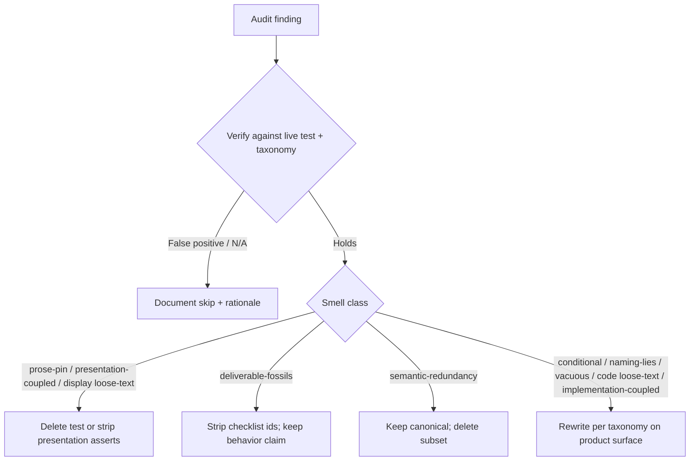

# TASK ARCHIVE: SLOBAC audit remediation

## SUMMARY

Verified all 60 findings from `.slobac/2026-07-11T14-58-48/audit.md` against live tests and the [SLOBAC taxonomy](https://texarkanine.github.io/slobac/taxonomy/), then remediated every holding smell in `skills/sr-search` tests. Also stripped supplemental deliverable-fossils the audit missed in `test_schedule.py` and `test_schema_0002.py`. Preferred deleting presentation/prose/skill-content pins over goldenizing copy; strengthened behavioral oracles (exact TSV, exact torch reasons, public-surface coverage). No production API changes. Final suites: 509 pytest passed (3 skipped), 61 JS passed; format/lint clean.

## REQUIREMENTS

1. Primary source: 60 findings in `.slobac/2026-07-11T14-58-48/audit.md`.
2. Supplemental in-scope fossils: all `B#`/`B17` checklist docstrings in `test_schedule.py` (module + tests), and Phase-1 “Done When” fossil in `test_schema_0002.py`.
3. Verify each finding against live tests + taxonomy before editing; remediate or document N/A.
4. For prose-pin / loose-text / presentation-coupled dashboard and skill/docs tests: prefer deletion over goldenizing output.
5. Prefer behavioral coverage of product code; preserve regression power when folding semantic redundancy.
6. No net-new product features beyond what remediation needs; TDD discipline for any SUT changes.
7. Full relevant test suite green after remediations.

## IMPLEMENTATION

### Approach

Smell-batched remediation with verify-first, delete-first ordering:

Batches executed:

0. Verify — all 60 HOLDS (0 N/A / already-fixed).
1. Deletes — torch writers file; skill feature-mention; packaging front-matter vacuous; JS PANEL_HELP token; aria ratio token; migrate help token; session API error-substring discrimination; session-pane emoji/CSS strip (keep JS-coupled selectors).
2. Fossils — audit-listed `B#`/`T#`/`F#`/Phase prefixes plus supplemental schedule + schema_0002.
3. Conditional / naming / vacuous — doctor torch isolation (skip-if-loaded else unconditional); mtime via public `discover` with pinned UTC-5; query `pytest.raises`; dispatcher docstring; orchestrator rename; exact query-CLI TSV lines.
4. Implementation-coupled — Claude `_parse_ts` → `parse_session`; sources `_mtime` → `discover`; delete private `metrics._iso` unit test (Z already locked by public payloads).
5. Semantic redundancy — drop warehouse-open home/path duplicates (XDG suite remains canonical).
6. Torch loose-text — exact `reason` + side effects for missing-freeze ensure and compile-timeout freeze.
7. Full verify — format/lint/test/test-js green.

### Key surfaces touched

| Area | Files |
| --- | --- |
| Doctor / CLI | `tests/test_doctor.py`, `tests/test_doctor_cli.py` |
| Engine / shim / torch | `test_engine_env.py`, `test_shim*.py`, `test_torch_*.py` (deleted `test_torch_writers.py`) |
| Query / migrate | `test_query.py`, `test_query_cli.py`, `test_migrate_cli.py` |
| Ingest | `test_ingest_claude.py`, `test_ingest_sources.py`, `test_ingest_orchestrator.py` |
| Dashboard | `test_dashboard_metrics.py`, `test_dashboard_static.py`, `test_dashboard_server.py`, `tests-js/dashboard-core.test.mjs` |
| Warehouse | `test_warehouse_home_xdg.py`, `test_warehouse_open.py` |
| Packaging / hygiene | `test_packaging.py`, `test_skill_hygiene.py` |
| Schedule / dispatcher | `test_schedule.py`, `test_schedule_cli.py`, `test_dispatcher_cli.py` |
| Schema | `test_schema_0002.py` |

### Creative phase decisions

No creative phase. Dispositions were taxonomy-prescribed and operator-settled (delete preference for presentation/prose/skill pins; exact reason + side effects for torch; no product API expansion). Nothing during build required a design fork — skipping creative was correct.

### Notable build friction

An early fossil-strip attempt used whole-file whitespace normalization and briefly corrupted Black hanging indents. Restored and redid with docstring/phrase-local transforms only.

## TESTING

- Batch 0 read-only verification of all 60 findings against live tests.
- Per-batch targeted pytest / node runs after each remediation unit.
- Final: `make format` / `make lint` clean; `make test` **509 passed, 3 skipped**; JS **61 passed**.
- `/niko-qa` semantic review: PASS — completeness, KISS/YAGNI (test-only deletions), no debris, no unexpected prod diffs; no fixes required.
- Note: naive `_mtime(` grep false-positives on `by_mtime()` — dismissed with token-boundary awareness.

## LESSONS LEARNED

### Technical

- Fossil renames must be docstring/phrase-local; never “normalize whitespace” across a whole test file when stripping checklist ids — Black hanging indents and multi-line calls break under global space collapse.
- Exact soft-fail `reason` strings from `torch_source` are stable enough to assert verbatim when the template is built from values the test already controls (`requirements_path()`, timeout).
- Public metrics payloads already locked trailing-`Z`; a private `_iso` unit test was pure coupling, not extra coverage.

### Process

- Verify-then-delete-first ordering pays off for smell remediations: presentation pins gone early reduces noise while rewriting behavioral tests.
- Preflight amendments that narrow “delete vs strengthen” for mixed presentation/JS-coupled tests (session pane) are high leverage.
- Bounded supplemental fossils (named files only) prevent open-ended suite fossil hunts during build.

## PROCESS IMPROVEMENTS

- Prefer token-boundary greps when confirming private-helper decoupling (`_mtime(` vs `by_mtime()`).
- Keep fossil-strip scripts phrase-local by default; treat whole-file whitespace rewrites as a separate, explicit step if ever needed.

## TECHNICAL IMPROVEMENTS

None shipped beyond test remediations. Optional future: suite-wide fossil inventory as a separate hygiene task (out of scope here by design).

## NEXT STEPS

None. Task complete and archived. Memory bank is clean for the next `/niko` run.
