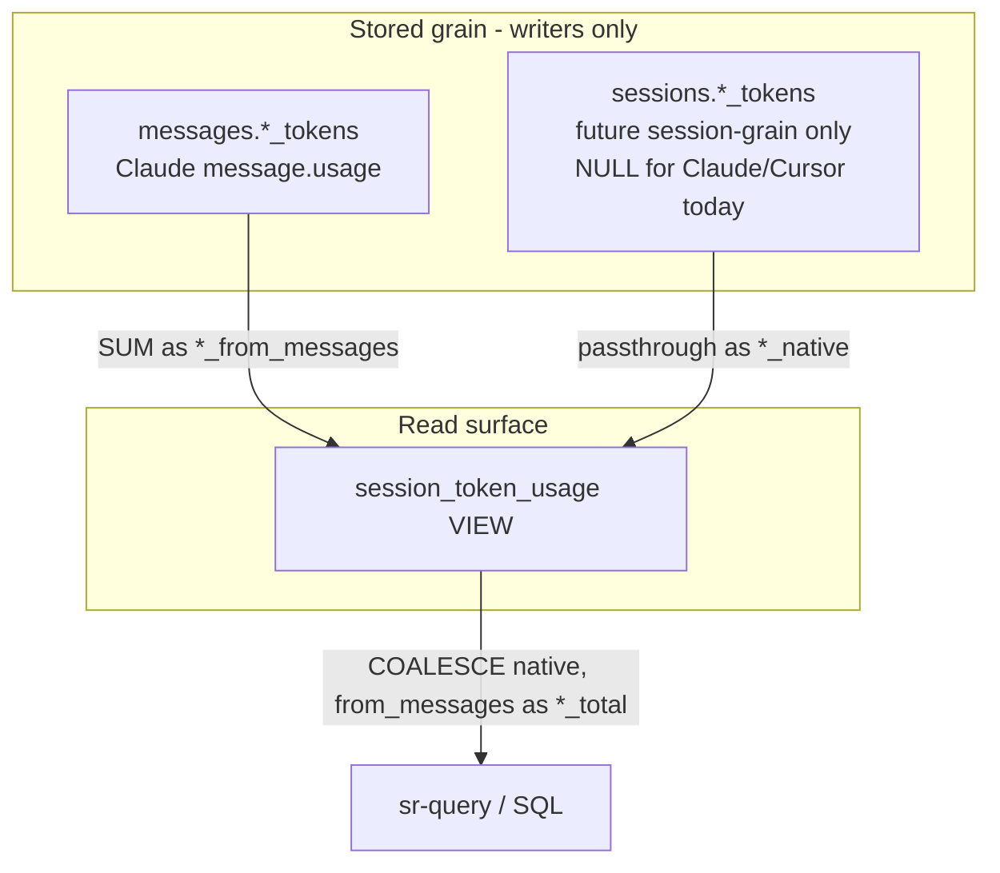

# TASK ARCHIVE: Token Usage Grain & Rollups

## SUMMARY

Made conversation-level token rollups first-class while future-proofing for session-grain harnesses. Migration `0007` adds nullable `sessions.*_tokens` (NULL for Claude/Cursor today) and VIEW `session_token_usage` (`*_from_messages`, `*_native`, `*_total` via COALESCE, `token_grain`). Ingest model/writer persist session tokens when set and never invent them from message sums. Merged as [PR #74](https://github.com/Texarkanine/stockroom/pull/74).

## REQUIREMENTS

From the project brief:

1. Keep Claude message-grain tokens as source of truth for that harness.
2. Do not attribute Cursor usage from dashboard CSV/API.
3. Easy per-session token rollups for message-grain sources.
4. Cheap path for future session-grain reporting (no expensive migration later).
5. One meaning per field — never invent message tokens from session totals (or the reverse as stored values).

**Constraints:** dual-harness warehouse; forward-only migrations; no Cursor enricher in this task; follow harness-labeled ingest patterns.

**Acceptance (all met):** Claude message ingest unchanged; documented rollup via VIEW; session-grain columns ready; tests cover schema/VIEW/writer; Cursor stays NULL at both grains.

## IMPLEMENTATION

### Creative decision (Option B)

Evaluated: (A) docs-only SUM, (B) dual typed columns + rollup VIEW, (C) separate `token_usage` fact table. Selected **B** — matches `messages.model` / `sessions.models` dual-grain precedent; rollups are one query; session-grain onboarding is an ingest fill. Rejected fact table (overbuilt) and premature index (personal-scale DuckDB; messages PK already leads with session).

Dual-grain flow:

### Key files

| Area | Files |
|------|--------|
| Migration | `skills/sr-search/src/stockroom/migrations/0007_session_token_usage.sql` |
| Golden | `skills/sr-search/tests/fixtures/schema/0007_snapshot.json` |
| Schema tests | `skills/sr-search/tests/test_schema_0007.py` |
| Ingest | `skills/sr-search/src/stockroom/ingest/model.py`, `writer.py` |
| Writer/model tests | `tests/test_ingest_writer.py`, `tests/test_ingest_model.py` |
| Head pins | `test_migrate_runner.py`, `test_warehouse_open.py`, `test_warehouse_concurrency.py` |
| Docs / skills | `docs/architecture/warehouse.md`, `docs/user-guide/search.md`, `skills/sr-query/SKILL.md`, `skills/sr-search/SKILL.md` |
| Patterns | `memory-bank/systemPatterns.md` (dual-grain tokens + VIEW note) |

### Approach

TDD: schema contract tests → migration → golden → writer tests → model/writer → docs → full suite. Writers target base tables only; VIEW is read-only. No backfill of Claude session columns from `SUM(messages)`. No secondary index. Parsers unchanged (session tokens unset).

### Post-merge docs ownership

SQL recipe stays in `sr-query` skill (agent cookbook). `search.md` trimmed to a discoverability pointer after PR review discussion — do not clone recipes into the user guide. Cookbook reshape / [#69](https://github.com/Texarkanine/stockroom/issues/69)-style recipe home deferred to a future PR.

## TESTING

- Schema: four nullable BIGINT session token columns; VIEW existence/columns via `duckdb_views()`; null-preserve across 0007; VIEW semantics (message / session / both / none grain); golden `0007_snapshot.json`.
- Writer: persist when set; NULL when unset (even with message tokens); integration via VIEW after `write_session`.
- Head version bumped to 7 in migrate/warehouse concurrency/open contracts.
- Verification: `make format` / `make lint` clean; `make test` → **617 passed, 4 skipped**.
- `/niko-preflight` PASS (amended TDD ordering, VIEW assert path, SKILL.md touchpoint).
- `/niko-qa` PASS — no semantic rework.

## LESSONS LEARNED

### Technical

- Adding a DuckDB VIEW at migration head updates both explicit `duckdb_views()` asserts *and* the cumulative golden when `_introspect_schema` reads `duckdb_columns` (views appear as tables there). Plan for both locks.
- `_HEAD_VERSION` pins in `test_migrate_runner` / `test_warehouse_open` / `test_warehouse_concurrency` are part of every migration's blast radius — required companion change, not an afterthought.
- `SUM` of all-NULL message token columns yields NULL; empty sessions (no messages) appear in the VIEW with from_messages NULL via LEFT JOIN.

### Process

- Preflight amendments that encode TDD step ordering and assert paths reduce build thrash for L3 schema work.
- Creative Option B constrained build away from CSV/dashboard scope; QA had little to prune.
- User-guide vs skill recipe ownership: architecture for doctrine, skill for copy-paste SQL, user-guide for pointers — not pymdownx snippet farms (already discouraged in properdocs config).

## PROCESS IMPROVEMENTS

When planning a new migration head, include an explicit checklist item for head-version pin updates (migrate runner + warehouse open/concurrency) alongside golden snapshot regeneration.

## TECHNICAL IMPROVEMENTS

None required for this ship. Optional future: #69-style `sr-query/references/` cookbook for gnarly harness-specific recipes (skills/tools) — separate from this VIEW, which exists so rollups are *not* gnarly.

## NEXT STEPS

- Future PR: cookbook shape / [#69](https://github.com/Texarkanine/stockroom/issues/69) recipe home (deferred by operator).
- None otherwise for this task — standalone L3 complete; memory bank cleared.
