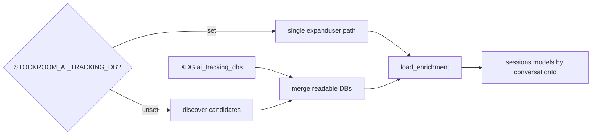

# TASK ARCHIVE: cursor-ai-tracking-multi-db

## SUMMARY

Fixed [#82](https://github.com/Texarkanine/stockroom/issues/82) on `wsl-dual-sot`: Cursor `ai-code-tracking.db` enrichment now walks/merges every readable candidate (plus additive XDG `ai_tracking_dbs`) so WSL CLI and Windows IDE corpora both populate `sessions.models`, and a tiny first-hit WSL DB no longer shadows IDE models on re-ingest. Single-DB `STOCKROOM_AI_TRACKING_DB` / kwarg overrides remain. PR [#85](https://github.com/Texarkanine/stockroom/pull/85) rework polished docs default-path wording, `expanduser` on the env override, parse-failure WARNING on present-but-bad `config.toml`, and normalize clarity. Did not revive aborted `state.vscdb` token enrich from `enhance-cursor-tokens` (already archived as abandoned).

## REQUIREMENTS

1. Walk/merge all readable ai-tracking candidates (fail-soft), not first-hit.
2. Optional additive XDG `[cursor].ai_tracking_dbs`; create XDG config fresh if needed.
3. Keep `STOCKROOM_AI_TRACKING_DB` as single-DB override for tests/one-shots.
4. Implement on `wsl-dual-sot` (not `enhance-cursor-tokens`).

**Constraints:** Out of scope — `state.vscdb` token enrich, Claude token ingest, [#84](https://github.com/Texarkanine/stockroom/issues/84) historical backfill; do not multi-path `state_vscdb`.

**Acceptance (all met):** Dual-corpus models under default ingest; additive fail-soft pins; re-ingest no longer wiped by WSL shadow DB; docs + tests (two synthetic DBs, first-hit regression, config pins).

**PR #85 rework (also met):** document `~/.config/stockroom/config.toml` default in `installed-layout.md`; `expanduser` on env override; WARNING on unparseable present config.toml (still empty `Settings()`); drop redundant `Path(path)` in `_normalize_db_path`.

## IMPLEMENTATION

1. Fresh `stockroom.home.resolve_config_home` + `stockroom.config` (`Settings`, `load_settings`, `[cursor].ai_tracking_dbs`).
2. `resolve_db_paths` / `load_enrichment`: discover + additive pins; env/kwarg singleton override; `settings=` DI for tests.
3. Enrich walks all readable DBs and merges by `conversationId` (fail-soft missing/unreadable).
4. Orchestrator default uses `load_enrichment()`; AC locked in orchestrator multi-DB test.
5. Docs: `ingest.md` multi-DB merge; `installed-layout.md` config home + default `~/.config/...` fallback.
6. Post-reflect polish: deleted unused `default_db_path`; stopped monkeypatching `load_settings`.
7. PR #85 rework: expanduser/warn/normalize/docs as above; filed [#86](https://github.com/Texarkanine/stockroom/issues/86) for smoke→ensure-env (out of band).

| Area | Files |
|------|--------|
| Config / home | `skills/sr-search/src/stockroom/config.py`, `home.py` |
| Enrich / ingest | `skills/sr-search/src/stockroom/ingest/enrich.py`, `ingest/__init__.py` |
| Tests | `tests/test_config.py`, `test_ingest_enrich.py`, `test_ingest_orchestrator.py` |
| Docs | `docs/user-guide/ingest.md`, `installed-layout.md` |

## TESTING

- TDD: merge of two synthetic DBs with disjoint IDs; first-hit shadowing regression; additive config pins; env override; orchestrator AC.
- Full suite green through build/QA/rework (final rework: **672 passed / 1 skipped** via `uv run --no-sync pytest`).
- `/niko-preflight` PASS; `/niko-qa` PASS (main + rework); live verify after re-ingest: Cursor ide 841 / cli 93 non-subagent sessions with models on both corpora.
- Rework tests: `test_resolve_db_paths_env_override_expands_user` (sets `HOME`; `Path.home` monkeypatch does not affect `os.path.expanduser`); `test_load_settings_malformed_toml_logs_warning`.

## LESSONS LEARNED

### Technical

- First-hit path resolution is a silent dual-corpus footgun when writers land disjoint ID spaces under ordered candidates — prefer walk/merge for optional sidecars; reserve env for true single-source overrides.
- Prefer injecting `Settings` (or a real temp XDG config) over monkeypatching `load_settings`; the latter forces a fragile module-import style.

### Process

- Preflight should treat “helpers updated, orchestrator seam unchanged” as a plan-failure mode; the AC-level orchestrator test belonged in the plan from the start.
- `make test`'s `sync` can strip out-of-lock torch; local verify after torch provision should use `--no-sync`.

### Million-dollar question

If multi-source ai-tracking had been assumed from day one, enrich would expose only `load_enrichment()` / `resolve_db_paths()` with env as a singleton override — no first-hit `default_db_path` API. Post-reflect cleanup deleted that leftover so that is the shipped shape.

## PROCESS IMPROVEMENTS

Keep the preflight gate that flags helper-only plan steps when the orchestrator seam is the real acceptance surface.

## TECHNICAL IMPROVEMENTS

Residual “preserve `sessions.models` on total enrich miss” remains a separate integrity question, not part of #82. Shared tracking-DB seed helper (PR review item 10) still optional.

## NEXT STEPS

- Land / merge [PR #85](https://github.com/Texarkanine/stockroom/pull/85) as desired; close or annotate [#82](https://github.com/Texarkanine/stockroom/issues/82) as delivered.
- Follow-up: [#86](https://github.com/Texarkanine/stockroom/issues/86) doctor smoke → ensure-env remedy (explicitly out of this task).
