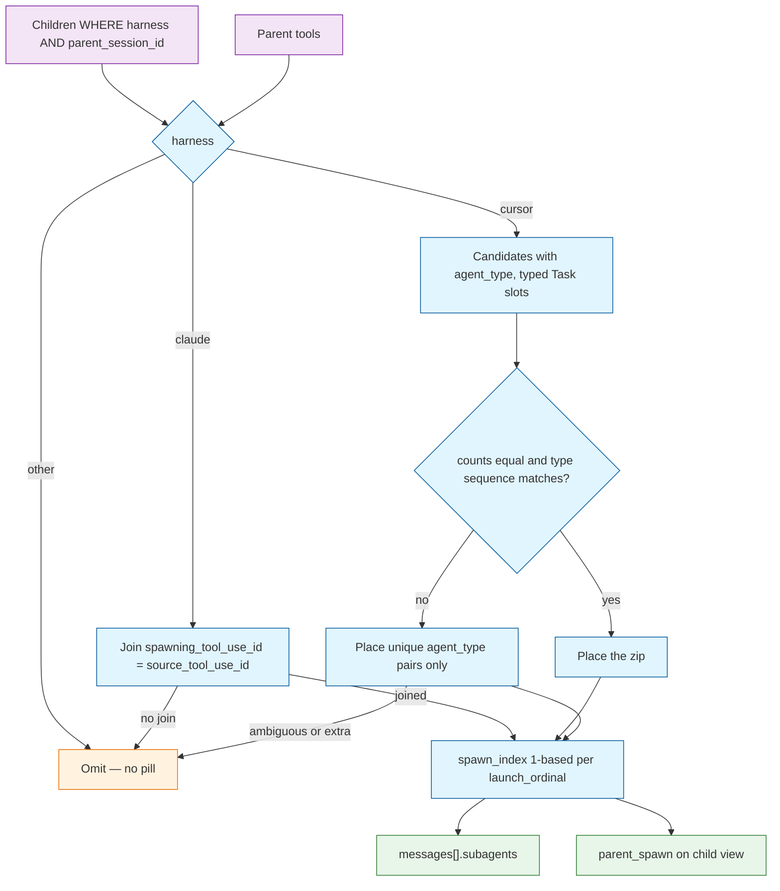

# TASK ARCHIVE: dashboard-subagent-pills

## SUMMARY

The dashboard session view now surfaces warehouse-linked subagent sessions as sibling inset cards (`#msg-{ordinal}-sa-{n}`) under the launching turn, plus a `parent:` line on child views that deep-links back to that pill. Association is read-time only: Claude joins spawn ids; Cursor places only when corroborated (aligned type zip or unique `agent_type`). A pill is a positive claim — omit rather than guess. Shipped on `subagent-insets` as draft [PR #126](https://github.com/Texarkanine/stockroom/pull/126).

## REQUIREMENTS

From the project brief:

1. For each conversation that spawned subagent sessions, render a visually distinct pill under the launching turn for each child that can be associated with that turn. A Claude child whose `spawning_tool_use_id` does not join a parent tool is omitted.
2. Pills are left-aligned with extra left padding and a slightly different color from ordinary message cards. The pill links to the child's reconstruction; do not inline child history.
3. New fragment anchors `#msg-{ordinal}-sa-{n}` (1-based among children of that turn) so existing `#msg-N` numbering stays stable.
4. When the open conversation is a subagent, show `parent:` under session metadata, linking to the parent at the child's pill when `parent_spawn` is known.
5. Sessions list remains top-level only.

Constraints that survived into the shipped product:

- Warehouse already had `is_subagent`, `parent_session_id`, `agent_type`, `spawning_tool_use_id`. No second parent/child model and no ingest rewrite.
- JSON export keeps `messages[].subagents` and `parent_spawn`. Markdown export stays pill-free.
- Cursor leftover (hang extras on the last Task / last message) is forbidden. An unchecked positional zip that can shift after a hole is forbidden.

Acceptance on the motivating Cursor pair: parent `604ead72-0402-49f2-bceb-c22ebed2ec33`, child `bc960b66-605b-4e83-baac-be61435555f5` — one pill on turn 48 (`#msg-48-sa-1`); untyped Task at msg 55 is not a slot; child view `parent:` returns to that hash.

## CREATIVE PHASE DECISIONS

### Spawn-to-turn association

**Problem:** Given parent tools and child rows (`parent_session_id` + same harness), compute `launch_ordinal` and 1-based `spawn_index`, plus the reverse `parent_spawn` for the child view. Volumes are tiny; honesty beats clever matching.

**Options evaluated:**

- **A. Provenance join only:** Attach only when `child.spawning_tool_use_id = tool.source_tool_use_id`. Cursor children (NULL spawn id) never attach.
- **B. Zip every parent `Task`:** Order children by `source_path` and zip against every `Task`, including untyped nudges/retries.
- **C. Claude join + Cursor typed-Task zip:** Claude uses A. Cursor zips `source_path`-ordered children against Tasks with non-null `subagent_type` — the same slots ingest uses for `agent_type`.
- **D. Persist launch ordinal at ingest:** New columns and a parser write; old warehouses stay blank until `--full`.

**Selected: Option C**, then operator-amended. C is the only option that places the motivating Cursor child under `#msg-48` without a schema change. Option B happens to work on today's two-Task sequence but a nudge *before* the real spawn would steal the slot. Option A fails Cursor. Option D violates "no ingest rewrite unless necessary."

**Operator amendments (load-bearing, not polish):**

- Claude unmatched or missing spawn ids are omitted. Do not invent a turn.
- A pill is a positive claim. Cursor leftover is forbidden. Positional zip runs only when counts match **and** each `child.agent_type` equals that slot's `subagent_type`. Otherwise place only types that appear once on both sides.
- Residual: two compensating holes when every remaining pair shares one type still looks aligned. No further warehouse signal exists.

**Friction:** Parent and child `source_mtime` can be identical (this warehouse: both `2026-08-26 04:30:07`). Time-proximity matching is not available. `source_tool_use_id` stays off public `tool_calls` JSON; the join is server-side only.

### Subagent pill chrome

**Options evaluated:**

- **A. Chip inside the launching turn:** Compact; inherits `#msg-N` as the scroll target so `#msg-N-sa-M` cannot land on the pill.
- **B. Sibling inset card:** After the launching turn; own id; extra left padding and tint.
- **C. Transcript-top child list:** Easy roster; severs spawn from turn; fails the inline-under-the-launcher requirement.

**Selected: Option B**, plus the already-chosen `parent:` line under session metadata. Pills cannot live inside `#msg-N` if `#msg-N-sa-M` must scroll to the pill.

**Label** (server-sent, first non-empty): Task `description`, then `agent_name`, `title`, `agent_type`, else `"Subagent"`. Prefer one focusable link per pill.

**Operator amendment after live look:** Outer card matches assistant/user chrome (`SUB-AGENT` role). Inner `.session-subagent-convo` is the child link. Keep `margin-left: 1.5rem` and an accent wash on `--surface-soft`. Heading ordinal is `#48-sa-1`, same muted style as turns. The sketch's extra "Open conversation" line was dropped.

JSON export keeps the new fields; markdown stays the conversation body.

## IMPLEMENTATION

Read-time association in a pure helper; `session_detail` is the only API boundary change. No schema, ingest, HTTP route, or new front-end dependency.

**Key files:**

- `skills/sr-search/src/stockroom/dashboard/spawns.py` — `associate_children`, `spawn_label`. Harness→technique map: `claude` → provenance join, `cursor` → corroborated zip, else empty. Comment on the map: a third harness is the cue to extract the two techniques, not another `elif` with Cursor Task/`source_path` knobs. Docstring names `_parent_subagent_types` as the sibling slot rule.
- `skills/sr-search/src/stockroom/dashboard/metrics.py` — `session_detail` always emits `messages[].subagents` (possibly `[]`) and top-level `parent_spawn` (`null` or `{session_id, message_ordinal, spawn_index}`). Child/parent/sibling SQL filters on `(harness, session_id)`. `source_tool_use_id` selected for association only.
- `skills/sr-search/src/stockroom/dashboard/static/dashboard-session.mjs` — exclusive `parseMessageHash`; `parseSubagentHash` / `parseSessionFragment`; `buildSessionDeepLink` spawn option; `buildParentLineHref`; `sessionTranscriptItems` / `sessionParentLine` (turn then sibling subagent items, not nested in the turn); JSON identity export; markdown still roles/text/tools only.
- `dashboard.mjs` + `index.html` — mount the model; `#session-parent` after `#session-meta`; hashchange uses the generic fragment helper; clear `sessionParent` on the loading/reset path. Pill and `parent:` links are plain `<a>` full reloads (deliberate: boot re-reads `?view=session…#msg-N-sa-M`).
- Tests: `tests/test_dashboard_spawns.py`, `test_dashboard_metrics.py` (payload + cross-harness collision), `tests-js/dashboard-session.test.mjs`.
- Docs: `docs/user-guide/dashboard.md`, `memory-bank/techContext.md` name both fragment forms.

**Plan units (TDD, as shipped):** (1) helper red/green, (2) payload, (3) hash/export helpers, (4) render model then mount, (5) prose.

**Post-reflect chrome** (operator live look, still this task): `SUB-AGENT` outer turn, inner convo pill, visible `#N-sa-M` ordinal. Merged `origin/main` (`#123` `bindSessionMarkdown` + `#125` CONTRIBUTING); turn bodies use `markdownRender`.

**Preflight advisory declined:** `association_method` confidence badges and a DB-facing `placements(con, …)` wrapper. Out of scope; omit-if-uncorroborated does not need a badge.

## TESTING

- First plan: `/niko-preflight` **FAIL (blocking)** — leftover needed `message_ordinals` the helper did not take; `hashchange` only accepted `#msg-N`; JSON export is identity stringify; unit 4 had no failing render test (`dashboard.mjs` has no DOM harness).
- Re-plan encoded those findings. Second preflight **PASS WITH ADVISORY** (inline queries vs a `placements()` wrapper; typed-Task rule duplicated with ingest; unknown harness must not inherit Cursor zip — plan already maps unknown → empty; plain `<a>` vs SPA intercept named as deliberate).
- Operator then forbade leftover entirely. Build proceeded without a third preflight because the change **removed** surfaces. `/niko-build` TDD walk; `/niko-qa` **PASS** (no blocking semantic findings).
- Suite at QA: `make lint`, `make format-check`, `make test` — 133 JavaScript tests; 840 Python tests passed, 4 skipped. Post-reflect chrome: 134 JS green.
- Live UAT on `:58018` (standing dashboard stays on `:58008`; do not rectify the shim from a parallel worktree). Browser-tool click on `parent:` focused the link but did not navigate; href + hash boot did. In-IDE browser tools were crashy later; verify by hard-refresh of `:58008`.

## LESSONS LEARNED

- Cursor `source_mtime` on parent and child can be identical; association is provenance (Claude) or corroborated slot/type (Cursor), nothing else.
- An untyped parent `Task` is not a spawn slot — same rule as ingest `_parent_subagent_types`. The live "Nudge L3 QA" at msg 55 is the motivating example, not a bug.
- When `dashboard.mjs` has no DOM harness, a pure item list in `dashboard-session.mjs` is the existing-suite way to specify sibling insertion and parent-line visibility before production mount.
- `source_tool_use_id` is warehouse provenance, not a public tool JSON field.
- Creative leftover and the first plan's "best-effort pill" were the same mistake: treating a missing child as something the UI must still point at.
- `dashboard.mjs` is cached separately from inline `index.html` CSS — a CSS-only refresh can lie about JS chrome.

## PROCESS IMPROVEMENTS

- A dashboard unit that only edits `dashboard.mjs` / `index.html` is not TDD until a testable model (or a real DOM harness) goes red first. Preflight was right to block the first unit 4.
- Narrowing association after an advisory preflight (omit more, add nothing) did not need another gate. Widening it would have.
- Live UAT of this dashboard on a machine that already serves `:58008` must use a second port. Do not restart the standing listener from a parallel worktree.
- Blocking preflight on leftover, hashchange, export identity, and untested mount would have been expensive in Build — those were the high-leverage findings.

## TECHNICAL IMPROVEMENTS

- Residual aligned-zip lie (two compensating holes, one shared type) has no warehouse signal. Do not invent leftover or time-proximity to "fix" it.
- The preflight `placements(con, …)` wrapper would make spawn-to-turn answerable from `sr-query` without copying logic. Declined for this task; still a reasonable later cookbook/CLI seam.
- Typed-Task slot rule lives in ingest and in `spawns.py`. Drift would mis-place pills. The docstring cross-name is the current mitigation.

## NEXT STEPS

- [PR #126](https://github.com/Texarkanine/stockroom/pull/126) (`subagent-insets`) — mark ready and merge when review is satisfied. `CODECOV_TOKEN` is still needed for a live coverage badge (unrelated, from #116).
- Do not start a new Niko task on this bank until this archive lands (this document *is* that landing).
