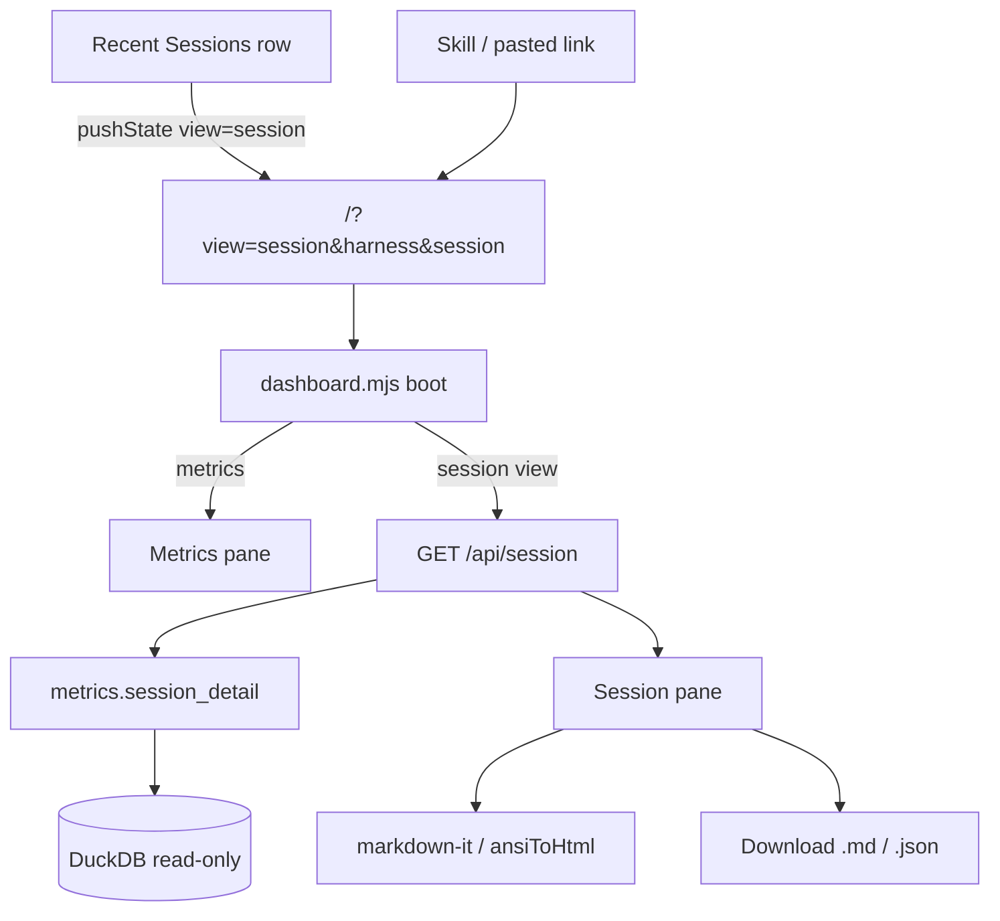

# TASK ARCHIVE: Session Inspection in Dashboard (#39)

## SUMMARY

Added a dashboard conversation-reconstruction view for any `(harness, session_id)`: click-through from Recent Sessions, deep-linkable `/?view=session&harness=&session=` URLs, vendored markdown-it rendering (basic markdown only), nested tool_calls with collapsed disclosure, and client-side markdown/JSON export plus copy-deep-link. Post-reflect polish: SMS-style bubbles, ANSI SGR display rendering, FOUC-free deep-link boot, and tool JSON nested inside the named `
` chrome.

Shipped on branch `convo-reconstruct` as [PR #40](https://github.com/Texarkanine/stockroom/pull/40).

## REQUIREMENTS

From the project brief / [#39](https://github.com/Texarkanine/stockroom/issues/39):

1. Conversation reconstruction view showing a session's messages in order.
2. Recent Sessions row click navigates into that view.
3. Deep-linkable URL by session identity (skills can share).
4. Basic markdown only via vendored JS library (no CDN; no extensions).
5. Optional markdown and/or JSON export.
6. Stay offline, read-only (`open_current()`), no schema migration.

## IMPLEMENTATION

### Architecture (client + API)

Same static `index.html` for `/` — not a separate server route. Client reads query params, fetches `GET /api/session?harness=&session=`, swaps metrics vs session panes. Early inline `<head>` script sets `data-view="session"` to avoid metrics FOUC before the module loads.

### Key files

- `skills/sr-search/src/stockroom/dashboard/metrics.py` — `sessions()` gains `session_id`; new `session_detail()`
- `skills/sr-search/src/stockroom/dashboard/server.py` — `/api/session` special-case; `_open_readonly()` for 503 handling
- `static/dashboard-session.mjs` — URL helpers, export formatters, `ansiToHtml` / `renderSessionMessageHtml`
- `static/dashboard.mjs` / `dashboard-data.mjs` / `index.html` — pane swap, fetch, SMS bubbles, tool chrome
- `static/markdown-it-14.1.0.min.js` + `REUSE.toml` MIT pin
- `skills/sr-dashboard/SKILL.md` — deep-link URL template

### Creative decisions (inlined)

**Deep-link navigation** — Selected query params on `/` (`view=session&harness=&session=`) over hash routes (weak for skill copy) and path+SPA fallback (server change for little gain). Composite identity required; `URLSearchParams` for encoding.

**Markdown library** — Selected markdown-it UMD with `html: false`, no plugins, linkify/typographer off over marked (needs sanitizer), snarkdown (too weak), or marked+DOMPurify (two artifacts). Vendored like Chart.js.

**Reconstruction content** — Selected single `/api/session` with nested ordered `tool_calls` over messages-only, parallel tools endpoint, or tools-export-only. UI: full-pane swap, collapsed `
` per tool; export MD+JSON client-side.

### Post-reflect polish

- SMS bubbles: assistant left / user right at 90% width (removed earlier `42rem` cap that blocked 90%).
- Tool expands: scroll inside nested box; summary is the box header, dark JSON flush inside.
- ANSI SGR → HTML for display when CSI present; else markdown-it.
- Deep-link boot: `html[data-view=session]` CSS + head script prevents metrics flash.

## TESTING

TDD throughout (failing tests → implement → pass). Verification:

- Targeted pytest (metrics, server, static, licensing) + Node `dashboard-session` tests
- Full `make ci` green at build end (519 pytest / 57 JS / ruff / REUSE)
- QA PASS after DRY `_open_readonly()` consolidation
- Manual operator review of deep-links, bubbles, ANSI, tool chrome

## LESSONS LEARNED

- Non-windowed dashboard endpoints need an early dispatcher special-case; `ENDPOINTS` registration alone is not enough for the generic `(con, harnesses, since, until)` path.
- Pure DOM-free helpers (`dashboard-session.mjs`) keep URL/export/ANSI coverage cheap under Node.
- `max-width: 90%` cannot widen past an explicit `width: min(100%, 42rem)` — remove the rem cap when percentage width is the product intent.
- Deep-link FOUC is structural when HTML defaults to metrics; fix with pre-module head script + CSS, not only late `dashboard.mjs` boot.

## PROCESS IMPROVEMENTS

- For a first drill-down on a previously single-pane UI, three focused creatives (routing / library / content) kept L3 build nearly free of design thrash.
- Preflight amendments that strengthen TDD ordering and add high-leverage controls (Copy deep-link) should stay in the plan before `/niko-build`.

## TECHNICAL IMPROVEMENTS

- Optional later: put Aggregate date-range state in the URL without colliding with reserved `view`/`harness`/`session` params.
- Optional: strip or render ANSI in export markdown (display-only today).

## NEXT STEPS

- Merge [PR #40](https://github.com/Texarkanine/stockroom/pull/40) when CI/review are satisfied.
- Close #39 on merge.
