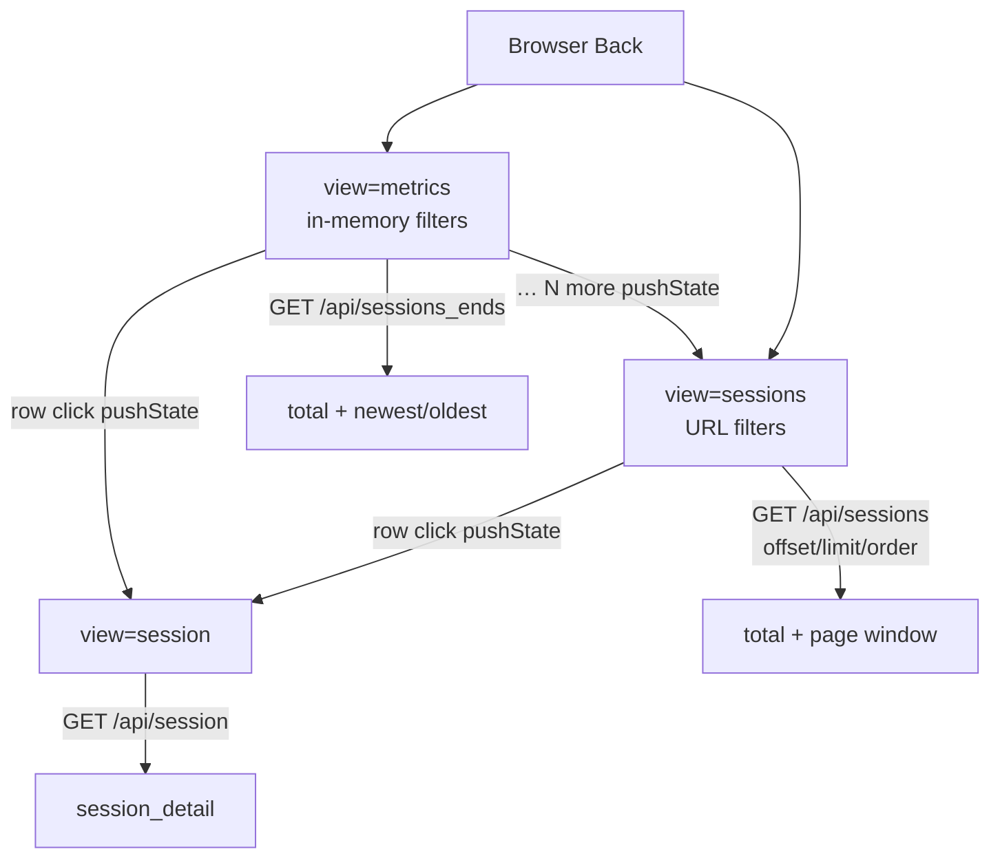

# TASK ARCHIVE: dashboard-sessions-browse

## SUMMARY

Closed the loop on visual conversation exploration per [#49](https://github.com/Texarkanine/stockroom/issues/49): capped glanceable **Sessions** panel on metrics (≤20 all; >20 → 10 newest + `… N more` + 10 oldest), deep-linkable paginated sessions-list SPA view (`view=sessions`), browser-Back-only navigation (removed `#session-back`), and efficient COUNT/window retrieval via new `/api/sessions_ends` plus enriched paged `/api/sessions` (`{total, sessions}`, `limit=0` = show-all).

Delivered to plan; creative API and per-page decisions held through build/QA. Post-reflect UX polish: truncated pagination chrome, clearer view titles, `pushState` only on view entry (`replaceState` for in-list page/filter changes), Local warehouse home link → `/`.

Merged as [#52](https://github.com/Texarkanine/stockroom/pull/52).

## REQUIREMENTS

From the project brief / #49:

1. Rename metrics panel to **Sessions**; apply ≤20 / 10+ellipsis+10 capping with correct `N = total − 20`.
2. Add deep-linkable sessions-list SPA view (same `view=` pattern as reconstruct from #39).
3. List page: harnesses + time range; Aggregate/Compare replaced by per-page (including show-all); same row fields; pagination top and bottom when paging.
4. List filters URL-scoped and independent of metrics filters; `… more` copies then-current metrics filters into the list URL.
5. Remove custom “Back to metrics” from reconstruct; no custom back on the list page — browser history only.
6. Efficient retrieval: COUNT + bounded ordered queries / new endpoints — not fetch-all-then-slice. Read-only `open_current()`, no schema migration.

Acceptance criteria all met. Out of scope held: reconstruct content/export beyond back removal; search-within-list; collaboration.

## IMPLEMENTATION

### Approach

L3: plan (open questions) → creative (API shape + per-page UX) → plan complete → preflight → TDD build (11 units) → QA → reflect → post-reflect UX polish → archive.

### Navigation & data flow

### Key files

| Area | Paths |
| --- | --- |
| Metrics | `dashboard/metrics.py` — shared filter/row helpers; `sessions_ends`; paged `sessions` envelope; `ENDPOINTS` |
| Server | `dashboard/server.py` — `offset`/`order`/`limit` (incl. `limit=0`); wire `sessions_ends` |
| Data / URL | `static/dashboard-data.mjs`, `dashboard-session.mjs`, `dashboard-core.mjs` — request plan, list fetch, list URL parse/build, panel row model |
| Adapter | `static/dashboard.mjs` — three-view pane swap, capped panel, list fetch/render/pager, popstate; push vs replace history |
| Shell | `static/index.html` — Sessions title; `#sessions-pane` + per-page radios; FOUC `data-view=sessions`; no `#session-back` |
| Docs/skill | `docs/user-guide/dashboard.md`, `skills/sr-dashboard/SKILL.md` |
| Persistent context | `memory-bank/techContext.md` — three-view SPA deep-link note |
| Tests | `tests/test_dashboard_metrics.py`, `test_dashboard_server.py`, `test_dashboard_static.py`; `tests-js/dashboard-{data,session,core}.test.mjs` |

### Creative decisions (inlined)

#### Sessions retrieval API shape

**Options:** A — enrich single `/api/sessions` with modes; B — ends endpoint + paged list; C — count + list only (panel does 2–3 calls).

**Selected: B** — `/api/sessions_ends` → `{total, newest, oldest}`; `/api/sessions` → `{total, sessions}` with `offset`/`order`/`limit` (`limit=0` = no LIMIT / show-all).

**Rationale:** Panel “ends” is not a page — dedicated contract avoids client merge bugs; maps 1:1 to UI call sites; shared SQL filter/row helpers stay DRY without mode soup. Envelope break acceptable (sole consumer: this SPA, same change).

**Implementation notes that held:** `total <= 20` → all in `newest`, empty `oldest`; `> 20` → newest 10 DESC + oldest 10 ASC; show-all must not be silently capped at 500.

#### Per-page control

**Options:** A — radio presets 25/50/100/All; B — `<select>`; C — presets + custom number.

**Selected: A** — radios in the Aggregate/Compare slot on the list pane only; URL `per_page=25|50|100|all`; default 50; All last; `all` → API `limit=0`.

**Rationale:** Matches existing control density; All always visible; closed vocabulary agent-friendly.

### Plan highlights (11 TDD units)

1. Metrics shared filter + `sessions_ends`
2. Paged `sessions` envelope
3. Server wiring / param validation
4. Pure JS list URL + panel model helpers
5. Data layer request plan + list fetch
6. HTML shell + FOUC; assert `#session-back` absent
7. Adapter: metrics panel cap + navigate to list
8. Adapter: sessions list view + pagination
9. Remove reconstruct custom back
10. Docs & skill
11. Verification (`make test-dashboard-py`, `make test-dashboard-js`, `make ci`)

Preflight amendments that paid off: explicit (a)→(b)→(c)→(d) TDD encoding per unit; page-beyond-last clamps to last non-empty page; docs scoped to tracked engine paths (not untracked localdev skill mirrors).

### Build / QA notes

- List date-range radios keep an in-memory preset when seeded from metrics (URL only carries ISO `since`/`until`); omit bounds when metrics window is `default`.
- QA trivial fix: empty-harness list URL means “all” at the API — picker UI synced to that semantics.
- Left `#recent-sessions` ids as cosmetic non-blocker.

### Post-reflect UX polish

- Truncated pagination chrome; clearer view titles
- `history.pushState` on view entry; `replaceState` for in-list page/filter changes
- Local warehouse eyebrow link → `/`

## TESTING

1. **TDD unit/integration** — metrics ends shapes (0 / ≤20 / >20), paged envelope + `limit=0`, server 400s and show-all, static FOUC/chrome contracts, JS URL helpers + request plan + panel row model.
2. **Dashboard suites** — `make test-dashboard-py`, `make test-dashboard-js` green through build; `make ci` green at verification and after QA fixes.
3. **`/niko-preflight`** — PASS (amendments above).
4. **`/niko-qa`** — PASS; trivial empty-harness picker sync + dead branch cleanup.
5. **Operator** — invoked archive after local Back + pagination UI satisfaction (post-reflect polish in #52).

## LESSONS LEARNED

### Technical

- Dashboard SPA views that share a control-bar pattern still need explicit ownership of URL-canonical vs in-memory chrome: list filters URL-owned; metrics filters memory-owned; list date *preset* is chrome when bounds are opaque ISO strings.
- Panel “ends” must not be forced through offset/limit paging — dedicated `sessions_ends` prevented the client-side merge bugs the pre-mortem warned about.
- History: push on view transitions, replace for in-view filter/page churn — keeps Back meaningful without stacking every pager click.

### Process

- Preflight amendments that rewrite existing contract tests (array payloads, limit clamps, static `#session-back`) pay for themselves immediately in early build units.
- Eleven-unit TDD sequence matched reality; no plan reordering required.

### Creative phase held

- API Option B and per-page Option A held cleanly through build/QA with no mid-build design thrash.

## PROCESS IMPROVEMENTS

- For multi-view SPA work, treat “which state is URL-owned vs memory-owned” as an explicit plan invariant (and test it), not only as a navigation note.
- When changing a public dashboard JSON shape, grep client + all test assumptions for the old shape in the same preflight blast radius as the server rewrite.

## TECHNICAL IMPROVEMENTS

- Optional: rename leftover `#recent-sessions` ids to match **Sessions** naming (cosmetic).
- Keyset pagination deferred unless OFFSET deep pages become measured pain on large local ranges.
- Search-within-list and reconstruct export remain out of scope for this task.

## NEXT STEPS

None for this task. Follow-ups above are optional polish, not blockers. Type `/niko` to begin the next task.
