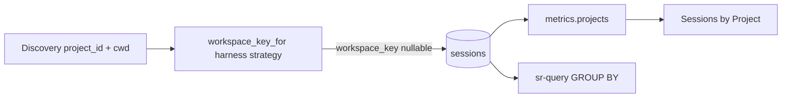

# TASK ARCHIVE: workspace-key

## SUMMARY

Added nullable `sessions.workspace_key` with an extensible per-harness ETL registry so same-cwd cross-harness sessions share a queryable rollup key. Wired Sessions by Project (`metrics.projects`) to `coalesce(workspace_key, project_id)`, left `project_id` harness-verbatim, and documented the contract in migration 0006, `ingest/paths.py`, warehouse architecture, and `systemPatterns`. Delivered to plan; QA only needed a harness-neutrality clarification in the private encode helper. Post-reflect: operator validated real warehouse merge after kill/restart; horizontal Chart.js hover axis fix; filed [#48](https://github.com/Texarkanine/stockroom/issues/48) for `make local-dashboard` bounce no-op.

Merged as [#50](https://github.com/Texarkanine/stockroom/pull/50) / release 0.7.0.

## REQUIREMENTS

From the project brief:

1. Add nullable `sessions.workspace_key` via forward migration (0006 after 0005).
2. Extensible per-harness ETL transforms (`workspace_key_for` registry); convergence: same machine + same `cwd` ⇒ same key when both can derive it.
3. Leave `project_id` harness-verbatim; do not rewrite identity.
4. When a harness cannot derive a key, store `NULL` (honest).
5. Populate on ingest insert/upsert; `--full` re-ingest backfills existing rows.
6. `metrics.projects()` groups/ranks by rollup key so chart and SQL share the key.
7. Document contract: migration header, paths module, architecture warehouse identity, systemPatterns one-liner.

Acceptance criteria all met: Cursor+Claude same-cwd convergence; different-cwd separation (lite-rpg mount case); NULL when underivable; metrics rollup; localized strategy extension; docs updated.

## IMPLEMENTATION

### Approach

L3: creative (standalone, before formal plan) → plan → preflight → TDD build (paths → migration → writer → metrics → docs) → QA → reflect → post-reflect operator validation + hover fix → archive.

### Key files

| Area | Paths |
| --- | --- |
| Paths / ETL | `ingest/paths.py` — `workspace_key_for` + `_WORKSPACE_KEY_STRATEGIES` (`cursor`, `claude`) |
| Model / writer | `ingest/model.py` (`NormalizedSession.workspace_key`); `ingest/writer.py` (compute at insert) |
| Schema | `migrations/0006_workspace_key.sql`; `tests/fixtures/schema/0006_snapshot.json` |
| Metrics | `dashboard/metrics.py` — group by `coalesce(workspace_key, project_id)`; labels from cwd leaf |
| Docs | `docs/architecture/warehouse.md`; `memory-bank/systemPatterns.md`; paths module docstring |
| Tests | `tests/test_ingest_paths.py`, `test_schema_0006.py`, writer/golden, `test_dashboard_metrics.py`; head pins in migrate_runner / warehouse open / concurrency |
| Post-reflect | `dashboard` Chart.js `chartInteractionOptions` (`axis: "y"` for horizontal bars) |

### Data flow

### Creative decisions (inlined)

**Open question:** Chart/presentation rollup vs ETL? Mutate identity? Strip non-alnum normalize?

**Options evaluated**

| Option | Verdict |
| --- | --- |
| A — Read-time rollup in metrics only | Rejected after operator required SQL parity with chart |
| B — Mutate stored `project_id` | Rejected — breaks verbatim identity / Claude encode invariant |
| C — Additive `workspace_key` column | **Selected** |
| D — Cosmetic strip leading/trailing non-alnum | Rejected — not path equality |

**Rationale:** Identity fidelity (`project_id` untouched); T durability (“same absolute path → same key”); chart and `sr-query` stay aligned.

**Naming:** `workspace_key` accepted over `normalized_project_id` (avoids implying mutated identity).

**Per-harness T:** Each harness has its own strategy; shared convergence contract; unknown harness → `NULL`. Document transform as harness-neutral path encode with leading separator stripped — not “whatever Cursor does forever.”

**NULL / chart:** Column stays NULL when underivable; metrics groups by `coalesce(workspace_key, project_id)` so orphans still appear without fabricating a cross-harness key in the column.

Creative authority file was `creative-project-rollup-layer.md` (content inlined above; ephemeral deleted at archive).

### Plan highlights

1. `workspace_key_for` + harness registry (TDD)
2. Migration 0006 structural only (no DML backfill; same pattern as 0002)
3. Model + writer compute at insert; ingest golden includes keys
4. `metrics.projects` rollup + same-cwd merge test; reinterpret basename-collide test
5. Docs + full verify

Preflight PASS with amendment: bump `test_migrate_runner` head 5→6. Build also had to bump warehouse open/concurrency `_HEAD_VERSION` and locked snapshot → 0006 (under-scoped in preflight).

### Post-reflect additions

- Operator: migrate + `ingest --full` populated keys; stockroom merges after real dashboard restart; lite-rpg stays split by design.
- Chart.js horizontal hover: `chartInteractionOptions` sets `axis: "y"` when `indexAxis: "y"`.
- GitHub [#48](https://github.com/Texarkanine/stockroom/issues/48): `make local-dashboard` claims bounce but no-ops when identity app_dir+version match.

## TESTING

1. **TDD unit/integration** — paths strategies, schema 0006 + cumulative snapshot, writer persistence, ingest golden `workspace_key`, metrics same-cwd merge + coalesce fallback + basename-collide under key semantics.
2. **`make test`** — 524 passed, 3 skipped; dashboard JS 61 passed (including hover fix).
3. **`/niko-preflight`** — PASS (amended migrate_runner head pins; TDD ordering on steps 1–4).
4. **`/niko-qa`** — PASS; trivial fix: private key helper uses `encode` + leading-sep strip, not `encode_for("cursor")`.
5. **Operator validation** — real warehouse after `--full`; chart merge visible only after kill/restart of stale dashboard process.

## LESSONS LEARNED

### Technical

- Schema-head pins live beyond the migrate runner: at least `test_warehouse_open._HEAD_VERSION`, `test_warehouse_concurrency._HEAD_VERSION`, and the open chokepoint’s locked cumulative snapshot. When adding a migration, grep for the prior head integer and prior snapshot path.
- A “harness-neutral” path key must not call `encode_for("cursor", …)` even when the bits match today’s Cursor slug form — that reifies harness identity into a shared helper.
- Creative “Cursor-form” shorthand is easy to reify as `encode_for("cursor")`; keep the private helper harness-agnostic.

### Process

- Preflight blast-radius for “bump head version” should treat all `_HEAD_VERSION` / locked-snapshot consumers as one checklist item, not only migrate-runner assertions named in the plan.
- Head-version pin sprawl is the durable process lesson from this task.

### Creative phase held

- Option C held cleanly through build/QA/operator validation.
- Per-harness registry translated directly into `_WORKSPACE_KEY_STRATEGIES`; thin wrappers kept for extensibility clarity.

## PROCESS IMPROVEMENTS

- When planning a new migration, grep `._HEAD_VERSION` and `000N_snapshot` across the whole test tree in preflight, not only files listed in the plan’s “head pin” bullet.
- Prefer keeping thin per-harness strategy wrappers even when today’s bodies share a private helper — clarity for the next harness beats collapsing to one untyped entry.

## TECHNICAL IMPROVEMENTS

- Optional multi-`project_id` hover list when several slugs roll into one key was noted as advisory out of scope — still a possible follow-up.
- Overview `distinct_projects` by `project_id` left unchanged (out of plan scope); revisit if product wants that metric on the rollup key too.
- [#48](https://github.com/Texarkanine/stockroom/issues/48): fix `make local-dashboard` so “bounce” actually restarts when in-memory process is stale despite matching identity.

## NEXT STEPS

None for this task. Follow-ups tracked separately: #48 (local-dashboard bounce), optional hover/overview refinements above. Type `/niko` to begin the next task.
