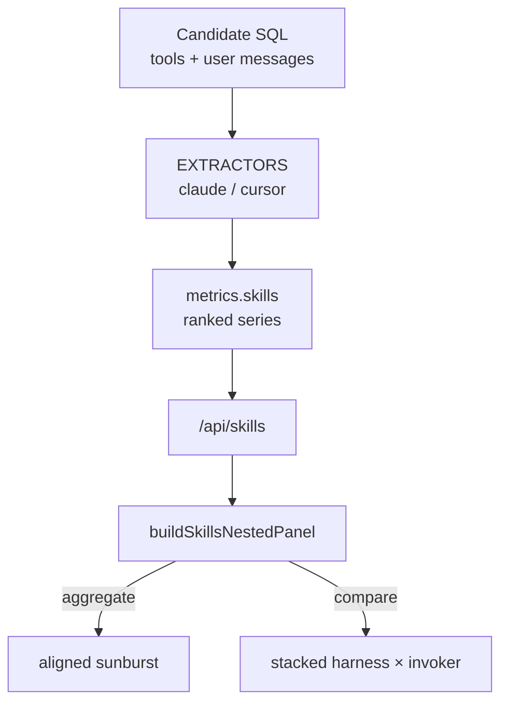

# TASK ARCHIVE: dashboard-skill-usage

## SUMMARY

Delivered dashboard skill-usage end-to-end for [#63](https://github.com/Texarkanine/stockroom/issues/63): harness-extensible extraction, `/api/skills`, and a Skill Distribution sunburst beside Tool Distribution — one continuous undertaking that went through an initial three-mockup ship, a sunburst/title/tooltip rework, and post-reflect visual polish (palette, borders, layout, PR color-rank feedback). No schema migration; offline read-only `open_current()`.

Final UI: one **Skill Distribution (top 10)** panel (aligned sunburst aggregate; stacked harness×invoker compare); **Tool Distribution (top 10)** naming; categorical `PALETTE` vs `AGGREGATE_COLOR`; black doughnut `RING_BORDER`; Model Distribution before Session Efficiency; First-Prompt Quality one grid cell.

## REQUIREMENTS

From the project brief (mockup phase + additive rework):

1. Serve skill × invoker × harness counts over `since`/`until`/`harness` via a dashboard API endpoint.
2. Count every discrete skill use (no session-level dedupe).
3. Per-harness extractors (Claude + Cursor; registry-extensible) — not one mondo SQL CASE for skill identity.
4. Balance DuckDB candidate SQL with Python post-processing; ground Claude/Cursor rules in warehouse probes.
5. Ship Chart.js treatments in the main grid at Tool Usage size so the operator can pick; then keep the winner and drop the gallery.
6. Sunburst nested encoding: inner user/agent, outer skills within each group, circumference-aligned; dual-invoker skills appear twice with paired solid/faded colors.
7. Stacked-bar tooltip swatches match legend/bar fills.
8. Parallel **Distribution (top 10)** wording for tools and skills.

**Constraints held:** offline read-only; existing `ENDPOINTS` / harness-keyed series patterns; TDD; final layout next to Tool Usage deferred until chart pick (then done in polish).

## IMPLEMENTATION

### Lifecycle (one flight)

Started as Level 3 (plan → creative ×2 → preflight → build → QA → reflect). Operator chose rework instead of archive; rework classified Level 2 (plan → preflight → build → QA → reflect), then operator polish and PR feedback, then this archive. Ephemeral docs for both legs are collapsed here.

### Creative decisions (inlined)

#### Extractor architecture

**Options:** A — mondo SQL; B — candidate SQL + registry extractors + server aggregate; C — raw event stream for JS panels.

**Selected: B.** Thin SQL for recall; Python extractors emit `SkillUse(skill, invoker)`; `metrics.skills` ranks and emits harness→invoker aligned arrays. Matches ingest / `workspace_key` extensibility; keeps panels presentation-only.

**Locked extractor rules (evolved in-flight):** Claude user `<command-name>`; Claude agent `Skill` tool (deny built-ins / skill-info blobs); Cursor agent `Read` of `…/SKILL.md` plus `manually_attached_skills`; Cursor user no-op where warehouse has no discrete event.

#### Mockup chart set → final pick

**Selected Set A** (issue-faithful trio): nested rings, stacked bar, tools-like. Nested compare honestly degraded to stacked harness×invoker. Operator later picked the sunburst; stacked and tools-like mockups removed; titles dropped `(mockup)` / encoding cues.

### Sunburst + client polish

- Outer data ordered user-group skills then agent-group skills; inner `[userTotal, agentTotal]`; circumference-sum tests guard alignment.
- Skill hues follow overall `/api/skills` payload rank (Tools-like), with user side `colorWithAlpha(..., 0.55)`; invoker ring uses `AGGREGATE_COLOR` (accent), not `PALETTE[0]`.
- `tooltipLabelColors` forces Chart.js tooltip fill/stroke from `backgroundColor` so faded-border stacks match legend/bars.
- Doughnut panels use explicit black `RING_BORDER` (match-fill hid opaque wedges; single aggregate border painted every arc).

### Key files

| Area | Paths |
|------|--------|
| Extract / API | `dashboard/skill_usage.py`, `dashboard/metrics.py` (`skills`), `dashboard/server.py` |
| Client | `static/dashboard-core.mjs`, `dashboard-data.mjs`, `dashboard.mjs`, `index.html` |
| Tests | `tests/test_dashboard_metrics.py`, `test_dashboard_static.py`, `tests/test_skill_usage.py` (or equivalent); `tests-js/dashboard-core.test.mjs`, `dashboard-data.test.mjs` |

## TESTING

- TDD throughout: extractors/metrics → ENDPOINTS/panel inventory pins → sunburst circumference + color helpers → tooltip `labelColor` → static panel structure.
- `/niko-preflight` PASS (both legs; inventory-pin amendments on first leg).
- `/niko-qa` PASS (trivial KISS/DRY only).
- Final verification: full `make test` **583 passed / 4 skipped**; format + lint clean.
- Operator visual checks via `make local-dashboard` for mockup pick, palette, borders, layout.

## LESSONS LEARNED

### Technical

- Dashboard endpoint/panel inventories in JS and static tests are part of the public contract for new `/api/*` + panel work.
- Chart.js tooltip swatches can prefer `borderColor`; for faded-fill / solid-border stacks, set both `labelColor` fill and stroke to the fill.
- Once the first categorical slot is a harness hue, `PALETTE[0]` must not double as aggregate/sum color — keep `AGGREGATE_COLOR` (and use it for the sunburst invoker ring).
- Multi-fill doughnuts need an explicit neutral `RING_BORDER`; match-fill borders hide opaque wedges; a single `aggregateDataset` border hue strokes every arc and legend swatch.
- Circumference-sum assertions are the load-bearing guard against “two independent pies” sunburst bugs.

### Process

- Preflight amendments that force “tests then wire” on inventory-pin files pay for themselves on dashboard work.
- Visual chart selection and layout polish naturally arrive after reflect; fold them into the reflection before archive rather than freezing the first reflect doc.
- Choosing rework over archive mid-flight is fine when the undertaking is still one continuous deliverable — archive once at the end with both legs inlined.

### Million-dollar question

If the sunburst (plus categorical vs aggregate colors and explicit ring borders) had been the chosen encoding from day one, the three-mockup ship and nested→sunburst rework would collapse into one client reshape of `/api/skills`, one Skill Distribution panel beside tools, and no post-hoc aggregate-color regression. Extractor/API and compare stacked-bar path would stay the same.

## PROCESS IMPROVEMENTS

- When operator feedback is “rework, don’t archive,” keep one task id / progress file and treat later L2 classification as a phase of the same undertaking — avoids dual archives for one feature flight.
- Nothing else notable: L3 creative → plan → preflight → build → QA fit the foundation; L2 loop fit the encoding rework.

## TECHNICAL IMPROVEMENTS

- Legend still lists duplicate outer skill names when a skill appears on both invoker rings — tooltips remain authoritative; custom legend labels (`"{skill} · {invoker}"`) if that noise becomes a problem.
- Title copy hardcodes `(top 10)` beside default `limit=10`; plumb limit into the client if the default ever changes.
- Cursor user-invoke coverage remains warehouse-limited; extend extractors when a discrete event appears.

## NEXT STEPS

None required for this undertaking. Optional follow-ups: legend label polish; limit-aware titles; richer Cursor user extraction if the warehouse gains a signal.
